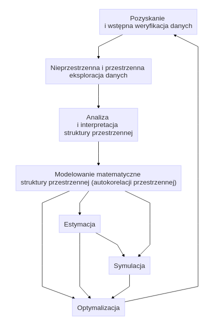
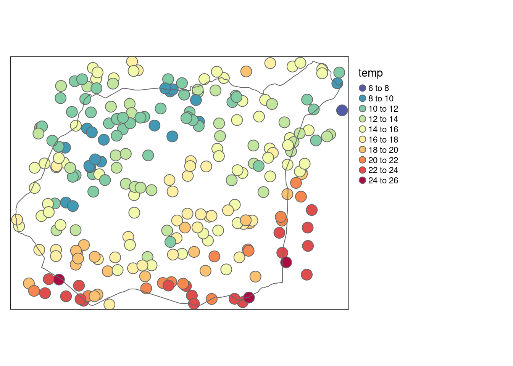
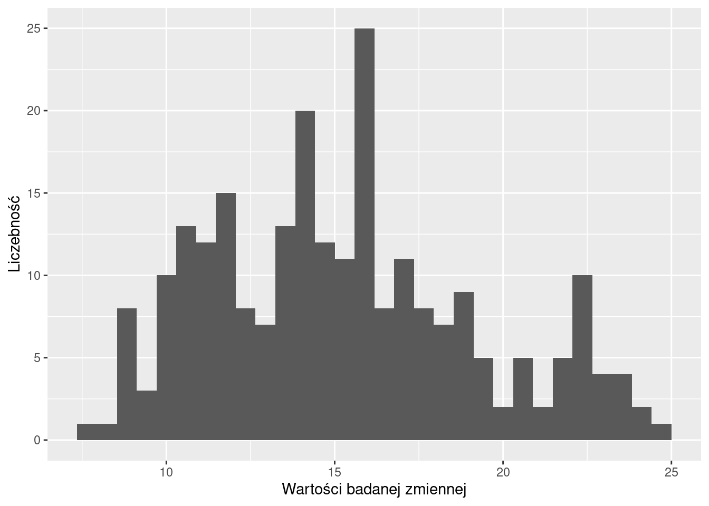
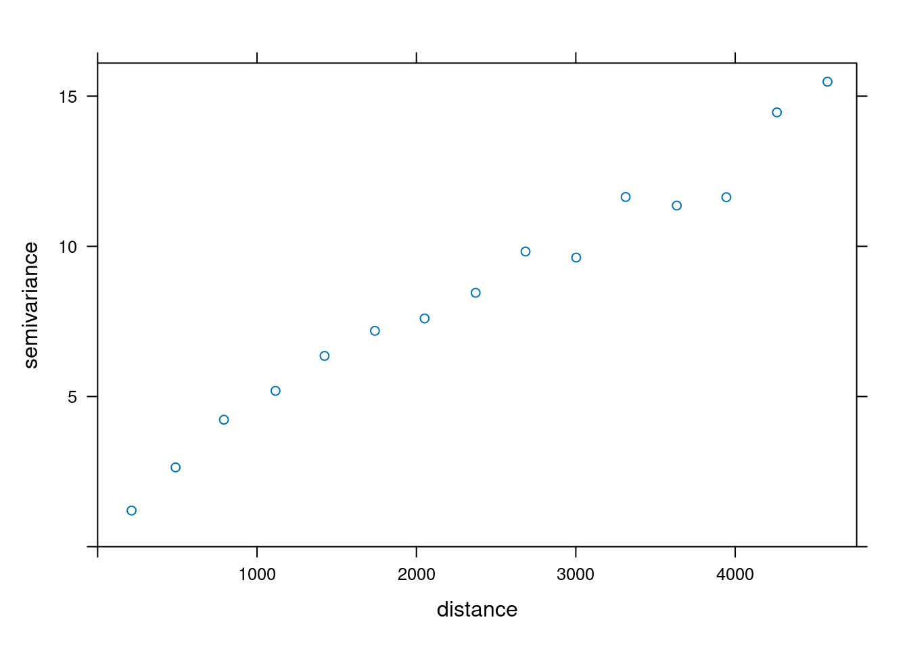
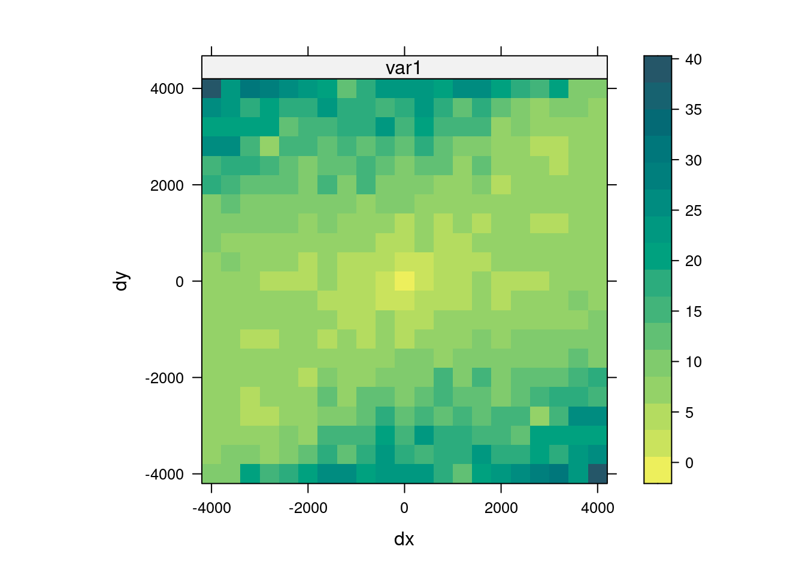
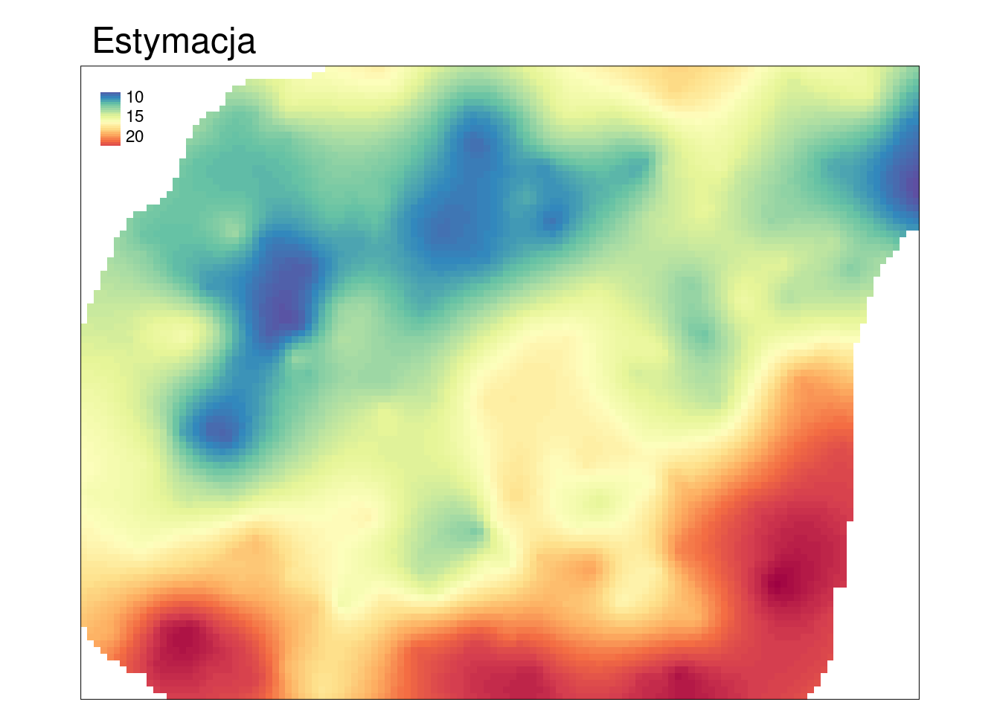
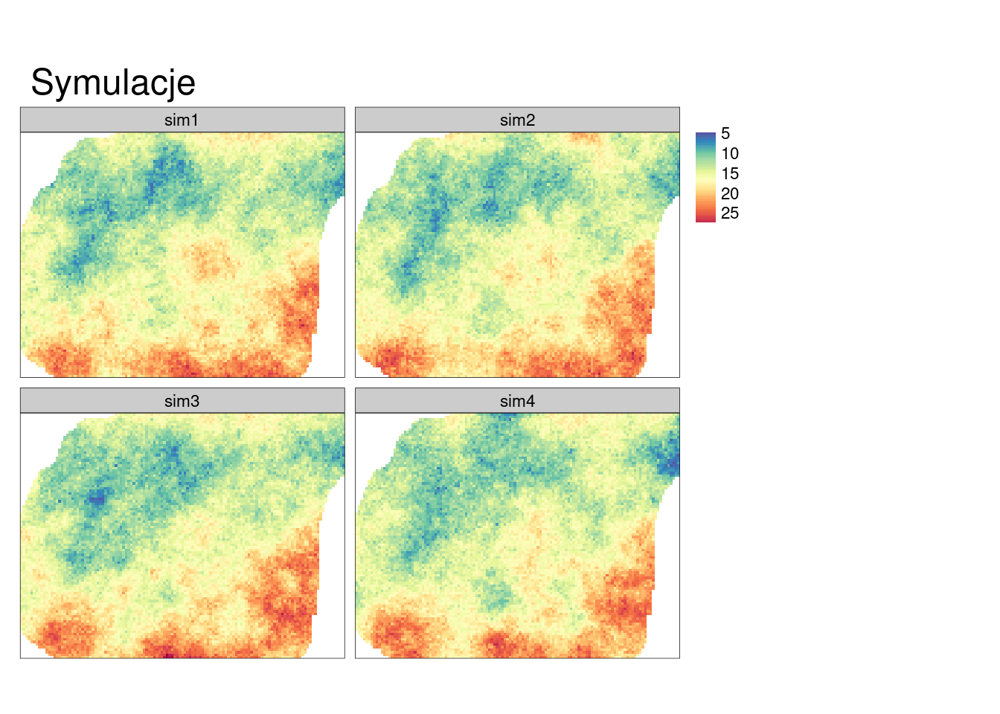

# Wprowadzenie

## Geostatystyczna analiza danych

> Geostatystyka to gałąź statystyki skupiająca się na przestrzennych lub czasoprzestrzennych zbiorach danych

Geostatystyka jest stosowana obecnie w wielu dyscyplinach, takich jak geologia naftowa, oceanografia, geochemia, logistyka, leśnictwo, gleboznawstwo, hydrologia, meteorologia, czy epidemiologia.
<!--refs-->

Geostatystyczna analiza danych może przyjmować różną postać w zależności od postawionego celu analizy.
Rycina \@ref(fig:01-wprowadzenie-1) przestawia uproszczoną ścieżkę postępowania geostatystycznego.

(\#fig:01-wprowadzenie-1)Uproszczona ścieżka postępowania geostatystycznego.

Punktem wyjścia analizy geostatystycznej jest posiadanie danych przestrzennych opisujących badane zjawisko, np. w **postaci punktowej** (rycina \@ref(fig:01-wprowadzenie-3)).

(\#fig:01-wprowadzenie-3)Przykładowe dane reprezentujące pomiary punktowe zmiennej numerycznej.

Dane należy poddać eksploracji w celu ich lepszego poznania, wyszukania relacji między zmiennymi, czy znalezienia potencjalnych błędów (rycina \@ref(fig:01-wprowadzenie-3b)).

(\#fig:01-wprowadzenie-3b)Rozkład wartości zmiennej numerycznej.

Na ich podstawie chcemy zrozumieć zmienność przestrzenną analizowanej cechy.
Do tego może nam posłużyć wykres nazywany **semiwariogramem** (rycina \@ref(fig:01-wprowadzenie-4)).

(\#fig:01-wprowadzenie-4)Wykres, nazywany semiwariogramem, reprezentujący niepodobieństwo wartości wraz z odległością.

**Semiwariogram** opisuje przestrzenną zmienność badanej cechy i za jego pomocą możemy stwierdzić jak to zjawisko zmienia się w przestrzeni.
Dodatkowo za pomocą **mapy semiwariogramu** (rycina \@ref(fig:01-wprowadzenie-5)) możliwe jest stwierdzenie czy istnieją jakieś kierunki w których ta cecha zmienia się zmienia bardziej dynamicznie, a w których ta zmiana jest wolniejsza.

(\#fig:01-wprowadzenie-5)Mapa semiwariogramu reprezentująca niepodobieństwo wartości wraz z odległością i kierunkiem.

Następnie korzystając z wiedzy uzyskanej z semiwariogramu i mapy semiwariogramu, jesteśmy w stanie stworzyć **model semiwariogramu** (rycina \@ref(fig:01-wprowadzenie-6)).

(\#fig:01-wprowadzenie-6)Model reprezentowany przez ciągłą linię naniesiony na semiwariogram.

Pozwala on zarówno na lepszy opis zmienności zjawiska, jak również służy do tworzenia **estymacji** czy też **symulacji**.
Estymacja tworzy najbardziej potencjalnie możliwą wartość dla wybranej lokalizacji (rycina \@ref(fig:01-wprowadzenie-7)).

(\#fig:01-wprowadzenie-7)Estymacja (oszacowanie) wartości badanej zmiennej dla całego obszaru.

Rolą symulacji (rycina \@ref(fig:01-wprowadzenie-8)) jest natomiast generowanie równie prawdopodobne możliwości rozkładu badanej cechy.

(\#fig:01-wprowadzenie-8)Przykłady symulowanych wartości badanej zmiennej dla całego obszaru.

Każdy z powyższych elementów geostatystycznej analizy danych zostanie rozwinięty w dalszych rozdziałach tego skryptu.

<!-- po co to - prosta analiza bez kodu -->
<!-- http://dmowska-zajecia.home.amu.edu.pl/data/uploads/geostatystyka/materialy/1_wprowadzenie.html -->
