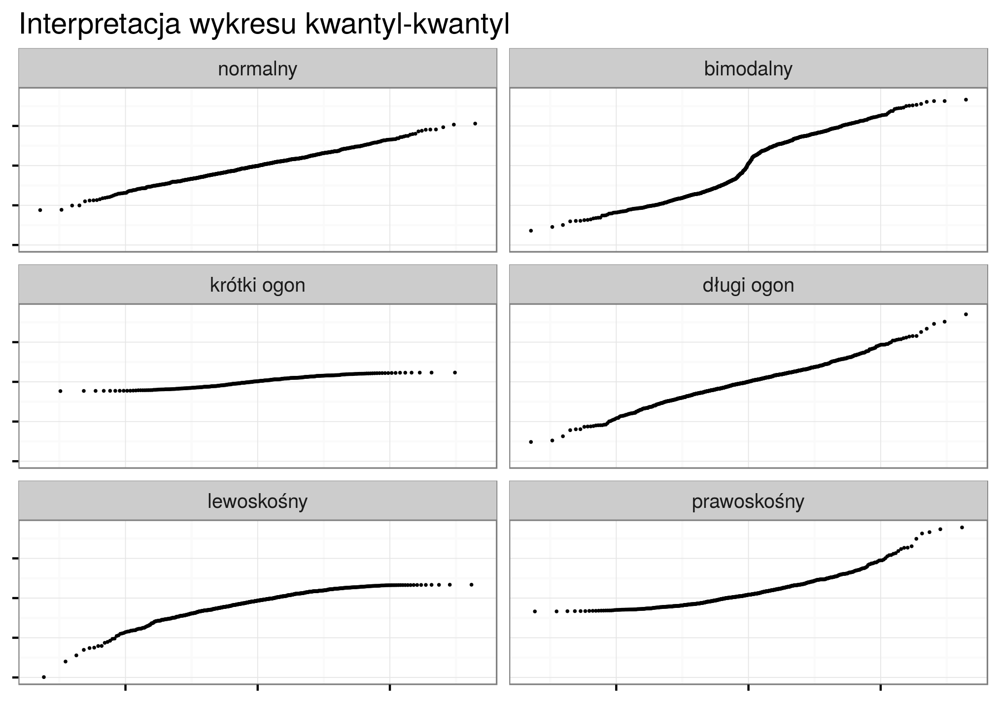

# Eksploracyjna analiza danych nieprzestrzennych {#eksploracja-analiza-danych-nieprzestrzennych}

```{r}
library('geostatbook')
data(punkty)
data(granica)
```

```{r setup2, echo=FALSE, include=FALSE}
library('knitr')
library('methods')
knitr::opts_chunk$set(warning=FALSE, message=FALSE)
options(device = "cairo_pdf")
```

## Cele eksploracyjnej analizy danych

Zazwyczaj przed przystąpieniem do analiz geostatystycznych koniecznie jest wykonanie eksploracyjnej analizy danych nieprzestrzennych. Jej ogólne cele obejmują:

- Stworzenie ogólnej charakterystyki danych oraz badanego zjawiska
- Określenie przestrzennego/czasowego typu próbkowania
- Uzyskanie informacji o relacji pomiędzy lokalizacją obserwacji a czynnikami wpływającymi na zmienność przestrzenną badanych cech

## Dane
### Dane 

Nie istnieje jedyna, optymalna ścieżka eksploracji danych. Proces ten różni się w zależności od posiadanego zbioru danych, jak i od postawionego pytania. Warto jednak, aby jednym z pierwszych kroków było przyjrzenie się danym wejściowym. Pozwala na to, między innymi, funkcja `str()`. Przykładowo, dla obiektu klasy `SpatialPointsDataFrame` wyświetla ona szereg ważnych informacji. Oprócz klasy można również odczytać, że obiekt `punkty` zawiera pięć elementów (ang. *slots*) rozpoczynających się od symbolu @. Pierwszy z nich, `@data` jest obiektem klasy `data.frame` zawierającym informacje o kolejnych punktach w tym zbiorze. Element `@coords.nrs` określa numer kolumn zawierających współrzędne w oryginalnym zbiorze danych. W poniższym przypadku żadna kolumna nie ma takich informacji. Kolejny element, `@coords` definiuje współrzędne kolejnych punktów w obiekcie `punkty`. Ostatnie dwa elementy, `@bbox` i `@proj4string` określają kolejno zasięg przestrzenny danych oraz definicję układu współrzędnych.

```{r}
str(punkty)
```

Oczywiście, każdy z elementów można obejrzeć indywidualnie, poprzez połączenie nazwy obiekty, znaku @, oraz nazwy elementu. Przykładowo `punkty@data` pozwala na obejrzenie tabeli atrybutów zbioru punktowego.

```{r}
str(punkty@data)
```

Istnieją dwa sposoby uzyskania wartości wybranej zmiennej z tabeli atrybutów.

```{r, eval=FALSE}
punkty@data$temp #1
punkty$temp      #2
```

Z uwagi na to, że zajmujemy się danymi przestrzennymi - warto też się upewnić czy dane zostały poprawnie wczytane i obejmują analizowany obszar. Najszybciej można to wykonać z pomocą funkcji `plot`.

```{r, echo=FALSE}
par(mar=c(rep(0, 4)))
```

```{r, message=FALSE, warning=FALSE}
plot(punkty)
plot(granica, add=TRUE)
```

## Statystyki opisowe
### Statystyki opisowe

Podstawową funkcją w R służącą wyliczaniu podstawowych statystyk jest `summary()`. Dla zmiennych numerycznych wyświetla ona wartość minimalną, pierwszy kwartyl, medianę, średnią, trzeci kwartyl, oraz wartość maksymalną. 

```{r }
summary(punkty@data)
```

### Statystyki opisowe | średnia i mediana

Do określenia wartości przeciętnej zmiennych najczęściej stosuje się medianę i średnią.

```{r }
median(punkty$temp, na.rm=TRUE)
mean(punkty$temp, na.rm=TRUE)
```

- W wypadku symetrycznego rozkładu te dwie cechy są równe
- Średnia jest bardziej wrażliwa na wartości odstające
- Mediana jest lepszą miarą środka danych, jeżeli są one skośne

Po co używać średniej?

- Bardziej przydatna w przypadku małych zbiorów danych
- Gdy rozkład danych jest symetryczny
- (Jednak) często warto podawać obie miary
  
### Statystyki opisowe | minimum i maksimum

Minimalna i maksymalna wartość zmiennej służy do określenia ekstremów w zbiorze danych, jak i sprawdzenia zakresu wartości.

```{r }
min(punkty$temp, na.rm=TRUE)
max(punkty$temp, na.rm=TRUE)
```

### Statystyki opisowe | odchylenie standardowe

Dodatkowo, często używaną statystyką jest odchylenie standardowe. Wartość ta określa w jak mocno wartości zmiennej odstają od średniej. Dla rozkładu normalnego ta wartość ma znane właśności:

- 68% obserwacji mieści się w granicach jednego odchylenia standardowego od średniej
- 95% obserwacji mieści się w granicach dwóch odchyleń standardowych od średniej
- 99,7% obserwacji mieści się w granicach trzech odchyleń standardowych od średniej

```{r, echo=FALSE}
library('knitr')
knitr::include_graphics('figs/normal_distribution.png')
```

```{r }
sd(punkty$temp, na.rm=TRUE)
```

## Wykresy
### Histogram

Histogram należy do typów wykresów najczęściej używanych w eksploracyjnej analizie danych.

```{r }
ggplot(punkty@data, aes(temp)) + geom_histogram()
```

- Stworzony przez Karla Pearsona
- Jest graficzną reprezentacją rozkładu danych
- Wartości danych są łączone w przedziały (na osi poziomej) a na osi pionowej jest ukazana liczba punktów (obserwacji) w każdym przedziale
- Różny dobór przedziałów może dawać inną informację
- W pakiecie `ggplot2`, domyślnie przedział to zakres/30

### Estymator jądrowy gęstości (ang. *kernel density estimation*)

Podobną funkcję do histogramu spełnia estymator jądrowy gęstości. Przypomina on wygładzony wykres histogramu i również służy graficznej reprezentacji rozkładu danych.

```{r }
ggplot(punkty@data, aes(temp)) + geom_density()
```

### Wykres kwantyl-kwantyl (ang.*quantile-quantile*)

Wykres kwantyl-kwantyl ułatwia interpretację rozkładu danych. 

```{r }
ggplot(punkty@data, aes(sample=temp)) + stat_qq()
```

Na poniższej rycinie można zobaczyć przykłady najczęściej spotykanych cech w wykresach kwantyl-kwantyl.

```{r, echo=FALSE}

```

### Dystrybuanta (CDF)

Dystrybuanta (ang. *conditional density function* - CDF) wyświetla prawdopodobieństwo, że wartość zmiennej przewidywanej jest mniejsza lub równa określonej wartości

```{r }
ggplot(punkty@data, aes(temp)) + stat_ecdf()
```

## Porównanie zmiennych

Wybór odpowiedniej metody porównania zmiennych zależy od szeregu cech, między innymi liczby zmiennych, ich typu, rozkładu wartości, etc.

### Kowariancja

Kowariancja jest nieunormowaną miarą zależności liniowej pomiędzy dwiema zmiennymi. Kowariancja dwóch zmiennych $x$ i $y$ pokazuje jak dwie zmienne są ze sobą liniowo powiązane. Dodatnia kowariancja wzkazuje na pozytywną relację liniową pomiędzy zmiennymi, podczas gdy ujemna kowariancja świadczy o odwrotnej sytuacji. Jeżeli zmienne nie są ze sobą liniowo powiązane, wartość kowariacji jest bliska zeru. Inaczej mówiąc, kowariancja stanowi miarę wspólnej zmienności dwóch zmiennych. Wielkość samej kowariancji uzależniona jest od przyjętej skali zmiennej (jednostki). Inne wyniku uzyskamy (przy tej samej zależności pomiędzy parą zmiennych), gdy będziemy analizować wyniki np. wieku i dochodu w złotówkach a inne dla wieku i dochodu w dolarach. Do wyliczania kowariancji w R służy funkcja `cov`. 

```{r }
cov(punkty$temp, punkty$ndvi)
```

### Współczynnik korelacji

Wspołczynnik korelacji to unormowana miara zależności pomiędzy dwiema zmiennymi, przyjmująca wartości od -1 do 1. Ten współczynnik jest uzyskiwany poprzez podzielenie wartości kowariancji przez odchylenie standardowe wyników. Z racji unormowania nie jest ona uzależniona od jednostki. Korelację można wyliczyć dzięki funkcji `cor`. Działa ona zarówno w przypadku dwóch zmiennych numerycznych, jak i całego obiektu zawierającego zmienne numeryczne.

```{r }
ggplot(punkty@data, aes(temp, ndvi)) + geom_point()
cor(punkty$temp, punkty$ndvi)
```

```{r }
cor(punkty@data[c(1, 3:5)])
```

Dodatkowo funkcja `cor.test` służy do testowania istotności korelacji. Za pomocą argumentu `method` można również wybrać jedną z trzech dostępnych miar korelacji.

```{r }
cor.test(punkty$temp, punkty$ndvi)
```

W przypadku posiadania co najmniej kilku par zmiennych, można skorzystać z funkcji `corrplot()` z pakietu `corrplot`. Wyświetla ona wykres pokazujący wartości korelacji pomiędzy zmiennymi.

```{r }
corrplot(cor(punkty@data[c(1, 3:5)]))
```

### Wykres pudełkowy

Wykres pudełkowy obrazuje pięc podstawowych statystyk opisowych oraz wartości odstające. Pudełko to zakres międzykwantylowy (IQR), a linie oznaczają najbardziej ekstremalne wartości, ale nie odstające. Górna z nich to 1,5\*IQR ponad krawędź pudełka, dolna to 1,5\*IQR poniżej wartości dolnej krawędzi pudełka. Linia środkowa to mediana.  

```{r }
punkty$clc <- as.factor(punkty$clc)
ggplot(punkty@data, aes(clc, temp)) + geom_boxplot()
```

### Testowanie istotności różnić średniej pomiędzy grupami

Analiza wariancji (ang. *Analysis of Variance* - ANOVA) służy do testowania istotności różnic między średnimi w wielu grupach. Metoda ta służy do oceny czy średnie wartości cechy $Y$ różnią się istotnie pomiędzy grupami wyznaczonymi przez zmienną $X$. ANOVA nie pozwala na stwierdzenie między którymi grupami występują różnice. Aby to stwierdzić konieczne jest wykonanie porównań wielokrotnych (*post-hoc*). ANOVĘ można wykonać za pomocą funkcji `aov()` definiując zmienną zależną oraz zmienną grupującą oraz zbiór danych.

```{r }
punkty$clc <- as.factor(punkty$clc)
aov_test <- aov(temp~clc, data=punkty)
summary(aov_test)
```

```{r, echo=FALSE}
dev.off()
```

Do wykonania porównań wielokrotnych służy funkcja `TukeyHSD()`. Dodatkowo wyniki można zwizualizować za pomocą funkcji `plot()`.

```{r }
tukey <- TukeyHSD(aov_test, 'clc')
plot(tukey, las=1)
```

## Transformacje danych
### Transformacje danych

Transformacja danych może mieć na celu ułatwienie porównywania różnych zmiennych, zniwelowanie skośności rozkładu lub też zmniejszenie wpływu danych odstających.


### Transformacja danych | Standaryzacja

Centrowanie i skalowanie (standaryzacja):

- Centrowanie danych - wybierana jest przeciętna wartość predyktora, a następnie od wszystkich wartości predyktorów odejmowana jest wybrana wcześniej wartość
- Skalowanie danych - dzielenie każdej wartości predyktora przez jego odchylenie standardowe
- Wadą tego podjeścia jest główne zmniejszenie interpretowalności pojedynczych wartości

### Transformacja danych | Centrowanie

```{r }
ggplot(punkty@data, aes(temp)) + geom_density()
punkty$temp_center <- punkty$temp - mean(punkty$temp)
ggplot(punkty@data, aes(temp_center)) + geom_density()
```

### Transformacja danych | Skalowanie

```{r }
ggplot(punkty@data, aes(temp)) + geom_density()
punkty$temp_scale <- punkty$temp / sd(punkty$temp)
ggplot(punkty@data, aes(temp_scale)) + geom_density()
```

### Transformacja danych | Standaryzacja

Do standaryzacji (centrowanie i skalowanie) służy funkcja `scale()`.

```{r }
ggplot(punkty@data, aes(temp)) + geom_density()
punkty$temp_standard <- scale(punkty$temp)
ggplot(punkty@data, aes(temp_standard)) + geom_density()
```

### Transformacja danych | Redukcja skośności

Redukcja skośności:
- Logarytmizacja
- Pierwiastkowanie
- Inne    

### Transformacja danych | Logarytmizacja

Logarytmizacja w R może odbyć się za pomocą funkcji `log()`. Transformację logarytmiczą można odwrócić używając funkcji `exp()`.

```{r }
ggplot(punkty@data, aes(temp)) + geom_density()
punkty$log_tpz <- log(punkty$temp)
ggplot(punkty@data, aes(log_tpz)) + geom_density()
punkty$exp_tpz <- exp(punkty$log_tpz)
ggplot(punkty@data, aes(exp_tpz)) + geom_density()
```

### Transformacja danych | Pierwiastkowanie

Pierwiastkowanie w R może odbyć się za pomocą funkcji `sqrt()`. Odwrócenie tej transformacji odbywa się poprzez podniesienie wartości do potęgi (`^2`).

```{r }
ggplot(punkty@data, aes(temp)) + geom_density()
punkty$sqrt_tpz <- sqrt(punkty$temp)
ggplot(punkty@data, aes(sqrt_tpz)) + geom_density()
punkty$pow_tpz <- punkty$sqrt_tpz^2
ggplot(punkty@data, aes(pow_tpz)) + geom_density()
```

<!--
Transformacja danych | Rodzina transformacji Boxa Coxa

```{r }
ggplot(punkty@data, aes(temp)) + geom_density()
transformacja <- BoxCoxTrans(punkty$temp)
transformacja
punkty$bc_tpz <- predict(transformacja, punkty$temp)
ggplot(punkty@data, aes(bc_tpz)) + geom_density()
invBoxCox <- function(x, lambda) if (lambda == 0) exp(x) else (lambda*x + 1)^(1/lambda) 
punkty$bc_tpz_inv <- invBoxCox(punkty$bc_tpz, lambda=0.2)
ggplot(punkty@data, aes(bc_tpz_inv)) + geom_density()
```

-->