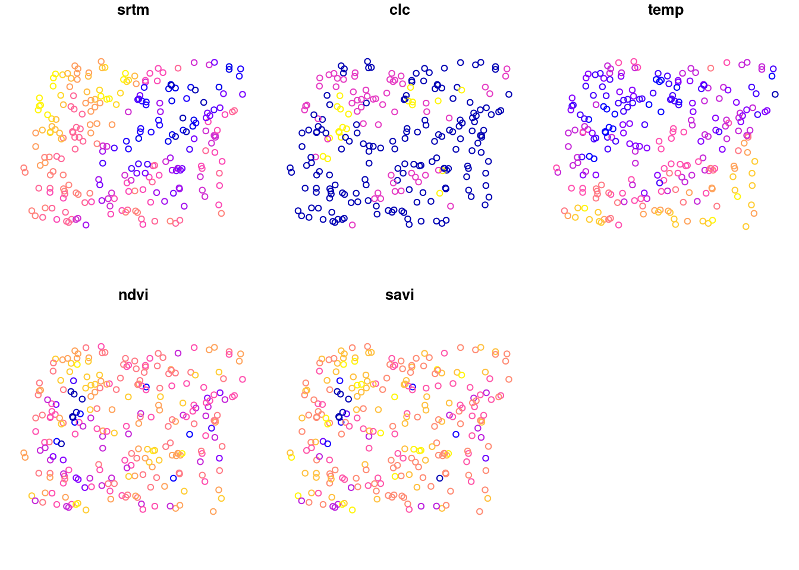
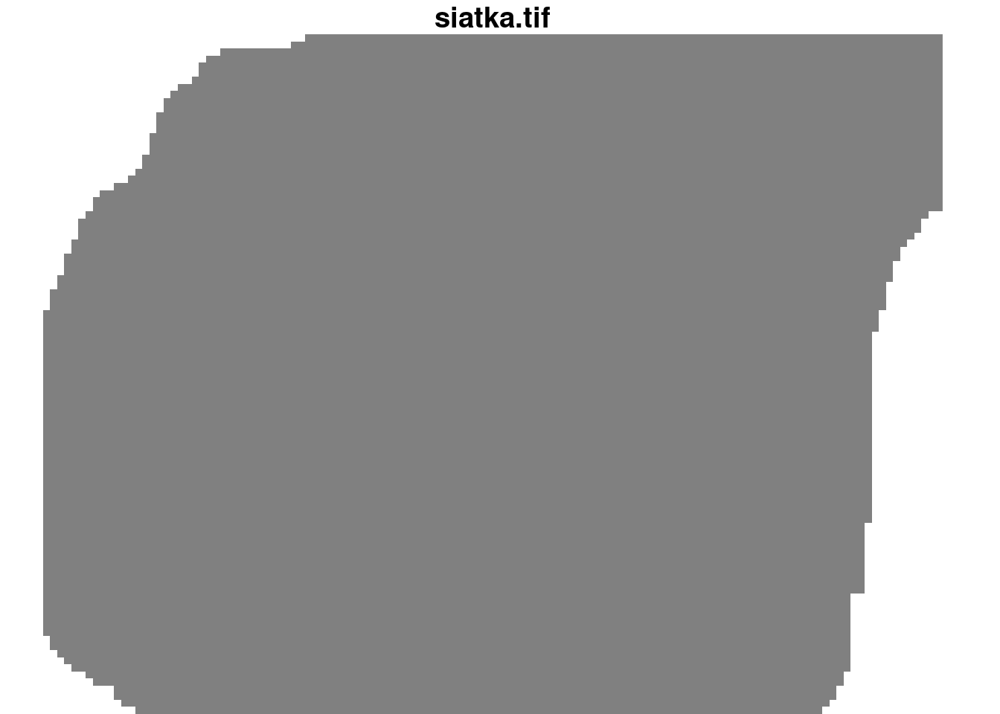
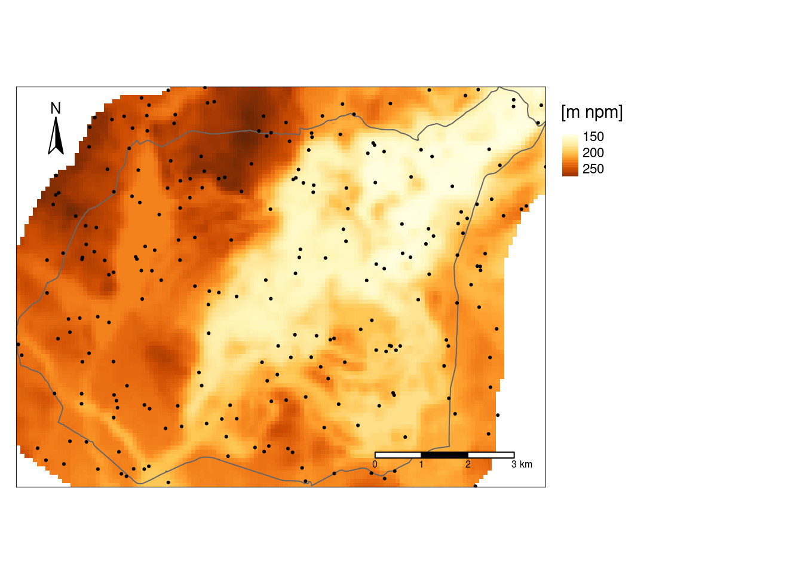
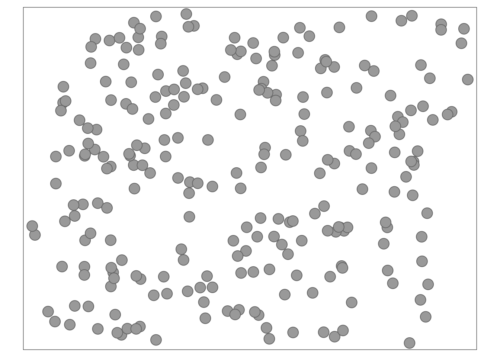
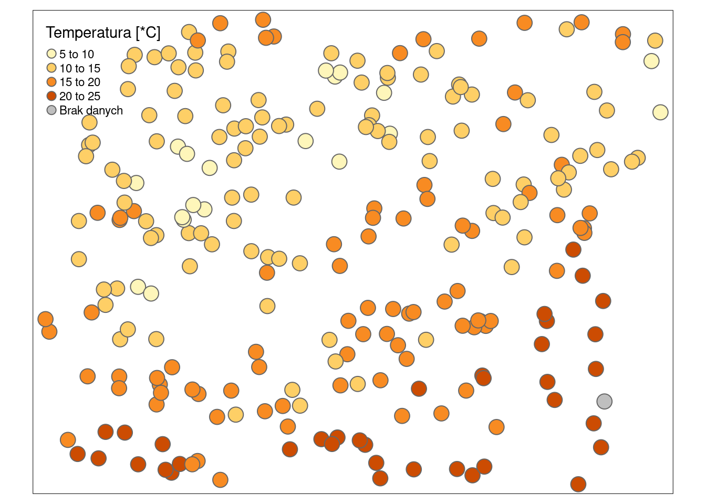
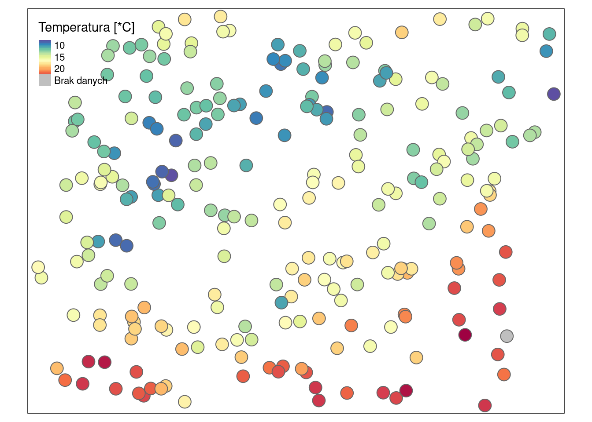
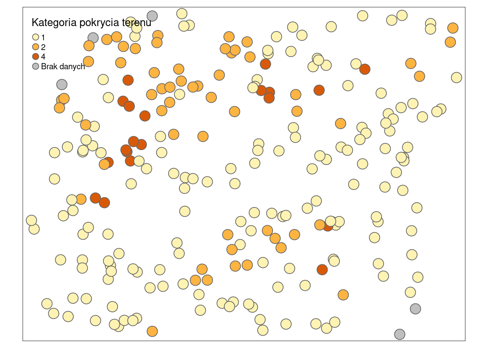
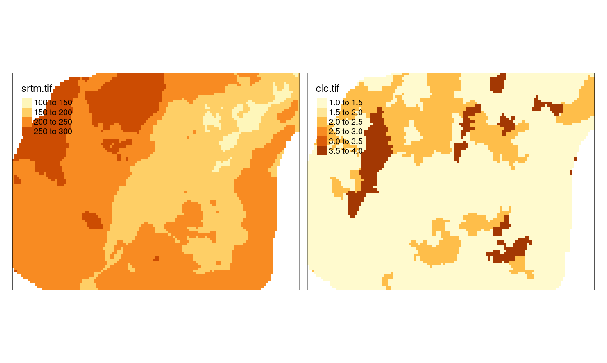
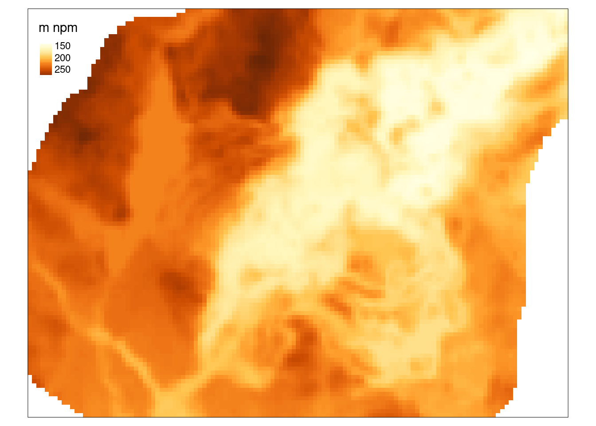
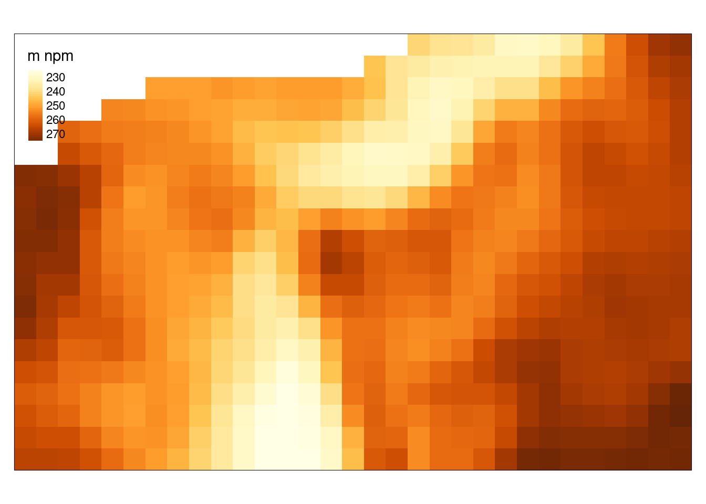

# R a dane przestrzenne {#r-a-dane-przestrzenne}

## Wprowadzenie

### Reprezentacja danych nieprzestrzennych

Skrypty i funkcje w języku R są zbudowane na podstawie szeregu obiektów nieprzestrzennych.
Do wbudowanych typów obiektów należą:<!--ref JN-->
    
- Wektory atomowe (ang. *vector*):
    - liczbowe (ang. *integer*, *numeric*) - `c(1, 2, 3)` i `c(1.21, 3.32, 4.43)`
    - znakowe (ang. *character*) - `c("jeden", "dwa", "trzy")`
    - logiczne (ang. *logical*) - `c(TRUE, FALSE)`
- Ramki danych (ang. *data.frame*) - to zbiór zmiennych (kolumn) oraz obserwacji (wierszy) zawierających różne typy danych
- Macierze (ang. *matrix*) - to zbiór kolumn oraz wierszy zawierających wektory jednego typu
- Listy (ang. *list*) - to sposób przechowywania obiektów o różnych typach i różnej długości

Dokładniejsze wyjaśnienie powyższych typów obiektów można znaleźć w rozdziałach 5 i 7 książki [Elementarz programisty: Wstęp do programowania używając R](https://nowosad.github.io/elp/).

### Pakiety

R zawiera także wiele funkcji pozwalających na przetwarzanie, wizualizację i analizowanie danych przestrzennych.
Zawarte są one w szeregu pakietów (zbiorów funkcji), między innymi:

- Obsługa danych przestrzennych - **sf**, **stars**, **terra**, **raster**, **sp**
- Geostatystyka - **gstat**, **geoR**

Więcej szczegółów na ten temat pakietów R służących do analizy przestrzennej można znaleźć pod adresem https://cran.r-project.org/view=Spatial.

### Reprezentacja danych przestrzennych

Dane przestrzenne mogą być reprezentowane w R poprzez wiele różnych klas obiektów z użyciem różnych pakietów R. 
Przykładowo dane wektorowe mogą być reprezentowane poprzez obiekty klasy `Spatial*` z pakietu **sp** oraz obiekty klasy `sf` z pakietu **sf**.

Pakiet **sf** oparty jest o standard OGC o nazwie Simple Features.
Większość jego funkcji zaczyna się od prefiksu `st_`.
Ten pakiet definiuje klasę obiektów `sf`, która jest sposobem reprezentacji przestrzennych danych wektorowych.
Pozwala on na stosowanie dodatkowych typów danych wektorowych (np. poligon i multipoligon to dwie oddzielne klasy), łatwiejsze przetwarzanie danych, oraz obsługę przestrzennych baz danych takich jak PostGIS.
Pakiet **sf** jest używany przez kilkadziesiąt dodatkowych pakietów R, jednak wiele metod i funkcji nadal wymaga obiektów klasy **sp**. 
Porównanie funkcji dostępnych w pakietach **sp** i **sf** można znaleźć pod adresem https://github.com/r-spatial/sf/wiki/Migrating.
Więcej o pakiecie **sf** można przeczytać w [rozdziale drugim](https://geocompr.robinlovelace.net/spatial-class.html) książki Geocomputation with R.

Dane rastrowe są reprezentowane między innymi poprzez klasę `SpatialGridDataFrame` z pakietu **sp**, obiekty klasy `Raster*` z pakietu **raster**, `SpatRaster` z pakietu **terra**, oraz klasę `stars` z pakietu **stars**.

Pakiet **stars** (*scalable, spatiotemporal tidy arrays*) pozwala na obsługę różnorodnych danych przestrzennych i czasoprzestrzennych reprezentowanych jako kostka danych (ang. *data cubes*).
Obejmuje to, między innymi, regularne i nieregularne dane rastrowe, ale także czasoprzestrzenne dane wektorowe.
Ten pakiet zapewnia klasy i metody do wczytywania, przetwarzania, wizualizacji czy zapisywania kości danych.
Posiada on także wbudowaną integrację z pakietem **sf**.

### GDAL/OGR

Pakiety **sf** czy **stars** wykorzystują zewnętrzne biblioteki [GDAL/OGR](http://www.gdal.org/) w R do wczytywania i zapisywania danych przestrzennych. 
GDAL to biblioteka zawierająca funkcje służące do odczytywania i zapisywania danych w formatach rastrowych, a OGR to biblioteka służąca to odczytywania i zapisywania danych w formatach wektorowych.

### PROJ

Dane przestrzenne powinny być zawsze powiązane z układem współrzędnych - w ten sposób możliwe jest określenie gdzie są one położone, a także jak wykonywane są na nich operacje przestrzenne.
Biblioteka [PROJ](https://proj.org/) jest używana przez pakiety **sf** i **stars** do określania i konwersji układów współrzędnych.
Układy współrzędnych mogą być opisywane na szereg sposobów, np. poprzez systemy kodów.
Najpopularniejszym z nich jest system kodów EPSG (ang. *European Petroleum Survey Group*), który pozwala on na łatwe identyfikowanie układów współrzędnych. 
Przykładowo, układ PL 1992 może być określony jako `"EPSG:2180"`.
Taki sposób określania układów współrzędnych wymaga jedynie znajomości odpowiedniego numery dla danego obszaru.

Dane przestrzenne przechowują też opis tego układu współrzędnych w bardziej złożony sposób nazwany WKT2.
Zawiera on opis elementów związanych z konkretnym układem współrzędnych, takich jak jednostka, elipsoida odwzorowania, itd.


Warto też wiedzieć, że przez wiele lat główną rolę pełniła reprezentacja **proj4string**, np. `"+proj=tmerc +lat_0=0 +lon_0=19 +k=0.9993 +x_0=500000 +y_0=-5300000 +ellps=GRS80 +towgs84=0,0,0,0,0,0,0 +units=m +no_defs"`, która określała własności układu współrzędnych. 
Współcześnie jednak ta reprezentacja nie jest zalecana do użycia.

Strona https://epsg.org/ zawiera bazę danych układów współrzędnych.

### Układy współrzędnych

Dane przestrzenne mogą być reprezentowane używając układów współrzędnych geograficznych lub prostokątnych płaskich.

W układzie współrzędnych geograficznych proporcje pomiędzy współrzędną oznaczającą długość geograficzną (X) a oznaczającą szerokość geograficzną (Y) nie są równe 1:1. 
Realna wielkość oczka siatki (jego powierzchnia) jest zmienna, a jednostka mapy jest abstrakcyjna w tych układach.
W efekcie nie pozwala to na proste określanie odległości czy powierzchni.
Powyższe cechy układów współrzędnych geograficznych powodują, że do większości algorytmów w geostatystyce wykorzystywane są układy współrzędnych prostokątnych płaskich.

Układy współrzędnych prostokątnych płaskich określane są w miarach liniowych (np. metrach).
W tych układach proporcje między współrzędną X a Y są równe 1:1, a wielkość oczka jest stała.

### GEOS

Pakiet  **sf** używa biblioteki [GEOS](https://libgeos.org/) do wykonywania operacji przestrzennych. 
Przykładowe funkcje tej biblioteki to tworzenie buforów, wyliczanie centroidów, określanie relacji topologicznych (np. przecina, zawiera, etc.) i wiele innych.

## Import danych

R pozwala na odczytywanie danych przestrzennych z wielu formatów.
Do najpopularniejszych należą dane tekstowe z plików o rozszerzeniu `.csv`, dane wektorowe z plików `.shp`, dane rastrowe z plików w formacie GeoTIFF, oraz bazy danych przestrzennych z plików rozszerzeniu `.gpkg`.

### Format .csv (dane punktowe)

Dane z plików tekstowych (np. rozszerzenie `.csv`) można odczytać za pomocą uogólnionej funkcji `read.table()` lub też funkcji szczegółowych - `read.csv()` lub `read.csv2()`.


``` r
dane_punktowe = read.csv("dane/punkty.csv")
```


``` r
head(dane_punktowe)
```

```
##       srtm clc      temp      ndvi      savi        x        y
## 1 175.7430   1 13.852222 0.6158061 0.4189449 750298.0 716731.6
## 2 149.8111   1 15.484209 0.5558816 0.3794864 753482.9 717331.4
## 3 272.8583  NA 12.760814 0.6067462 0.3745572 747242.5 720589.0
## 4 187.2777   1 14.324648 0.3756170 0.2386246 755798.9 718828.1
## 5 260.1366   1 15.908549 0.4598393 0.3087599 746963.5 717533.5
## 6 160.1416   2  9.941118 0.5600288 0.3453627 756801.6 720474.1
```

Po wczytaniu za pomocą funkcji `read.csv()`, nowy obiekt (np. `dane_punktowe`) jest reprezentowany za pomocą klasy nieprzestrzennej `data.frame`. 
Aby obiekt został przetworzony do klasy przestrzennej, konieczne jest określenie które kolumny zawierają informacje o współrzędnych; w tym wypadku współrzędne znajduję się w kolumnach `x` oraz `y`. 
Nadanie układu współrzędnych odbywa się poprzez funkcję `st_as_sf()`.


``` r
library(sf)
dane_punktowe_sf = st_as_sf(dane_punktowe, coords = c("x", "y"))
dane_punktowe_sf
```

```
## Simple feature collection with 248 features and 5 fields
## Geometry type: POINT
## Dimension:     XY
## Bounding box:  xmin: 745592.5 ymin: 712642.4 xmax: 756967.8 ymax: 721238.7
## CRS:           NA
## First 10 features:
##        srtm clc      temp      ndvi      savi                  geometry
## 1  175.7430   1 13.852222 0.6158061 0.4189449   POINT (750298 716731.6)
## 2  149.8111   1 15.484209 0.5558816 0.3794864 POINT (753482.9 717331.4)
## 3  272.8583  NA 12.760814 0.6067462 0.3745572   POINT (747242.5 720589)
## 4  187.2777   1 14.324648 0.3756170 0.2386246 POINT (755798.9 718828.1)
## 5  260.1366   1 15.908549 0.4598393 0.3087599 POINT (746963.5 717533.5)
## 6  160.1416   2  9.941118 0.5600288 0.3453627 POINT (756801.6 720474.1)
## 7  192.9223   2 13.514751 0.6009588 0.3737249   POINT (752698 718623.6)
## 8  234.9989   1 12.919225 0.4979195 0.2978503 POINT (749399.8 716955.2)
## 9  228.7312   1 19.247132 0.3819634 0.2077981   POINT (748766.6 713889)
## 10 240.5474   2 10.529105 0.5795159 0.3805268   POINT (749290.4 718861)
```

Ważne, ale nie wymagane, jest także dodanie informacji o układzie przestrzennym danych za pomocą funkcji `st_set_crs()`. 


``` r
dane_punktowe_sf = st_set_crs(dane_punktowe_sf, value = "EPSG:2180")
```

Proste wizualizacje uzyskanych danych klasy przestrzennej, np. `sf` czy `stars`, można uzyskać za pomocą funkcji `plot()` (rycina \@ref(fig:02-r-a-dane-przestrzenne-5) i \@ref(fig:02-r-a-dane-przestrzenne-7a)).


``` r
plot(dane_punktowe_sf)
```

<div class="figure" style="text-align: center">

<p class="caption">(\#fig:02-r-a-dane-przestrzenne-5)Efekt działania funkcji plot na obiekcie klasy sf.</p>
</div>

### Dane wektorowe

Dane wektorowe (np. w formacie GeoPackage czy ESRI Shapefile) można odczytać za pomocą funkcji `read_sf()` z pakietu **sf**.
Przyjmuje ona co najmniej jeden argument - `dsn`, który określa główny plik w którym znajdują się dane. 


``` r
library(sf)
granica_sf = read_sf(dsn = "dane/granica.gpkg")
# plot(granica_sf)
```

### Dane rastrowe

Istnieje kilka sposobów odczytu danych rastrowych w R. 
Do najpopularniejszych należą funkcje `rast()` z pakietu **terra** i `raster()` z pakietu **raster**.
W poniższym przykładzie użyjemy funkcji `read_stars()` z pakietu **stars**.
Należy w niej jedynie podać ścieżkę do pliku rastrowego.


``` r
library(stars)
siatka_stars = read_stars("dane/siatka.tif")
siatka_stars
```

```
## stars object with 2 dimensions and 1 attribute
## attribute(s):
##             Min. 1st Qu. Median Mean 3rd Qu. Max. NA's
## siatka.tif     0       0      0    0       0    0 1270
## dimension(s):
##   from  to offset delta             refsys point x/y
## x    1 127 745542    90 ETRF2000-PL / CS92 FALSE [x]
## y    1  96 721256   -90 ETRF2000-PL / CS92 FALSE [y]
```


``` r
plot(siatka_stars)
```

<div class="figure" style="text-align: center">

<p class="caption">(\#fig:02-r-a-dane-przestrzenne-7a)Efekt działania funkcji plot na obiekcie klasy sf.</p>
</div>


## Przeglądanie danych przestrzennych

### Struktura obiektu

Podstawowe informacje o obiekcie można uzyskać poprzez wpisanie jego nazwy:


``` r
dane_punktowe_sf
```

```
## Simple feature collection with 248 features and 5 fields
## Geometry type: POINT
## Dimension:     XY
## Bounding box:  xmin: 745592.5 ymin: 712642.4 xmax: 756967.8 ymax: 721238.7
## Projected CRS: ETRF2000-PL / CS92
## First 10 features:
##        srtm clc      temp      ndvi      savi                  geometry
## 1  175.7430   1 13.852222 0.6158061 0.4189449   POINT (750298 716731.6)
## 2  149.8111   1 15.484209 0.5558816 0.3794864 POINT (753482.9 717331.4)
## 3  272.8583  NA 12.760814 0.6067462 0.3745572   POINT (747242.5 720589)
## 4  187.2777   1 14.324648 0.3756170 0.2386246 POINT (755798.9 718828.1)
## 5  260.1366   1 15.908549 0.4598393 0.3087599 POINT (746963.5 717533.5)
## 6  160.1416   2  9.941118 0.5600288 0.3453627 POINT (756801.6 720474.1)
## 7  192.9223   2 13.514751 0.6009588 0.3737249   POINT (752698 718623.6)
## 8  234.9989   1 12.919225 0.4979195 0.2978503 POINT (749399.8 716955.2)
## 9  228.7312   1 19.247132 0.3819634 0.2077981   POINT (748766.6 713889)
## 10 240.5474   2 10.529105 0.5795159 0.3805268   POINT (749290.4 718861)
```

Obiekty `sf` są zbudowane z tabeli (*data frame*) wraz z dodatkową kolumną zawierającą geometrie (często nazywaną `geometry` lub `geom`) oraz szeregu atrybutów przestrzennych.
Strukturę obiektu `sf` można sprawdzić za pomocą funkcji `str()`:


``` r
str(dane_punktowe_sf)
```

```
## Classes 'sf' and 'data.frame':	248 obs. of  6 variables:
##  $ srtm    : num  176 150 273 187 260 ...
##  $ clc     : int  1 1 NA 1 1 2 2 1 1 2 ...
##  $ temp    : num  13.9 15.5 12.8 14.3 15.9 ...
##  $ ndvi    : num  0.616 0.556 0.607 0.376 0.46 ...
##  $ savi    : num  0.419 0.379 0.375 0.239 0.309 ...
##  $ geometry:sfc_POINT of length 248; first list element:  'XY' num  750298 716732
##  - attr(*, "sf_column")= chr "geometry"
##  - attr(*, "agr")= Factor w/ 3 levels "constant","aggregate",..: NA NA NA NA NA
##   ..- attr(*, "names")= chr [1:5] "srtm" "clc" "temp" "ndvi" ...
```

Obiekty `stars` mogą przyjmować różną formę w zależności od tego czy reprezentują one dane wektorowe czy rastrowe oraz tego ile wymiarów posiadają te dane.
Przykładowy obiekt `siatka_stars` posiada dwa wymiary (`x` i `y`) oraz jeden atrybut (`siatka.tif`).


``` r
siatka_stars
```

```
## stars object with 2 dimensions and 1 attribute
## attribute(s):
##             Min. 1st Qu. Median Mean 3rd Qu. Max. NA's
## siatka.tif     0       0      0    0       0    0 1270
## dimension(s):
##   from  to offset delta             refsys point x/y
## x    1 127 745542    90 ETRF2000-PL / CS92 FALSE [x]
## y    1  96 721256   -90 ETRF2000-PL / CS92 FALSE [y]
```

Jest on zbudowany jako lista zawierająca dwuwymiarową macierz wraz ze zbiorem metadanych (można to sprawdzić za pomocą funkcji `str(siatka_stars)`).

### Tabla atrybutów

Funkcja `st_drop_geometry()` pozwala na pozbycie się informacji przestrzennych z obiektu klasy `sf` i uzyskanie jedynie obiektu klasy `data.frame` zawierającego nieprzestrzenne informacje o kolejnych punktach w tym zbiorze.


``` r
punkty_df = st_drop_geometry(dane_punktowe_sf)
head(punkty_df)
```

```
##       srtm clc      temp      ndvi      savi
## 1 175.7430   1 13.852222 0.6158061 0.4189449
## 2 149.8111   1 15.484209 0.5558816 0.3794864
## 3 272.8583  NA 12.760814 0.6067462 0.3745572
## 4 187.2777   1 14.324648 0.3756170 0.2386246
## 5 260.1366   1 15.908549 0.4598393 0.3087599
## 6 160.1416   2  9.941118 0.5600288 0.3453627
```

Przetworzenie obiektu klasy `stars` na `data.frame` odbywa się natomiast używając funkcji `as.data.frame()`.


``` r
siatka_df = as.data.frame(siatka_stars)
head(siatka_df)
```

```
##          x        y siatka.tif
## 1 745586.7 721211.2         NA
## 2 745676.7 721211.2         NA
## 3 745766.7 721211.2         NA
## 4 745856.7 721211.2         NA
## 5 745946.7 721211.2         NA
## 6 746036.7 721211.2         NA
```

### Współrzędne

Funkcja `st_coordinates()` pozwala na wydobycie współrzędnych zarówno z obiektu punktowego klasy `sf` jak i siatki klasy `stars`.


``` r
# sf
xy = st_coordinates(dane_punktowe_sf)
head(xy)
```

```
##             X        Y
## [1,] 750298.0 716731.6
## [2,] 753482.9 717331.4
## [3,] 747242.5 720589.0
## [4,] 755798.9 718828.1
## [5,] 746963.5 717533.5
## [6,] 756801.6 720474.1
```

``` r
# stars
siatka_xy = st_coordinates(siatka_stars)
head(siatka_xy)
```

```
##          x        y
## 1 745586.7 721211.2
## 2 745676.7 721211.2
## 3 745766.7 721211.2
## 4 745856.7 721211.2
## 5 745946.7 721211.2
## 6 746036.7 721211.2
```

### Obwiednia

Funkcja `st_bbox()` określa zasięg przestrzenny danych w jednostkach mapy.


``` r
st_bbox(dane_punktowe_sf)
```

```
##     xmin     ymin     xmax     ymax 
## 745592.5 712642.4 756967.8 721238.7
```

### Układ współrzędnych

Funkcja `st_crs()` wyświetla definicję układu współrzędnych.


``` r
st_crs(dane_punktowe_sf)
```

```
## Coordinate Reference System:
##   User input: EPSG:2180 
##   wkt:
## PROJCRS["ETRF2000-PL / CS92",
##     BASEGEOGCRS["ETRF2000-PL",
##         DATUM["ETRF2000 Poland",
##             ELLIPSOID["GRS 1980",6378137,298.257222101,
##                 LENGTHUNIT["metre",1]]],
##         PRIMEM["Greenwich",0,
##             ANGLEUNIT["degree",0.0174532925199433]],
##         ID["EPSG",9702]],
##     CONVERSION["Poland CS92",
##         METHOD["Transverse Mercator",
##             ID["EPSG",9807]],
##         PARAMETER["Latitude of natural origin",0,
##             ANGLEUNIT["degree",0.0174532925199433],
##             ID["EPSG",8801]],
##         PARAMETER["Longitude of natural origin",19,
##             ANGLEUNIT["degree",0.0174532925199433],
##             ID["EPSG",8802]],
##         PARAMETER["Scale factor at natural origin",0.9993,
##             SCALEUNIT["unity",1],
##             ID["EPSG",8805]],
##         PARAMETER["False easting",500000,
##             LENGTHUNIT["metre",1],
##             ID["EPSG",8806]],
##         PARAMETER["False northing",-5300000,
##             LENGTHUNIT["metre",1],
##             ID["EPSG",8807]]],
##     CS[Cartesian,2],
##         AXIS["northing (x)",north,
##             ORDER[1],
##             LENGTHUNIT["metre",1]],
##         AXIS["easting (y)",east,
##             ORDER[2],
##             LENGTHUNIT["metre",1]],
##     USAGE[
##         SCOPE["Topographic mapping (medium and small scale)."],
##         AREA["Poland - onshore and offshore."],
##         BBOX[49,14.14,55.93,24.15]],
##     ID["EPSG",2180]]
```

## Przetwarzanie danych przestrzennych

### Łączenie danych rastrowych

Połączenie danych rastrowych pochodzących z kilku plików może odbyć się poprzez wczytanie ich jako osobnych obiektów klasy `stars` a następnie połączenie ich używając funkcji `c()`.


``` r
srtm_stars = read_stars("dane/srtm.tif")
clc_stars = read_stars("dane/clc.tif")
dwie_stars = c(srtm_stars, clc_stars)
```

W efekcie uzyskiwany jest obiekt posiadający dwa atrybuty odpowiadające wczytanym plikom.


``` r
dwie_stars
```

```
## stars object with 2 dimensions and 2 attributes
## attribute(s):
##               Min.  1st Qu.   Median      Mean  3rd Qu.     Max. NA's
## srtm.tif  143.6559 186.4765 216.4929 212.21245 235.2941 288.8382 1242
## clc.tif     1.0000   1.0000   1.0000   1.42126   2.0000   4.0000 1270
## dimension(s):
##   from  to offset delta             refsys point x/y
## x    1 127 745542    90 ETRF2000-PL / CS92 FALSE [x]
## y    1  96 721256   -90 ETRF2000-PL / CS92 FALSE [y]
```

### Wydobywanie wartości z rastra

Posiadając dwa obiekty, jeden punktowy a drugi rastrowy, dotyczące tego samego obszaru możliwe jest wydobycie wartości dla punktów używając funkcji `st_join()`.
<!-- toDo -->


``` r
dane_punktowe_sf2 = st_join(dane_punktowe_sf, st_as_sf(dwie_stars))
```

## Eksport danych

### Zapisywanie danych wektorowych

R pozwala również na zapisywanie danych przestrzennych. 
W przypadku zapisu danych wektorowych za pomocą funkcji `write_sf()` konieczne jest podanie ścieżki i  nazwy zapisywanego obiektu wraz z rozszerzeniem (np. `dane/granica.gpkg`).


``` r
write_sf(granica_sf, dsn = "dane/granica.gpkg")
```

### Zapisywanie danych rastrowych

Funkcja `write_sf()` pozwala również na zapisywanie danych rastrowych.
Wymaga ona podania dwóch argumentów - nazwy zapisywanego obiektu (np. `siatka_stars`) oraz ścieżki i nazwy nowego pliku wraz z rozszerzeniem (np. `dane/nowa_siatka.tif`).


``` r
write_stars(siatka_stars, dsn = "dane/nowa_siatka.tif")
```

<!-- Możliwe jest także użycie szeregu dodatkowych argumentów, np.: -->
<!-- - `type` - określającego typ danych wyjściowych  -->
<!-- - `options` - pozwalającego na użycie dodatkowych opcji sterownika, np. użycie kompresji danych -->

## Wizualizacja danych 2D

Do wizualizacji danych przestrzennych w R służy co najmniej kilkanaście różnych pakietów. 
Poniżej pokazane są przykłady użycia pakietu **tmap**.

Poniższy blok kodu tworzy złożoną wizualizację przestrzenną (rycina \@ref(fig:02-r-a-dane-przestrzenne-1-bis)) składającą się z cyfrowego modelu wysokościowego, którego różne wartości są oddane poprzez kolejne kolory (`tm_raster()`) i legendę z prawej strony (`tm_layout()`); granic Suwalskiego Parku Krajobrazowego (`tm_borders()`); kropek przedstawiających dane punktowe (`tm_dots()`); podziałki liniowej (`tm_scale_bar()`); strzałki północy (`tm_compass`).


``` r
library(tmap)
tm_shape(dwie_stars) +
        tm_raster("srtm.tif", style = "cont", title = "[m npm]") +
        tm_shape(granica_sf) +
        tm_borders() +
        tm_shape(dane_punktowe_sf) +
        tm_dots() +
        tm_scale_bar() +
        tm_compass(position = c("left", "top")) +
        tm_layout(legend.outside = TRUE)
```

<div class="figure" style="text-align: center">

<p class="caption">(\#fig:02-r-a-dane-przestrzenne-1-bis)Przykład wizualizacji danych 2D stworzonej z użyciem pakietu tmap.</p>
</div>

Główna idea stojąca za pakietem **tmap** mówi o łączeniu kolejnych linii kodu znakiem `+`, i te kolejne elementy będą wyświetlane po sobie.
Podstawową funkcją tego pakietu jest `tm_shape()`, która pozwala na zdefiniowanie jaki obiekt przestrzenny chcemy zwizualizować.
Następnie, w zależności od tego jakiego rodzaju jest nasz obiekt (np. czy to punkt czy raster), możemy zdefiniować różne typy wizualizacji.
Dla danych punktowych może to być `tm_dots()` czy `tm_symbols()`, dla poligonów - `tm_borders()` czy `tm_polygons()`, a dla rastrów - `tm_raster()`.
Każda z powyższych funkcji jest też łatwo modyfikowalna, pozwalając na wybranie zmiennej do przestawienia na mapie, stylu legendy, jej tytułu, itd.
Dodatkowo, **tmap** daje możliwość umieszczenia innych elementów map, takich jak podziałka liniowa (`tm_scale_bar()`) i strzałka północy (`tm_compass`).

Więcej o wizualizacji danych przestrzennych można przeczytać w książce [Elegant and informative maps with tmap](https://r-tmap.github.io/tmap-book/) oraz rozdziale [Making maps with R](https://geocompr.robinlovelace.net/adv-map.html) książki Geocomputation with R.

### Dane punktowe

Pakiet **tmap** posiada szereg funkcji dla różnych typów danych wejściowych.
W przypadku danych punktowych, najczęściej używane są `tm_symbols()` i `tm_dots()`.
Gdy są one używane bez podania dodatkowych argumentów, wówczas otrzymujemy jedynie wizualizację geometrii naszych danych (rycina \@ref(fig:02-r-a-dane-przestrzenne-2-bis)).


``` r
tm_shape(dane_punktowe_sf) +
        tm_symbols()
```

<div class="figure" style="text-align: center">

<p class="caption">(\#fig:02-r-a-dane-przestrzenne-2-bis)Użycie pakietu plot do wyświetlenia geometrii obiektu klasy sf.</p>
</div>

Kiedy jednak chcemy przedstawić konkretną zmienną, musimy zadeklarować w jaki sposób ma być przedstawiona, przykładowo `col = "temp"` pokoloruje nasze punkty w zależności od wartości zmiennej `"temp"` i automatycznie doda odpowiednią legendę.
W takiej sytuacji możemy dodatkowo, np. dodać tytuł legendy (`title.col = "Temperatura [*C]")`) czy sposób opisu brakujących wartości `textNA = "Brak danych"` (rycina \@ref(fig:02-r-a-dane-przestrzenne-3-bis)).


``` r
tm_shape(dane_punktowe_sf) +
        tm_symbols(col = "temp", 
                   title.col = "Temperatura [*C]",
                   textNA = "Brak danych")
```

<div class="figure" style="text-align: center">

<p class="caption">(\#fig:02-r-a-dane-przestrzenne-3-bis)Użycie pakietu tmap do wizualizacji zmiennej temp w danych punktowych.</p>
</div>

Inne możliwe modyfikacje obejmują zmianę domyślnej palety kolorystycznej (`palette = "-Spectral"`) czy też tego w jaki sposób kolejne wartości są przedstawiane  (rycina \@ref(fig:02-r-a-dane-przestrzenne-4-bis)). 
Automatycznie używany jest podział wartości na kilka równych przedziałów, ale możliwe są również inne podejścia do tego zadania.
Przykładowo, `style = "cont"` tworzy ciągłą legendę.


``` r
tm_shape(dane_punktowe_sf) +
        tm_symbols(col = "temp", 
                   title.col = "Temperatura [*C]",
                   textNA = "Brak danych",  
                   palette = "-Spectral",
                   style = "cont")
```

<div class="figure" style="text-align: center">

<p class="caption">(\#fig:02-r-a-dane-przestrzenne-4-bis)Bardziej złożone zastosowanie pakietu tmap do wizualizacji zmiennej temp w danych punktowych.</p>
</div>

### Dane punktowe - kategorie

Nie zawsze dane mają postać ciągłych wartości - bywają one również określeniami różnych klas. 
W takich sytuacjach należy wcześniej przetworzyć typ danych do postaci kategoryzowanej (`as.factor()`) lub zmienić sposób przedstawiana wartości na `"cat"` (rycina \@ref(fig:02-r-a-dane-przestrzenne-5-bis)).


``` r
tm_shape(dane_punktowe_sf) +
        tm_symbols(col = "clc", 
                   title.col = "Kategoria pokrycia terenu",
                   style = "cat",
                   textNA = "Brak danych")
```

<div class="figure" style="text-align: center">

<p class="caption">(\#fig:02-r-a-dane-przestrzenne-5-bis)Użycie funkcji plot do wyświetlenia zmiennej kategoryzowanej obiektu klasy sf.</p>
</div>

### Rastry

Pakiet **tmap** pozwala również na wyświetlanie danych rastrowych -- tym razem używając funkcji `tm_raster()`. 
Domyślnie wyświetla ona wszystkie zmienne (lub warstwy znajdujące się w obiekcie klasy `stars` (rycina \@ref(fig:02-r-a-dane-przestrzenne-6-bis)).


``` r
tm_shape(dwie_stars) +
        tm_raster()
```

<div class="figure" style="text-align: center">

<p class="caption">(\#fig:02-r-a-dane-przestrzenne-6-bis)Użycie pakietu tmap do wyświetlenia obiektu klasy stars.</p>
</div>

Wybranie jednej zmiennej ma miejsce w argumencie `col`. 
Przykładowo, `col = "srtm.tif"` wyświetli pierwszą zmienną (rycina \@ref(fig:02-r-a-dane-przestrzenne-7-bis)), a `col = "clc.tif"` drugą.
Wynik wizualizacji możemy też modyfikować podobnie jak w przykładach dla danych punktowych powyżej.


``` r
tm_shape(dwie_stars) +
        tm_raster(col = "srtm.tif", style = "cont", title = "m npm")
```

<div class="figure" style="text-align: center">

<p class="caption">(\#fig:02-r-a-dane-przestrzenne-7-bis)Wizualizacja zmiennej srtm.tif obiektu klasy stars.</p>
</div>

Wyświetlenie wybranej zmiennej może też mieć miejsce poprzez indeksowanie.
Opiera się to o kilka indeksów, np. dla obiektu `siatka_stars` są to `[indeks atrybutu, indeksy kolumn, indeksy wierszy]`^[Liczba indeksów zależy od złożoności obiektu klasy `stars`. Przykładowo dla obiektów posiadających trzy wymiary, np. wielokanałowe dane satelitarne, mogą to być `[indeks atrybutu, indeksy kolumn, indeksy wierszy, indeksy kanału]`.].
Przykładowo indeks `dwie_stars[2, , ]` pozwala na wyświetlenie drugiego atrybutu -- możliwe jest tutaj również użycie uproszczonej formy `dwie_stars[2]`.
Indeksowanie pozwala też na wyświetlenie fragmentu danych rastrowych.
Na przykład, indeks `[1, 2:50, 1:20]` pozwala na wyświetlenie pierwszej zmiennej, ale tylko dla kolumn od 20 do 50 i wierszy od 1 do 20 (rycina \@ref(fig:02-r-a-dane-przestrzenne-8-bis)).


``` r
tm_shape(dwie_stars[1, 20:50, 1:20]) +
        tm_raster(col = "srtm.tif", style = "cont", title = "m npm")
```

<div class="figure" style="text-align: center">

<p class="caption">(\#fig:02-r-a-dane-przestrzenne-8-bis)Użycie pakietu tmap do wyświetlenia wybranej zmiennej obiektu klasy stars dla wybranego zasięgu przestrzennego.</p>
</div>

## Zadania {#z2}

1. Wczytaj dane z pliku `punkty_ndvi.csv` i przetwórz je do postaci obiektu przestrzennego `ndvi_p`.
2. Stwórz mapę zmiennej `ndvi` z nowo utworzonego obiektu. (Dodatkowo: zapisz mapę do pliku graficznego `punkty_ndvi.png`).
3. Zapisz obiekt `ndvi_p` do formatu GeoPackage oraz do formatu ESRI Shapefile.
4. Wczytaj ten nowy plik w formacie ESRI Shapefile do R.
Przejrzyj ten obiekt. 
Jaki typ geometrii on przechowuje? 
Ile obiektów on zawiera?
Ile ma on atrybutów (zmiennych)?
Jaki ma on układ współrzędnych?
5. Nadaj powyższemu obiektowi układ współrzędnych PL1992 (`EPSG:2180`).
6. Wczytaj dane z pliku `srtm.tif` do R jako obiekt `srtm`. 
Jakiego rodzaju jest wynikowy obiekt? 
Jaki typ danych on przechowuje?
Jakie ma wymiary?
Ile ma on atrybutów (zmiennych)?
Jaki ma on układ współrzędnych?
Stwórz prostą mapę z nowo utworzonego obiektu.
7. Dla punktów z obiektu `ndvi_p` wydobądź wartości z obiektu `srtm`.
8. Stwórz mapę pokazującą punkty z obiektu `ndvi_p`, gdzie kolory będą obrazowały wartości wyciągnięte z obiektu `srtm`. 
W tle tej mapy przedstaw obiekt `srtm`.
(Dodatkowo: spróbuj do tego użyć pakietu **tmap** lub **ggplot2**).

