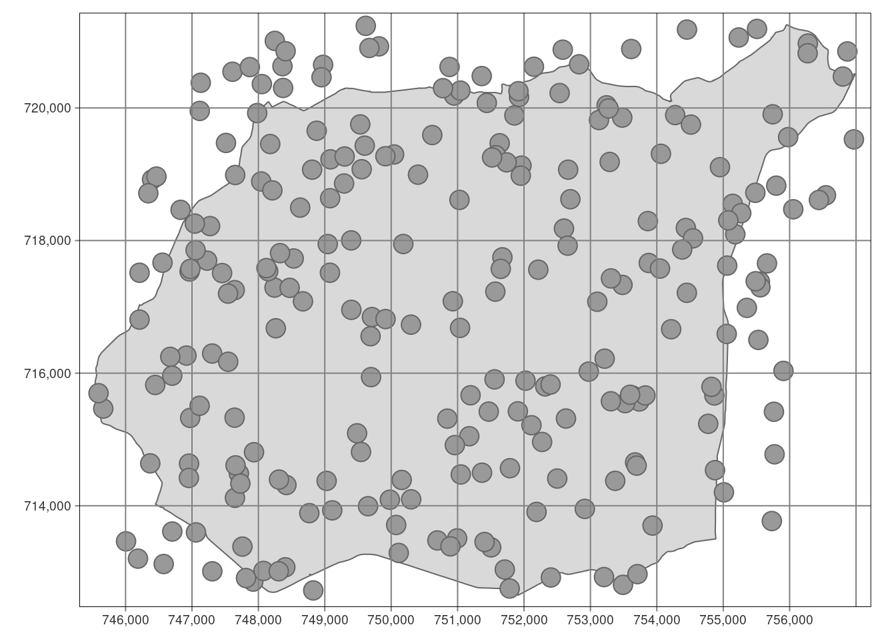
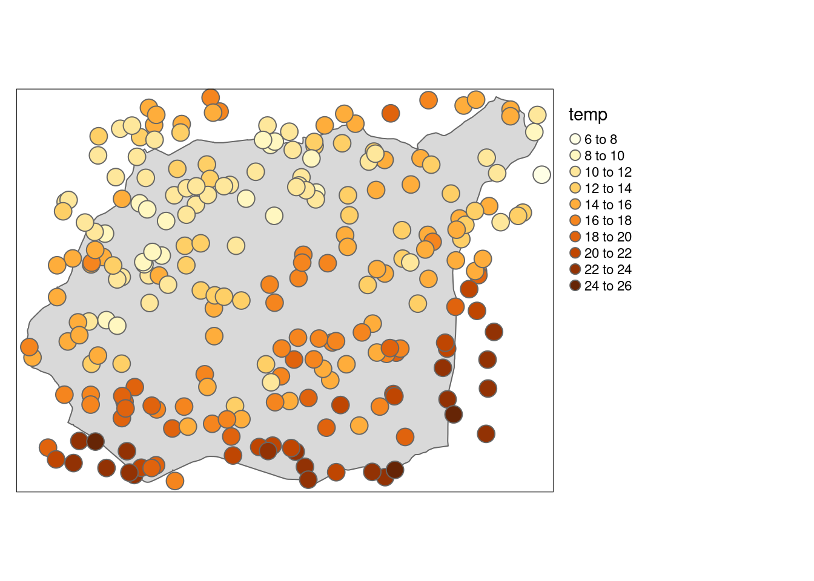
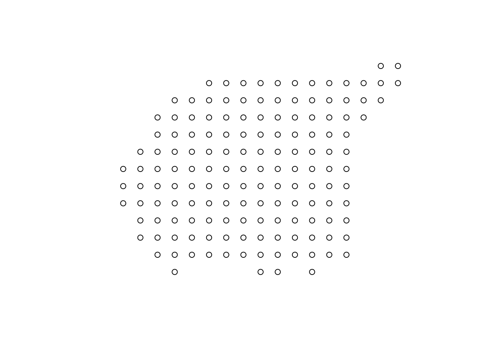
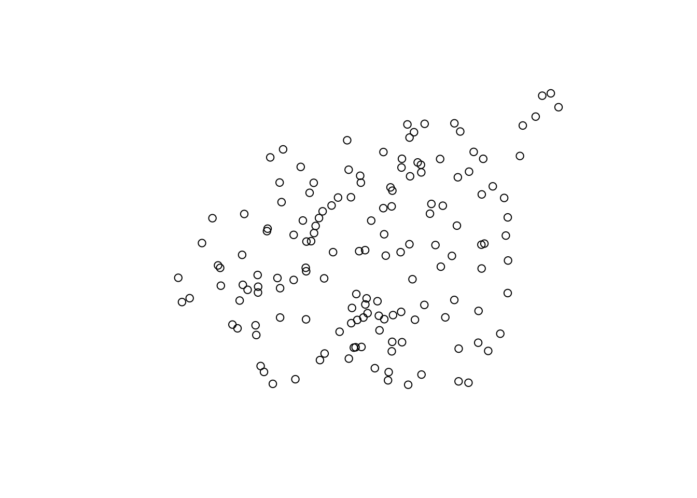
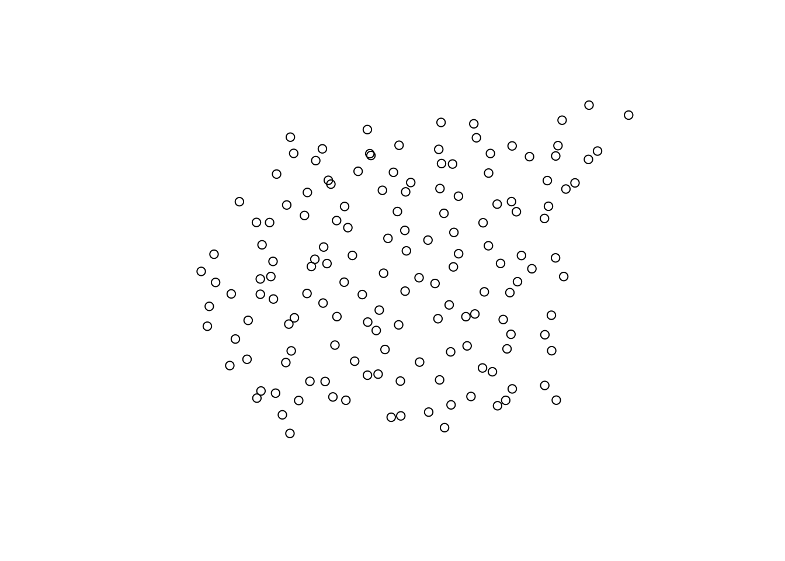
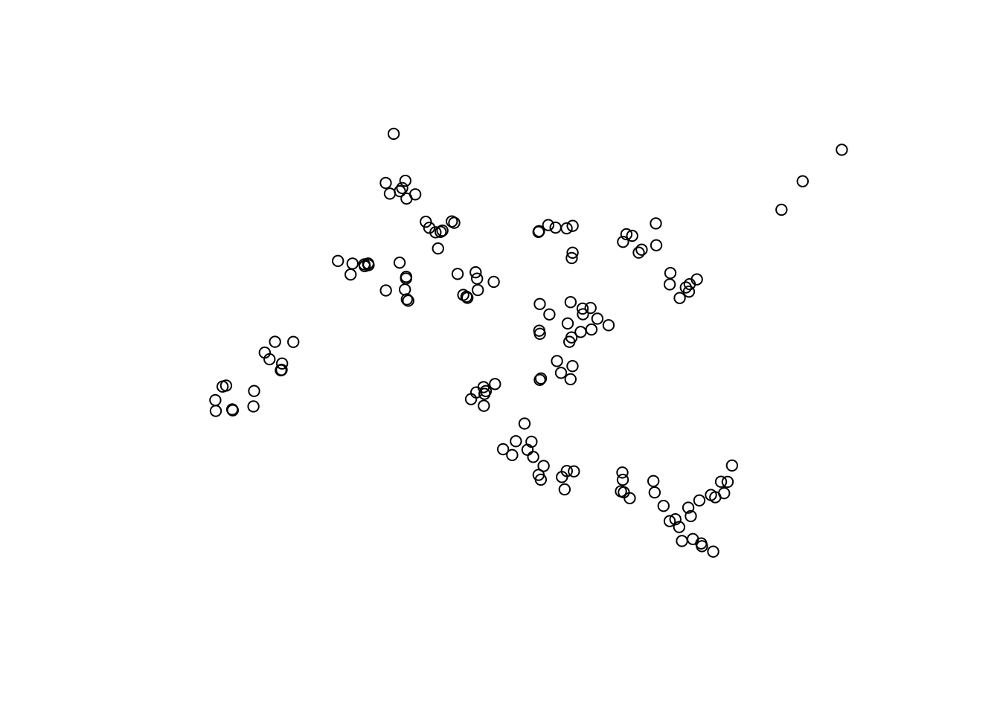
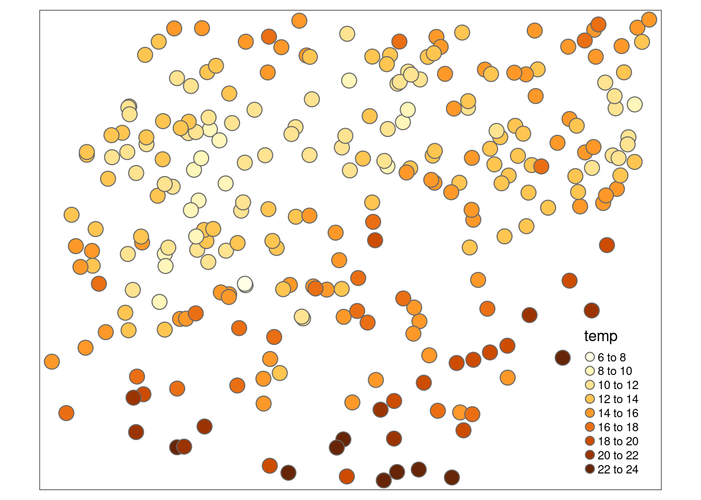
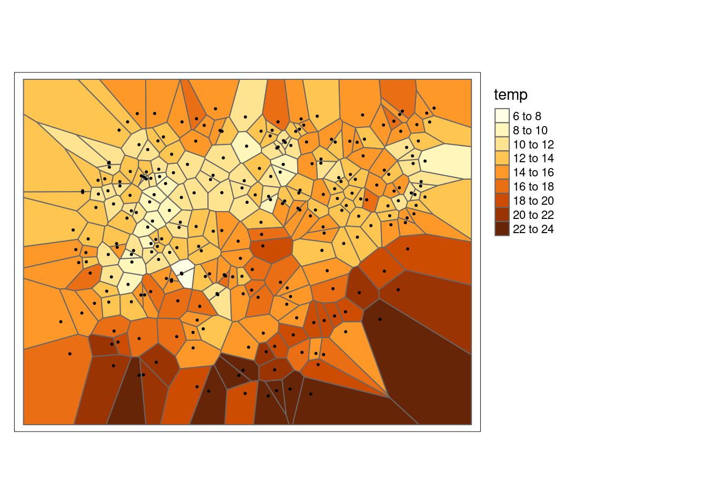
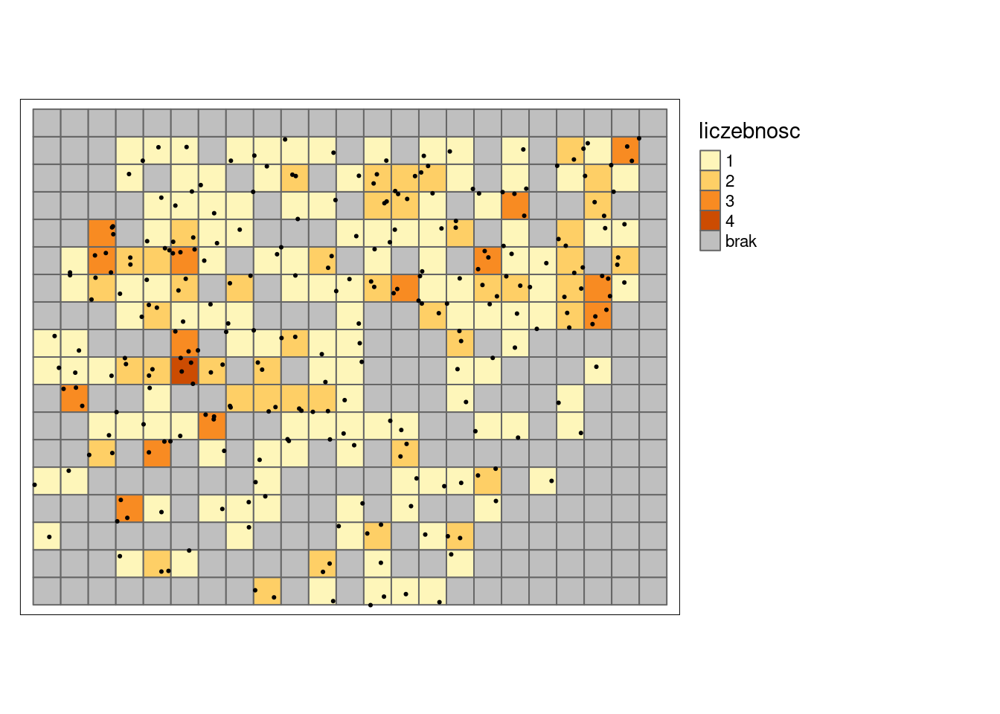

# Eksploracyjna analiza danych przestrzennych {#eksploracyjna-analiza-danych-przestrzennych}

Odtworzenie obliczeń z tego rozdziału wymaga załączenia poniższych pakietów oraz wczytania poniższych danych:


``` r
library(sf)
library(stars)
library(tmap)
library(geostatbook)
data(punkty)
data(granica)
```


## Aspekt przestrzenny 

### Podstawowe terminy

- Populacja - cały obszar, dla którego chcemy określić wybrane właściwości, np. temperatura powietrza.
- Próba - zbiór obserwacji, dla których mamy informacje, np. pomiary ze stacji meteorologicznych.
Inaczej, próba to podzbiór populacji. 

Zazwyczaj niemożliwe (lub bardzo kosztowne) jest zdobycie informacji o całej populacji. 
Z tego powodu bardzo cenne jest odpowiednie wykorzystanie informacji z próby, a następnie wnioskowanie na jej podstawie o populacji.

### Mapy punktowe

Eksploracyjna analiza danych przestrzennych w przypadku danych punktowych ma na celu:

- Sprawdzenie poprawności współrzędnych (sekcja \@ref(popr-wsp)).
- Sprawdzenie poprawności danych, w tym między innymi określenie danych odstających lokalnie (sekcja \@ref(dane-odst)).
- Wgląd w typ próbkowania danych (sekcja \@ref(probkowanie)).
- Rozgrupowanie danych przy próbkowaniu preferencyjnym (sekcja \@ref(rozgrupowanie)).
- Ogólny pogląd na zmienność przestrzenną, wykorzystanie prostej automatycznej procedury interpolacji (rozdział \@ref(metody-interpolacji)).

## Sprawdzenie poprawności współrzędnych {#popr-wsp}

Wstępne sprawdzenie poprawności współrzędnych można wykonać poprzez wizualizację danych przestrzennych za pomocą funkcji `plot()` (rycina \@ref(fig:04-eksp-przestrzenna-3)).


``` r
tm_shape(granica) +
        tm_polygons() +
        tm_shape(punkty) +
        tm_symbols() +
        tm_grid()
```

<div class="figure" style="text-align: center">

<p class="caption">(\#fig:04-eksp-przestrzenna-3)Lokalizacja punktów pomiarowych na tle granicy obszaru badań.</p>
</div>

## Dane lokalnie odstające {#dane-odst}

Dane lokalnie odstające oznaczają nietypowe przestrzennie wartości danej cechy; nie zawsze możliwe jest ich określenie używając statystyk opisowych czy histogramów.
Daną lokalnie odstającą może być przykładowo niska wartość otoczona wysokimi wartościami lub też wysoka wartość otoczona niskimi wartościami.
Może to oznaczać zarówno błąd w danych albo wpływ innego czynnika na analizowaną cechę. 
Przyjrzenie się wartościom analizowanej cechy można wykonać z użyciem funkcji `plot()`. 
Na poniższym przykładzie wyświetlona jest zmienna `temp` oznaczająca średnią temperaturę dobową (rycina \@ref(fig:04-eksp-przestrzenna-8)).


``` r
tm_shape(granica) +
        tm_polygons() +
        tm_shape(punkty) +
        tm_symbols(col = "temp", n = 10) +
        tm_layout(legend.outside = TRUE)
```

<div class="figure" style="text-align: center">

<p class="caption">(\#fig:04-eksp-przestrzenna-8)Wizualizacja zmiennej temp pozwalająca na wyszukanie wartości lokalnie odstających.</p>
</div>

Dodatkowo można wykorzystać tryb `view` w pakiecie **tmap** do interaktywnego określania wartości oraz numeru punktu (numer wiersza w tabeli atrybutów).


``` r
tmap_mode("view")
tm_shape(punkty) +
        tm_symbols(col = "temp", n = 10)
```

Aby powrócić do trybu statycznego, trzeba użyć funkcji `tmap_mode("plot")`. 


``` r
tmap_mode("plot")
```

## Próbkowanie {#probkowanie}

### Podstawowe typy próbowania

Istnieje cały szereg typów próbkowania danych przestrzennych.
Funkcja `st_sample()` z pakietu **sf** pozwala na stworzenie kilku typów próbkowania (argument `type`), między innymi:

- Regularny (ang.*regular*)
- Losowy (ang.*random*)
- Losowy stratyfikowany (ang.*stratified*)
- Preferencyjny (ang.*clustered*)

### Regularny typ próbowania

W regularnym typie próbkowania, kolejne punkty rozłożone są równomiernie na badanym obszarze (rycina \@ref(fig:04-eksp-przestrzenna-4)).

<div class="figure" style="text-align: center">

<p class="caption">(\#fig:04-eksp-przestrzenna-4)Przykład próbkowania regularnego.</p>
</div>

### Losowy typ próbowania

W losowym typie próbkowania każda lokalizacja ma takie samo prawdopodobieństwo wystąpienia. 
Dodatkowo, każdy punkt jest losowany niezależnie od pozostałych  (rycina \@ref(fig:04-eksp-przestrzenna-5)).

<div class="figure" style="text-align: center">

<p class="caption">(\#fig:04-eksp-przestrzenna-5)Przykład próbkowania losowego.</p>
</div>

### Losowy stratyfikowany typ próbowania

Losowy stratyfikowany typ próbkowania polega na podzieleniu analizowanego obszaru na regularne komórki, a następnie dla każdej komórki losowana jest lokalizacja punktu (rycina \@ref(fig:04-eksp-przestrzenna-6b)).

<div class="figure" style="text-align: center">

<p class="caption">(\#fig:04-eksp-przestrzenna-6b)Przykład próbkowania losowego stratyfikowanego.</p>
</div>


### Preferencyjny typ próbowania

W preferencyjnym typie próbkowania istnieją obszary, które z jakieś powodu (np. specyficzne wartości analizowanej cechy) są znacznie częściej opróbowane niż inne (rycina \@ref(fig:04-eksp-przestrzenna-7b)).

<div class="figure" style="text-align: center">

<p class="caption">(\#fig:04-eksp-przestrzenna-7b)Przykład próbkowania preferencyjnego.</p>
</div>


<!-- https://www.youtube.com/watch?v=75IZVZBaLkQ -->

<!-- Wskaźnik Clarka-Evansa (1954) to stosunek między rzeczywistą średnią odległością od najbliższego sąsiada, a oczekiwaną dla rozkładu losowego:

- **Wartości niższe od 1** wskazują na występowanie skupień punktów
- **Wartość równa 1** wskazuje na losowy rozkład punktów
- **Wartości wyższe od 1** wskazują na bardziej regularny ich rozkład (np., dla regularnej siatki heksagonalnej wartość wskaźnika wynosi 2,15)

- Wartość wskaźnika Clarka-Evansa (1954) dla poniższych danych wynosi 
- Oznacza to, że te dane były próbkowane w schemacie (układzie) zbliżonym do losowego -->

## Rozgrupowanie danych {#rozgrupowanie}

Typ próbkowania może wpływać na wartości statystyk opisowych.
W odpowiedzi na to istnieje szereg metod rozgrupowywania danych, wśród których można wymienić, między innymi, rozgrupowywanie poligonalne oraz rozgrupowywanie komórkowe.
Celem tych metod jest nadanie wag obserwacjom w celu zapewnienia reprezentatywności przestrzennej danych.

Na potrzeby przykładów związanych z rozgrupowaniem danych w pakiecie **geostatbook** znajduje się zbiór danych `punkty_pref`.
W tym zbiorze gęściej opróbkowane są niskie wartości temperatury, co powoduje, że średnia dla całego obszaru jest znacznie niższa niż w rzeczywistości.


``` r
data(punkty_pref)
tm_shape(punkty_pref) +
        tm_symbols(col = "temp", n = 10)
```




``` r
srednia_arytmetyczna = mean(punkty_pref$temp, na.rm = TRUE)
srednia_arytmetyczna
```

```
## [1] 14.06929
```

### Rozgrupowanie poligonalne

**Rozgrupowanie poligonalne** polega na zastosowaniu jednej z metod triangulacji, np. poligonów Woronoja:

1. Dla każdego punktu określany jest poligon
2. Wyliczana jest powierzchnia poligonu
3. Waga każdego punktu wyliczana jest poprzez podzielenie powierzchni indywidualnych przez powierzchnię całego obszaru, a następnie pomnożenie przez liczbę punktów

$$w'_j=\frac{area_j}{\sum_{j=1}^{n}area_j} \cdot n$$
, gdzie $area_j$ powierzchnia dla wybranej obserwacji, a $n$ to łączna liczba obserwacji


``` r
library(dismo)
punkty_pref$id = 1:nrow(punkty_pref)
v = st_as_sf(voronoi(as(punkty_pref, "Spatial")))
v$pow = as.numeric(st_area(v))
v$waga_rp = v$pow / sum(v$pow) * nrow(punkty_pref)
v_df = st_drop_geometry(v[c("id", "waga_rp")])
punkty_pref = merge(punkty_pref, v_df, by = "id")
```


``` r
tm_shape(v) +
        tm_polygons(col = "temp", n = 10) +
        tm_shape(punkty_pref) +
        tm_dots() +
        tm_layout(legend.outside = TRUE)
```




``` r
srednia_wazona_rp = mean(punkty_pref$temp * punkty_pref$waga_rp, na.rm = TRUE)
srednia_wazona_rp
```

```
## [1] 15.87475
```

### Rozgrupowanie komórkowe

Rozgrupowanie komórkowe (ang. *cell declustering*) polega na:

1. Stworzeniu regularnej siatki dla badanego obszaru
2. Policzeniu liczby obserwacji w każdym oczku siatki
3. Nadanie wagi dla każdego punktu, zgodnie ze wzorem:

$$w'_j=\frac{\frac{1}{n_i}}{\text{liczba komorek z danymi}} \cdot n$$

, gdzie $n_i$ to liczba obserwacji w komórce, a $n$ to łączna liczba obserwacji


``` r
siatka_n = st_make_grid(granica, cellsize = 500)
siatka_n = st_as_sf(siatka_n)
punkty_pref$liczebnosc = 0
st_crs(siatka_n) = st_crs(punkty_pref)
siatka_nr = aggregate(punkty_pref["liczebnosc"], by = siatka_n, FUN = length)
# siatka_nr$odw_licz = 1 / siatka_nr$liczebnosc
punkty_pref$liczebnosc = NULL
punkty_pref = st_join(punkty_pref, siatka_nr)
punkty_pref$waga_rk = ((1 / punkty_pref$liczebnosc) /
                       sum(!is.na(siatka_nr$liczebnosc))) *
                      nrow(punkty_pref)
```


``` r
tm_shape(siatka_nr) +
        tm_polygons(col = "liczebnosc", n = 10, textNA = "brak") +
        tm_shape(punkty_pref) +
        tm_dots() +
        tm_layout(legend.outside = TRUE)
```




``` r
srednia_wazona_rk = mean(punkty_pref$temp * punkty_pref$waga_rk, na.rm = TRUE)
srednia_wazona_rk
```

```
## [1] 14.26612
```

### Porównanie metod rozgrupowania


Średnia wartość temperatury dla badanego obszaru wynosiła 15,59 stopni Celsjusza, jednak w preferencyjnej próbie ta wartość wynosiła 14,07 stopni Celsjusza.
Porównując dwie zastosowane metody rozgrupowania warto zauważyć, że najbliższy wynik uzyskano korzystając z rozgrupowania poligonalnego, które nieznacznie zawyżyło rzeczywistą wartość temperatury.
Rozgrupowanie komórkowe było w tym przypadku mniej dokładne, wyraźnie zawyżając wartości temperatury.


|                          | Średnia arytmetyczna|
|:-------------------------|--------------------:|
|Populacja                 |              15.5913|
|Próba                     |              14.0693|
|Rozgrupowanie poligonalne |              15.8747|
|Rozgrupowanie komórkowe   |              14.2661|

W przypadku metod rozgrupowania należy jednak pamiętać, że ich wynik zależy od szeregu wprowadzonych parametrów, w szczególności granic badanego obszaru oraz zastosowanej wielkości oczka siatki.

<!--
polygon declustering - http://gis.stackexchange.com/questions/122376/cell-declustering-using-open-source-software
cell declustering - https://stat.ethz.ch/pipermail/r-sig-geo/2010-February/007710.html
http://gaa.org.au/pdf/DeclusterDebias-CCG.pdf


<!-- Poniżej znajdują się przykłady użycia dwóch wersji rozgrupowania komórkowego (rozgrupowywanie komórkowe I oraz rozgrupowywanie komórkowe II) i jedna wersja rozgrupowania poligonowego. -->

<!-- ### Rozgrupowanie danych -->

<!-- Na potrzeby przykładów związanych z rozgrupowaniem danych w pakiecie **geostatbook** znajduje się zbiór danych `punkty_pref`.  -->
<!-- W tym zbiorze gęściej opróbkowane są niskie wartości temperatury, co powoduje, że średnia dla całego obszaru jest znacznie niższa niż w rzeczywistości. -->

<!-- ```{r } -->
<!-- data(punkty_pref) -->
<!-- spplot(punkty_pref, "temp") -->
<!-- summary(punkty_pref$temp) -->
<!-- ``` -->

<!-- ### Rozgrupowanie komórkowe I | (ang. *cell declustering*) -->

<!-- Pierwszy rodzaj rozgrupowania komórkowego polega na: -->

<!-- 1. Stworzeniu siatki dla badanego obszaru -->
<!-- 2. Policzeniu liczby obserwacji w każdym oczku siatki -->
<!-- 3. Nadanie wagi dla każdego punktu, zgodnie ze wzorem: -->

<!-- $$w'_j=\frac{\frac{1}{n_i}}{\text{liczba komorek z danymi}} \cdot n$$ -->
<!-- , gdzie $n_i$ to liczba obserwacji w komórce, a $n$ to łączna liczba obserwacji -->

<!-- ### Rozgrupowanie komórkowe I | (ang. *cell declustering*) -->

<!-- ```{r rozkom01} -->
<!-- data(punkty_pref) -->
<!-- punkty_pref$id = 1:nrow(punkty_pref) -->
<!-- spplot(punkty_pref, "id", colorkey = TRUE) -->

<!-- data(granica) -->
<!-- siatka_n = raster(extent(gBuffer(granica, width = 500))) -->
<!-- res(siatka_n) = c(1000, 1000) -->
<!-- siatka_n[] = 0 -->
<!-- proj4string(siatka_n) = CRS(proj4string(punkty_pref)) -->
<!-- siatka_n = as(siatka_n, "SpatialPolygonsDataFrame") -->
<!-- siatka_n = siatka_n[!is.na(siatka_n@data$layer), ] -->
<!-- plot(siatka_n) -->
<!-- plot(punkty_pref, add = TRUE) -->

<!-- punkty_pref$liczebnosc = rep(0, length(punkty_pref)) -->
<!-- siatka_nr = aggregate(punkty_pref["liczebnosc"], by = siatka_n, FUN = length) -->
<!-- spplot(siatka_nr, "liczebnosc") -->

<!-- liczba = over(punkty_pref, siatka_nr) -->
<!-- punkty_pref$waga = ((1 / liczba$liczebnosc) / sum(!is.na(siatka_nr$liczebnosc))) * length(punkty_pref) -->

<!-- spplot(punkty_pref, "waga") -->

<!-- srednia_arytmetyczna = mean(punkty_pref$temp) -->
<!-- srednia_wazona_c1 = mean(punkty_pref$temp * punkty_pref$waga, na.rm = TRUE) -->
<!-- ``` -->

<!-- ### Rozgrupowanie komórkowe II | (ang. *cell declustering*) -->

<!-- Drugi rodzaj rozgrupowania komórkowego polega na: -->

<!-- 1. Stworzeniu siatki dla badanego obszaru -->
<!-- 2. Wykonaniu interpolacji z użyciem funkcji `krige()` z pakietu **gstat**. W tym wypadku konieczne jest użycie argumentu `nmax = 1`, który przypisuje wartość najbliższej obserwacji do każdego oczka siatki. -->
<!-- 3. Waga dla każdego punktu nadawana jest poprzez zliczenie liczby oczek siatki dla konkretnej wartości, a następnie podzielenie tego przez liczbę oczek siatki. -->

<!-- <!-- -->
<!-- - Przygotowanie danych -->
<!-- https://stat.ethz.ch/pipermail/r-sig-geo/2010-February/007710.html -->

<!-- When "interpolating" with nmax=1, you basically assign the value of the -->
<!-- nearest observation to each grid cell, so, honoustly, it's hard to call -->
<!-- this interpolation, it is rather something of a discretized Thiessen -->
<!-- polygon. -->
<!-- --> 

<!-- ```{r rozkom02} -->
<!-- data(punkty_pref) -->
<!-- punkty_pref$id = 1:nrow(punkty_pref) -->
<!-- spplot(punkty_pref, "id", colorkey = TRUE) -->

<!-- data(granica) -->
<!-- siatka_n = raster(extent(gBuffer(granica, width = 500))) -->
<!-- res(siatka_n) = c(100, 100) -->
<!-- siatka_n[] = 0 -->
<!-- proj4string(siatka_n) = CRS(proj4string(punkty_pref)) -->
<!-- siatka_n = as(siatka_n, "SpatialPointsDataFrame") -->
<!-- siatka_n = siatka_n[!is.na(siatka_n@data$layer), ] -->
<!-- gridded(siatka_n) = TRUE -->
<!-- plot(siatka_n, border = TRUE) -->
<!-- ``` -->

<!-- ```{r rozkom02b} -->
<!-- out = krige(id~1, punkty_pref, siatka_n, nmax = 1) -->
<!-- spplot(out, "var1.pred") -->
<!-- df = as.data.frame(table(out[[1]])) -->
<!-- df$waga = df$Freq / sum(df$Freq) -->
<!-- punkty_pref = sp::merge(punkty_pref, df, by.x = "id", by.y = "Var1") -->
<!-- summary(punkty_pref$waga) -->
<!-- spplot(out, "var1.pred", sp.layout = list("sp.points", punkty_pref)) -->
<!-- # spplot(punkty_pref, "waga") -->

<!-- srednia_arytmetyczna = mean(punkty_pref$temp) -->
<!-- srednia_wazona_c2 = sum(punkty_pref$temp * punkty_pref$waga, na.rm = TRUE) -->
<!-- ``` -->

<!-- ### Rozgrupowanie poligonowe | (ang. *polygon declustering*) -->

<!-- Rozgrupowanie poligonowe polega na zastosowaniu jednej z metod triangulacji, np. poligonów Voronoi'a: -->

<!-- 1. Dla każdego punktu określany jest poligon. -->
<!-- 2. Wyliczana jest powierzchnia poligonu. -->
<!-- 3. Waga każdego punktu wyliczana jest poprzez podzielenie powierzchni indywidualnych przez powierzchnię całego obszaru, a następnie pomnożenie przez liczbę punktów. -->

<!-- $$w'_j=\frac{area_j}{\sum_{j=1}^{n}area_j} \cdot n$$ -->
<!-- , gdzie $area_j$ powierzchnia dla wybranej obserwacji, a $n$ to łączna liczba obserwacji -->

<!-- ### Rozgrupowanie poligonowe | (ang. *polygon declustering*) -->

<!-- ```{r rozpoly} -->
<!-- data(punkty_pref) -->
<!-- punkty_pref$id = 1:nrow(punkty_pref) -->
<!-- spplot(punkty_pref, "id", colorkey = TRUE) -->

<!-- v = voronoi(punkty_pref) -->
<!-- plot(punkty_pref, cex = 0.2, col = "red") -->
<!-- plot(v, add = TRUE) -->

<!-- v$pow = area(v) -->
<!-- v$waga = v$pow / sum(v$pow) * length(punkty_pref) -->

<!-- punkty_pref = sp::merge(punkty_pref, v[c("id", "waga")], by = "id") -->
<!-- spplot(punkty_pref, "waga") -->

<!-- srednia_arytmetyczna = mean(punkty_pref$temp, na.rm = TRUE) -->
<!-- srednia_wazona_p = mean(punkty_pref$temp * punkty_pref$waga, na.rm = TRUE) -->
<!-- ``` -->

<!-- ```{r old_with_intersect, echo=FALSE, eval=FALSE} -->
<!-- data(punkty_pref) -->
<!-- punkty_pref$id = 1:nrow(punkty_pref) -->
<!-- spplot(punkty_pref, "id", colorkey = TRUE) -->

<!-- v = voronoi(punkty_pref) -->
<!-- plot(punkty_pref, cex = 0.2, col = "red") -->
<!-- plot(v, add = TRUE) -->

<!-- v_intersect = intersect(granica, v) -->
<!-- plot(punkty_pref, cex = 0.2, col = "red") -->
<!-- plot(v_intersect, add = TRUE) -->

<!-- v_intersect$pow = area(v_intersect) -->
<!-- v_intersect$waga = v_intersect$pow / sum(v_intersect$pow) * length(punkty_pref) -->

<!-- punkty_pref = merge(punkty_pref, v_intersect[c("id", "waga")], by = "id") -->
<!-- spplot(punkty_pref, "waga") -->

<!-- srednia_arytmetyczna = mean(punkty_pref$temp, na.rm = TRUE) -->
<!-- srednia_wazona_p = mean(punkty_pref$temp * punkty_pref$waga, na.rm = TRUE) -->
<!-- ``` -->


<!-- ### Porównanie metod rozgrupowania -->

<!-- Średnia wartość temperatury dla badanego obszaru wynosiła 15,59 stopni Celsjusza, jednak w preferencyjnej próbie ta wartość wynosiła 14,28 stopni Celsjusza.  -->
<!-- Porównując trzy zastosowane metody próbkowania warto zauważyć, że najbliższy wynik uzyskano korzystając z pierwszego rodzaju rozgrupowania komórkowego, która nieznacznie zaniżyła rzeczywistą wartość temperatury. -->
<!-- Rozgrupowanie komórkowe II oraz rozgrupowanie poligonowe były w tym przypadku mniej dokładne, wyraźnie zawyżając wartości temperatury.  -->

<!-- ```{r tab_dec_1, echo=FALSE} -->
<!-- srednia_arytmetyczna_pop = 15.5912781 -->
<!-- df = data.frame(sa = c(srednia_arytmetyczna_pop, srednia_arytmetyczna, srednia_wazona_c1, srednia_wazona_c2, srednia_wazona_p)) -->
<!-- rownames(df) = c("Populacja", "Próba", "Rozgrupowanie komórkowe I", "Rozgrupowanie komórkowe II", "Rozgrupowanie poligonowe") -->
<!-- knitr::kable(df, col.names = "Średnia arytmetyczna", row.names = TRUE, digits = 4) -->
<!-- ``` -->

<!-- W przypadku metod rozgrupowania należy jednak pamiętać, że ich wynik zależy od szeregu wprowadzonych parametrów, w szczególności granic badanego obszaru oraz zastosowanej wielkości oczka siatki. -->

<!-- <!-- -->
<!-- polygon declustering - http://gis.stackexchange.com/questions/122376/cell-declustering-using-open-source-software -->
<!-- cell declustering - https://stat.ethz.ch/pipermail/r-sig-geo/2010-February/007710.html -->
<!-- http://gaa.org.au/pdf/DeclusterDebias-CCG.pdf -->
<!-- --> 

## Zadania {#z4}

1. Wykonaj mapę pokazującą przestrzenny rozkład wartości NDVI w zbiorze `punkty`. 
(Dodatkowo: spróbuj użyć do tego pakietu **tmap** - `install.packages("tmap")`).
2. Stwórz nowy obiekt `punkty4326`, który będzie zawierać pomiary z obiektu `punkty`, ale będzie w układzie odwzorowania WGS 84.
Wykonaj mapę pokazującą przestrzenny rozkład wartości NDVI w zbiorze `punkty4326`. 
Czy dostrzegasz jakieś różnice?
3. Określ i opisz typ próbkowania danych `punkty` oraz danych `punkty_pref`.
4. Porównaj średnią arytmetyczną zmiennej `srtm` z obiektu `punkty_pref` ze średnimi uzyskanymi metodami rozgupowania poligonalnego i rozgrupowanie komórkowego.
(Dodatkowo: sprawdź różne wielkości oczka siatki w rozgrupowaniu komórkowym).

