# Metody interpolacji {#metody-interpolacji}

Odtworzenie obliczeń z tego rozdziału wymaga załączenia poniższych pakietów oraz wczytania poniższych danych:


``` r
library(sf)
library(stars)
library(gstat)
library(tmap)
library(dismo)
library(fields)
library(geostatbook)
data(punkty)
data(siatka)
data(granica)
```


Przez przejściem do interpolacji geostatystycznych, którymi są poświęcona kolejne rozdziały, warto zdać sobie sprawę, że nie jest to jedyna możliwa droga postępowania do stworzenia estymacji przestrzennych. 
Można wyróżnić dwie główne grupy modeli przestrzennych - modele deterministyczne (sekcja \@ref(modele-deterministyczne) oraz modele statystyczne (sekcja \@ref(modele-statystyczne)).

## Tworzenie siatek

Większość metod interpolacji wymaga stworzenia siatki interpolacyjnej (pustego rastra).
Istnieją dwa podstawowe rodzaje takich siatek - siatki regularne oraz siatki nieregularne.

### Siatki regularne

Siatki regularne mają kształt prostokąta obejmującego cały analizowany obszar. 
Określenie granic obszaru można wykonać na podstawie zasięgu danych punktowych za pomocą funkcji `st_bbox()` z pakietu **sf**.


``` r
st_bbox(punkty)
```

```
##     xmin     ymin     xmax     ymax 
## 745592.5 712723.3 756967.8 721238.7
```

Do stworzenia siatki można wykorzystać funkcję `st_as_stars()`.
Tworzy ona nowy obiekt na podstawie obwiedni istniejącego obiektu punktowego oraz zadanej rozdzielczości (rycina \@ref(fig:05-interpolacje-4b)).^[Możliwe jest też ręczne określenie granic obszaru poprzez wpisanie zakresów współrzędnych w funkcji `st_bbox()`.]


``` r
punkty_bbox = st_bbox(punkty)
nowa_siatka = st_as_stars(punkty_bbox, 
                          dx = 500,
                          dy = 500)
nowa_siatka = st_set_crs(nowa_siatka, "EPSG:2180")
```

<div class="figure" style="text-align: center">
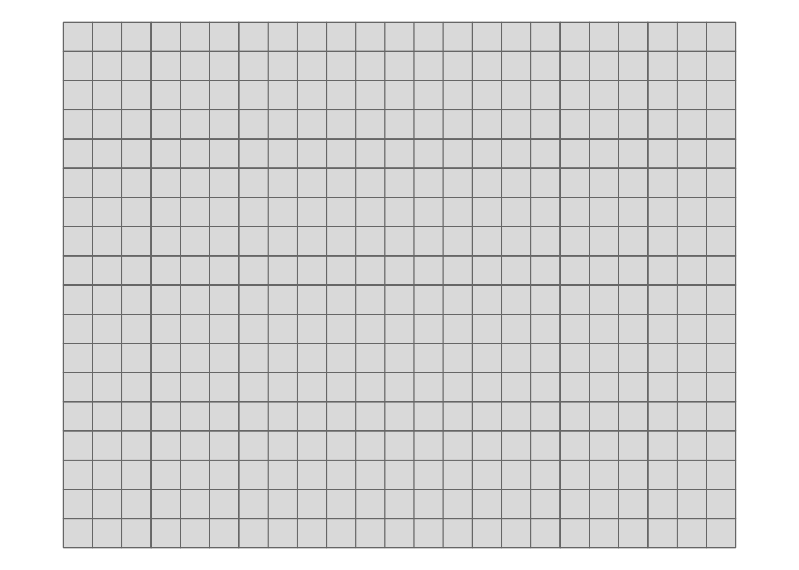
<p class="caption">(\#fig:05-interpolacje-4b)Wizualizacja regularnej siatki z oczkiem o boku 500 na 500 metrów.</p>
</div>

<!-- siatka by hand -->

### Siatki nieregularne

Siatki nieregularne mają zazwyczaj kształt wieloboku obejmującego analizowany obszar. 
Mogą one powstać, np. w oparciu o wcześniej istniejące granice.

W poniższym przypadku odczytywana jest granica badanego obszaru z pliku w formacie GeoPackage.
Taki obiekt można np. stworzyć za pomocą oprogramowania GIS takiego jak [QGIS](http://www.qgis.org/pl/site/).
Następnie tworzony jest nowy obiekt `nowa_siatka_n` poprzez wybranie tylko tych oczek siatki, które znajdują się wewnątrz zadanych granic.


``` r
granica = read_sf("dane/granica.gpkg")
nowa_siatka_n = nowa_siatka[granica]
```

Wynik przetworzenia można zobaczyć na rycinie \@ref(fig:05-interpolacje-7).

<div class="figure" style="text-align: center">
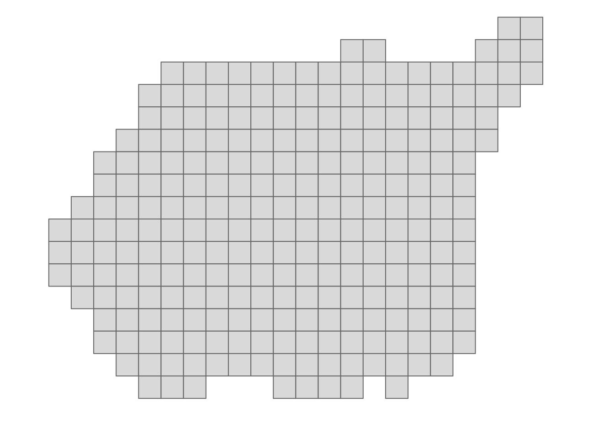
<p class="caption">(\#fig:05-interpolacje-7)Wizualizacja nieregularnej siatki z oczkiem o boku 500 na 500 metrów.</p>
</div>


### Siatki - wizualizacja

Sprawdzenie, czy uzyskana siatka oraz dane punktowe się na siebie nakładają można sprawdzić z pomocą pakietu **tmap** (rycina \@ref(fig:05-interpolacje-6)).


``` r
tm_shape(nowa_siatka) +
        tm_raster(legend.show = FALSE) +
        tm_shape(punkty) +
        tm_dots()
```

<div class="figure" style="text-align: center">
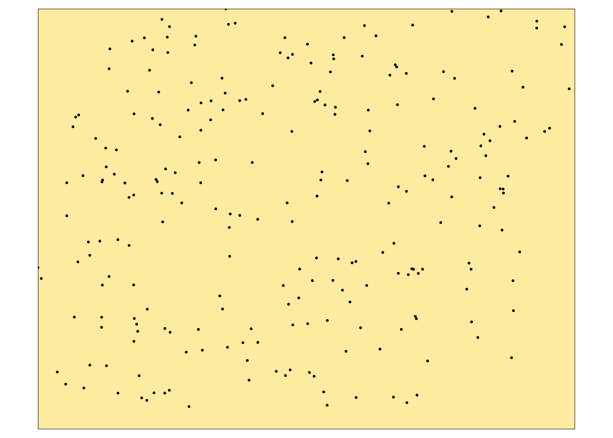
<p class="caption">(\#fig:05-interpolacje-6)Wizualizacja regularnej siatki z nałożonym położeniem obserwacji punktowych.</p>
</div>

## Modele deterministyczne

Modele deterministyczne charakteryzują się tym, że ich parametry są zazwyczaj ustalane w oparciu o funkcję odległości lub powierzchni. 
W tych modelach brakuje szacunków na temat oceny błędu modelu.
Zaletą tych modeli jest ich prostota oraz krótki czas obliczeń. 
Do modeli deterministycznych należą, między innymi:

- Metoda diagramów Woronoja (ang.  *Voronoi diagram*) (sekcja \@ref(voronoi))
- Metoda średniej ważonej odległością (ang. *Inverse Distance Weighted - IDW*) (sekcja \@ref(idw))
- Funkcje wielomianowe (ang. *Polynomials*) (sekcja \@ref(funkcje-wielomianowe))
- Funkcje sklejane (ang. *Splines*) (sekcja \@ref(funkcje-sklejane))

<!--http://neondataskills.org/Data-Workshops/ESA15-Going-On-The-Grid-Spatial-Interpolation-Basics/-->

### Diagramy Woronoja {#voronoi}

Metoda diagramów Woronoja polega na stworzeniu nieregularnych poligonów na podstawie analizowanych punktów, a następnie wpisaniu w każdy poligon wartości odpowiadającego mu punktu. 
Na poniższym przykładzie ta metoda stosowana jest z użyciem funkcji `voronoi()` z pakietu **dismo** (rycina \@ref(fig:05-interpolacje-10)).


``` r
voronoi_interp = voronoi(st_coordinates(punkty))
voronoi_interp = st_as_sf(voronoi_interp)
voronoi_interp$temp = punkty$temp
```


``` r
tm_shape(voronoi_interp) +
        tm_polygons(col = "temp", n = 10, palette = "-Spectral",
                    title = "Diagramy Woronoja:\ntemperatura") +
        tm_layout(legend.outside = TRUE)
```

<div class="figure" style="text-align: center">
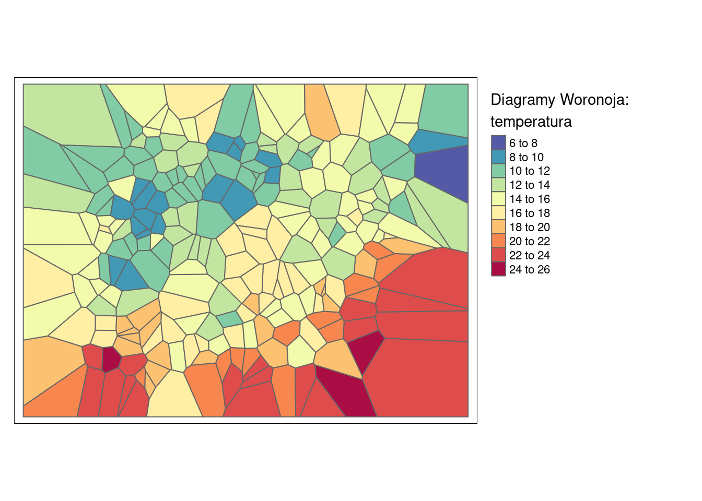
<p class="caption">(\#fig:05-interpolacje-10)Interpolacja zmiennej temp używając metody diagramów Woronoja.</p>
</div>

### IDW

Metoda średniej ważonej odległością (IDW) wylicza wartość dla każdej komórki na podstawie wartości punktów obokległych ważonych odwrotnością ich odległości. 
W efekcie, czym bardziej jest punkt oddalony, tym mniejszy jest jego wpływ na interpolowaną wartość. 
Wagę punktów ustala się z użyciem argumentu wykładnika potęgowego (`idp`, ang. *inverse distance weighting power*) (rycina \@ref(fig:05-interpolacje-11)).


<div class="figure" style="text-align: center">
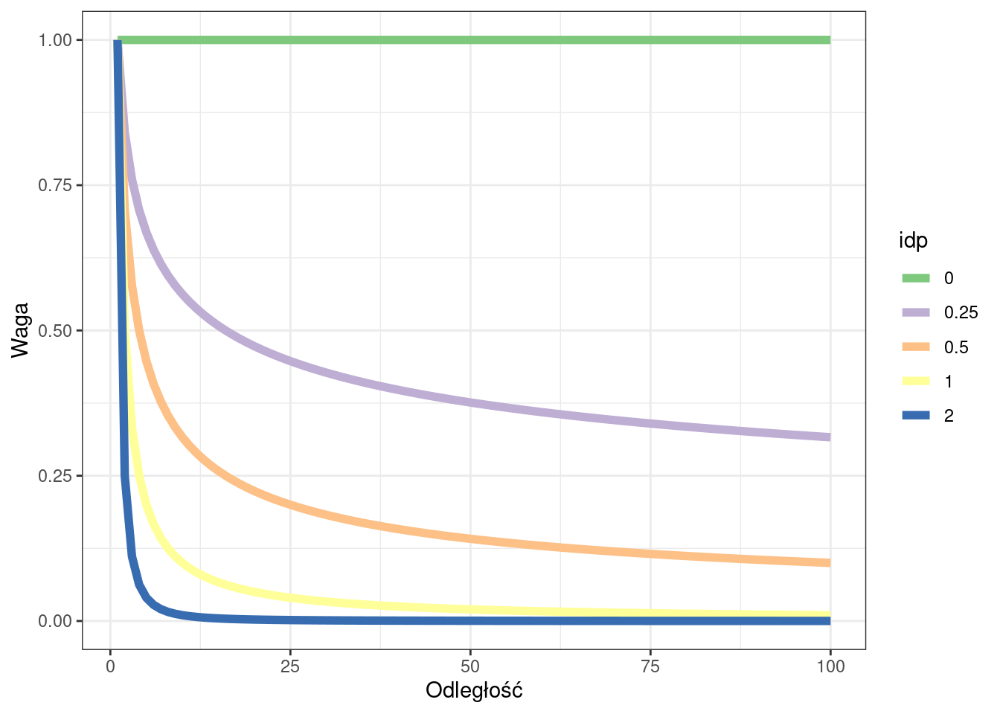
<p class="caption">(\#fig:05-interpolacje-12)Relacja pomiędzy argumentem wykładnika potęgowego a wpływem wartości punktów wraz z odległością.</p>
</div>

W pakiecie **gstat** istnieje do tego celu funkcja `idw()`, która przyjmuje analizowaną cechę (`temp~1`), zbiór punktowy, siatkę, oraz wartość wykładnika potęgowego (argument `idp`) (rycina \@ref(fig:05-interpolacje-11)).


``` r
idw_interp = idw(temp ~ 1, locations = punkty,
                 newdata = siatka, idp = 2)
```

```
## [inverse distance weighted interpolation]
```

``` r
tm_shape(idw_interp) +
        tm_raster(col = "var1.pred", n = 10, palette = "-Spectral",
                  style = "cont", title = "IDW") +
        tm_layout(legend.outside = TRUE)
```

<div class="figure" style="text-align: center">
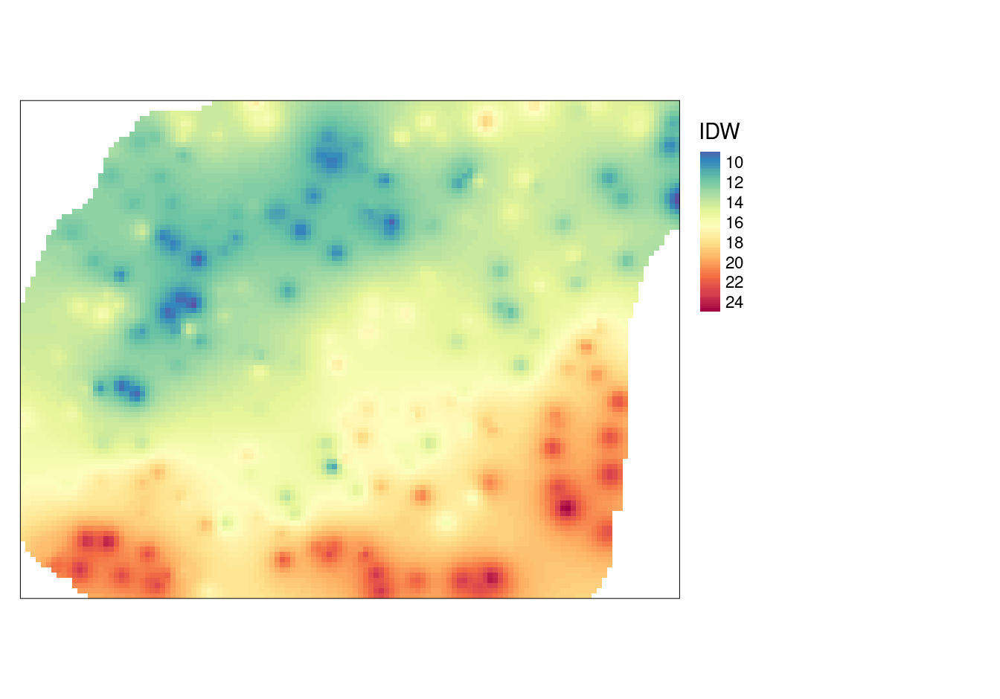
<p class="caption">(\#fig:05-interpolacje-11)Interpolacja zmiennej temp używając metody średniej ważonej odległością (IDW).</p>
</div>

### Funkcje wielomianowe

Stosowanie funkcji wielomianowych w R może odbyć się z wykorzystaniem funkcji `gstat()` z pakietu **gstat**.
Wymaga ona podania trzech argumentów: `formula` określającego naszą analizowaną cechę (`temp~1` mówi, że chcemy interpolować wartość temperatury zależnej od samej siebie), `data` określający analizowany zbiór danych, oraz `degree` określającą stopień wielomianu.
Następnie funkcja `predict()` przenosi nowe wartości na wcześniej stworzoną siatkę.
Porównanie wielomianów pierwszego, drugiego i trzeciego stopnia można znaleźć na rycinach \@ref(fig:05-interpolacje-13), \@ref(fig:05-interpolacje-14) i \@ref(fig:05-interpolacje-15).


``` r
# wielomian 1 stopnia
wielomian_1 = gstat(formula = temp ~ 1, locations = punkty,
                    degree = 1)
wielomian_1_pred = predict(wielomian_1, newdata = siatka)
```

```
## [ordinary or weighted least squares prediction]
```

``` r
tm_shape(wielomian_1_pred) +
        tm_raster(col = "var1.pred", n = 10, palette = "-Spectral",
                  style = "cont", title = "Wielomian pierwszego stopnia") +
        tm_layout(legend.outside = TRUE)
```

<div class="figure" style="text-align: center">
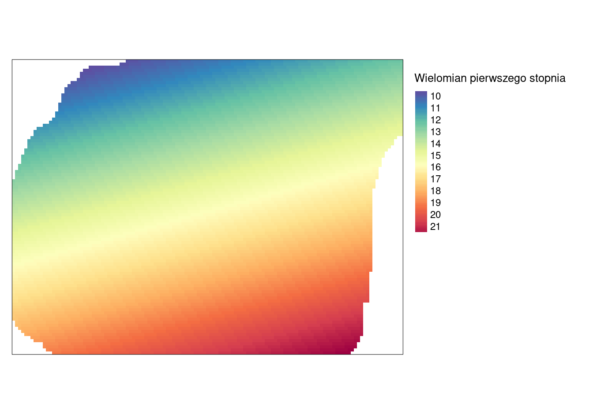
<p class="caption">(\#fig:05-interpolacje-13)Powierzchnia trendu zmiennej temp określona używając wielomianu pierwszego stopnia.</p>
</div>


``` r
# wielomian 2 stopnia
wielomian_2 = gstat(formula = temp ~ 1, locations = punkty,
                    degree = 2)
wielomian_2_pred = predict(wielomian_2, newdata = siatka)
```

```
## [ordinary or weighted least squares prediction]
```

``` r
tm_shape(wielomian_2_pred) +
        tm_raster(col = "var1.pred", n = 10, palette = "-Spectral",
                  style = "cont", title = "Wielomian drugiego stopnia") +
        tm_layout(legend.outside = TRUE)
```

<div class="figure" style="text-align: center">
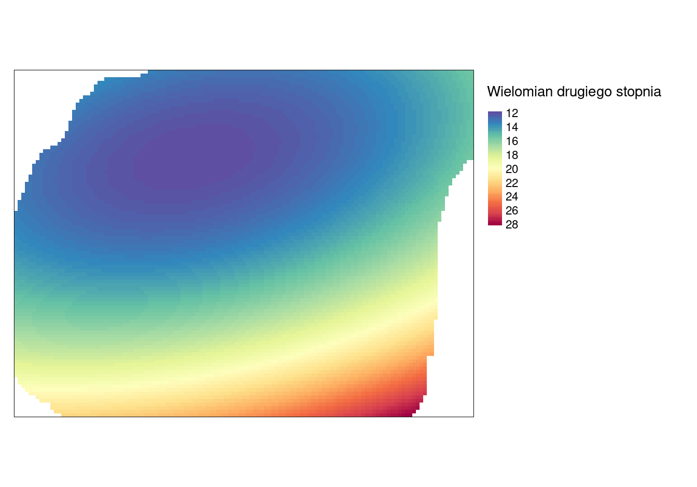
<p class="caption">(\#fig:05-interpolacje-14)Powierzchnia trendu zmiennej temp określona używając wielomianu drugiego stopnia.</p>
</div>


``` r
# wielomian 3 stopnia
wielomian_3 = gstat(formula = temp ~ 1, locations = punkty,
                    degree = 3)
wielomian_3_pred = predict(wielomian_3, newdata = siatka)
```

```
## [ordinary or weighted least squares prediction]
```

``` r
tm_shape(wielomian_3_pred) +
        tm_raster(col = "var1.pred", n = 10, palette = "-Spectral",
                  style = "cont", title = "Wielomian trzeciego stopnia") +
        tm_layout(legend.outside = TRUE)
```

<div class="figure" style="text-align: center">
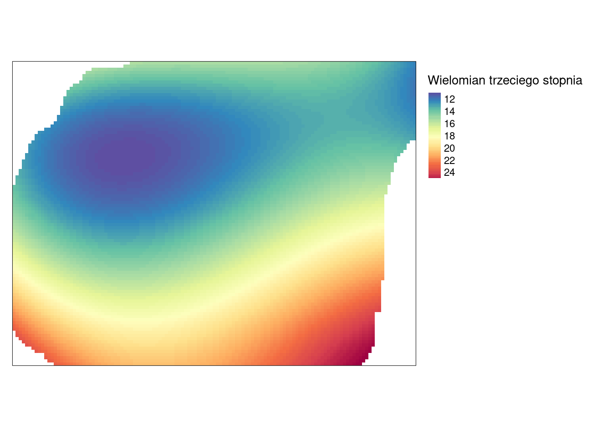
<p class="caption">(\#fig:05-interpolacje-15)Powierzchnia trendu zmiennej temp określona używając wielomianu trzeciego stopnia.</p>
</div>

### Funkcje sklejane

Interpolacja z użyciem funkcji sklejanych (funkcja `Tps()` z pakietu **fields**) dopasowuje krzywą powierzchnię do wartości analizowanych punktów (rycina \@ref(fig:05-interpolacje-16)).


``` r
tps = Tps(st_coordinates(punkty), punkty$temp)
siatka$tps_pred = predict(tps, st_coordinates(siatka))
siatka$tps_pred[is.na(siatka$X2)] = NA
```


``` r
tm_shape(siatka) +
        tm_raster(col = "tps_pred", n = 10, palette = "-Spectral",
                  style = "cont", title = "Funkcje sklejane") +
        tm_layout(legend.outside = TRUE)
```

<div class="figure" style="text-align: center">
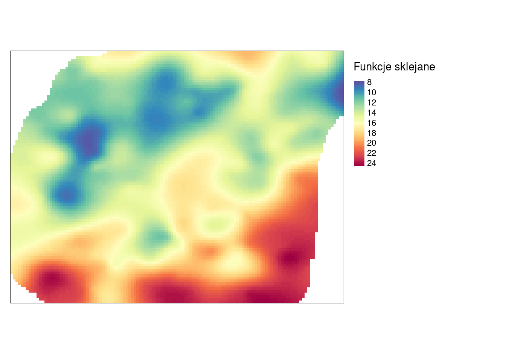
<p class="caption">(\#fig:05-interpolacje-16)Interpolacja zmiennej temp z użyciem funkcji sklejanych.</p>
</div>

### Porównanie modeli deterministycznych

Na rycinie \@ref(fig:05-interpolacje-17) można wizualnie porównać wyniki uzyskane czterema metodami deterministycznymi.

<div class="figure" style="text-align: center">
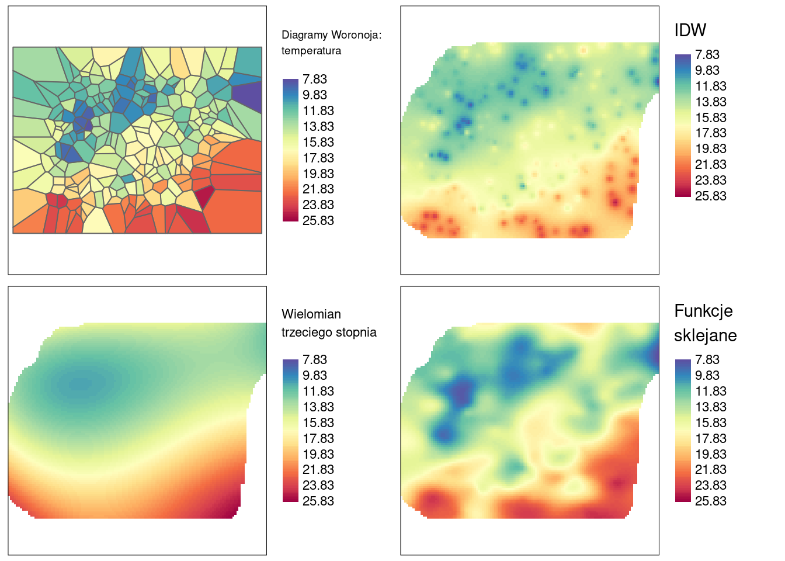
<p class="caption">(\#fig:05-interpolacje-17)Porównanie czterech metod interpolacji dla zmiennej temp używając jednolitej skali wartości.</p>
</div>

## Modele statystyczne

Modele statystyczne charakteryzują się tym, że ich parametry określane są w oparciu o teorię prawdopodobieństwa, dodatkowo wynik estymacji zawiera także oszacowanie błędu.
Te metody jednak zazwyczaj wymagają większych zasobów sprzętowych.
Do modeli statystycznych należą, między innymi:

- Kriging
- Modele regresyjne
- Modele bayesowskie
- Modele hybrydowe

W kolejnych rozdziałach znajduje się omówienie kilku podstawowych typów pierwszej z tych metod - krigingu.

## Zadania {#z5}

1. Stwórz siatkę interpolacyjną o rozdzielczości 200 metrów dla obszaru Suwalskiego Parku Krajobrazowego.
2. Korzystając z danych `punkty` wykonaj interpolację zmiennej `srtm` używając:
- Poligonów Woronoja
- Metody IDW
- Funkcji wielomianowych
- Funkcji sklejanych
3. Porównaj uzyskane wyniki poprzez ich wizualizację. 
Czym różnią się powyższe metody?
4. Wykonaj interpolację zmiennej `temp` metodą IDW sprawdzając różne parametry argumentu `idp`. 
W jaki sposób wpływa on na uzyskaną interpolację?
