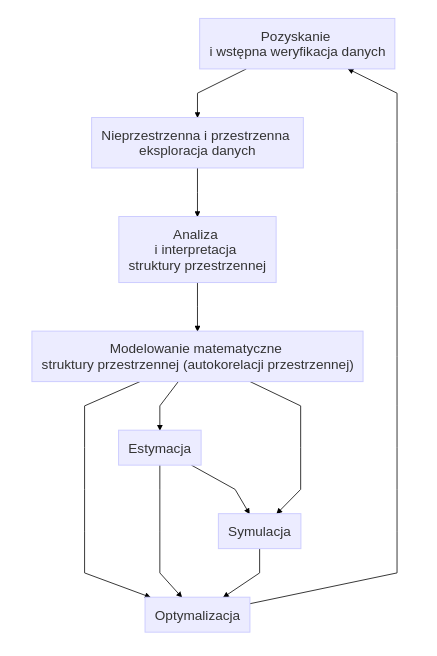
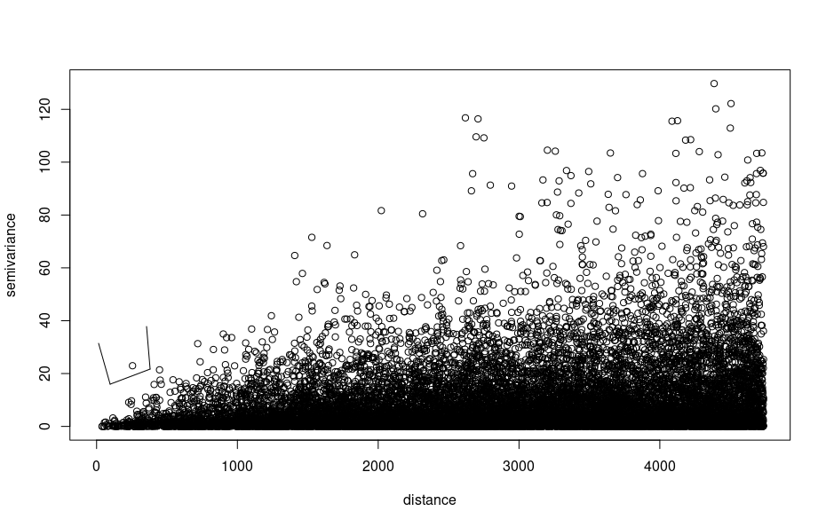
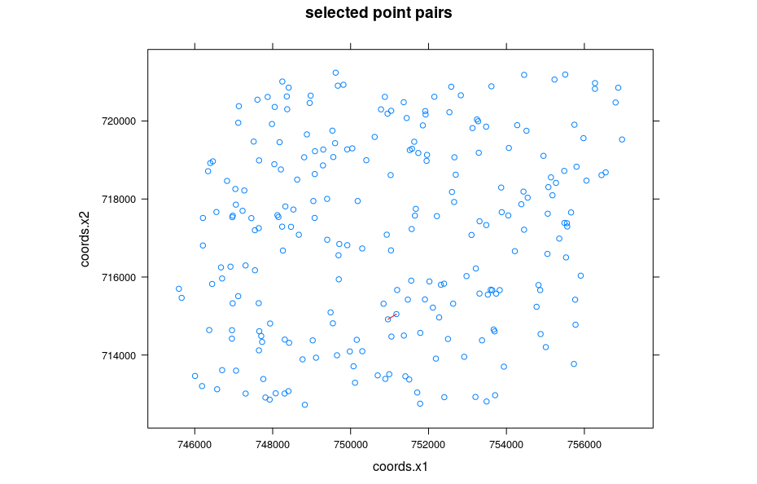
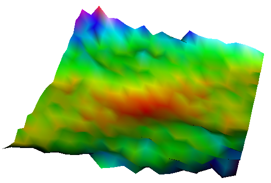

# Geostatystyka - prolog {#geostatystyka-prolog}

```{r, message=FALSE, warning=FALSE}
library("gstat")
library("sp")
library("pgirmess")
library("ggplot2")
library("raster")
library("rasterVis")
library("geostatbook")
data(punkty)
data(siatka)
data(granica)
```

```{r, echo=FALSE}
par(mar = c(rep(0, 4)))
options(scipen = 99 * 99)
```

<!--
http://www.inside-r.org/packages/cran/raster/docs/interpolate

-->

## Geostatystyka

### Geostatystyka

Geostatystyka jest to zbiór narzędzi statystycznych uwzględniających w analizie danych ich przestrzenną i czasową lokalizację, a opartych o teorię funkcji losowych.

<!--
### Geostatystyka a klasyczna statystyka
- Isnieje informacja o lokalizacji obserwacji
-->

### Geostatystyka | Funkcje

Istnieją cztery główne funkcje geostatystyki:

1. Identyfikacja i modelowanie struktury przestrzennej/czasowej zjawiska
2. Estymacja - szacowanie wartości badanej zmiennej w nieopróbowanym miejscu i/lub momencie czasu
3. Symulacja - generowanie alternatywnych obrazów, które honorują wyniki pomiarów i strukturę przestrzenną/czasową zjawiska
4. Optymalizacja próbkowania/sieci pomiarowej 

Inaczej mówiąc, celem geostatystyki nie musi być tylko interpolacja (estymacja) przestrzenna, ale również zrozumienie zmienności przestrzennej lub czasowej zjawiska, symulowanie wartości, oraz optymalizacja sieci pomiarowej.

### Geostatystyczna analiza danych

Geostatystyczna analiza danych może przyjmować różną postać w zależności od postawionego celu analizy. Poniższa rycina przestawia uproszczoną ścieżkę postępowania geostatystycznego. 

```{r diagram, echo=FALSE}
library("DiagrammeR")
# library('trelliscope')
p <- DiagrammeR::mermaid("
                graph TB;
                hw((Dane pomiarowe)) -->Analiza[<center>Analiza <br>i interpretacja <br>struktury przestrzennej</center>];
                Analiza -->Modelowanie[<center>Modelowanie matematyczne <br>struktury przestrzennej</center>]
                Modelowanie -->Estymacja;
                Modelowanie -->Optymalizacja;
                Modelowanie -->Symulacja;
                ")
```

```{r, echo=FALSE, fig.width=8}
library("knitr")

```

<!--
### Geostatystyka | Cele
- Charakterystyka struktury przestrzennej badanego zjawiska
- Uwzględnienie przestrzennych relacji między zmiennymi
- Interpolacja wartości
- Wizualizacja
- Określenie niepewności danych
- Stwierdzenie niepewności estymacji
-->

### Geostatystyka | Podstawowe etapy

W przypadku estymacji geostatystycznej, zwanej inaczej interpolacją geostatystyczną, pełna ścieżka postępowania składa się z siedmiu elementów:

1. Zaprojektowanie sposobu (typu) próbkowania oraz organizacji zadań
2. Zebranie danych, analiza laboratoryjna
3. Wstępna eksploracja danych, ocena ich jakości
4. Modelowanie semiwariogramów na podstawie dostępnych danych
5. Estymacja badanej cechy
6. Porównanie i ocena modeli
7. Stworzenie wynikowego produktu i jego dystrybucja

### Geostatystyka | Dane wejściowe

Jedną z najważniejszych ograniczeń stosowania metod geostatystycznych jest spełnienie odpowiednich założeń dotyczących danych wejściowych. Muszą one:

1. Zawierać wystarczająco dużą liczbę punktów (minimalnie >30, ale zazwyczaj więcej niż 100/150)
2. Być reprezentatywne
3. Być niezależne
4. Być stworzone używając stałej metodyki
5. Być wystarczająco dokładne

## Przestrzenna kowariancja i korelacja i semiwariancja

### Przestrzenna kowariancja, korelacja i semiwariancja | Założenia

Oprócz ograniczeń dotyczących danych wejściowych, istnieją również założenia dotyczące analizowanej cechy (analizowanego zjawiska):

1. Przestrzennej ciągłości - przestrzenna korelacja między zmienny w dwóch lokalizacjach zależy tylko od ich odległości (oraz czasem kierunku), lecz nie od tego gdzie są one położone
2. Stacjonarności - średnia i wariancja są stałe na całym badanym obszarze

### Przestrzenna kowariancja, korelacja i semiwariancja | Symbole

Podstawowe symbole w określaniu przestrzennej zmienności to:

- $u$ - wektor współrzędnych
- $z(u)$ - badana zmienna jako funkcja położenia - inaczej określany jako ogon (ang. *tail*)
- $h$ - lag - odstęp pomiędzy dwoma lokalizacjami
- $z(u+h)$ - wartość badanej zmiennej odległej o odstęp $h$ - inaczej określany jako głowa (ang. *head*)

### Przestrzenna kowariancja, korelacja i semiwariancja

Przestrzenna kowariancja, korelacja i semiwariancja to miary określające przestrzenną zmienność analizowanej cechy.

- Kowariancja i korelacja to miary podobieństwa pomiędzy dwoma zmiennymi
- Przenosząc to na aspekt przestrzenny, badamy jedną zmienną, ale pomiędzy dwoma punktami odległymi od siebie o pewien dystans (okreslany jako lag)
- W efekcie otrzymujemy miarę podobieństwa pomiędzy wartością głowy i ogona
- Trzecią miarę charakteryzującą relację między obserwacjami odległymi o kolejne odstępy jest semiwariancja
- Z praktycznego punktu widzenia, semiwariogram jest preferowaną miarą relacji przestrzennej, ponieważ wykazuje tendencję do lepszego wygładzania danych niż funkcja kowariancji
- Dodatkowo, semiwariogram jest mniej wymagający obliczeniowo
- Jednocześnie, dla potrzeb interpretacji relacji, kowarancja i korelacja przestrzenna nadaje się nie gorzej niż semiwariancja

```{r z_przs0, echo=FALSE}
hscat(temp~1, punkty, breaks = c(0, 200))
```

### Wykres rozrzutu z przesunięciem

Wykres rozrzutu z przesunięciem pokazuje korelację pomiędzy wartościami analizowanej cechy w pewnych grupach odległości. Taki wykres można stworzyć używając funkcji `hscat()` z pakietu `gstat`. Przykładowo, na poniższym wykresie widać wartość cechy `temp` z kolejnymi przesunięciami - od 0 do 500 metrów, od 500 metrów do 1000 metrów, itd. W pierwszym przedziale wartość cechy `temp` z przesunięciem wykazuje korelację na poziomie 0,876, a następnie z każdym kolejnym przedziałem (odległością) ta wartość maleje. W przedziale 3500 do 4000 metrów osiąga jedynie 0,128. Pozwala to na stwierdzenie, że cecha `temp` wykazuje zmienność przestrzenną - podobieństwo jej wartości zmniejsza się wraz z odległością.

```{r z_przs, fig.height=7}
hscat(temp~1, punkty, breaks = seq(0, 4000, by = 500))
```

### Autokowariancja

Podobną informację jak wykres rozrzutu z przesunięciem daje autokowariancja. Pokazuje ona jak mocno przestrzennie powiązane są wartości par obserwacji odległych od siebie o kolejne przedziały. Jej wyliczenie jest możliwe z użyciem funkcji `variogram()` z pakietu `gstat`, gdzie definiuje się analizowaną zmienną, zbiór punktowy, oraz ustala się argument `covariogram` na `TRUE`.

```{r }
kowario <- variogram(temp~1, punkty, covariogram = TRUE)
plot(kowario)
```

### Autokorelacja

Kolejną miarą przestrzennego podobieństwa jest autokorelacja. Jej wykres (autokorelogram) pokazuje wartość jednej z miar autokorelacji (np. I Morana lub C Geary'ego) w stosunku do odległości. Na poniższym przykładzie, wartość statystyki I Morana jest wyliczana poprzez funkcję `correlog()` z pakietu `pgirmess`.
 
```{r }
wsp <- coordinates(punkty)
kor <- correlog(wsp, punkty$temp, method = "Moran")
kor <- as.data.frame(kor)
ggplot(kor, aes(dist.class, coef)) + geom_smooth(linetype = 0) + geom_line() + geom_point(size = 5)
```

### Semiwariancja

Zmienność przestrzenna analizowanej cechy może być określona za pomocą semiwariancji. Jest to połowa średniej kwadratu różnicy pomiędzy wartościami badanej zmiennej w dwóch lokalizacjach odległych o wektor $h$:

$$ \gamma(h) = \frac{1}{2}E[(z(s) - z(s+h))^2] $$

Przykładowo, aby wyliczyć wartość semiwariancji (`gamma`) pomiędzy dwoma punktami musimy znać wartość pierwszego z nich (w przykładzie jest to ok. 22,46 stopni Celsjusza) oraz drugiego z nich (ok. 16,04 stopni Celsjusza). Korzystając z wzoru na semiwariację otrzymujemy wartość równą ok. 20,60. Znamy również odległość między punktami (ok. 4576,59 metra), więc możemy w uproszczeniu stwierdzić, że dla tej pary punktów odległych o 4577 metry wartość semiwariancji wynosi około 20,6.

```{r }
odl <- dist(coordinates(punkty)[c(1, 2), ])
gamma <- 0.5 * (punkty$temp[1] - punkty$temp[2]) ^ 2
gamma
```

### Chmura semiwariogramu

Jeżeli w badanej próbie mamy $n$ obserwacji oznacza to, że możemy zaobserwować $\frac{1}{2}n(n-1)$ par obserwacji. Każda z tych par obserwacji daje nam informację o semiwariancji występującej wraz z odległością. Tę semiwariancję można zaprezentować na wykresie zwanym chmurą semiwariogramu. Do jej wyliczenia służy funkcja `variogram()` z argumentem `cloud=TRUE`.

```{r }
vario_cloud <- variogram(temp~1, punkty, cloud = TRUE)
plot(vario_cloud)
```

Chmura semiwariogramu pozwala także na zauważenie par punktów, których wartości znacząco odstają. Aby zlokalizować te pary punktów, można zastosować funkcję `plot()` z argumentem `digitize=TRUE`, a następnie za pomocą kilku kliknięć określić obszar zawierający nietypowe wartości. Po skończonym wyborze należy nacisnąć klawisz Esc.

```{r chmurkowanie, eval=FALSE}
vario_cloud_sel <- plot(variogram(temp~1, punkty, cloud = TRUE), digitize = TRUE)
```

```{r, echo=FALSE, fig.width=6}
library("knitr")

```

Następnie można wyświetlić wybrane pary punktów z użyciem funkcji `plot()`.

```{r chmurkowanie2, eval=FALSE}
plot(vario_cloud_sel, punkty)
```

```{r, echo=FALSE, fig.width=6}
library("knitr")

```

### Semiwariogram | Charakterystyka struktury przestrzennej

Semiwariogram jest wykresem pokazującym relację pomiędzy odległością a semiwariancją. Inaczej mówiąc, dla kolejnych odstępów (lagów) wartość semiwariancji jest uśredniana i przestawiania w odniesieniu do odległości. 

$$ \hat{\gamma}(h) = \frac{1}{2N(h)}\sum_{i=1}^{N(h)}(z(s_i) - z(s_i+h))^2 $$

,gdzie $N(h)$ oznacza liczbę par punktów w odstępie $h$.

W oparciu o semiwariogram empiryczny (czyli oparty na danych) możemy następnie dopasować do niego model/e.

### Semiwariogram | Obliczenia pomocnicze

- Liczba par obserwacji:

```{r }
0.5 * length(punkty) * (length(punkty) - 1)
```

- Połowa pierwiastka powierzchni:

```{r }
pow <- area(granica)
as.vector(0.5 * sqrt(pow))
```

 <!--
- Połowa przekątnej obszaru
Twierdzenie Pitagorasa

$$x^2 + y^2 = z^2$$

```{r, eval=FALSE }
wierz <- as.vector(extent(poligon))
kraw_x <- wierz[2] - wierz[1]
kraw_y <- wierz[4] - wierz[3]
z_kwadrat <- kraw_x ^ 2 + kraw_y ^ 2
0.5 * sqrt(z_kwadrat)
```
-->

- Powierzchnia zajmowana przez jedną próbkę:

```{r }
pow_pr <- area(granica) / length(punkty)
pow_pr
```

- Średnia odległość między punktami :

```{r }
sqrt(pow_pr)
```

### Semiwariogram

Semiwariogram składa się z trzech podstawowych elementów. Są to:

- **Nugget** - efekt nuggetowy - pozwala na określenie błędu w danych wejściowych oraz zmienności na dystansie krótszym niż pierwszy odstęp
- **Sill** - semiwariancja progowa - oznacza wariancję badanej zmiennej
- **Range** - zasięg - to odległość do której istnieje przestrzenna korelacja

### Semiwariogram | Rules of thumb

Przy ustalaniu parametrów semiwariogramu powinno się stosować do kilku utartych zasad (tzw. *rules of thumb*):

- W każdym odstępie powinno się znaleźć co najmniej 30 par punktów
- Maksymalny zasięg semiwariogramu (ang. *cutoff distance*) to 1/2 pierwiastka z badanej powierzchni (inne źródła mówią o połowie z przekątnej badanego obszaru/jednej trzeciej)
- Liczba odstępów powinna nie być mniejsza niż 10
- Optymalnie maksymalny zasięg semiwariogramu powinien być dłuższy o 10-15% od zasięgu zjawiska
- Optymalnie odstępy powinny być jak najbliżej siebie i jednocześnie nie być chaotyczne
- Warto metodą prób i błędów określić optymalne parametry semiwariogramu
- Należy określić czy zjawisko wykazuje anizotropię przestrzenną

### Semiwariogram 

Stworzenie podstawowego semiwariogramu w pakiecie `gstat` odbywa się z użyciem funkcji `variogram()`. Należy w niej zdefiniować analizowaną zmienną (w tym przykładzie `temp~1`) oraz zbiór punktowy (`punkty`).

```{r }
vario_par <- variogram(temp~1, punkty)
vario_par
```

Do wyświetlenia semiwariogramu służy funkcja `plot()`. Można również dodać informację o liczbie par punktów, jaka posłużyła do wyliczenia semiwariancji dla kolejnych odstępów poprzez argument `plot.numbers=TRUE`.

```{r}
plot(vario_par, plot.numbers = TRUE)
```

Maksymalny zasięg semiwariogramu (ang. *cutoff distance*) jest domyślnie wyliczany w pakiecie `gstat` jako 1/3 z najdłuższej przekątnej badanego obszaru. Można jednak tę wartość zmodyfikować używając argumentu `cutoff`.

```{r}
vario_par <- variogram(temp~1, punkty, cutoff = 4000)
plot(vario_par)
```

Dodatkowo, domyślnie w pakiecie `gstat` odległość między przedziałami (ang. *interval width*) jest wyliczana jako maksymalny zasięg semiwariogramu podzielony przez 15. Można to oczywiście zmienić używając zarówno argumentu `cutoff`, jak i argumentu `width` mówiącego o szerokości odstępów.

```{r }
vario_par <- variogram(temp~1, punkty, cutoff = 1000, width = 250)
plot(vario_par)
```

<!--
## Wpływa danych odstających

Tak jak inne statystyki typu wariancji, wartości kowariancji i semiwariogramu są bardzo czułe na występowanie danych ekstremalnych – potencjalnie błędnych. Stosuje się trzy sposoby aby ten problem rozwiązać:
Transformację matematyczną danych (logarytmowanie, pierwiastkowanie itp.) , aby zredukować skośność ich histogramu,
Usuwanie par danych, które zaburzają wartość semiwariancji dla określonych odstępów h. Procedura ta zwana jest czyszczeniem wykresu rozrzutu z przesunięciem („h-scattergram cleansing”).
Używanie innych statystyk h-scattergramu, które są mniej czułe na występowanie danych ekstremalnych.
### Rodogram/madogram

```{r }
# library('SpatialExtremes')
# n.site <- 15
# locations <- matrix(runif(2*n.site, 0, 10), ncol = 2)
# colnames(locations) <- c("lon", "lat")
#
# ##Simulate a max-stable process - with unit Frechet margins
# data <- rmaxstab(40, locations, cov.mod = "whitmat", nugget = 0, range = 1,
#                  smooth = 2)
#
# ##Compute the madogram
# madogram(data, locations)
# data2 <- matrix(c(punkty$temp, punkty$X2002.08.20_NDVI), nrow=2)
# locations2 <- coordinates(punkty)
# colnames(locations2) <- c("lon", "lat")
# madogram(data2, locations2)
```

-->

## Anizotropia

### Anizotropia struktury przestrzennej

W wielu sytuacjach, wartość cechy zależy nie tylko od odległości, ale także od kierunku. O takim zjawisku mówimy, że wykazuje ono anizotropię struktury przestrzennej.

### Mapa semiwariogramu

Mapa semiwariogramu (zwana inaczej powierzchnią semiwariogramu) służy do określenia czy struktura przestrzenna zjawiska posiada anizotropię, a jeżeli tak to w jakim kierunku. Na podstawie mapy semiwariogramu identyfikuje się także parametry potrzebne do zbudowania semiwariogramów kierunkowych.

Stworzenie mapy semiwariogramu odbywa się poprzez dodanie kilku argumentów do funkcji `variogram()`: oprócz argumentu zmiennej i zbioru punktowego, jest to `cutoff`, `width`, oraz `map=TRUE`. Następnie można ją wyświetlić używając funkcji `plot()`. Warto w tym wypadku użyć dodatkowego argumentu `threshold`, który powoduje, że niepewna wartość semiwariancji (wyliczona na małej liczbie punktów) nie jest wyświetlana.

```{r }
vario_map <- variogram(temp~1, punkty, cutoff = 4000, width = 400, map = TRUE)
plot(vario_map, threshold = 30) # co najmniej 30 par punktów
```

Mapie semiwariogramu można również się przyjrzeć interaktywnie używając funkcję `plot3D()` z pakietu `rasterVis`.

```{r mapa_semi, eval=FALSE, fig.width=6}
plot3D(raster(vario_map$map), col = rainbow)
```

```{r, echo=FALSE}

```

### Semiwariogramy kierunkowe | Kierunki

W przypadku, gdy zjawisko wykazuje anizotropię przestrzenną, możliwe jest stworzenie semiwariogramów dla różnych wybranych kierunków. Dla argumentu `alpha = c(0, 45, 90, 135)` wybrane cztery główne kierunki to 0, 45, 90 i 135 stopni. Oznacza to, że przykładowo dla kierunku 45 stopni brane pod uwagę będą wszystkie pary punktów pomiędzy 22,5 a 67,5 stopnia.

```{r }
vario_kier <- variogram(temp~1, punkty, alpha = c(0, 45, 90, 135))
plot(vario_kier)
```
