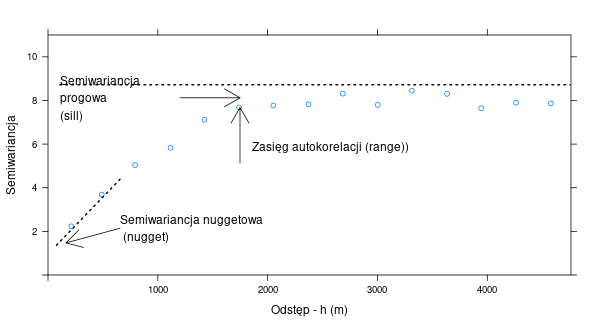

# Modelowanie autokorelacji przestrzennej {#modelowanie-matematycznie-autokorelacji-przestrzennej}

Odtworzenie obliczeń z tego rozdziału wymaga załączenia poniższych pakietów oraz wczytania poniższych danych:

```{r 07-modelowanie-1, message=FALSE, warning=FALSE}
library(sf)
library(stars)
library(gstat)
library(geostatbook)
data(punkty)
paleta = hcl.colors(12, palette = "ag_Sunset")
```

```{r 07-modelowanie-2, echo=FALSE}
par(mar = c(rep(0, 4)))
```

## Modelowanie matematycznie autokorelacji przestrzennej

### Modelowanie struktury przestrzennej

Semiwariogram empiryczny (wyliczony z danych punktowych) jest:

- Nieciągły - wartości semiwariancji są średnimi przedziałowymi.
- Chaotyczny - badana próba jest jedynie przybliżeniem rzeczywistości, dodatkowo obciążonym błędami.

Estymacje i symulacje przestrzenne wymagają modelu struktury przestrzennej analizowanej cechy, a nie tylko wartości empirycznych.
Dodatkowo, matematycznie modelowanie wygładza chaotyczne fluktuacje danych empirycznych (rycina \@ref(fig:07-modelowanie-3)).

```{r 07-modelowanie-3, echo=FALSE, fig.cap = "Porównanie semiwariogramu empirycznego i modelu semiwariogramu."}
library(gridExtra)
punkty$x = st_coordinates(punkty)[,1]
punkty$y = st_coordinates(punkty)[,2]
vario_kzt = variogram(temp~x + y, locations = punkty)
model_kzt = vgm(model = "Sph", nugget = 1)
fitted_kzt = fit.variogram(vario_kzt, model_kzt)
grid.arrange(plot(vario_kzt), plot(vario_kzt, fitted_kzt))
```

### Model semiwariogramu

Model semiwariogramu składa się zazwyczaj z trzech podstawowych elementów (rycina \@ref(fig:07-modelowanie-4)).
Są to:

- **Nugget** - efekt nuggetowy - pozwala na określenie błędu w danych wejściowych oraz zmienności na dystansie krótszym niż pierwszy odstęp.
- **Sill** - semiwariancja progowa - oznacza wariancję badanej zmiennej.
- **Range** - zasięg - to odległość do której istnieje przestrzenna korelacja.

```{r, fig.height=6, fig.width=11, eval=FALSE, echo=FALSE}
punkty$x = st_coordinates(punkty)[,1]
punkty$y = st_coordinates(punkty)[,2]
vario_par = variogram(temp~x + y, locations = punkty)
vario_par$gamma = vario_par$gamma + 1
plot(vario_par, 
     plot.numbers = FALSE,
     xlab = "Odstęp - h (m)",
     ylab = "Semiwariancja",
     ylim = c(0, 11))
library(lattice)
png("figs/variogram.png", width = 600, height = 326, res = 72)
plot(vario_par, 
     plot.numbers = FALSE,
     xlab = "Odstęp - h (m)",
     ylab = "Semiwariancja",
     ylim = c(0, 11))
dev.off()
```

```{r, eval=FALSE, echo=FALSE}
png("figs/variogram_text.png", width = 600, height = 326, res = 72)

library(gridExtra)
library(grid)
arrow_style = arrow(angle = 30, 
                    length = unit(0.25, "inches"),
                    ends = "last", type = "open")
arrow_style2 = arrow(angle = 30, 
                    length = unit(0.05, "inches"),
                    ends = "both", type = "open")
nugget = segmentsGrob(x0 = 0.2, x1 = 0.11, y0 = 0.3, y1 = 0.255,
                     arrow = arrow_style)
nuggetline = segmentsGrob(x0 = 0.2, x1 = 0.09, 
                          y0 = 0.45, y1 = 0.24,
                     gp = gpar(lty = 3, lwd = 2))
varianceline = segmentsGrob(x0 = 0.1, x1 = 0.95, 
                          y0 = 0.74, y1 = 0.74,
                     gp = gpar(lty = 3, lwd = 2))
range = segmentsGrob(x0 = 0.4, x1 = 0.4, y0 = 0.5, y1 = 0.67,
                     arrow = arrow_style)
sill = segmentsGrob(x0 = 0.3, x1 = 0.4, y0 = 0.7, y1 = 0.7,
                     arrow = arrow_style)
my_v = grid::rasterGrob(png::readPNG("figs/variogram.png"))
grid.draw(my_v)
grid.draw(nuggetline)
grid.draw(nugget)
grid.text("Semiwariancja nuggetowa\n (nugget)", x = 0.2, y = 0.3,
          just = "left")
grid.draw(varianceline)
grid.draw(range)
grid.text("Zasięg autokorelacji (range))", x = 0.42, y = 0.55,
          just = "left")
grid.draw(sill)
grid.text("Semiwariancja\nprogowa\n(sill)", x = 0.1, y = 0.7,
          just = "left")
dev.off()
```

```{r 07-modelowanie-4, echo=FALSE, fig.cap = "Podstawowe elementy modelu semiwariogramu."}

```

### Model nuggetowy

Model nuggetowy określa sytuację, w której analizowana zmienna nie wykazuje autokorelacji. 
Inaczej mówiąc, niepodobieństwo jej wartości nie wzrasta wraz z odległością.
Model nuggetowy nie powinien być używany samodzielnie - w większości zastosowań jest on elementem modelu złożonego. 
Służy on do określania, między innymi, błędu pomiarowego czy zmienności na krótkich odstępach.

## Modele podstawowe 

### Typy modeli podstawowych

Pakiet `gstat` zawiera 20 podstawowych modeli geostatystycznych, w tym najczęściej używane takie jak:

- Nuggetowy (ang. *Nugget effect model*)
- Sferyczny (ang. *Spherical model*)
- Gaussowski (ang. *Gaussian model*)
- Potęgowy (ang. *Power model*)
- Wykładniczy (ang. *Exponential model*)
- Inne

Do wyświetlenia listy nazw modeli i ich skrótów służy funkcja `vgm()`.

```{r 07-modelowanie-5 }
vgm()
```

Można się również im przyjrzeć używając funkcji `show.vgms()` (rycina \@ref(fig:07-modelowanie-6)).

```{r 07-modelowanie-6, fig.cap = "Przykład modeli semiwariogramu dostępnych w pakiecie gstat."}
show.vgms()
```

Istnieje możliwość wyświetlenia tylko wybranych modeli podstawowych poprzez argument `models` (rycina \@ref(fig:07-modelowanie-7)).

```{r 07-modelowanie-7, fig.cap = "Porównanie modeli sferycznego (Sph), gaussowskiego (Gau), potęgowego (Pow) i wykładniczego (Exp)."}
show.vgms(models = c("Sph", "Gau", "Pow", "Exp"), 
          range = 1.4, max = 2.5)
```

Dodatkowo, można je porównać na jednym wykresie poprzez argument `as.groups = TRUE` (rycina \@ref(fig:07-modelowanie-8)).

```{r 07-modelowanie-8, fig.cap = "Porównanie modeli sferycznego (Sph), gaussowskiego (Gau), potęgowego (Pow) i wykładniczego (Exp) na jednym wykresie."}
show.vgms(models = c("Sph", "Gau", "Pow", "Exp"), 
          range = 1.4, max = 2.5, as.groups = TRUE)
```

## Metody modelowania

### Rodzaje metod modelowania

Istnieją trzy najczęściej spotykane metody modelowania geostatystycznego:

- Ustawianie "ręczne" parametrów modelu, np. funkcja `vgm()` z pakietu **gstat**.
- Ustawianie "wizualne" parametrów modelu, np. funkcja `eyefit()` z pakietu **geoR**.
- Automatyczny wybór parametrów na podstawie różnych kryteriów statystycznych, np. funkcja `fit.variogram()` z pakietu **gstat**, `variofit()` z pakietu **geoR**, `autofitVariogram()` z pakietu **automap**.

Odpowiednie określenie modelu matematycznego często nie jest proste.
W efekcie automatyczne metody nie zawsze są w stanie dać lepszy wynik od modelowania "ręcznego". 
Najlepiej, gdy wybór modelu oparty jest o wiedzę na temat zakładanego procesu przestrzennego.

### Funkcja `fit.variogram()`

Funkcja `fit.variogram()` z pakietu **gstat** dopasowuje zasięg oraz semiwariancję progową w oparciu o ustalone "ręcznie" wejściowe parametry modelu^[Więcej na temat działania tej funkcji można przeczytać we wpisie na stronie https://www.r-spatial.org/r/2016/02/14/gstat-variogram-fitting.html.].

<!-- ### Liniowy model regionalizacji -->

<!-- W przypadku, gdy analizowane zjawisko jest złożone, odwzorowanie kształtu semiwariogramu empirycznego wymaga połączenia dwóch lub większej liczby modeli podstawowych.  -->
<!-- W takiej sytuacji konieczne jest spełnienie dwóch warunków: -->

<!-- - Wszystkie zastosowane modele muszą być dopuszczalne (`vgm()`) -->
<!-- - Wariancja progowa każdego podstawowego modelu musi być dodatnia -->

## Modelowanie izotropowe

Do zbudowania modelu semiwariogramu należy wykonać szereg kroków:

1. Stworzyć i wyświetlić semiwariogram empiryczny analizowanej zmiennej z użyciem funkcji `variogram()` oraz `plot()`.
2. Zdefiniować wejściowe parametry semiwariogramu. 
W najprostszej sytuacji wystarczy zdefiniować używany model/e poprzez skróconą nazwę używanej funkcji (`model`). 
Możliwe, ale nie wymagane jest także określenie wejściowej semiwariancji cząstkowej (`psill`) oraz zasięgu modelu (`range`) w funkcji `vgm()`. 
Uzyskany model można przedstawić w funkcji `plot()` podając nazwę obiektu zawierającego semiwariogram empiryczny oraz obiektu zawierającego model.
3. Dopasować parametry modelu używając funkcji `fit.variogram()`.
To dopasowanie można również zwizualizować używając funkcji `plot()`.

```{r 07-modelowanie-9, echo=FALSE}
nowa_siatka = st_bbox(punkty) %>%
  st_as_stars(deltax = 100, deltay = 100)

set.seed(14)
punkty2 = st_sample(st_as_sf(nowa_siatka), size = 50, type = "random")
punkty2 = st_sf(values = runif(length(punkty2)), punkty2)
```

### Model sferyczny

Model sferyczny (`Sph`) jest jednym z najczęściej stosowanych modeli geostatystycznych. 
Reprezentuje on cechę, której zmienność wartości ma charakter naprzemiennych płatów niskich i wysokich wartości (rycina \@ref(fig:07-modelowanie-10)).
Średnio te płaty mają średnicę określoną przez zasięg (`range`) modelu.

```{r 07-modelowanie-10, echo=FALSE, fig.cap="Przykład zjawiska reprezentowanego poprzez model sferyczny."}
vario2 = variogram(values ~ 1, locations = punkty2)
model_sph = fit.variogram(vario2, vgm(psill = 0.08, model = "Sph", range = 2000))
# plot(vario2, model_sph)
k_sph = krige(values ~ 1, 
               locations = punkty2,
               newdata = nowa_siatka,
               model = model_sph,
               debug.level = 0)
plot(k_sph[1], col = paleta, main = "", key.pos = NULL)
```

Stworzenie takiego modelu dla zmiennej `temp` polega najpierw na zbudowaniu semiwariogramu empirycznego używając funkcji `variogram()` (rycina \@ref(fig:07-modelowanie-11)).

```{r 07-modelowanie-11, fig.cap="Semiwariogram zmiennej temp."}
vario = variogram(temp ~ 1, locations = punkty)
plot(vario)
```

W kolejnym kroku, przy użyciu funkcji `vgm()` określa się typ modelu oraz jego podstawowe parametry (rycina \@ref(fig:07-modelowanie-12)).

```{r 07-modelowanie-12, fig.cap="Model sferyczny zmiennej temp."}
model_sph = vgm(psill = 10, model = "Sph", range = 3000)
model_sph
plot(vario, model = model_sph)
```

Dodatkowo możliwe jest także automatyczne dopasowanie modelu w oparciu o wstępnie podane parametry używając funkcji `fit.variogram()` (rycina \@ref(fig:07-modelowanie-13)).

```{r 07-modelowanie-13, fig.cap="Automatycznie dopasowany model sferyczny zmiennej temp używając wstępnie podanych parametrów."}
fitted_sph = fit.variogram(vario, model_sph)
fitted_sph
plot(vario, model = fitted_sph)
```

W niektórych przypadkach funkcja `fit.variogram()` da także zadawalające wyniki, gdy tylko zostanie podany typ modelu (rycina \@ref(fig:07-modelowanie-14)).

```{r 07-modelowanie-14, fig.cap="Automatycznie dopasowany model sferyczny zmiennej temp używając jedynie wstępnie podanego typu modelu."}
model_sph2 = vgm(model = "Sph")
fitted_sph2 = fit.variogram(vario, model_sph2)
fitted_sph2
plot(vario, model = fitted_sph2)
```

### Model wykładniczy

Model wykładniczy (`Exp`) również jest jednym z najczęściej używanych w geostatystyce.
Od modelu sferycznego różni go szczególnie to, że nie ma on skończonego zasięgu.
W jego przypadku, zamiast zasięgu podaje się tzw. zasięg praktyczny.
Oznacza on odległość na jakiej model osiąga 95% wartości wariancji progowej (rycina \@ref(fig:07-modelowanie-15)).

```{r 07-modelowanie-15, echo=FALSE, fig.cap="Przykład zjawiska reprezentowanego poprzez model wykładniczy."}
model_exp = fit.variogram(vario2, vgm(psill = 0.14, model = "Exp", range = 2200))
# plot(vario2, model_exp)
k_exp = krige(values ~ 1, 
               locations = punkty2,
               newdata = nowa_siatka,
               model = model_exp,
               debug.level = 0)
plot(k_exp[1], col = paleta, main = "", key.pos = NULL)
```

Proces tworzenia tego modelu jest bardzo podobny do przedstawionego powyżej - budowany jest semiwariogram empiryczny, a następnie ustalany jest model poprzez podanie kilku jego parametrów (rycina \@ref(fig:07-modelowanie-17)).

```{r 07-modelowanie-17, fig.cap="Model wykładniczy zmiennej temp."}
vario = variogram(temp ~ 1, locations = punkty)
# plot(vario)
model_exp = vgm(psill = 10, model = "Exp", range = 3000)
model_exp
plot(vario, model = model_exp)
```

Dalej, funkcja `fit.variogram()` może pomóc w dopasowaniu tego modelu (rycina \@ref(fig:07-modelowanie-18)).

```{r 07-modelowanie-18, fig.cap="Automatycznie dopasowany model wykładniczy zmiennej temp."}
fitted_exp = fit.variogram(vario, model_exp)
fitted_exp
plot(vario, model = fitted_exp)
```

### Model gaussowski

Model gaussowski (`Gau`) również posiada zasięg praktyczny definiowany jako 95% wartości wariancji progowej (rycina \@ref(fig:07-modelowanie-19)).
Jego cechą charakterystyczną jest paraboliczny kształt na początkowym odcinku. 
Jest on najczęściej używany do modelowania cech o regularnej i łagodnej zmienności przestrzennej. 
Model gaussowski z uwagi na swoje cechy zazwyczaj nie powinien być stosowany samodzielnie, lecz jako element modelu złożonego.

```{r 07-modelowanie-19, echo=FALSE, fig.cap="Przykład zjawiska reprezentowanego poprzez model gaussowski."}
model_gau = vgm(psill = 0.10, model = "Gau", range = 1000)
# plot(vario2, model_gau)
k_gau = krige(values ~ 1, 
               locations = punkty2,
               newdata = nowa_siatka,
               model = model_gau,
               debug.level = 0)
plot(k_gau[1], col = paleta, main = "", key.pos = NULL)
```

Zdefiniowanie modelu gaussowskiego odbywa się używając skrótu `"Gau"` (rycina \@ref(fig:07-modelowanie-21)).

```{r 07-modelowanie-21, fig.cap="Model gaussowski zmiennej temp."}
vario = variogram(temp ~ 1, locations = punkty)
# plot(vario)
model_gau = vgm(psill = 13, model = "Gau", range = 3000)
model_gau
plot(vario, model = model_gau)
```

Dopasowanie tego modelu może również nastąpić używając funkcji `fit.variogram()` (rycina \@ref(fig:07-modelowanie-22)).

```{r 07-modelowanie-22, fig.cap="Automatycznie dopasowany model gaussowski zmiennej temp."}
fitted_gau = fit.variogram(vario, model_gau)
fitted_gau
plot(vario, model = fitted_gau)
```

### Model potęgowy

Model potęgowy (`Pow`) to przykład tzw. modelu nieograniczonego (rycina \@ref(fig:07-modelowanie-23)).
Jego wartość rośnie w nieskończoność, dlatego niemożliwe jest określenie jego zasięgu. 
W przypadku modelu potęgowego, parametr `range` oznacza wykładnik potęgowy.

```{r 07-modelowanie-23, echo=FALSE, fig.cap="Przykład zjawiska reprezentowanego poprzez model potęgowy."}
model_pow = fit.variogram(vario2, vgm(psill = 0.3, model = "Pow", range = 0.1))
model_pow = vgm(psill = 0.02, model = "Pow", range = 0.14)
# plot(vario2, model_pow)
k_pow = krige(values ~ 1, 
               locations = punkty2,
               newdata = nowa_siatka,
               model = model_pow,
               debug.level = 0)
plot(k_pow[1], col = paleta, main = "", key.pos = NULL)
```

Model potęgowy jest określany skrótem `"Pow"` (ryciny \@ref(fig:07-modelowanie-25) i  \@ref(fig:07-modelowanie-26)).

```{r 07-modelowanie-25, fig.cap="Model potęgowy zmiennej temp."}
vario = variogram(temp ~ 1, locations = punkty)
# plot(vario)
model_pow = vgm(psill = 0.03, model = "Pow", range = 0.7)
model_pow
plot(vario, model = model_pow)
```

```{r 07-modelowanie-26, fig.cap="Automatycznie dopasowany model potęgowy zmiennej temp."}
fitted_pow = fit.variogram(vario, model_pow)
fitted_pow
plot(vario, model = fitted_pow)
```

### Porównanie modeli

Z uwagi na swoją charakterystykę, każdy z powyższych modeli ma inny zakres wartości.
Aby porównać te modele należy je przedstawić używając tej samej skali kolorystycznej (\@ref(fig:07-modelowanie-27)).

```{r 07-modelowanie-27, echo=FALSE, fig.cap="Porównanie powierzchni reprezentowanej przez modele sferyczny, wykładniczy, gaussowski i potęgowy."}
modl = c(k_sph, k_exp, k_gau, k_pow)
modl = modl[c(1, 3, 5, 7)]
names(modl) = c("Model sferyczny", "Model wykładniczny", 
                "Model gaussowski", "Model potęgowy")
modl = st_redimension(modl)

p1_base + 
        geom_stars(data = modl) + 
        facet_wrap(~new_dim)
```

### Modele złożone I

Najczęściej pojedynczy model nie jest w stanie odwzorować dokładnie zmienności przestrzennej analizowanej cechy.
W takich sytuacjach konieczne jest połączenie dwóch lub więcej modeli podstawowych. 
Najbardziej powszechny model złożony składa się z funkcji nuggetowej (dla odległości zero) oraz drugiej funkcji (dla dalszej odległości) (rycina \@ref(fig:07-modelowanie-28)). 
Zdefiniowanie takiej funkcji odbywa się poprzez dodanie argumentu `nugget` w funkcji `vgm()`.

```{r 07-modelowanie-28, fig.cap="Złożony model zmiennej temp."}
vario = variogram(temp ~ 1, locations = punkty)
model_zl1 = vgm(psill = 10, model = "Sph", range = 3000,
                nugget = 0.5)
model_zl1
plot(vario, model = model_zl1)
```

Dalsze dopasowanie modeli złożonych również można uzyskać używając funkcji `fit.variogram()` (rycina \@ref(fig:07-modelowanie-29)).

```{r 07-modelowanie-29, fig.cap="Automatycznie dopasowany złożony model zmiennej temp."}
fitted_zl1 = fit.variogram(vario, model_zl1)
fitted_zl1
plot(vario, model = fitted_zl1)
```

### Modele złożone II

Bardziej złożone modele można tworzyć z pomocą argumentu `add.to`.
Przyjmuje on kolejny obiekt funkcji `vgm()` i poprzez połączenie tych dwóch obiektów otrzymuje model złożony. 
Na poniższym przykładzie stworzony został model złożony składający się z modelu nuggetowego oraz dwóch modeli gaussowskich (ryciny \@ref(fig:07-modelowanie-30) i \@ref(fig:07-modelowanie-31)).

```{r 07-modelowanie-30, fig.cap="Złożony model zmiennej temp składający się z modelu nuggetowego oraz dwóch modeli gaussowskich."}
vario = variogram(temp ~ 1, locations = punkty)
model_zl2 = vgm(10, "Gau", 3000, 
                add.to = vgm(4, model = "Gau",
                             range = 500, nugget = 0.5))
model_zl2
plot(vario, model = model_zl2)
```

```{r 07-modelowanie-31, fig.cap="Automatycznie dopasowany złożony model zmiennej temp składający się z modelu nuggetowego oraz dwóch modeli gaussowskich."}
fitted_zl2 = fit.variogram(vario, model_zl2)
plot(vario, model = fitted_zl2)
```

## Modelowanie anizotropowe

### Anizotropia

Uwzględnienie anizotropii wymaga zamiany parametru zasięgu na trzy inne parametry (rycina \@ref(fig:07-modelowanie-33)):

- Kąt określający dominujący kierunek.
- Zasięg w dominującym kierunku.
- Proporcję anizotropii, czyli relację pomiędzy zasięgiem w przeciwległym kierunku do zasięgu w dominującym kierunku.

```{r 07-modelowanie-33, echo=FALSE, fig.cap="Podstawowe parametry mapy semiwariogramu."}
knitr::include_graphics("figs/mapa_semiwariogramu.png")
```

W pakiecie **gstat** odbywa się to poprzez dodanie argumentu `alpha` do funkcji `variogram()`. 
Należy w niej zdefiniować analizowane kierunki, które zostały określone na podstawie mapy semiwariogramu. 
Następnie w funkcji `vgm()` należy podać nowy argument `anis`.
Przyjmuje on dwie wartości. Pierwsza z nich (`45` w przykładzie poniżej) oznacza dominujący kierunek anizotropii, druga zaś (`0.4`) mówi o tzw. proporcji anizotropii.
Proporcja anizotropii jest to relacja pomiędzy zmiennością na kierunku prostopadłym a głównym kierunku.
Na poniższym przykładzie zasięg ustalony dla głównego kierunku wynosi 4000 metrów.
Wartość proporcji anizotropii, `0.4`, w tym wypadku oznacza że dla prostopadłego kierunku zasięg będzie wynosił 1600 metrów (4000 metrów x 0.4) (rycina \@ref(fig:07-modelowanie-34)).

```{r 07-modelowanie-34, fig.cap="Mapa semiwariogramu zmiennej temp."}
vario_map = variogram(temp ~ 1, 
                      locations = punkty,
                      cutoff = 4000,
                      width = 400, 
                      map = TRUE)
plot(vario_map, threshold = 30, 
     col.regions = hcl.colors(40, palette = "ag_GrnYl", rev = TRUE))
```

Anizotropia może być także reprezentowana używając semiwariogramów kierunkowych (rycina \@ref(fig:07-modelowanie-35))

```{r 07-modelowanie-35, fig.cap="Semiwariogramy kierunkowe zmiennej temp."}
vario_kier = variogram(temp ~ 1, 
                       locations = punkty,
                       alpha = c(0, 45, 90, 135),
                       cutoff = 4000)
plot(vario_kier)
```

Następnie semiwariogramy kierunkowe mogą być modelowane ręcznie (rycina \@ref(fig:07-modelowanie-36)) lub też używając automatycznego dopasowania (rycina \@ref(fig:07-modelowanie-37)).

```{r 07-modelowanie-36, fig.cap="Modele kierunkowe zmiennej temp."}
vario_kier_fit = vgm(psill = 8, model = "Sph", range = 4000, 
                     nugget = 0.5, anis = c(45, 0.4))
plot(vario_kier, vario_kier_fit, as.table = TRUE)
```

```{r 07-modelowanie-37, fig.cap="Automatycznie dopasowane modele kierunkowe zmiennej temp."}
vario_kier_fit2 = fit.variogram(vario_kier,
                                vgm(model = "Sph",
                                    anis = c(45, 0.4), 
                                    nugget = 0.5))
plot(vario_kier, vario_kier_fit2, as.table = TRUE)
```

## Zadania {#z7}

Przyjrzyj się danym z obiektu `punkty_pref`. Możesz go wczytać używając poniższego kodu:

```{r 07-modelowanie-38}
data(punkty_pref)
```

1. Zbuduj modele semiwariogramu zmiennej `srtm` używając modelu sferycznego używając zarówno ręcznie ustalonych parametrów oraz funkcji `fit.variogram()`.
Porównaj graficznie uzyskane modele.
2. Zbuduj modele semiwariogramu zmiennej `srtm` używając modelu nuggetowego, sferycznego, wykładniczego, gausowskiego i potęgowego.
Porównaj graficznie uzyskane modele.
3. Stwórz złożony model semiwariogramu zmiennej `srtm` używając modelu nuggetowego i sferycznego.
4. W oparciu o mapę semiwariogramu, zbuduj semiwariogramy kierunkowe zmiennej `srtm` dla kierunków wykazujących anizotropię przestrzenną.
Następnie zbuduj modele semiwariogramu dla uzyskanych semiwariogramów kierunkowych.
5. (Dodatkowe) Spróbuj użyć jednego z modeli podstawowych, który nie był opisywany w tym rozdziale. 
Czym ten wybrany model się charakteryzuje?
