# Modelowanie autokorelacji przestrzennej {#modelowanie-matematycznie-autokorelacji-przestrzennej}

Odtworzenie obliczeń z tego rozdziału wymaga załączenia poniższych pakietów oraz wczytania poniższych danych:


``` r
library(sf)
library(stars)
library(gstat)
library(geostatbook)
data(punkty)
```


## Modelowanie matematycznie autokorelacji przestrzennej

### Modelowanie struktury przestrzennej

Semiwariogram empiryczny (wyliczony z danych punktowych) jest:

- Nieciągły - wartości semiwariancji są średnimi przedziałowymi.
- Chaotyczny - badana próba jest jedynie przybliżeniem rzeczywistości, dodatkowo obciążonym błędami.

Estymacje i symulacje przestrzenne wymagają modelu struktury przestrzennej analizowanej cechy, a nie tylko wartości empirycznych.
Dodatkowo, matematycznie modelowanie wygładza chaotyczne fluktuacje danych empirycznych (rycina \@ref(fig:07-modelowanie-3)).

<div class="figure" style="text-align: center">
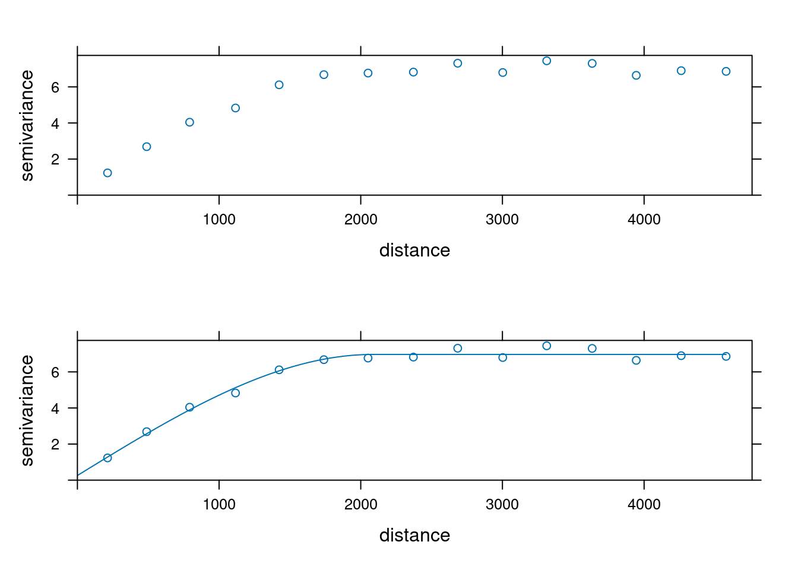
<p class="caption">(\#fig:07-modelowanie-3)Porównanie semiwariogramu empirycznego i modelu semiwariogramu.</p>
</div>

### Model semiwariogramu

Model semiwariogramu składa się zazwyczaj z trzech podstawowych elementów (rycina \@ref(fig:07-modelowanie-4)).
Są to:

- **Nugget** - efekt nuggetowy - pozwala na określenie błędu w danych wejściowych oraz zmienności na dystansie krótszym niż pierwszy odstęp.
- **Sill** - semiwariancja progowa - oznacza wariancję badanej zmiennej.
- **Range** - zasięg - to odległość do której istnieje przestrzenna korelacja.


<div class="figure" style="text-align: center">
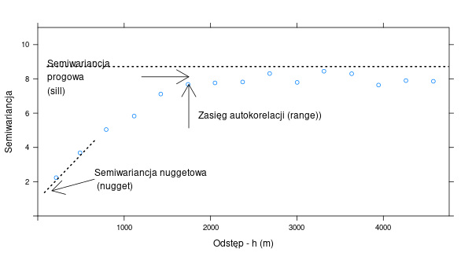
<p class="caption">(\#fig:07-modelowanie-4)Podstawowe elementy modelu semiwariogramu.</p>
</div>

### Model nuggetowy

Model nuggetowy określa sytuację, w której analizowana zmienna nie wykazuje autokorelacji. 
Inaczej mówiąc, niepodobieństwo jej wartości nie wzrasta wraz z odległością.
Model nuggetowy nie powinien być używany samodzielnie - w większości zastosowań jest on elementem modelu złożonego. 
Służy on do określania, między innymi, błędu pomiarowego czy zmienności na krótkich odstępach.

## Modele podstawowe 

### Typy modeli podstawowych

Pakiet `gstat` zawiera 20 podstawowych modeli geostatystycznych, w tym najczęściej używane takie jak:

- Nuggetowy (ang. *Nugget effect model*)
- Sferyczny (ang. *Spherical model*)
- Gaussowski (ang. *Gaussian model*)
- Potęgowy (ang. *Power model*)
- Wykładniczy (ang. *Exponential model*)
- Inne

Do wyświetlenia listy nazw modeli i ich skrótów służy funkcja `vgm()`.


``` r
vgm()
```

```
##    short                                      long
## 1    Nug                              Nug (nugget)
## 2    Exp                         Exp (exponential)
## 3    Sph                           Sph (spherical)
## 4    Gau                            Gau (gaussian)
## 5    Exc        Exclass (Exponential class/stable)
## 6    Mat                              Mat (Matern)
## 7    Ste Mat (Matern, M. Stein's parameterization)
## 8    Cir                            Cir (circular)
## 9    Lin                              Lin (linear)
## 10   Bes                              Bes (bessel)
## 11   Pen                      Pen (pentaspherical)
## 12   Per                            Per (periodic)
## 13   Wav                                Wav (wave)
## 14   Hol                                Hol (hole)
## 15   Log                         Log (logarithmic)
## 16   Pow                               Pow (power)
## 17   Spl                              Spl (spline)
## 18   Leg                            Leg (Legendre)
## 19   Err                   Err (Measurement error)
## 20   Int                           Int (Intercept)
```

Można się również im przyjrzeć używając funkcji `show.vgms()` (rycina \@ref(fig:07-modelowanie-6)).


``` r
show.vgms()
```

<div class="figure" style="text-align: center">
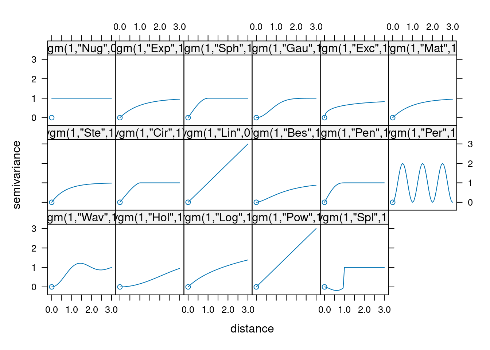
<p class="caption">(\#fig:07-modelowanie-6)Przykład modeli semiwariogramu dostępnych w pakiecie gstat.</p>
</div>

Istnieje możliwość wyświetlenia tylko wybranych modeli podstawowych poprzez argument `models` (rycina \@ref(fig:07-modelowanie-7)).


``` r
show.vgms(models = c("Sph", "Gau", "Pow", "Exp"), 
          range = 1.4, max = 2.5)
```

<div class="figure" style="text-align: center">
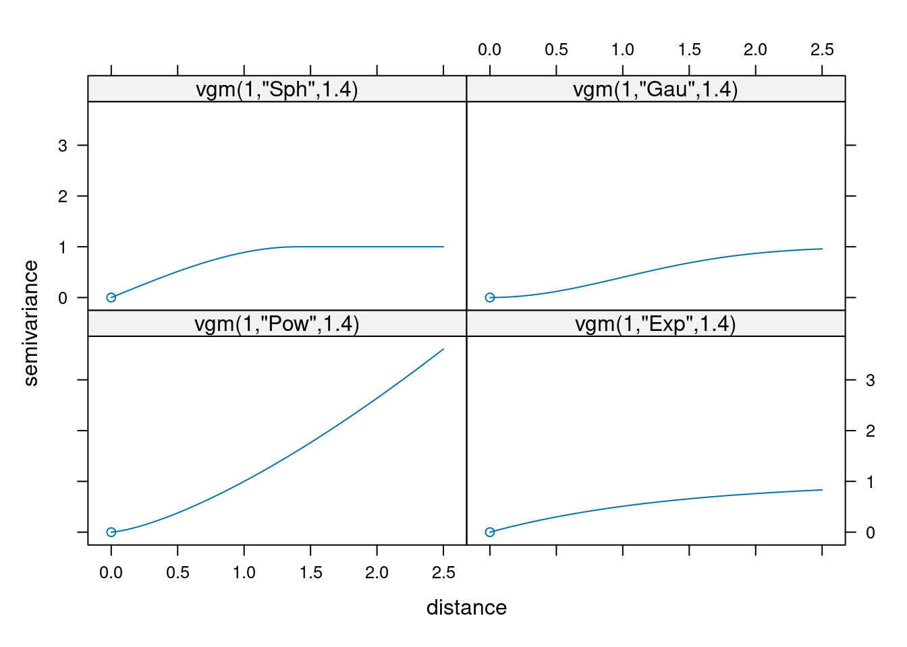
<p class="caption">(\#fig:07-modelowanie-7)Porównanie modeli sferycznego (Sph), gaussowskiego (Gau), potęgowego (Pow) i wykładniczego (Exp).</p>
</div>

Dodatkowo, można je porównać na jednym wykresie poprzez argument `as.groups = TRUE` (rycina \@ref(fig:07-modelowanie-8)).


``` r
show.vgms(models = c("Sph", "Gau", "Pow", "Exp"), 
          range = 1.4, max = 2.5, as.groups = TRUE)
```

<div class="figure" style="text-align: center">
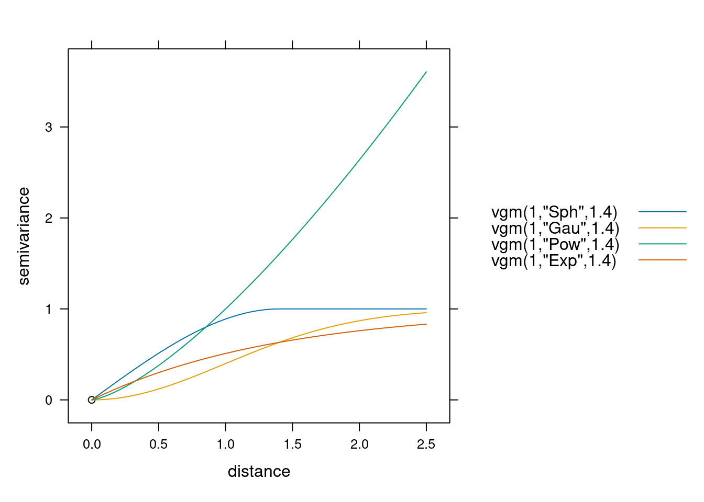
<p class="caption">(\#fig:07-modelowanie-8)Porównanie modeli sferycznego (Sph), gaussowskiego (Gau), potęgowego (Pow) i wykładniczego (Exp) na jednym wykresie.</p>
</div>

## Metody modelowania

### Rodzaje metod modelowania

Istnieją trzy najczęściej spotykane metody modelowania geostatystycznego:

- Ustawianie "ręczne" parametrów modelu, np. funkcja `vgm()` z pakietu **gstat**.
- Ustawianie "wizualne" parametrów modelu, np. funkcja `eyefit()` z pakietu **geoR**.
- Automatyczny wybór parametrów na podstawie różnych kryteriów statystycznych, np. funkcja `fit.variogram()` z pakietu **gstat**, `variofit()` z pakietu **geoR**, `autofitVariogram()` z pakietu **automap**.

Odpowiednie określenie modelu matematycznego często nie jest proste.
W efekcie automatyczne metody nie zawsze są w stanie dać lepszy wynik od modelowania "ręcznego". 
Najlepiej, gdy wybór modelu oparty jest o wiedzę na temat zakładanego procesu przestrzennego.

### Funkcja `fit.variogram()`

Funkcja `fit.variogram()` z pakietu **gstat** dopasowuje zasięg oraz semiwariancję progową w oparciu o ustalone "ręcznie" wejściowe parametry modelu^[Więcej na temat działania tej funkcji można przeczytać we wpisie na stronie https://www.r-spatial.org/r/2016/02/14/gstat-variogram-fitting.html.].

<!-- ### Liniowy model regionalizacji -->

<!-- W przypadku, gdy analizowane zjawisko jest złożone, odwzorowanie kształtu semiwariogramu empirycznego wymaga połączenia dwóch lub większej liczby modeli podstawowych.  -->
<!-- W takiej sytuacji konieczne jest spełnienie dwóch warunków: -->

<!-- - Wszystkie zastosowane modele muszą być dopuszczalne (`vgm()`) -->
<!-- - Wariancja progowa każdego podstawowego modelu musi być dodatnia -->

## Modelowanie izotropowe

Do zbudowania modelu semiwariogramu należy wykonać szereg kroków:

1. Stworzyć i wyświetlić semiwariogram empiryczny analizowanej zmiennej z użyciem funkcji `variogram()` oraz `plot()`.
2. Zdefiniować wejściowe parametry semiwariogramu. 
W najprostszej sytuacji wystarczy zdefiniować używany model/e poprzez skróconą nazwę używanej funkcji (`model`). 
Możliwe, ale nie wymagane jest także określenie wejściowej semiwariancji cząstkowej (`psill`) oraz zasięgu modelu (`range`) w funkcji `vgm()`. 
Uzyskany model można przedstawić w funkcji `plot()` podając nazwę obiektu zawierającego semiwariogram empiryczny oraz obiektu zawierającego model.
3. Dopasować parametry modelu używając funkcji `fit.variogram()`.
To dopasowanie można również zwizualizować używając funkcji `plot()`.


### Model sferyczny

Model sferyczny (`Sph`) jest jednym z najczęściej stosowanych modeli geostatystycznych. 
Reprezentuje on cechę, której zmienność wartości ma charakter naprzemiennych płatów niskich i wysokich wartości (rycina \@ref(fig:07-modelowanie-10)).
Średnio te płaty mają średnicę określoną przez zasięg (`range`) modelu.

<div class="figure" style="text-align: center">
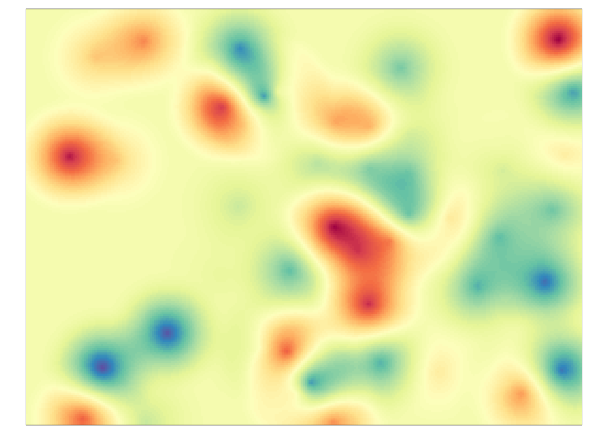
<p class="caption">(\#fig:07-modelowanie-10)Przykład zjawiska reprezentowanego poprzez model sferyczny.</p>
</div>

Stworzenie takiego modelu dla zmiennej `temp` polega najpierw na zbudowaniu semiwariogramu empirycznego używając funkcji `variogram()` (rycina \@ref(fig:07-modelowanie-11)).


``` r
vario = variogram(temp ~ 1, locations = punkty)
plot(vario)
```

<div class="figure" style="text-align: center">

<p class="caption">(\#fig:07-modelowanie-11)Semiwariogram zmiennej temp.</p>
</div>

W kolejnym kroku, przy użyciu funkcji `vgm()` określa się typ modelu oraz jego podstawowe parametry (rycina \@ref(fig:07-modelowanie-12)).


``` r
model_sph = vgm(psill = 10, model = "Sph", range = 3000)
model_sph
```

```
##   model psill range
## 1   Sph    10  3000
```

``` r
plot(vario, model = model_sph)
```

<div class="figure" style="text-align: center">
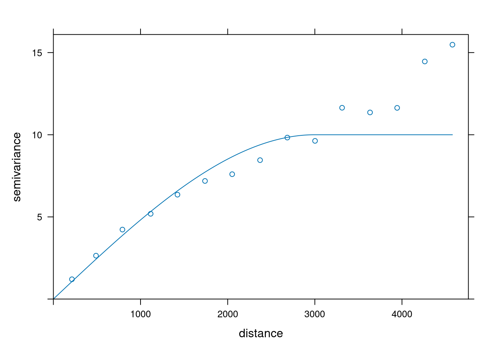
<p class="caption">(\#fig:07-modelowanie-12)Model sferyczny zmiennej temp.</p>
</div>

Dodatkowo możliwe jest także automatyczne dopasowanie modelu w oparciu o wstępnie podane parametry używając funkcji `fit.variogram()` (rycina \@ref(fig:07-modelowanie-13)).


``` r
fitted_sph = fit.variogram(vario, model_sph)
fitted_sph
```

```
##   model    psill    range
## 1   Sph 13.20295 4549.691
```

``` r
plot(vario, model = fitted_sph)
```

<div class="figure" style="text-align: center">

<p class="caption">(\#fig:07-modelowanie-13)Automatycznie dopasowany model sferyczny zmiennej temp używając wstępnie podanych parametrów.</p>
</div>

W niektórych przypadkach funkcja `fit.variogram()` da także zadowalające wyniki, gdy tylko zostanie podany typ modelu (rycina \@ref(fig:07-modelowanie-14)).


``` r
model_sph2 = vgm(model = "Sph")
fitted_sph2 = fit.variogram(vario, model_sph2)
fitted_sph2
```

```
##   model   psill    range
## 1   Sph 13.2018 4549.092
```

``` r
plot(vario, model = fitted_sph2)
```

<div class="figure" style="text-align: center">
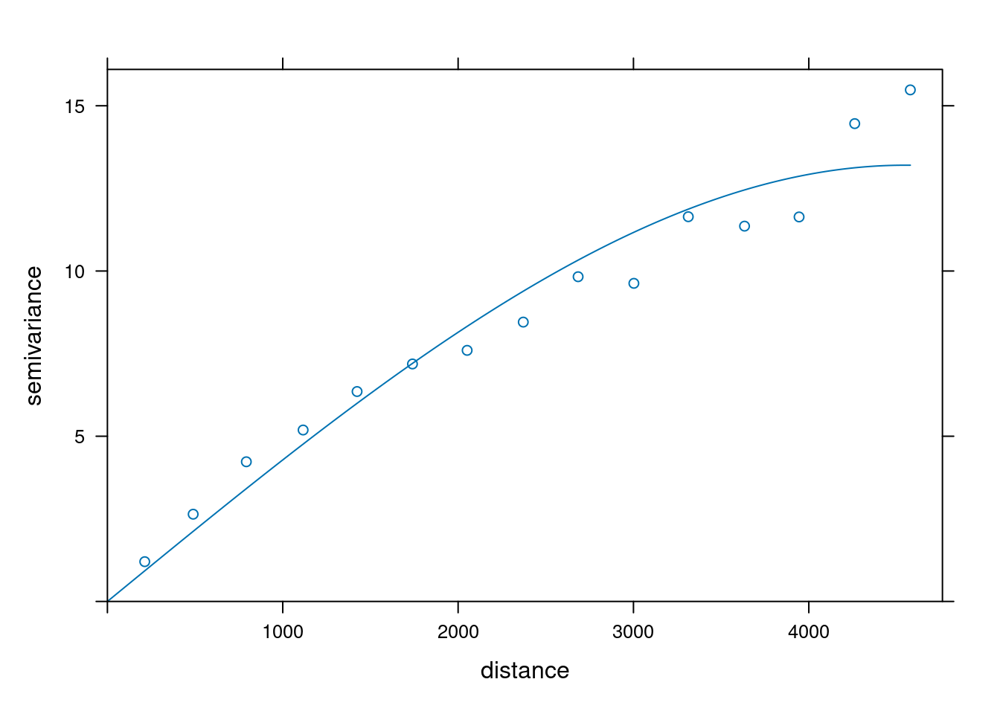
<p class="caption">(\#fig:07-modelowanie-14)Automatycznie dopasowany model sferyczny zmiennej temp używając jedynie wstępnie podanego typu modelu.</p>
</div>

### Model wykładniczy

Model wykładniczy (`Exp`) również jest jednym z najczęściej używanych w geostatystyce.
Od modelu sferycznego różni go szczególnie to, że nie ma on skończonego zasięgu.
W jego przypadku, zamiast zasięgu podaje się tzw. zasięg praktyczny.
Oznacza on odległość na jakiej model osiąga 95% wartości wariancji progowej (rycina \@ref(fig:07-modelowanie-15)).

<div class="figure" style="text-align: center">
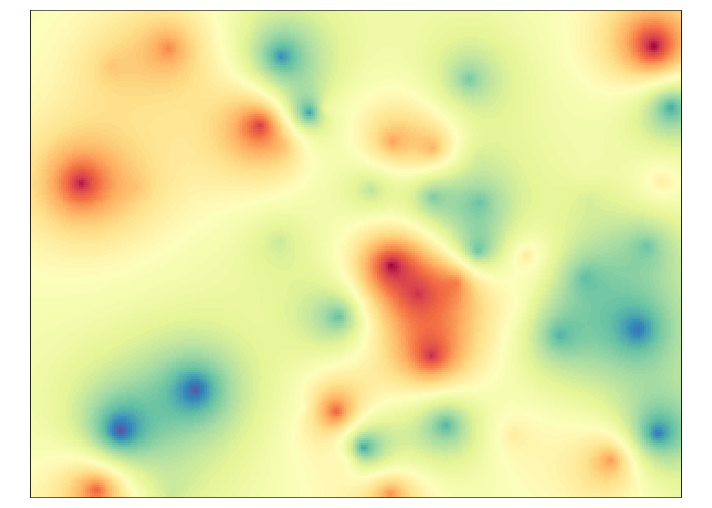
<p class="caption">(\#fig:07-modelowanie-15)Przykład zjawiska reprezentowanego poprzez model wykładniczy.</p>
</div>

Proces tworzenia tego modelu jest bardzo podobny do przedstawionego powyżej - budowany jest semiwariogram empiryczny, a następnie ustalany jest model poprzez podanie kilku jego parametrów (rycina \@ref(fig:07-modelowanie-17)).


``` r
vario = variogram(temp ~ 1, locations = punkty)
# plot(vario)
model_exp = vgm(psill = 10, model = "Exp", range = 3000)
model_exp
```

```
##   model psill range
## 1   Exp    10  3000
```

``` r
plot(vario, model = model_exp)
```

<div class="figure" style="text-align: center">
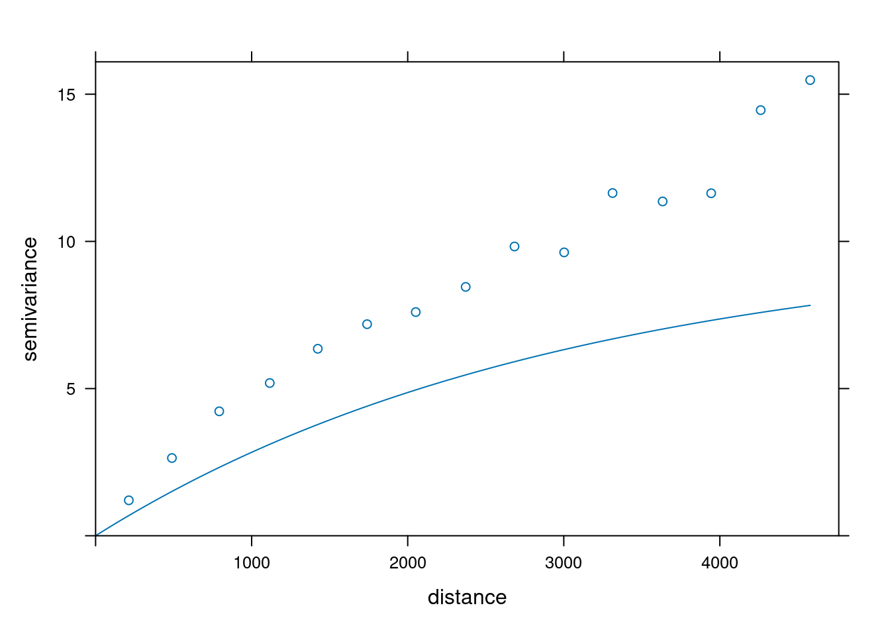
<p class="caption">(\#fig:07-modelowanie-17)Model wykładniczy zmiennej temp.</p>
</div>

Dalej, funkcja `fit.variogram()` może pomóc w dopasowaniu tego modelu (rycina \@ref(fig:07-modelowanie-18)).


``` r
fitted_exp = fit.variogram(vario, model_exp)
fitted_exp
```

```
##   model    psill    range
## 1   Exp 17.87051 3298.917
```

``` r
plot(vario, model = fitted_exp)
```

<div class="figure" style="text-align: center">

<p class="caption">(\#fig:07-modelowanie-18)Automatycznie dopasowany model wykładniczy zmiennej temp.</p>
</div>

### Model gaussowski

Model gaussowski (`Gau`) również posiada zasięg praktyczny definiowany jako 95% wartości wariancji progowej (rycina \@ref(fig:07-modelowanie-19)).
Jego cechą charakterystyczną jest paraboliczny kształt na początkowym odcinku. 
Jest on najczęściej używany do modelowania cech o regularnej i łagodnej zmienności przestrzennej. 
Model gaussowski z uwagi na swoje cechy zazwyczaj nie powinien być stosowany samodzielnie, lecz jako element modelu złożonego.

<div class="figure" style="text-align: center">
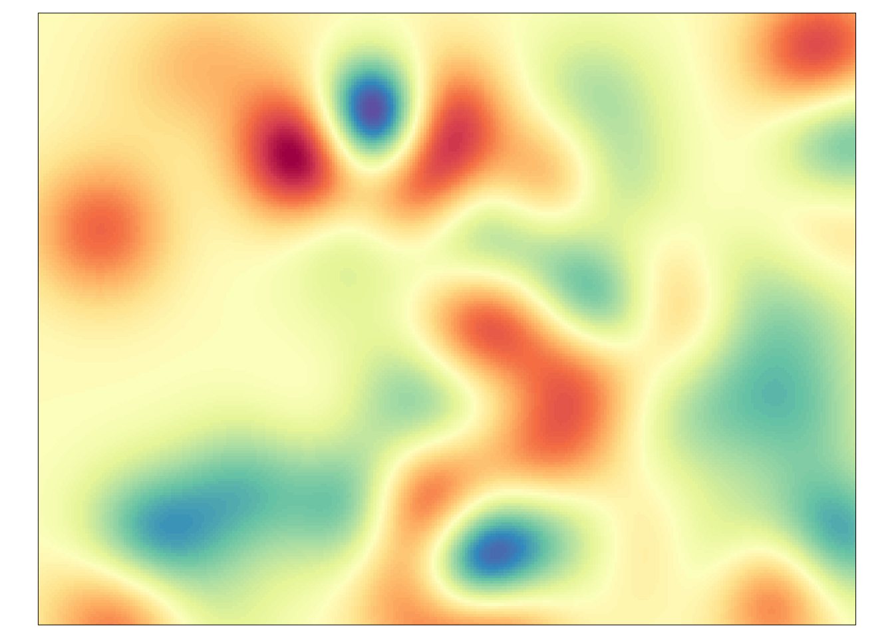
<p class="caption">(\#fig:07-modelowanie-19)Przykład zjawiska reprezentowanego poprzez model gaussowski.</p>
</div>

Zdefiniowanie modelu gaussowskiego odbywa się używając skrótu `"Gau"` (rycina \@ref(fig:07-modelowanie-21)).


``` r
vario = variogram(temp ~ 1, locations = punkty)
# plot(vario)
model_gau = vgm(psill = 13, model = "Gau", range = 3000)
model_gau
```

```
##   model psill range
## 1   Gau    13  3000
```

``` r
plot(vario, model = model_gau)
```

<div class="figure" style="text-align: center">
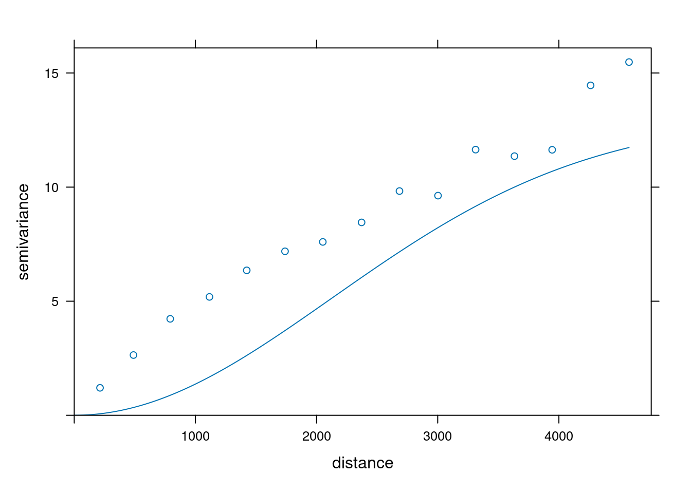
<p class="caption">(\#fig:07-modelowanie-21)Model gaussowski zmiennej temp.</p>
</div>

Dopasowanie tego modelu może również nastąpić używając funkcji `fit.variogram()` (rycina \@ref(fig:07-modelowanie-22)).


``` r
fitted_gau = fit.variogram(vario, model_gau)
fitted_gau
```

```
##   model    psill    range
## 1   Gau 8.573835 852.2404
```

``` r
plot(vario, model = fitted_gau)
```

<div class="figure" style="text-align: center">
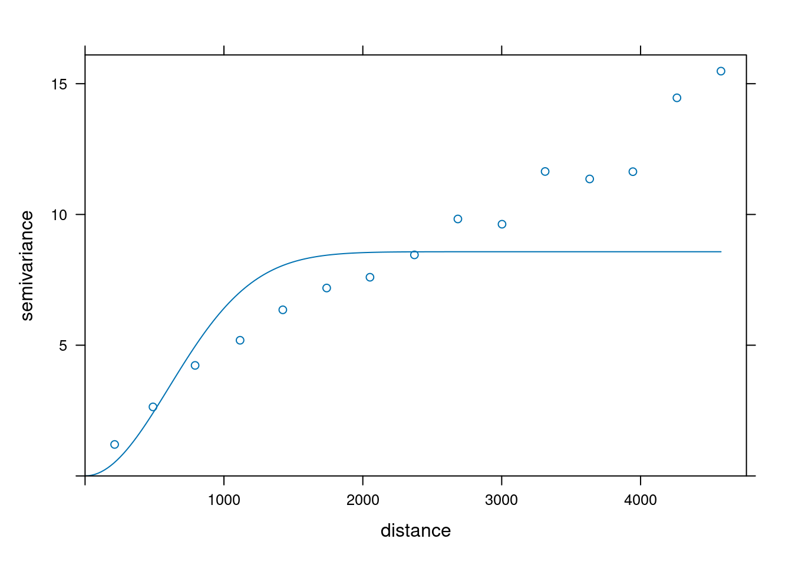
<p class="caption">(\#fig:07-modelowanie-22)Automatycznie dopasowany model gaussowski zmiennej temp.</p>
</div>

### Model potęgowy

Model potęgowy (`Pow`) to przykład tzw. modelu nieograniczonego (rycina \@ref(fig:07-modelowanie-23)).
Jego wartość rośnie w nieskończoność, dlatego niemożliwe jest określenie jego zasięgu. 
W przypadku modelu potęgowego, parametr `range` oznacza wykładnik potęgowy.

<div class="figure" style="text-align: center">
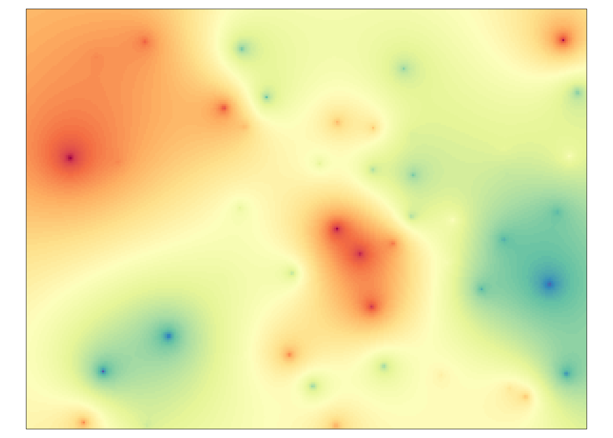
<p class="caption">(\#fig:07-modelowanie-23)Przykład zjawiska reprezentowanego poprzez model potęgowy.</p>
</div>

Model potęgowy jest określany skrótem `"Pow"` (ryciny \@ref(fig:07-modelowanie-25) i  \@ref(fig:07-modelowanie-26)).


``` r
vario = variogram(temp ~ 1, locations = punkty)
# plot(vario)
model_pow = vgm(psill = 0.03, model = "Pow", range = 0.7)
model_pow
```

```
##   model psill range
## 1   Pow  0.03   0.7
```

``` r
plot(vario, model = model_pow)
```

<div class="figure" style="text-align: center">
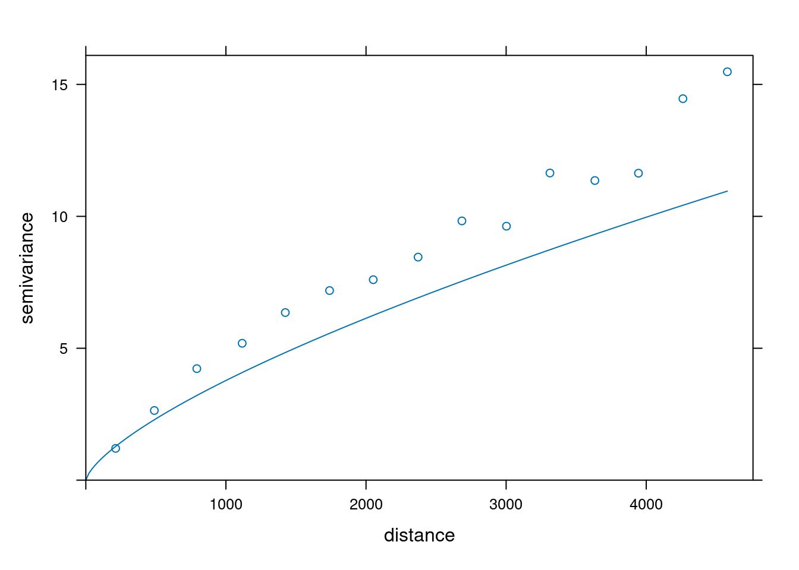
<p class="caption">(\#fig:07-modelowanie-25)Model potęgowy zmiennej temp.</p>
</div>


``` r
fitted_pow = fit.variogram(vario, model_pow)
fitted_pow
```

```
##   model      psill     range
## 1   Pow 0.02515946 0.7535889
```

``` r
plot(vario, model = fitted_pow)
```

<div class="figure" style="text-align: center">
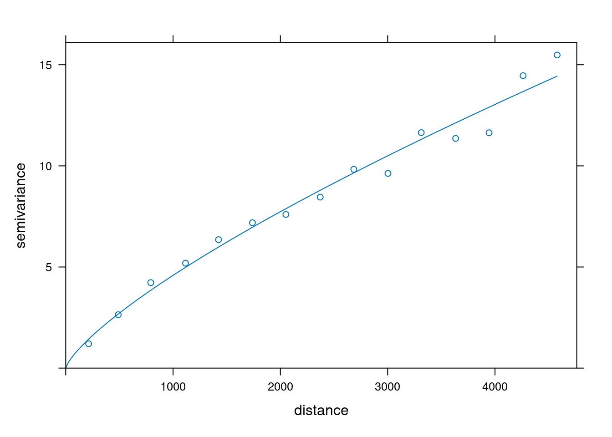
<p class="caption">(\#fig:07-modelowanie-26)Automatycznie dopasowany model potęgowy zmiennej temp.</p>
</div>

### Porównanie modeli

Z uwagi na swoją charakterystykę, każdy z powyższych modeli ma inny zakres wartości.
Aby porównać te modele należy je przedstawić używając tej samej skali kolorystycznej (\@ref(fig:07-modelowanie-27)).

<div class="figure" style="text-align: center">
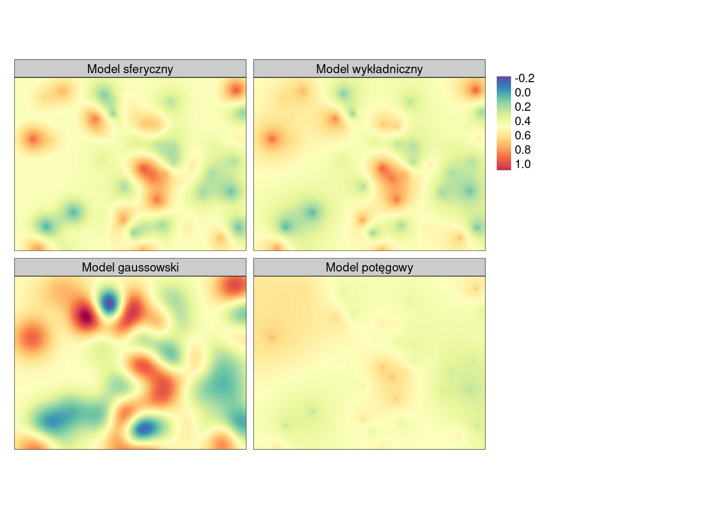
<p class="caption">(\#fig:07-modelowanie-27)Porównanie powierzchni reprezentowanej przez modele sferyczny, wykładniczy, gaussowski i potęgowy.</p>
</div>

### Modele złożone I

Najczęściej pojedynczy model nie jest w stanie odwzorować dokładnie zmienności przestrzennej analizowanej cechy.
W takich sytuacjach konieczne jest połączenie dwóch lub więcej modeli podstawowych. 
Najbardziej powszechny model złożony składa się z funkcji nuggetowej (dla odległości zero) oraz drugiej funkcji (dla dalszej odległości) (rycina \@ref(fig:07-modelowanie-28)). 
Zdefiniowanie takiej funkcji odbywa się poprzez dodanie argumentu `nugget` w funkcji `vgm()`.


``` r
vario = variogram(temp ~ 1, locations = punkty)
model_zl1 = vgm(psill = 10, model = "Sph", range = 3000,
                nugget = 0.5)
model_zl1
```

```
##   model psill range
## 1   Nug   0.5     0
## 2   Sph  10.0  3000
```

``` r
plot(vario, model = model_zl1)
```

<div class="figure" style="text-align: center">
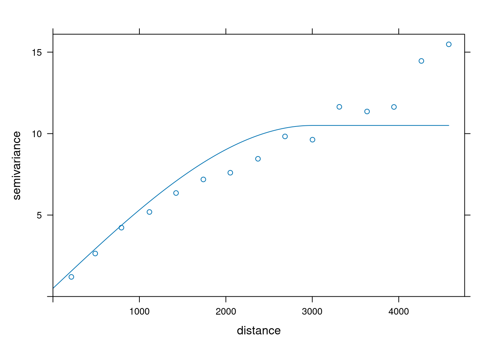
<p class="caption">(\#fig:07-modelowanie-28)Złożony model zmiennej temp.</p>
</div>

Dalsze dopasowanie modeli złożonych również można uzyskać używając funkcji `fit.variogram()` (rycina \@ref(fig:07-modelowanie-29)).


``` r
fitted_zl1 = fit.variogram(vario, model_zl1)
fitted_zl1
```

```
##   model      psill    range
## 1   Nug  0.6751142    0.000
## 2   Sph 13.7617233 5511.173
```

``` r
plot(vario, model = fitted_zl1)
```

<div class="figure" style="text-align: center">
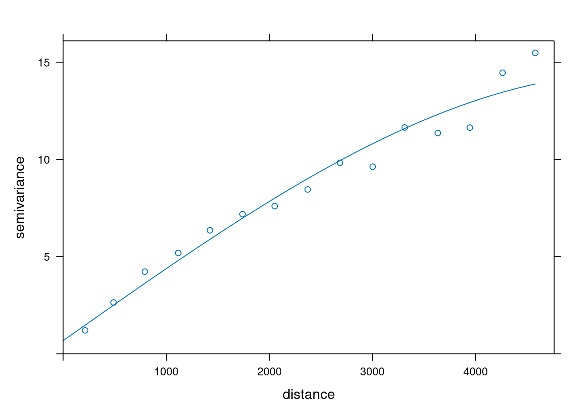
<p class="caption">(\#fig:07-modelowanie-29)Automatycznie dopasowany złożony model zmiennej temp.</p>
</div>

### Modele złożone II

Bardziej złożone modele można tworzyć z pomocą argumentu `add.to`.
Przyjmuje on kolejny obiekt funkcji `vgm()` i poprzez połączenie tych dwóch obiektów otrzymuje model złożony. 
Na poniższym przykładzie stworzony został model złożony składający się z modelu nuggetowego oraz dwóch modeli gaussowskich (ryciny \@ref(fig:07-modelowanie-30) i \@ref(fig:07-modelowanie-31)).


``` r
vario = variogram(temp ~ 1, locations = punkty)
model_zl2 = vgm(10, "Gau", 3000, 
                add.to = vgm(4, model = "Gau",
                             range = 500, nugget = 0.5))
model_zl2
```

```
##   model psill range
## 1   Nug   0.5     0
## 2   Gau   4.0   500
## 3   Gau  10.0  3000
```

``` r
plot(vario, model = model_zl2)
```

<div class="figure" style="text-align: center">
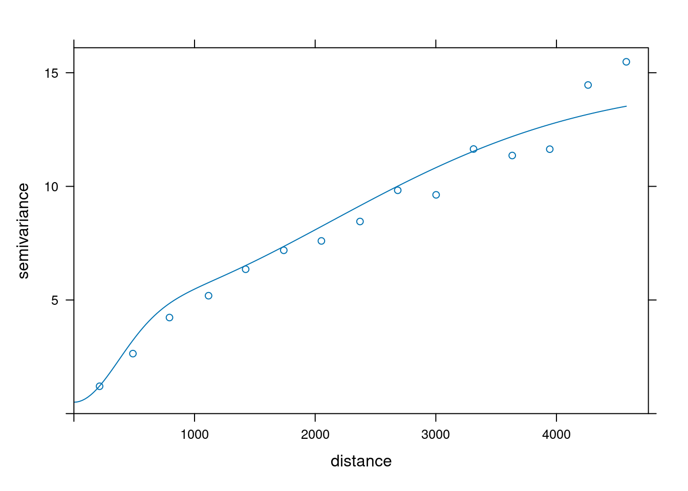
<p class="caption">(\#fig:07-modelowanie-30)Złożony model zmiennej temp składający się z modelu nuggetowego oraz dwóch modeli gaussowskich.</p>
</div>


``` r
fitted_zl2 = fit.variogram(vario, model_zl2)
plot(vario, model = fitted_zl2)
```

<div class="figure" style="text-align: center">

<p class="caption">(\#fig:07-modelowanie-31)Automatycznie dopasowany złożony model zmiennej temp składający się z modelu nuggetowego oraz dwóch modeli gaussowskich.</p>
</div>

## Modelowanie anizotropowe

### Anizotropia

Uwzględnienie anizotropii wymaga zamiany parametru zasięgu na trzy inne parametry (rycina \@ref(fig:07-modelowanie-33)):

- Kąt określający dominujący kierunek.
- Zasięg w dominującym kierunku.
- Proporcję anizotropii, czyli relację pomiędzy zasięgiem w przeciwległym kierunku do zasięgu w dominującym kierunku.

<div class="figure" style="text-align: center">
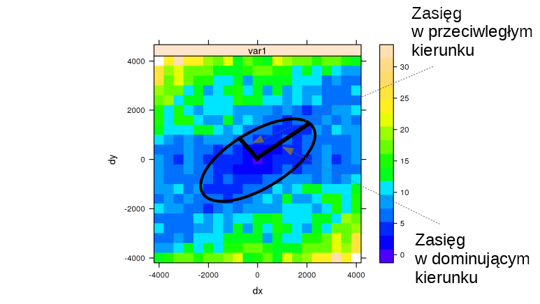
<p class="caption">(\#fig:07-modelowanie-33)Podstawowe parametry mapy semiwariogramu.</p>
</div>

W pakiecie **gstat** odbywa się to poprzez dodanie argumentu `alpha` do funkcji `variogram()`. 
Należy w niej zdefiniować analizowane kierunki, które zostały określone na podstawie mapy semiwariogramu. 
Następnie w funkcji `vgm()` należy podać nowy argument `anis`.
Przyjmuje on dwie wartości. Pierwsza z nich (`45` w przykładzie poniżej) oznacza dominujący kierunek anizotropii, druga zaś (`0.4`) mówi o tzw. proporcji anizotropii.
Proporcja anizotropii jest to relacja pomiędzy zmiennością na kierunku prostopadłym a głównym kierunku.
Na poniższym przykładzie zasięg ustalony dla głównego kierunku wynosi 4000 metrów.
Wartość proporcji anizotropii, `0.4`, w tym wypadku oznacza że dla prostopadłego kierunku zasięg będzie wynosił 1600 metrów (4000 metrów x 0.4) (rycina \@ref(fig:07-modelowanie-34)).


``` r
vario_map = variogram(temp ~ 1, 
                      locations = punkty,
                      cutoff = 4000,
                      width = 400, 
                      map = TRUE)
plot(vario_map, threshold = 30, 
     col.regions = hcl.colors(40, palette = "ag_GrnYl", rev = TRUE))
```

<div class="figure" style="text-align: center">

<p class="caption">(\#fig:07-modelowanie-34)Mapa semiwariogramu zmiennej temp.</p>
</div>

Anizotropia może być także reprezentowana używając semiwariogramów kierunkowych (rycina \@ref(fig:07-modelowanie-35))


``` r
vario_kier = variogram(temp ~ 1, 
                       locations = punkty,
                       alpha = c(0, 45, 90, 135),
                       cutoff = 4000)
plot(vario_kier)
```

<div class="figure" style="text-align: center">
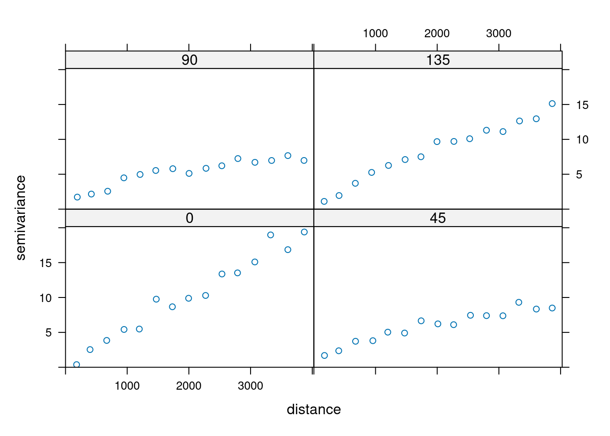
<p class="caption">(\#fig:07-modelowanie-35)Semiwariogramy kierunkowe zmiennej temp.</p>
</div>

Następnie semiwariogramy kierunkowe mogą być modelowane ręcznie (rycina \@ref(fig:07-modelowanie-36)) lub też używając automatycznego dopasowania (rycina \@ref(fig:07-modelowanie-37)).


``` r
vario_kier_fit = vgm(psill = 8, model = "Sph", range = 4000, 
                     nugget = 0.5, anis = c(45, 0.4))
plot(vario_kier, vario_kier_fit, as.table = TRUE)
```

<div class="figure" style="text-align: center">
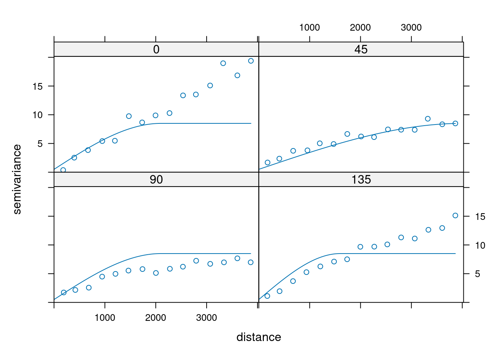
<p class="caption">(\#fig:07-modelowanie-36)Modele kierunkowe zmiennej temp.</p>
</div>


``` r
vario_kier_fit2 = fit.variogram(vario_kier,
                                vgm(model = "Sph",
                                    anis = c(45, 0.4), 
                                    nugget = 0.5))
plot(vario_kier, vario_kier_fit2, as.table = TRUE)
```

<div class="figure" style="text-align: center">
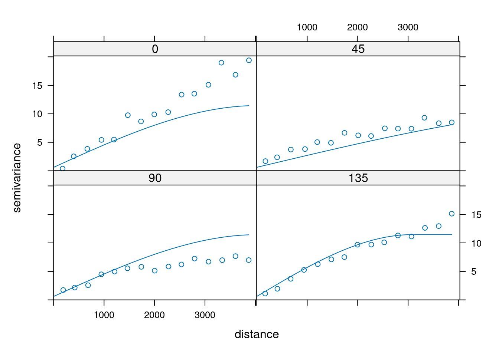
<p class="caption">(\#fig:07-modelowanie-37)Automatycznie dopasowane modele kierunkowe zmiennej temp.</p>
</div>

## Zadania {#z7}

Przyjrzyj się danym z obiektu `punkty_pref`. Możesz go wczytać używając poniższego kodu:


``` r
data(punkty_pref)
```

1. Zbuduj modele semiwariogramu zmiennej `srtm` używając modelu sferycznego używając zarówno ręcznie ustalonych parametrów oraz funkcji `fit.variogram()`.
Porównaj graficznie uzyskane modele.
2. Zbuduj modele semiwariogramu zmiennej `srtm` używając modelu nuggetowego, sferycznego, wykładniczego, gausowskiego i potęgowego.
Porównaj graficznie uzyskane modele.
3. Stwórz złożony model semiwariogramu zmiennej `srtm` używając modelu nuggetowego i sferycznego.
4. W oparciu o mapę semiwariogramu, zbuduj semiwariogramy kierunkowe zmiennej `srtm` dla kierunków wykazujących anizotropię przestrzenną.
Następnie zbuduj modele semiwariogramu dla uzyskanych semiwariogramów kierunkowych.
5. (Dodatkowe) Spróbuj użyć jednego z modeli podstawowych, który nie był opisywany w tym rozdziale. 
Czym ten wybrany model się charakteryzuje?
