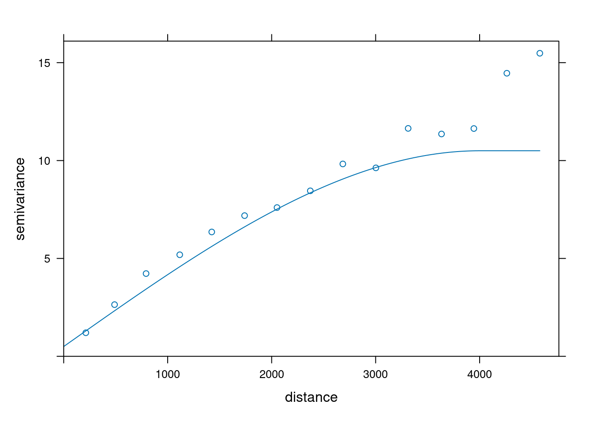
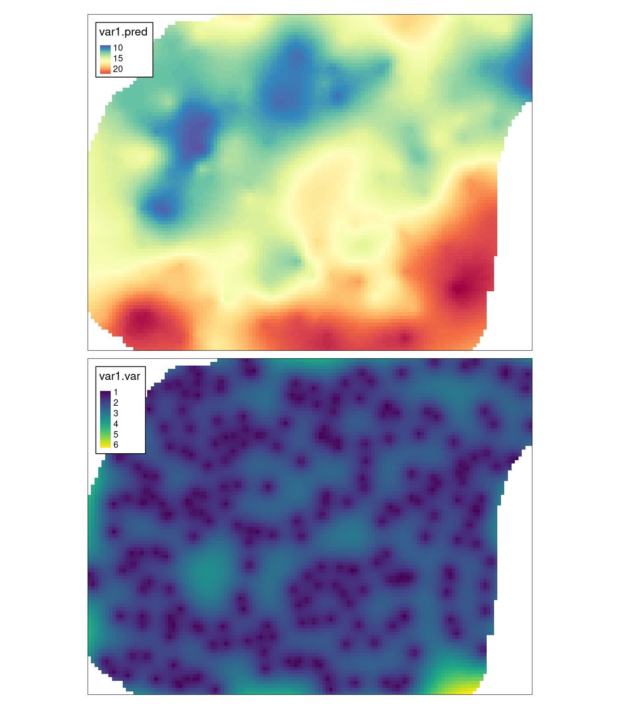
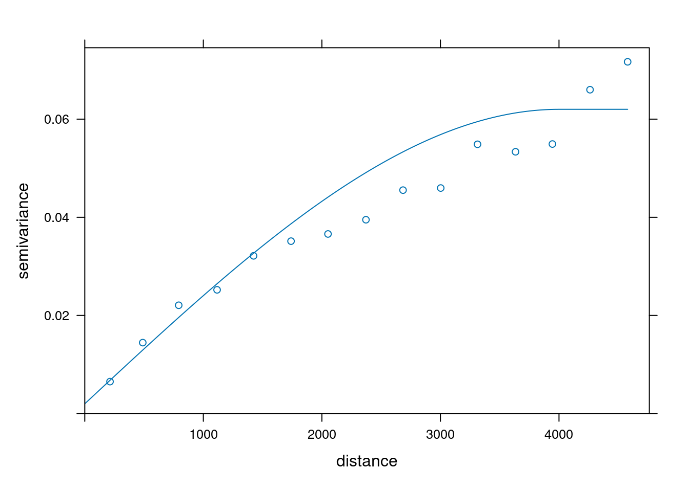
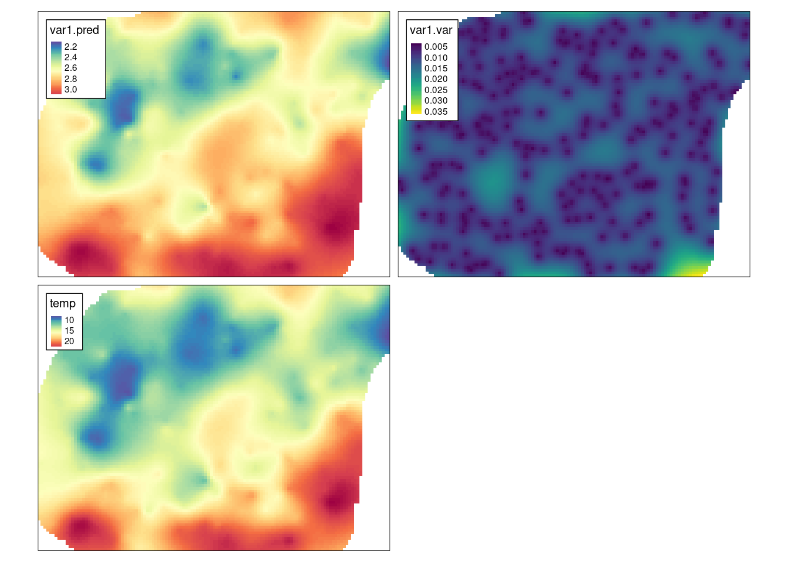
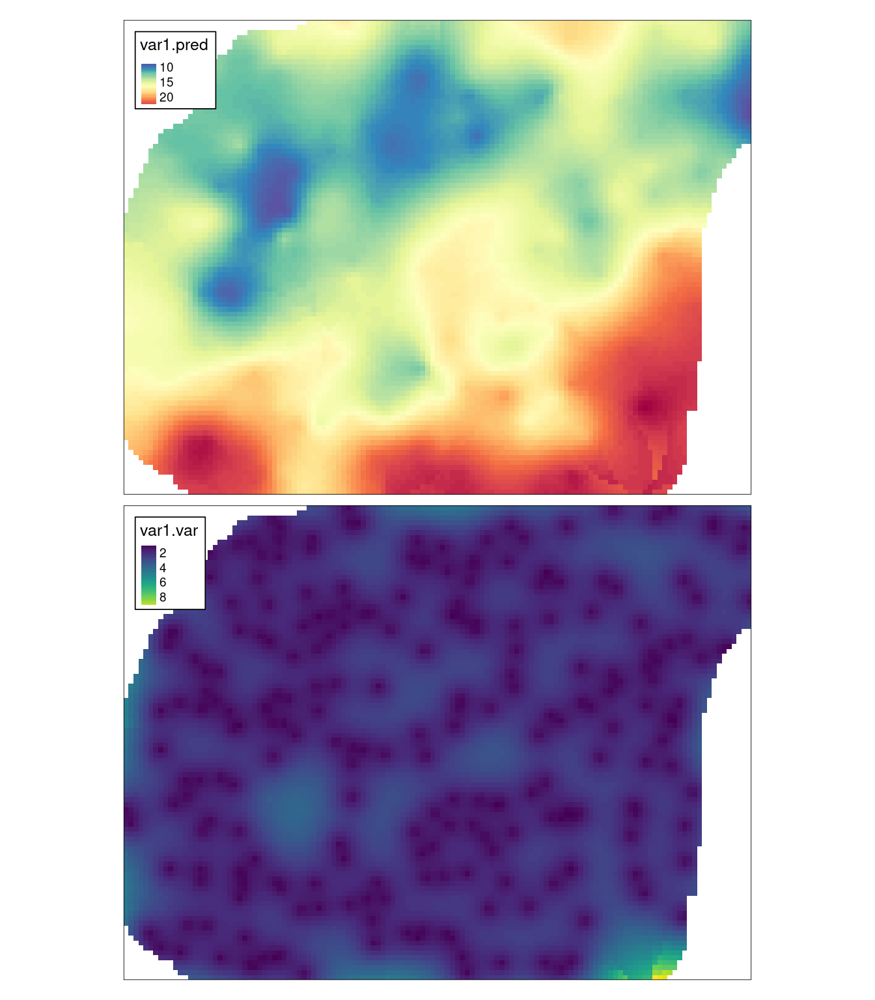
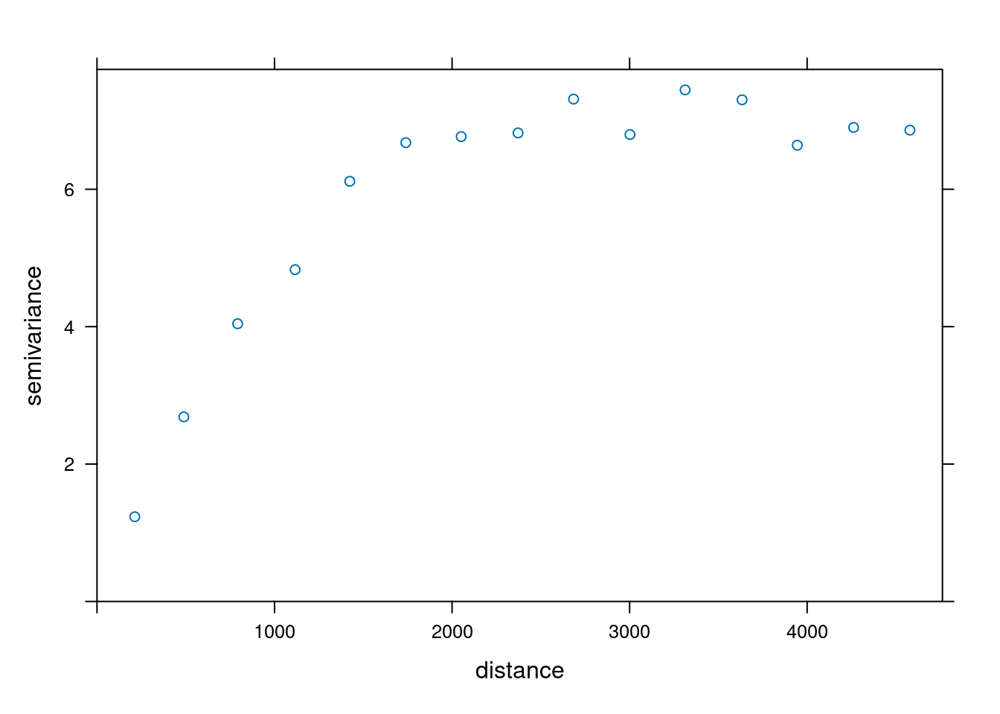
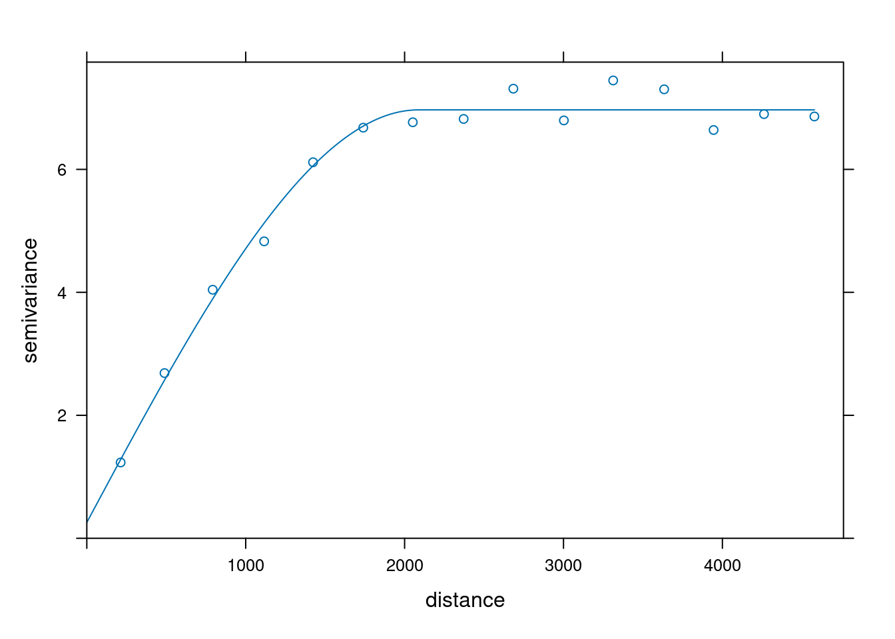
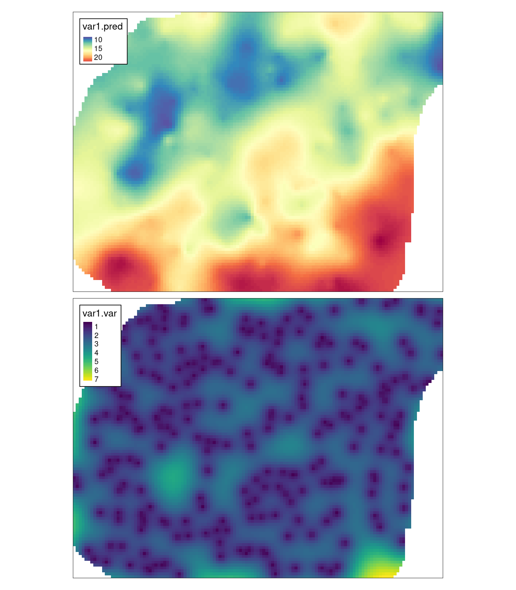
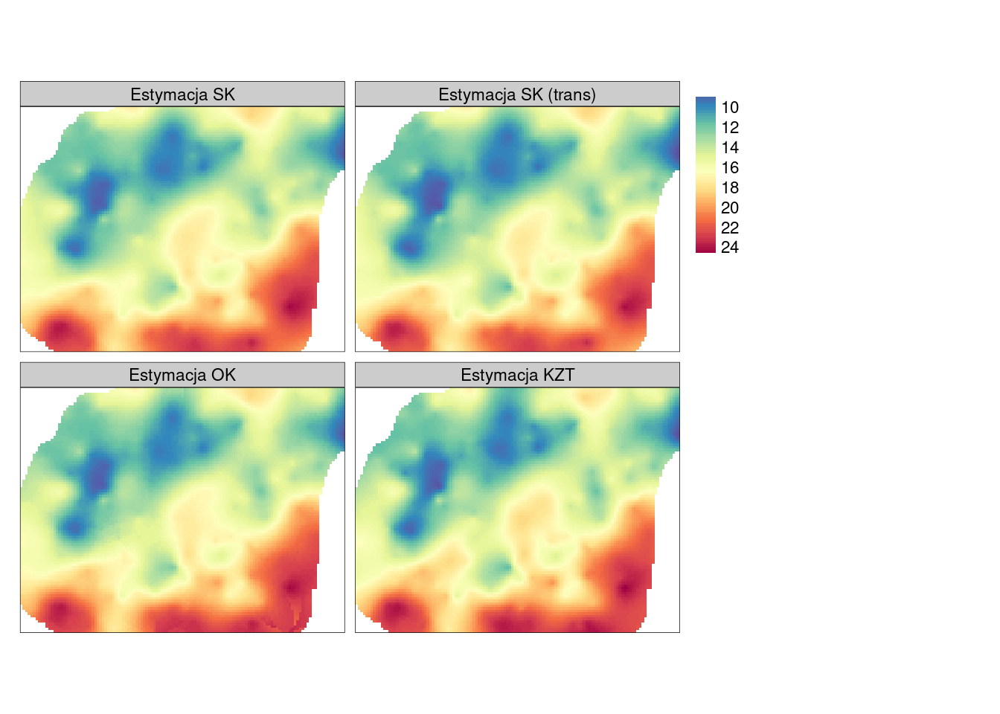

# Estymacje jednozmienne {#estymacje-jednozmienne}

Odtworzenie obliczeń z tego rozdziału wymaga załączenia poniższych pakietów oraz wczytania poniższych danych:


``` r
library(sf)
library(stars)
library(gstat)
library(tmap)
library(geostatbook)
data(punkty)
data(siatka)
```


## Kriging

### Interpolacja geostatystyczna

Kriging (interpolacja geostatystyczna) to grupa metod estymacji zaproponowana w latach 50. przez Daniego Krige.
Główna zasada mówi, że prognoza w danej lokalizacji jest kombinacją obokległych obserwacji. 
Waga nadawana każdej z obserwacji jest zależna od stopnia (przestrzennej) korelacji - stąd też bierze się istotna rola semiwariogramów.

### Metod krigingu

Istnieje szereg metod krigingu, w tym:

- Kriging prosty (ang. *Simple kriging*) (sekcja \@ref(kriging-prosty))
- Kriging zwykły (ang. *Ordinary kriging*) (sekcja \@ref(kriging-zwykly))
- Kriging z trendem (ang. *Kriging with a trend*) (sekcja \@ref(kriging-z-trendem))
- Kriging stratyfikowany (ang. *Kriging within strata* – KWS)
- Kriging prosty ze zmiennymi średnimi lokalnymi (ang. *Simple kriging with varying local means* - SKlm) (sekcja \@ref(SKlm))
- Kriging z zewnętrznym trendem/Uniwersalny kriging (ang.*Kriging with an external trend/Universal kriging*) (sekcja \@ref(kriging-uniwersalny))
- Kokriging (ang. *Co-kriging*) (sekcja \@ref(kokriging))
- Kriging danych kodowanych (ang. *Indicator kriging*) (sekcja \@ref(kriging-danych-kodowanych))
- Inne

## Kriging prosty

### Kriging prosty (ang. *Simple kriging*)

Kriging prosty zakłada, że średnia jest znana i stała na całym obszarze.
W poniższym przykładzie po stworzeniu semiwariogramu empirycznego, dopasowano model semiwariogramu składający się z funkcji sferycznej o zasięgu 4000 metrów i wartości nuggetu równej 0,5 (rycina \@ref(fig:08-estymacje-3)).


``` r
vario = variogram(temp ~ 1, locations = punkty)
model = vgm(10, model = "Sph", range = 4000, nugget = 0.5)
model
```

```
##   model psill range
## 1   Nug   0.5     0
## 2   Sph  10.0  4000
```

``` r
plot(vario, model = model)
```

<div class="figure" style="text-align: center">

<p class="caption">(\#fig:08-estymacje-3)Model złożony z modelu nuggetowego i sferycznego dla zmiennej temp.</p>
</div>


``` r
# fitted = fit.variogram(vario, model)
```

Następnie następuje estymacja wartości z użyciem metody krigingu prostego. 
W funkcji `krige()` z pakietu **gstat**, użycie tej metody wymaga ustalenia średniej wartości cechy za pomocą argumentu `beta`. 


``` r
mean(punkty$temp)
```

```
## [1] 15.22251
```


``` r
sk = krige(temp ~ 1, 
            locations = punkty,
            newdata = siatka,
            model = model,
            beta = 15)
```

```
## [using simple kriging]
```

Wynik krigingu prostego, jak i każdy inny uzyskany z użyciem pakietu **gstat**, można podejrzeć wpisując nazwę wynikowego obiektu.
Szczególnie ważne są dwie, nowe zmienne - `var1.pred` oraz `var1.var`.
Pierwsza z nich oznacza wartość estymowaną dla każdego oczka siatki, druga zaś mówi o wariancji estymacji. 


``` r
sk
```

```
## stars object with 2 dimensions and 2 attributes
## attribute(s):
##                Min.  1st Qu.    Median      Mean   3rd Qu.     Max. NA's
## var1.pred  8.473052 12.70587 14.961083 15.488215 17.711775 24.36355 1270
## var1.var   0.821095  1.61326  1.974793  2.041073  2.355011  6.26745 1270
## dimension(s):
##   from  to offset delta               refsys x/y
## x    1 127 745542    90 ETRS89 / Poland CS92 [x]
## y    1  96 721256   -90 ETRS89 / Poland CS92 [y]
```

Obie uzyskane zmienne można wyświetlić z użyciem pakietu **tmap** (rycina \@ref(fig:plotsy2)).


``` r
tm_shape(sk) +
        tm_raster(col = c("var1.pred", "var1.var"),
                  style = "cont", 
                  palette = list("-Spectral", "viridis")) +
        tm_layout(legend.frame = TRUE)
```

<div class="figure" style="text-align: center">

<p class="caption">(\#fig:plotsy2)Estymacja i wariancja estymacji używając metody krigingu prostego (SK).</p>
</div>

### Kriging prosty po transformacji danych

Zarówno kriging prosty, jak i kolejne metody krigingowe opisane w tym skrypcie, mogą używać zmiennych wejściowych poddanych transformacjom, np. logaritmizacji (sekcja \@ref(trans-danych)).
Może to mieć na celu zniwelowanie skośności rozkładu i w efekcie uzyskanie pewniejszych wyników. 
Tutaj konieczne jest pamiętanie o kilku koniecznych krokach: (1) wykonaniu transformacji przy budowaniu semiwariogramu, (2) wykonaniu transformacji przy tworzeniu estymacji, oraz (3) zastosowaniu transformacji odwrotnej na uzyskanych wynikach.
Zobaczmy to na poniższym przykładzie.

W pierwszym etapie budujemy i modelujemy semiwariogram, jednakże zamiast używać bezpośrednio wartości zmiennej `temp` poddajemy ją logaritmizacji poprzez `log(temp)`.


``` r
vario_kp2 = variogram(log(temp) ~ 1, locations = punkty)
model_kp2 = vgm(0.06, model = "Sph", range = 4000, nugget = 0.002)
model_kp2
```

```
##   model psill range
## 1   Nug 0.002     0
## 2   Sph 0.060  4000
```

``` r
plot(vario_kp2, model = model_kp2)
```

<div class="figure" style="text-align: center">

<p class="caption">(\#fig:08-estymacje-3b)Model złożony z modelu nuggetowego i sferycznego dla zmiennej temp.</p>
</div>


``` r
# fitted_kp2 = fit.variogram(vario_kp2, model_kp2)
```

Następnie, musimy określić logarytm średniej wartości badanej zmiennej dla całego obszaru  oraz użyć logarytmu tej zmiennej do stworzenia estymacji.


``` r
mean(log(punkty$temp))
```

```
## [1] 2.689027
```


``` r
sk_kp2 = krige(log(temp) ~ 1, 
            locations = punkty,
            newdata = siatka,
            model = model_kp2,
            beta = 2.69)
```

```
## [using simple kriging]
```

Wynik krigingu prostego zawiera dwie zmienne - `var1.pred` oraz `var1.var`.
Co warte podkreślenia, pierwsza z nich określa wartość estymowaną dla każdego oczka siatki w logarytmie badanej jednostki. 
Przykładowo, gdy nasza zmienna określała temperaturę w stopniach Celsjusza, to wynik jest przestawiony w logarytmie stopni Celsjusza.


``` r
sk_kp2
```

```
## stars object with 2 dimensions and 2 attributes
## attribute(s):
##                   Min.     1st Qu.     Median       Mean    3rd Qu.       Max.
## var1.pred  2.116458867 2.532130644 2.70146692 2.70654657 2.86844059 3.19736223
## var1.var   0.003507856 0.008334475 0.01053523 0.01092072 0.01284403 0.03625981
##            NA's
## var1.pred  1270
## var1.var   1270
## dimension(s):
##   from  to offset delta               refsys x/y
## x    1 127 745542    90 ETRS89 / Poland CS92 [x]
## y    1  96 721256   -90 ETRS89 / Poland CS92 [y]
```

W związku z tym, koniecznym ostatnim krokiem jest przywrócenie oryginalnej jednostki. 
Możemy to zrobić używając funkcji `rev_trans()` z pakietu **geostatbook** (sekcja \@ref(transformacja-odwrotna)), która przyjmuje naszą zlogaritmizowaną estymację, wariancję estymacji i oryginalne wartości pomiarów w punktach.


``` r
sk_kp2$temp = rev_trans(sk_kp2$var1.pred, sk_kp2$var1.var, punkty$temp)
sk_kp2
```

```
## stars object with 2 dimensions and 3 attributes
## attribute(s):
##                   Min.      1st Qu.      Median        Mean     3rd Qu.
## var1.pred  2.116458867  2.532130644  2.70146692  2.70654657  2.86844059
## var1.var   0.003507856  0.008334475  0.01053523  0.01092072  0.01284403
## temp       8.187681121 12.430871960 14.72626722 15.22250747 17.40643717
##                   Max. NA's
## var1.pred   3.19736223 1270
## var1.var    0.03625981 1270
## temp       24.10950341 1270
## dimension(s):
##   from  to offset delta               refsys x/y
## x    1 127 745542    90 ETRS89 / Poland CS92 [x]
## y    1  96 721256   -90 ETRS89 / Poland CS92 [y]
```

W efekcie otrzymujemy estymację w oryginalnych jednostkach - stopniach Celsjusza.
Trzy uzyskane zmienne można wyświetlić z użyciem pakietu **tmap** (rycina \@ref(fig:plotsy2b)).


``` r
tm_shape(sk_kp2) +
        tm_raster(col = c("var1.pred", "var1.var", "temp"),
                  style = "cont", 
                  palette = list("-Spectral", "viridis", "-Spectral")) +
        tm_layout(legend.frame = TRUE)
```

<div class="figure" style="text-align: center">

<p class="caption">(\#fig:plotsy2b)Estymacja logarytmu zmiennej temp, jej wariancja estymacji, oraz estymacja wartości tej zmiennej po przeprowadzeniu procesu transformacji odwrotnej.</p>
</div>

## Kriging zwykły {#kriging-zwykly}

### Kriging zwykły (ang. *Ordinary kriging*)

W krigingu zwykłym średnia traktowana jest jako wartość nieznana. 
Metoda ta uwzględnia lokalne fluktuacje średniej poprzez stosowanie ruchomego okna. 
Parametry ruchomego okna można określić za pomocą jednego z dwóch argumentów:

- `nmax` - użyta zostanie określona liczba najbliższych obserwacji.
- `maxdist` - użyte zostaną jedynie obserwacje w zadanej odległości.


``` r
# ok = krige(temp ~ 1,
#             locations = punkty,
#             newdata = siatka, 
#             model = model, 
#             nmax = 30)
ok = krige(temp ~ 1,
            locations = punkty,
            newdata = siatka, 
            model = model, 
            maxdist = 1500)
```

```
## [using ordinary kriging]
```

Podobnie jak w przypadku krigingu prostego, można przyjrzeć się wynikom estymacji podając nazwę wynikowego obiektu oraz wyświetlić je używając funkcji `tm_shape()` and `tm_raster()` (rycina \@ref(fig:plotsy2ok2)).


``` r
ok
```

```
## stars object with 2 dimensions and 2 attributes
## attribute(s):
##                 Min.  1st Qu.    Median      Mean  3rd Qu.      Max. NA's
## var1.pred  8.4763353 12.71717 14.967146 15.531098 17.70921 24.326622 1270
## var1.var   0.8215425  1.62057  1.990971  2.082008  2.39254  9.882173 1270
## dimension(s):
##   from  to offset delta               refsys x/y
## x    1 127 745542    90 ETRS89 / Poland CS92 [x]
## y    1  96 721256   -90 ETRS89 / Poland CS92 [y]
```


``` r
tm_shape(ok) +
        tm_raster(col = c("var1.pred", "var1.var"),
                  style = "cont", 
                  palette = list("-Spectral", "viridis")) +
        tm_layout(legend.frame = TRUE)
```

<div class="figure" style="text-align: center">

<p class="caption">(\#fig:plotsy2ok2)Estymacja i wariancja estymacji używając metody krigingu zwykłego (OK).</p>
</div>

## Kriging z trendem

### Kriging z trendem (ang. *Kriging with a trend*)

Kriging z trendem, określany również jako kriging z wewnętrznym trendem, do estymacji wykorzystuje (oprócz zmienności wartości wraz z odległością) położenie analizowanych punktów.
W pierwszym kroku konieczne jest dodanie współrzędnych do używanego obiektu i do używanej siatki.


``` r
# dodanie współrzędnych do punktów
punkty$x = st_coordinates(punkty)[, 1]
punkty$y = st_coordinates(punkty)[, 2]
# dodanie współrzędnych do siatki
siatka$x = st_coordinates(siatka)[, 1]
siatka$y = st_coordinates(siatka)[, 2]
```

Współrzędne dodawane są do całej (regularnej) siatki.
Możemy przyciąć je do badanego obszaru poprzez wpisanie wartości `NA` w miejscach poza naszym obszarem zainteresowań.


``` r
siatka$x[is.na(siatka$X2)] = NA
siatka$y[is.na(siatka$X2)] = NA
```

Następnie pierwszy z argumentów w funkcji `variogram()` musi przyjąć postać `temp ~ x + y`, co oznacza, że uwzględniamy liniowy trend zależny od współrzędnej `x` oraz `y` (rycina \@ref(fig:08-estymacje-11)).


``` r
vario_kzt = variogram(temp ~ x + y, locations = punkty)
plot(vario_kzt)
```

<div class="figure" style="text-align: center">

<p class="caption">(\#fig:08-estymacje-11)Semiwariogram zmiennej temp uwzględniający współrzędne x i y.</p>
</div>

Dalszym etapem jest dopasowanie modelu semiwariancji, a następnie wyliczenie estymowanych wartości z użyciem funkcji `krige()`.
Należy tutaj pamiętać, aby wzór (w przykładzie `temp ~ x + y`) był taki sam podczas budowania semiwariogramu, jak i estymacji (rycina \@ref(fig:08-estymacje-12)).


``` r
model_kzt = vgm(model = "Sph", nugget = 1)
fitted_kzt = fit.variogram(vario_kzt, model_kzt)
fitted_kzt
```

```
##   model     psill    range
## 1   Nug 0.2568762    0.000
## 2   Sph 6.7107464 2087.465
```

``` r
plot(vario_kzt, fitted_kzt)
```

<div class="figure" style="text-align: center">

<p class="caption">(\#fig:08-estymacje-12)Model semiwariogramu zmiennej temp uwzględniający współrzędne x i y.</p>
</div>


``` r
kzt = krige(temp ~ x + y, 
             locations = punkty, 
             newdata = siatka, 
             model = fitted_kzt)
```

```
## [using universal kriging]
```

Wyświetlenie wyników odbywa się używając pakietu **tmap**.


``` r
tm_shape(kzt) +
        tm_raster(col = c("var1.pred", "var1.var"),
                  style = "cont", 
                  palette = list("-Spectral", "viridis")) +
        tm_layout(legend.frame = TRUE)
```

<div class="figure" style="text-align: center">

<p class="caption">(\#fig:plotsy2kzt)Estymacja i wariancja estymacji używając metody krigingu z trendem (KZT).</p>
</div>

## Porównanie wyników SK, SK (trans), OK i KZT

Poniższe porównanie krigingu prostego (SK), krigingu prostego po zastosowaniu transformacji (SK trans), zwykłego (OK) i z trendem (KZT) wykazuje niewielkie różnice w uzyskanych wynikach (rycina \@ref(fig:ploty-trzy)).

<div class="figure" style="text-align: center">

<p class="caption">(\#fig:ploty-trzy)Porównanie wyników estymacji używając metody krigingu prostego (SK), krigingu zwykłego (OK) i krigingu z trendem (KZT).</p>
</div>

W rozdziałach \@ref(estymacje-wielozmienne) oraz \@ref(wykorzystanie-do-estymacji-danych-uzupeniajacych) pokazane będą uzyskane wyniki interpolacji temperatury powietrza korzystając z innych metod krigingu.


## Zadania {#z8}

Zadania w tym rozdziale są oparte o dane z obiektu `punkty_pref`.
Możesz go wczytać używając poniższego kodu:


``` r
data(punkty_pref)
```

Na jego podstawie stwórz trzy obiekty - `punkty_pref1` zawierający wszystkie punkty, `punkty_pref2` zawierający losowe 100 punktów, oraz `punkty_pref3` zawierający losowe 30 punktów.


``` r
set.seed(2018-11-25)
punkty_pref1 = punkty_pref
punkty_pref2 = punkty_pref[sample(nrow(punkty_pref), 100), ]
punkty_pref3 = punkty_pref[sample(nrow(punkty_pref), 30), ]
```

1. Zbuduj optymalne modele semiwariogramu zmiennej `srtm` dla trzech zbiorów danych - `punkty_pref1`, `punkty_pref2`, `punkty_pref3`.
Porównaj graficznie uzyskane modele.
2. W oparciu o uzyskane modele stwórz estymacje zmiennej `srtm` dla trzech zbiorów danych - `punkty_pref1`, `punkty_pref2`, `punkty_pref3` używając krigingu prostego.
Porównaj graficznie zarówno mapy estymacji jak i mapy wariancji. 
Opisz zaobserwowane różnice.
3. W oparciu o uzyskane modele stwórz estymacje zmiennej `srtm` dla zbioru danych `punkty_pref3` używając krigingu zwykłego.
Sprawdź jak wygląda wynik estymacji uwzględniając (i) 10 najbliższych obserwacji, (ii) 30 najbliższych obserwacji, (iii) obserwacje w odległości do 2 km.
4. Używając krigingu z trendem, stwórz optymalne modele zmiennej `srtm` dla dwóch zbiorów danych - `punkty_pref1` oraz `punkty_pref3`.
5. Porównaj graficznie zarówno mapy estymacji jak i mapy wariancji dla krigingu prostego, zwykłego oraz z trendem dla danych `punkty_pref3`. 
Jakie można zauważyć podobieństwa a jakie różnice?
6. Dla zmiennej `temp` z obiektu `punkty_pref1` stwórz mapę semiwariogramu. 
Czy ta zmienna wykazuje anizotropię przestrzenną? 
Jeżeli tak to stwórz semiwariogramy kierunkowe i ich modele, a następnie estymację zmiennej `temp`.

