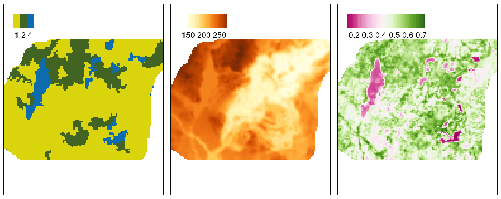
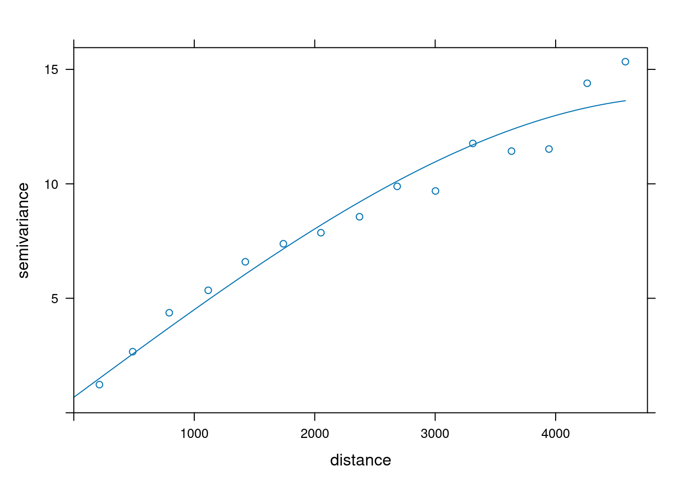
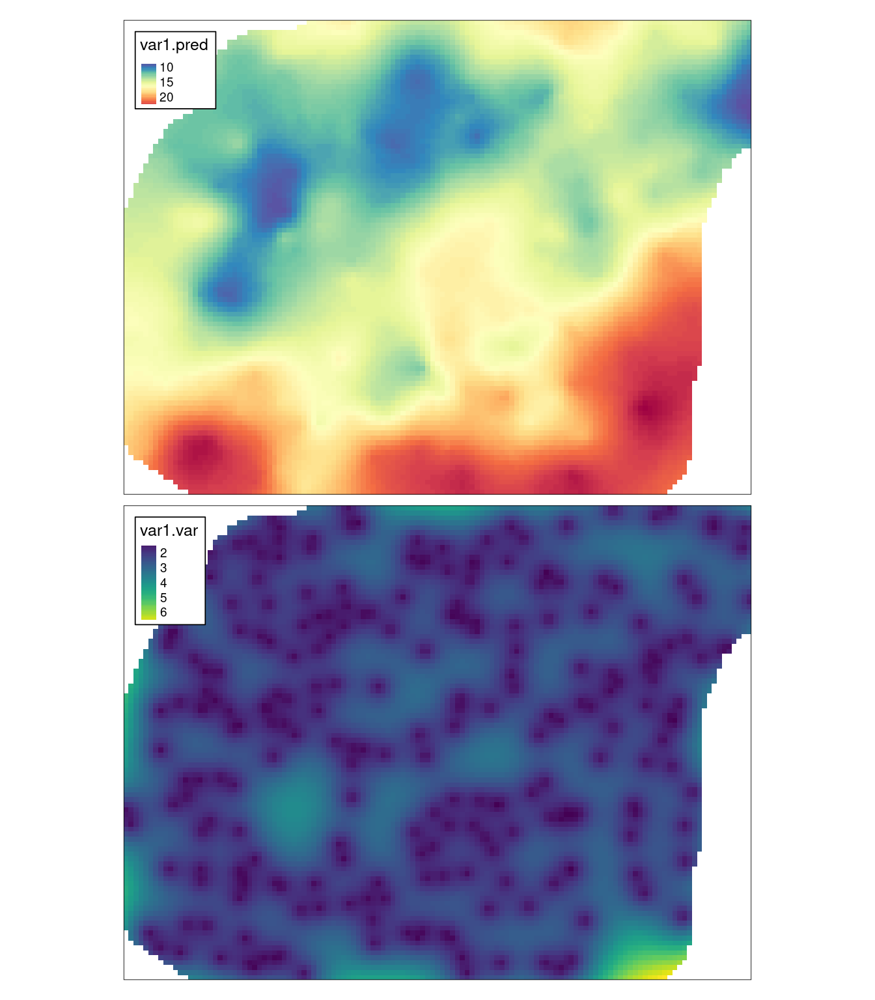
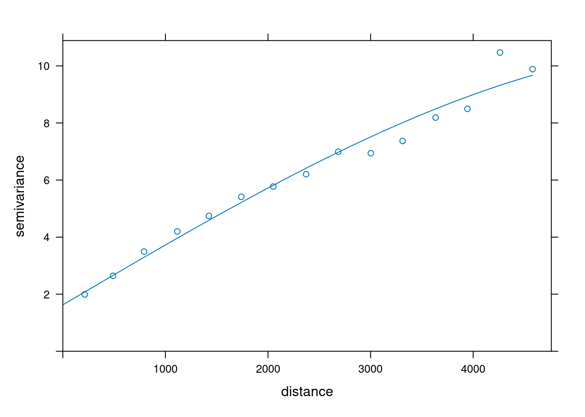
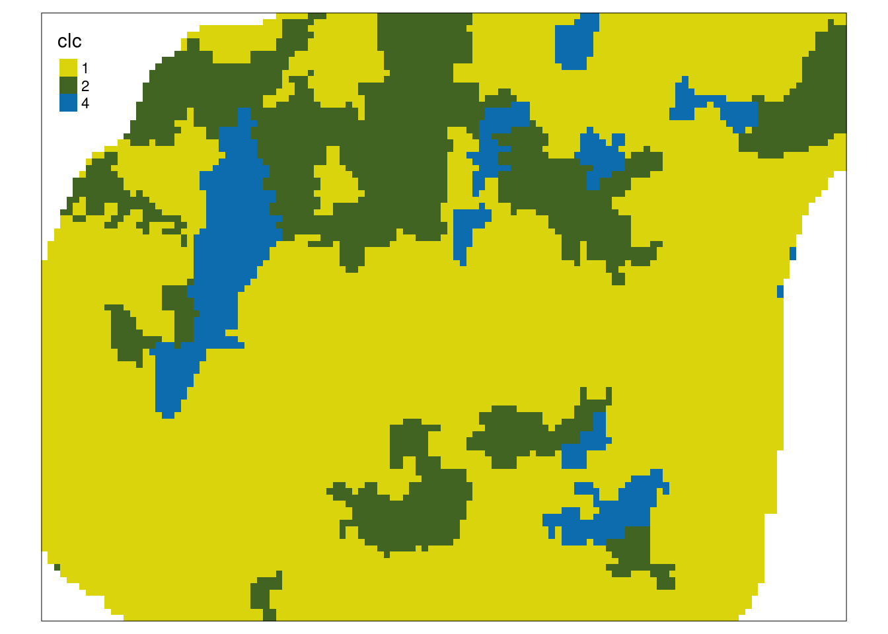
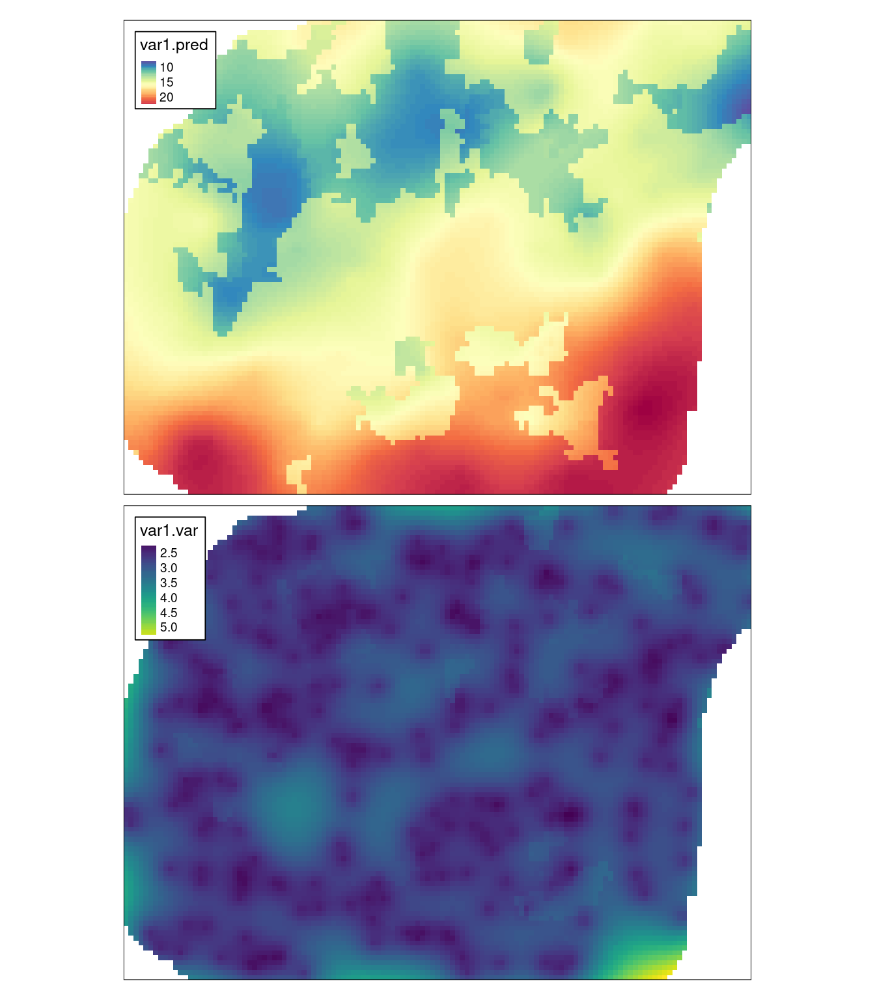
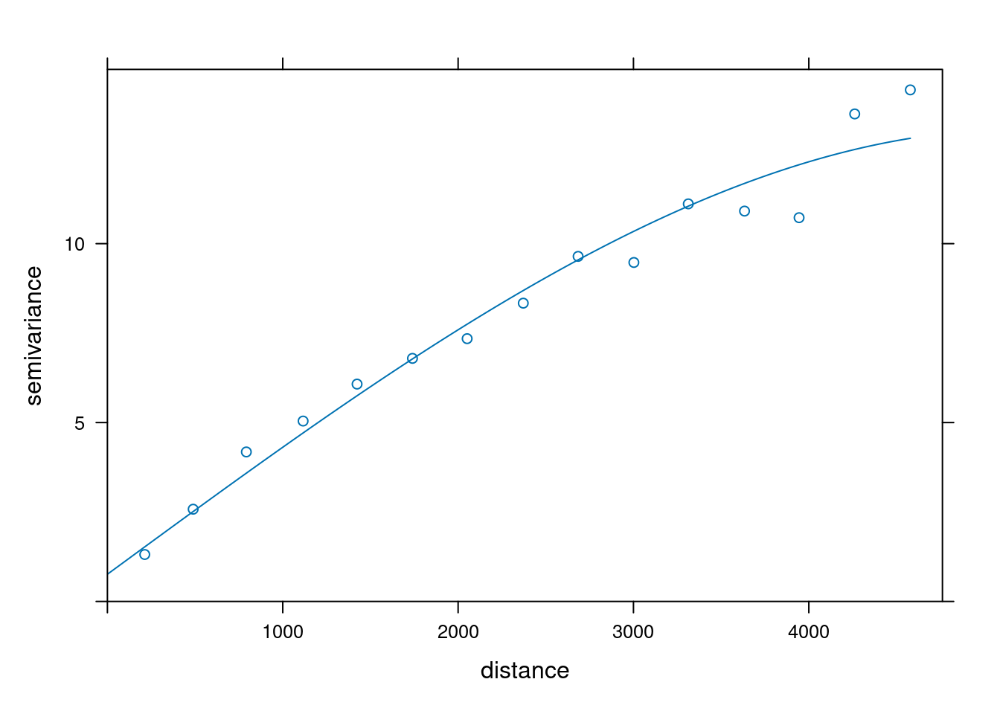
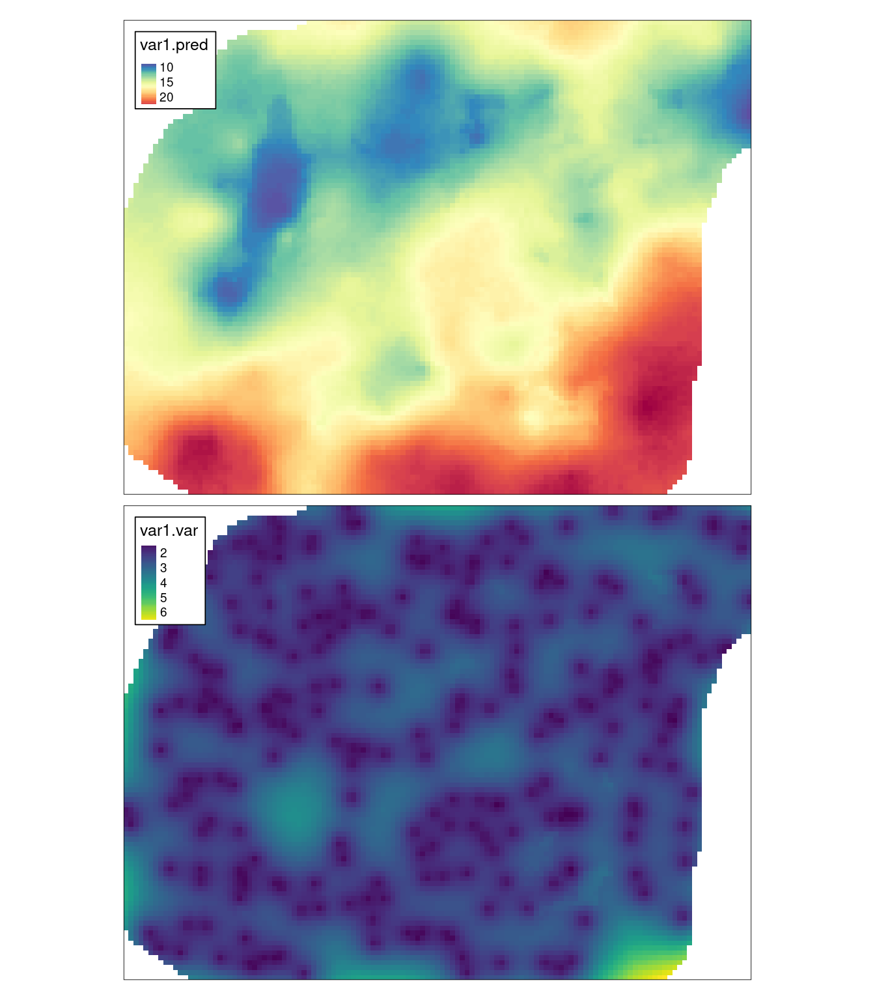

# Estymacje używające danych uzupełniających {#wykorzystanie-do-estymacji-danych-uzupeniajacych}

Odtworzenie obliczeń z tego rozdziału wymaga załączenia poniższych pakietów oraz wczytania poniższych danych:


``` r
library(sf)
library(stars)
library(gstat)
library(tmap)
library(geostatbook)
data(punkty)
data(siatka)
data(dane_uzup)
```


W wielu przypadkach, oprócz konkretnych pomiarów, istnieje również informacja na temat zmienności innych cech na analizowanym obszarze. 
W sytuacji, gdy dodatkowe zmienne są skorelowane ze zmienną analizowaną można wykorzystać jedną z metod krigingu wykorzystującą dane uzupełniające, tj. kriging stratyfikowany, kriging prosty ze zmiennymi średnimi lokalnymi, czy kriging uniwersalny.



<!-- ## Kriging stratyfikowany -->

<!-- ### Kriging stratyfikowany (ang. *Kriging within strata*) -->

<!-- Kriging stratyfikowany zakłada, że zmienność badanego zjawiska zależy od cechy jakościowej (kategoryzowanej). -->
<!-- Przykładowo, wartość badanej zmiennej jest różna w zależności od pokrycia terenu. -->
<!-- Kriging stratyfikowany wymaga posiadania danych zmiennej jakościowej (kategoryzowanej) na całym badanym obszarze. -->

<!-- W poniższym przykładzie zmienną jakościową jest uproszczone pokrycie terenu ze zmiennej `clc`.  -->
<!-- Przyjmuje ono jedno z trzech wartości. `1` oznacza obszary rolnicze, `2` oznacza obszary leśne, a `4` oznacza wody powierzchniowe. -->

<!-- ```{r } -->
<!-- siatka$clc = as.factor(siatka$clc) -->
<!-- plot(siatka["clc"]) -->
<!-- ``` -->

<!-- Kriging stratyfikowany polega na niezależnym tworzeniu i modelowaniu semiwariogramów dla każdej z kategorii. -->

<!-- ```{r } -->
<!-- vario_kws1 = variogram(temp~1, punkty[punkty$clc == 1, ]) -->
<!-- # plot(vario_kws1) -->
<!-- fitted_kws1 = fit.variogram(vario_kws1, vgm(model = "Sph", nugget = 0.5)) -->
<!-- plot(vario_kws1, fitted_kws1) -->
<!-- ``` -->

<!-- ```{r } -->
<!-- vario_kws2 = variogram(temp~1, punkty[punkty$clc == 2, ]) -->
<!-- # plot(vario_kws2) -->
<!-- fitted_kws2 = fit.variogram(vario_kws2, vgm(model = "Gau", nugget = 0.1)) -->
<!-- plot(vario_kws2, fitted_kws2) -->
<!-- ``` -->

<!-- ```{r } -->
<!-- vario_kws4 = variogram(temp~1, punkty[punkty$clc == 4, ]) -->
<!-- # plot(vario_kws4) -->
<!-- fitted_kws4 = fit.variogram(vario_kws4, vgm(model = "Nug")) -->
<!-- plot(vario_kws4, fitted_kws4) -->
<!-- ``` -->

<!-- Następnie dla każdego obszaru przeprowadzona jest niezależna estymacja wartości analizowanej cechy.  -->
<!-- Należy jedynie wcześniej zadbać, by w siatce nie było elementów `NA` dotyczących zmiennych jakościowych.  -->
<!-- W przykładzie tworzona jest nowa siatka (`siatka2`) nie zawierająca braków wartości dla zmiennej `clc`. -->

<!-- ```{r} -->
<!-- siatka2 = siatka[siatka$clc == 1,,] -->
<!-- kws1 = krige(temp~1,  -->
<!--               location = punkty[punkty$clc == 1, ],  -->
<!--               newdata = siatka2[na.omit(siatka2$clc == 1), ],  -->
<!--               model = fitted_kws1) -->
<!-- spplot(kws1, "var1.pred") -->
<!-- ``` -->
<!-- ```{r, message=FALSE} -->
<!-- siatka2 = dplyr::filter(siatka, clc == 1) -->
<!-- siatka2  -->
<!-- kws1 = krige(temp~1,  -->
<!--               location = punkty[punkty$clc == 1, ],  -->
<!--               newdata = siatka2[na.omit(siatka2$clc == 1), ],  -->
<!--               model = fitted_kws1) -->
<!-- spplot(kws1, "var1.pred") -->
<!-- ``` -->

<!-- ```{r, message=FALSE} -->
<!-- kws2 = krige(temp~1, -->
<!--               location = punkty[punkty$clc == 2, ], -->
<!--               newdata = siatka2[na.omit(siatka2$clc == 2), ],  -->
<!--               model = fitted_kws2) -->
<!-- spplot(kws2, "var1.pred") -->
<!-- ``` -->

<!-- ```{r, message=FALSE} -->
<!-- kws4 = krige(temp~1,  -->
<!--               location = punkty[punkty$clc == 4, ],  -->
<!--               newdata = siatka2[na.omit(siatka2$clc == 4), ],  -->
<!--               model = fitted_kws4) -->
<!-- spplot(kws4, "var1.pred") -->
<!-- ``` -->

<!-- Ostatnim etapem jest połączenie cząstkowych wyników w jeden obiekt klasy `SpatialPixelsDataFrame`. -->

<!-- ```{r} -->
<!-- kws = rbind(kws1, kws2, kws4) -->
<!-- ``` -->

<!-- Uzyskane w ten sposób wyniki znacząco różnią się od estymacji krigingem prostym czy zwykłym, wykazując odrębność zmienności w poszczególnych kategoriach pokrycia/użytkowania terenu. -->

<!-- ```{r plotsykws1, eval=FALSE} -->
<!-- spplot(kws, "var1.pred") -->
<!-- spplot(kws, "var1.var") -->
<!-- ``` -->

<!-- ```{r plotsykws2, echo=FALSE, fig.height=8} -->
<!-- library(gridExtra) -->
<!-- p1 = spplot(kws, "var1.pred", main = "Estymacja KWS") -->
<!-- p2 = spplot(kws, "var1.var", main = "Wariancja estymacja KWS") -->
<!-- grid.arrange(p1, p2, ncol = 1) -->
<!-- ``` -->

## Kriging prosty ze zmiennymi średnimi lokalnymi (LVM) {#SKlm}

### Kriging prosty ze zmiennymi średnimi lokalnymi (LVM) (ang. *Simple kriging with varying local means*)

Kriging prosty ze zmiennymi średnimi lokalnymi zamiast znanej (stałej) stacjonarnej średniej wykorzystuje zmienne średnie lokalne uzyskane na podstawie innej informacji. 

Lokalna średnia może być uzyskana za pomocą wyliczenia regresji liniowej pomiędzy zmienną badaną a zmienną dodatkową. 
W takiej sytuacji konieczne jest użycie funkcji `lm()`.
W poniższym przykładzie budowany jest model liniowy relacji pomiędzy temperaturą powietrza (`temp`), a wysokością nad poziomem morza (`srtm`).


``` r
coef = lm(temp ~ srtm, punkty)$coef
coef
```

```
## (Intercept)        srtm 
## 17.41296753 -0.01021971
```

Wykorzystując relację pomiędzy tymi dwoma zmiennymi tworzony jest semiwariogram empiryczny, który następnie jest modelowany (rycina \@ref(fig:09-dane-uzupelniajace-5)).


``` r
vario = variogram(temp ~ srtm, location = punkty)
model_sim = vgm(model = "Sph", nugget = 1)
fitted_sim = fit.variogram(vario, model_sim)
fitted_sim
```

```
##   model      psill    range
## 1   Nug  0.6756367    0.000
## 2   Sph 13.1450299 5085.204
```

``` r
plot(vario, model = fitted_sim)
```

<div class="figure" style="text-align: center">

<p class="caption">(\#fig:09-dane-uzupelniajace-5)Model semiwariogramu zmiennej temp używając zmiennej srtm.</p>
</div>

Ostatnim krokiem jest estymacja geostatystyczna, w której oprócz czterech podstawowych argumentów, definiujemy także parametr `beta`.
W tym wypadku jest to wypadku obiekt uzyskany na podstawie regresji liniowej.


``` r
sk_lvm = krige(temp ~ srtm, 
               location = punkty, 
               newdata = dane_uzup, 
               model = fitted_sim, 
               beta = coef)
```

```
## [using simple kriging]
```

``` r
sk_lvm
```

```
## stars object with 2 dimensions and 2 attributes
## attribute(s):
##                Min.   1st Qu.    Median      Mean   3rd Qu.      Max. NA's
## var1.pred  8.559515 12.745494 14.958937 15.523648 17.759209 24.240945 1242
## var1.var   1.066204  1.875899  2.248138  2.321278  2.638222  6.852509 1242
## dimension(s):
##   from  to offset delta               refsys x/y
## x    1 127 745542    90 ETRS89 / Poland CS92 [x]
## y    1  96 721256   -90 ETRS89 / Poland CS92 [y]
```


``` r
tm_shape(sk_lvm) +
        tm_raster(col = c("var1.pred", "var1.var"),
                  style = "cont", 
                  palette = list("-Spectral", "viridis")) +
        tm_layout(legend.frame = TRUE)
```

<div class="figure" style="text-align: center">

<p class="caption">(\#fig:plotsylvm2)Estymacja i wariancja estymacji używając metody prostego krigingu ze zmiennymi średnimi lokalnymi (LVM).</p>
</div>

## Kriging uniwersalny 

### Kriging uniwersalny (ang. *Universal kriging*)

Kriging uniwersalny, określany również jako kriging z trendem (ang. *Kriging with a trend model*) zakłada, że nieznana średnia lokalna zmienia się stopniowo na badanym obszarze. 
W krigingu uniwersalnym możemy stosować zarówno zmienne jakościowe, jak i ilościowe. 

W pierwszym przykładzie, kriging uniwersalny służy stworzeniu semiwariogramu, modelowaniu oraz estymacji temperatury powietrza z użyciem zmiennej pokrycia terenu (ryciny \@ref(fig:09-dane-uzupelniajace-7), \@ref(fig:09-dane-uzupelniajace-8), \@ref(fig:plotsy4uk1)).


``` r
punkty$clc = as.factor(punkty$clc)
vario_uk1 = variogram(temp ~ clc, location = punkty)
# vario_uk1
# plot(vario_uk1)
model_uk1 = vgm(model = "Sph", nugget = 1)
vario_fit_uk1 = fit.variogram(vario_uk1, model = model_uk1)
vario_fit_uk1
```

```
##   model    psill    range
## 1   Nug 1.626245    0.000
## 2   Sph 9.059005 6426.143
```

``` r
plot(vario_uk1, vario_fit_uk1)
```

<div class="figure" style="text-align: center">

<p class="caption">(\#fig:09-dane-uzupelniajace-7)Model semiwariogramu zmiennej temp używając zmiennej clc.</p>
</div>


``` r
dane_uzup$clc = as.factor(dane_uzup$clc)
tm_shape(dane_uzup["clc"]) +
        tm_raster(palette = c("#d9d40c", "#416422", "#0c6cae"))
```

<div class="figure" style="text-align: center">

<p class="caption">(\#fig:09-dane-uzupelniajace-8)Rozkład przestrzenny wartości zmiennej clc używanej w modelu.</p>
</div>


``` r
uk1 = krige(temp ~ clc, 
            locations = punkty,
            newdata = dane_uzup, 
            model = vario_fit_uk1)
```

```
## [using universal kriging]
```


``` r
tm_shape(uk1) +
        tm_raster(col = c("var1.pred", "var1.var"),
                  style = "cont", 
                  palette = list("-Spectral", "viridis")) +
        tm_layout(legend.frame = TRUE)
```

<div class="figure" style="text-align: center">

<p class="caption">(\#fig:plotsy4uk1)Estymacja i wariancja estymacji używając zmiennej clc i metody krigingu uniwersalnego (KU).</p>
</div>

W kolejnym przykładzie zastosowane są już dwie zmienne uzupełniające - wartość wskaźnika wegetacji (`ndvi`) oraz wysokość nad poziomem morza (`srtm`) (ryciny \@ref(fig:09-dane-uzupelniajace-10), \@ref(fig:plotsy4KU)).


``` r
vario_uk2 = variogram(temp ~ ndvi + srtm, location = punkty)
# vario_uk2
# plot(vario_uk2)
model = vgm(model = "Sph", nugget = 1)
vario_fit_uk2 = fit.variogram(vario_uk2, model = model)
vario_fit_uk2
```

```
##   model      psill    range
## 1   Nug  0.7602125    0.000
## 2   Sph 12.4326154 5188.676
```

``` r
plot(vario_uk2, vario_fit_uk2)
```

<div class="figure" style="text-align: center">

<p class="caption">(\#fig:09-dane-uzupelniajace-10)Model semiwariogramu zmiennej temp używając zmiennych ndvi i srtm.</p>
</div>


``` r
uk2 = krige(temp ~ ndvi + srtm,
             locations = punkty, 
             newdata = dane_uzup,
             model = vario_fit_uk2)
```

```
## [using universal kriging]
```


``` r
tm_shape(uk2) +
        tm_raster(col = c("var1.pred", "var1.var"),
                  style = "cont", 
                  palette = list("-Spectral", "viridis")) +
        tm_layout(legend.frame = TRUE)
```

<div class="figure" style="text-align: center">

<p class="caption">(\#fig:plotsy4KU)Estymacja i wariancja estymacji używając zmiennych ndvi i srtm i metody krigingu uniwersalnego (KU).</p>
</div>

## Zadania {#z11}

Zadania w tym rozdziale są oparte o dane z obiektu `punkty`.


``` r
data(punkty)
```

<!-- 1. Używając krigingu stratyfikowanego, stwórz optymalne modele zmiennej `ndvi` dla trzech typów pokrycia terenu (zmienna `clc`). Bazując na stworzonych modelach, stwórz estymacje zmiennej `ndvi` dla trzech typów pokrycia terenu. -->
<!-- Połącz uzyskane estymacje w jedną mapę. -->
1. Zastosuj kriging prosty ze zmiennymi średnimi lokalnymi do stworzenia estymacji zmiennej `ndvi` używając jej relacji ze zmienną `savi`.
2. Stwórz estymację krigingu uniwersalnego dla zmiennej `ndvi` używając jej relacji ze zmienną `savi`.
3. Stwórz estymację krigingu uniwersalnego dla zmiennej `ndvi` używając jej relacji ze zmiennymi `clc`, `srtm`, `temp` i `savi`.
4. Porównaj graficznie trzy powyższe estymacje. 
Opisz podobieństwa i różnice.

