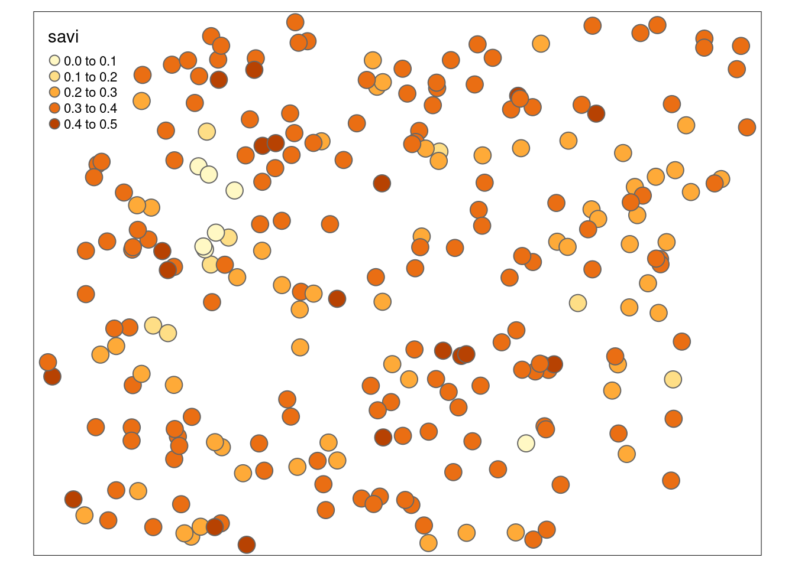
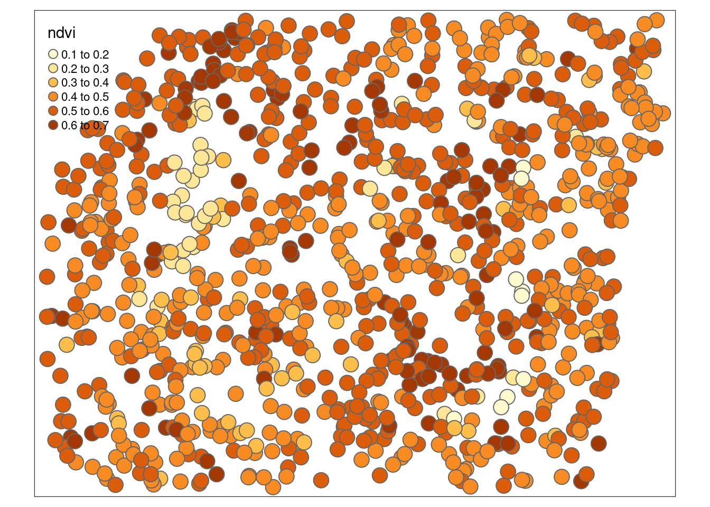
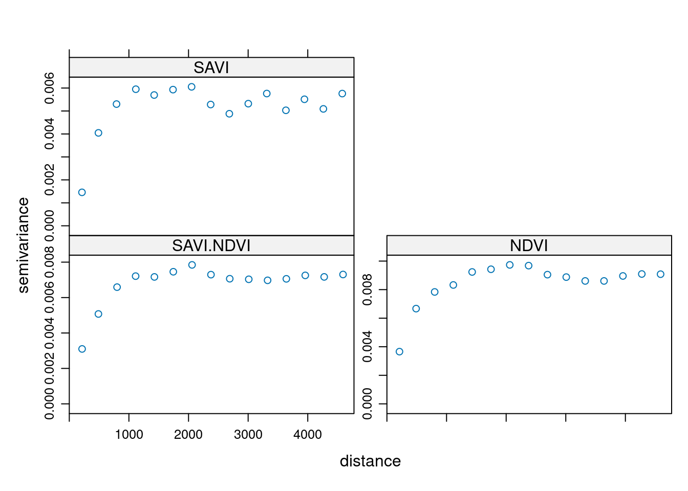
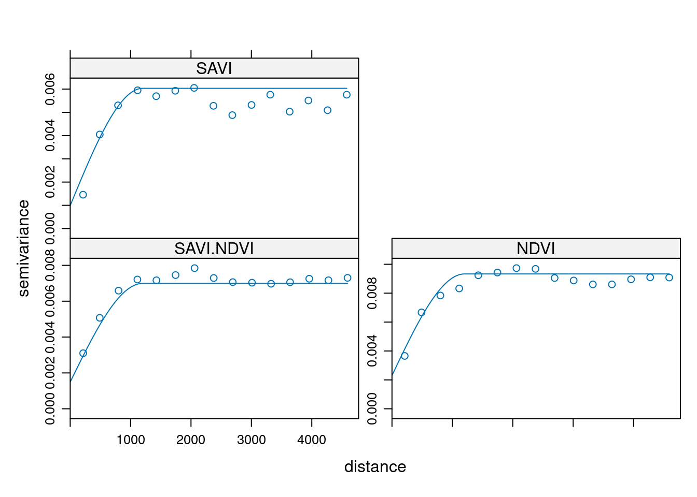
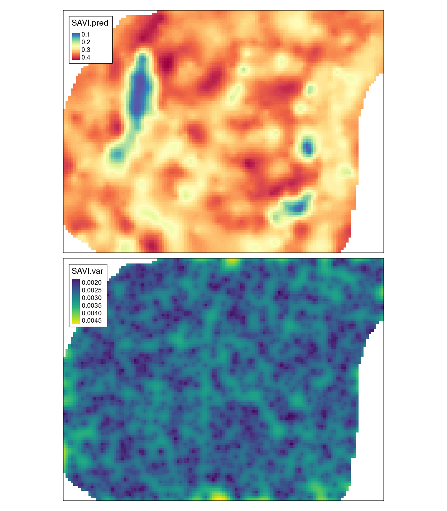

# Estymacje wielozmienne {#estymacje-wielozmienne}

Odtworzenie obliczeń z tego rozdziału wymaga załączenia poniższych pakietów oraz wczytania poniższych danych:


``` r
library(sf)
library(stars)
library(gstat)
library(tmap)
library(geostatbook)
data(punkty)
data(punkty_ndvi)
data(siatka)
```


## Kokriging 

### Kokriging (ang. *co-kriging*)

Kokriging pozwala na wykorzystanie dodatkowej zmiennej (ang. *auxiliary variable*), zwanej inaczej kozmienną (ang. *co-variable*), która może być użyta do prognozowania wartości badanej zmiennej w nieopróbowanej lokalizacji.
Zmienna dodatkowa może być pomierzona w tych samych miejscach, gdzie badana zmienna, jak też w innych niż badana zmienna. 
Możliwa jest też sytuacja, gdy zmienna dodatkowa jest pomierzona w dwóch powyższych przypadkach. 
Kokriging wymaga, aby obie zmienne były istotnie ze sobą skorelowane.
Najczęściej kokriging jest stosowany w sytuacji, gdy zmienna dodatkowa jest łatwiejsza (tańsza) do pomierzenia niż zmienna główna. 
W efekcie, uzyskany zbiór danych zawiera informacje o badanej zmiennej oraz gęściej opróbowane informacje o zmiennej dodatkowej.
Jeżeli informacje o zmiennej dodatkowej są znane dla całego obszaru wówczas bardziej odpowiednią techniką będzie kriging z zewnętrznym trendem (KED).

### Wybór dodatkowej zmiennej

Wybór zmiennej dodatkowej może opierać się na dwóch kryteriach:

- Teoretycznym
- Empirycznym
    
<!--
Kroskowariogramy
Kroskorelogramy
-->

## Krossemiwariogramy

### Krossemiwariogramy (ang. **crossvariogram**)

Metoda kokrigingu opiera się nie o semiwariogram, lecz o krossemiwariogramy. 
Krossemiwariogram jest to wariancja różnicy pomiędzy dwiema zmiennymi w dwóch lokalizacjach.
Wyliczając krossemiwariogram otrzymujemy empiryczne semiwariogramy dla dwóch badanych zmiennych oraz krosswariogram dla kombinacji dwóch zmiennych.

W poniższym przykładzie istnieją dwie zmienne, `savi` ze zbioru `punkty` pomierzona w 242 lokalizacjach oraz `ndvi` ze zbioru `punkty_ndvi` pomierzona w 992 punktach (ryciny \@ref(fig:10-kokriging-3) i \@ref(fig:10-kokriging-3)).


``` r
tm_shape(punkty) +
        tm_symbols(col = "savi")
```

<div class="figure" style="text-align: center">

<p class="caption">(\#fig:10-kokriging-3)Mapa wartości zmiennej savi.</p>
</div>


``` r
tm_shape(punkty_ndvi) +
        tm_symbols(col = "ndvi")
```

<div class="figure" style="text-align: center">

<p class="caption">(\#fig:10-kokriging-4)Mapa wartości zmiennej ndvi.</p>
</div>

Tworzenie krossemiwariogramów odbywa się z użyciem funkcji `gstat()`. Na początku definiujemy pierwszy obiekt `g`. 
Składa się on z obiektu pustego (`NULL`), nazwy pierwszej zmiennej (nazwa może być dowolna), wzoru (w przykładzie `savi ~ 1`), oraz pierwszego zbioru punktowego. 
Następnie do pierwszego obiektu `g` dodajemy nowe informacje również poprzez funkcję `gstat()`. Jest to nazwa obiektu (`g`), nazwa drugiej zmiennej, wzór, oraz drugi zbiór punktowy.


``` r
g = gstat(NULL, 
          id = "SAVI", 
          form = savi ~ 1, 
          data = punkty)
g = gstat(g, 
          id = "NDVI", 
          form = ndvi ~ 1, 
          data = punkty_ndvi)
g
```

```
## data:
## SAVI : formula = savi`~`1 ; data dim = 242 x 5
## NDVI : formula = ndvi`~`1 ; data dim = 992 x 1
```

Z uzyskanego w ten sposób obiektu tworzymy krossemiwariogram (funkcja `variogram()`), a następnie go wizualizujemy używając funkcji `plot()` (rycina \@ref(fig:10-kokriging-6)).


``` r
v = variogram(g)
plot(v)
```

<div class="figure" style="text-align: center">

<p class="caption">(\#fig:10-kokriging-6)Krossemiwariogram zmiennych savi i ndvi.</p>
</div>

## Modelowanie krossemiwariogramów

Modelowanie krossemiwariogramów, podobnie jak ich tworzenie, odbywa się używając funkcji `gstat()`,
<!-- Istnieją dwie podstawowe podejścia modelowania krossemiwariogramów: (1) wspólne modelowanie semiwariogramów i krossemiwariogramów lub (2) modelowanie każdego semiwariogramu i krossemiwariogramu oddzielnie. -->
<!-- W pierwszym podejściu  -->
gdzie podaje się wcześniejszy obiekt `g`, model, oraz argument `fill.all = TRUE`. 
Ten ostatni parametr powoduje, że model dodawany jest do wszystkich elementów krossemiwariogramu.


``` r
g_model = vgm(0.006, model = "Sph",
              range = 1200, nugget = 0.001)
g1 = gstat(g, model = g_model, fill.all = TRUE)
g1
```

```
## data:
## SAVI : formula = savi`~`1 ; data dim = 242 x 5
## NDVI : formula = ndvi`~`1 ; data dim = 992 x 1
## variograms:
##              model psill range
## SAVI[1]        Nug 0.001     0
## SAVI[2]        Sph 0.006  1200
## NDVI[1]        Nug 0.001     0
## NDVI[2]        Sph 0.006  1200
## SAVI.NDVI[1]   Nug 0.001     0
## SAVI.NDVI[2]   Sph 0.006  1200
```

W przypadku semiwariogramów funkcja `fit.variogram()` służyła dopasowaniu parametrów modelu do semiwariogramu empirycznego. 
Podobną rolę w krossemiwariogramach spełnia funkcja `fit.lmc()` - dopasowuje ona liniowy model koregionalizacji do semiwariogramów wielozmienych (rycina \@ref(fig:10-kokriging-8)).
Funkcja `fit.lmc()` oczekuje co najmniej dwóch elementów, krossemiwariogramu oraz modelów krossemiwariancji. 
W poniższym przykładzie dodatkowo użyto parametru `correct.diagonal = 1.01`, z uwagi na to że analizowane zmienne wykazywały bardzo silną korelację oraz parametru `fit.method`.
Ten ostatni parametr określa, która z użytych metod automatycznego dopasowania semiwariogramów jest używana.
Pakiet **gstat** ma domyślnie ustawione `fit.method = 7`, co daje największe znaczenie parom punktów o najmniejszym zasięgu. 
Ta opcja nie jest zazwyczaj optymalna w przypadku krossemiwariogramów - tutaj częściej stosuje się `fit.method = 6` (wagi nie są nadawane) lub `fit.method = 1` (wagi proporcjonalne do liczby par punktów w każdym przedziale).


``` r
g2 = fit.lmc(v, g1,
                correct.diagonal = 1.01,
                fit.method = 6)
g2
```

```
## data:
## SAVI : formula = savi`~`1 ; data dim = 242 x 5
## NDVI : formula = ndvi`~`1 ; data dim = 992 x 1
## variograms:
##              model        psill range
## SAVI[1]        Nug 0.0009873135     0
## SAVI[2]        Sph 0.0050465345  1200
## NDVI[1]        Nug 0.0023006100     0
## NDVI[2]        Sph 0.0070299532  1200
## SAVI.NDVI[1]   Nug 0.0014922022     0
## SAVI.NDVI[2]   Sph 0.0055018027  1200
```

``` r
plot(v, g2)
```

<div class="figure" style="text-align: center">

<p class="caption">(\#fig:10-kokriging-8)Automatycznie dopasowane modele krossemiwariogramu zmiennych savi i ndvi.</p>
</div>

<!--

``` r
# plot(variogram(g, map=TRUE, cutoff=12000, width=800))
plot(variogram(g, alpha = c(60, 105, 150, 195)))
```
-->   

<!-- Drugie podejście polega na modelowaniu każdego semiwariogramu i krossemiwariogramu oddzielnie za pomocą funkcji `gstat()` oraz poprzez podanie za każdym razem odpowiedniego `id`. -->

<!-- ```{r} -->
<!-- model_savi = vgm(0.005, model = "Sph",  -->
<!--                  range = 1200, nugget = 0.001) -->
<!-- g3 = gstat(g,  -->
<!--           id = "SAVI",  -->
<!--           model = model_savi) -->

<!-- model_ndvi = vgm(0.007, model = "Sph",  -->
<!--                  range = 1200, nugget = 0.002) -->
<!-- g3 = gstat(g3,  -->
<!--           id = "NDVI",  -->
<!--           model = model_ndvi) -->
<!-- g3 -->
<!-- ``` -->

<!-- W przypadku semiwariogramów, odpowiednie `id` są zgodne z tymi podanymi podczas tworzenia krossemiwariogramu, natomiast modelowanie krossemiwariogramu polega na podaniu wektora dwóch `id`. -->

<!-- ```{r} -->
<!-- model_kros = vgm(0.0051, model = "Sph", -->
<!--                       range = 1200, nugget = 0.002) -->
<!-- g3 = gstat(g3, -->
<!--           id = c("SAVI", "NDVI"), -->
<!--           model = model_kros) -->
<!-- g3 -->
<!-- ``` -->

<!-- Efekt takiego modelowanie można zobaczyć na rycinie \@ref(fig:kros-model-hand). -->

<!-- ```{r kros-model-hand, fig.cap="Ręcznie dopasowane modele krossemiwariogramu zmiennych savi i ndvi. "} -->
<!-- plot(v, g4) -->
<!-- ``` -->

<!-- ```{r} -->
<!-- g4 = fit.lmc(v, g3, -->
<!--              fit.sills = FALSE, -->
<!--              correct.diagonal = 1.01) -->
<!-- ``` -->


## Kokriging 

Posiadając dopasowane modele oraz siatkę można uzyskać wynik używając funkcji `predict()` (rycina \@ref(fig:kokriging-predicted)). 


``` r
ck = predict(g2, newdata = siatka)
```

```
## Linear Model of Coregionalization found. Good.
## [using ordinary cokriging]
```

W efekcie otrzymujemy pięć zmiennych:

1. `SAVI.pred` - estymacja zmiennej `savi`
2. `SAVI.var` - wariancja zmiennej `savi`
3. `NDVI.pred` - estymacja zmiennej `ndvi`
4. `NDVI.var` - wariancja zmiennej `ndvi`
5. `cov.SAVI.NDVI` - kowariancja zmiennych `savi` oraz `ndvi`


``` r
ck
```

```
## stars object with 2 dimensions and 5 attributes
## attribute(s):
##                       Min.     1st Qu.      Median        Mean     3rd Qu.
## SAVI.pred      0.077243684 0.290908153 0.321211504 0.315700226 0.348022981
## SAVI.var       0.001525063 0.002379011 0.002638353 0.002652832 0.002905902
## NDVI.pred      0.205549518 0.468630003 0.508090071 0.501150702 0.542080400
## NDVI.var       0.003082640 0.003893078 0.004212984 0.004272496 0.004578181
## cov.SAVI.NDVI  0.001930305 0.002625231 0.002885524 0.002929714 0.003180885
##                       Max. NA's
## SAVI.pred      0.437090600 1270
## SAVI.var       0.004777928 1270
## NDVI.pred      0.658528553 1270
## NDVI.var       0.007378830 1270
## cov.SAVI.NDVI  0.005432433 1270
## dimension(s):
##   from  to offset delta               refsys x/y
## x    1 127 745542    90 ETRS89 / Poland CS92 [x]
## y    1  96 721256   -90 ETRS89 / Poland CS92 [y]
```


``` r
tm_shape(ck) +
        tm_raster(col = c("SAVI.pred", "SAVI.var"),
                  style = "cont", 
                  palette = list("-Spectral", "viridis")) +
        tm_layout(legend.frame = TRUE)
```

<div class="figure" style="text-align: center">

<p class="caption">(\#fig:kokriging-predicted)Estymacja i wariancja estymacji zmiennej savi używając metody kokrigingu (CK).</p>
</div>


<!--   
## Kokriging pełny i medianowy, kokriging kolokacyjny, 
## Kokriging na podstawie uproszczonych modeli Markowa I i II
-->

## Zadania {#z10}

Zadania w tym rozdziale są oparte o dane z `meuse.all` z pakietu **gstat**.


``` r
data("meuse.all")
meuse = st_as_sf(meuse.all, coords = c("x", "y"))
```

Na jego podstawie wydziel dwa obiekty - `meuse164` zawierający tylko zmienną `cadmium` (kadm) dla 164 punktów, oraz `meuse60` zawierający tylko zmienną `copper` (miedź) dla 60 punktów.


``` r
set.seed(431)
meuse164 = meuse["cadmium"]
meuse60 = meuse[sample(nrow(meuse), 60), "copper"]
```

1. Stwórz siatkę interpolacyjną o rozdzielczości 100 jednostek dla obszaru, w którym znajdują się punkty `meuse`.
2. Zbuduj optymalne modele semiwariogramu zmiennej `cadmium` dla obiektu `meuse164` oraz zmiennej `copper` dla obiektu `meuse60`.
Porównaj graficznie uzyskane modele.
3. Korzystając z obiektów `meuse164` oraz `meuse60` stwórz krossemiwariogram.
4. Zbuduj ręczny model uzyskanego krossemiwariogramu.
Następnie stwórz model automatyczny.
Porównaj uzyskane wyniki.
5. Stwórz estymację zmiennej `copper` w nowo utworzonej siatce korzystając z kokrigingu.
6. Dodatkowe: stwórz estymację zmiennej `savi` z obiektu `punkty` używając krigingu zwykłego. 
Porównaj uzyskaną estymację z estymacją przedstawioną w tym rozdziale, stworzoną używając kokrigingu.
