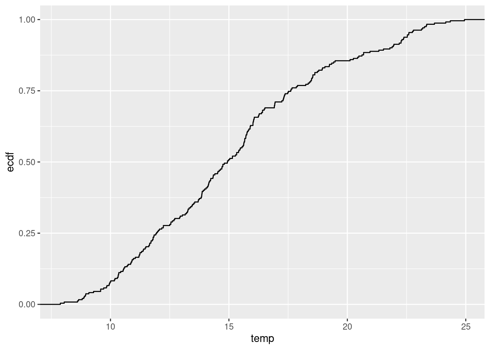
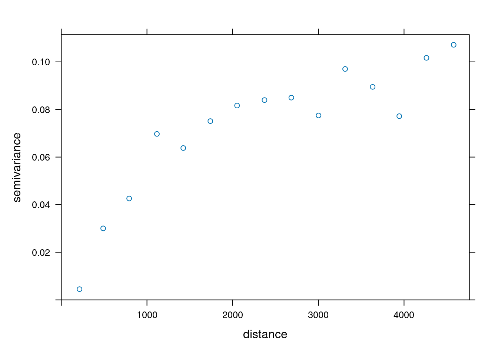
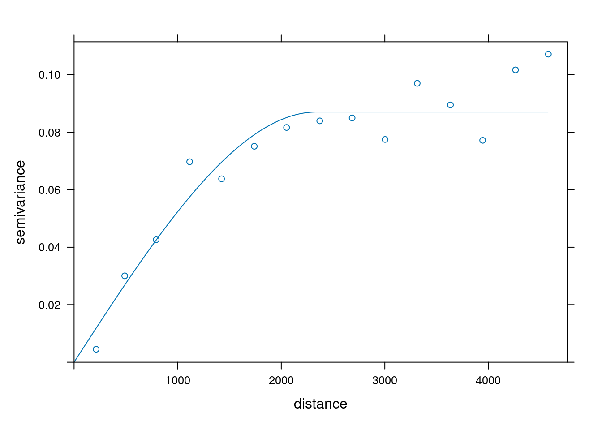
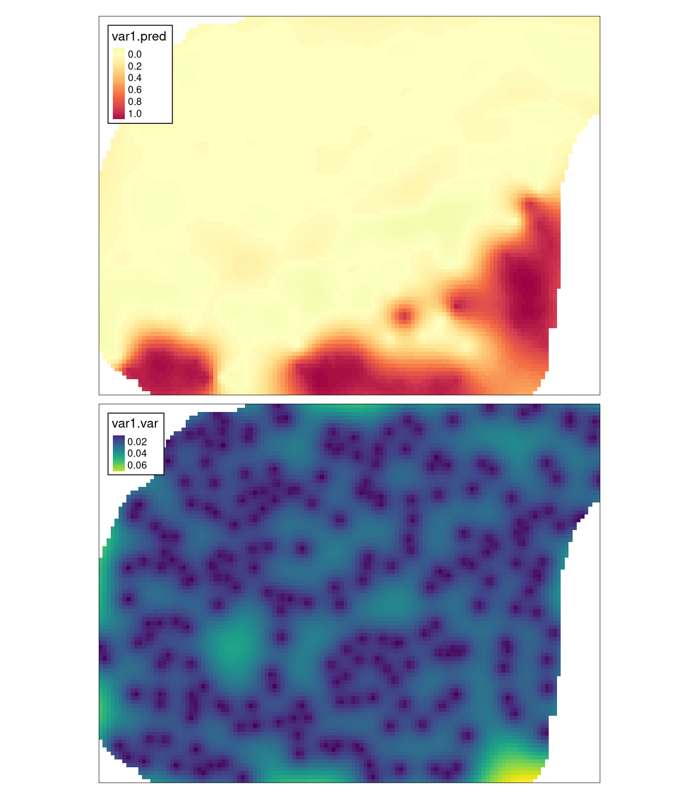
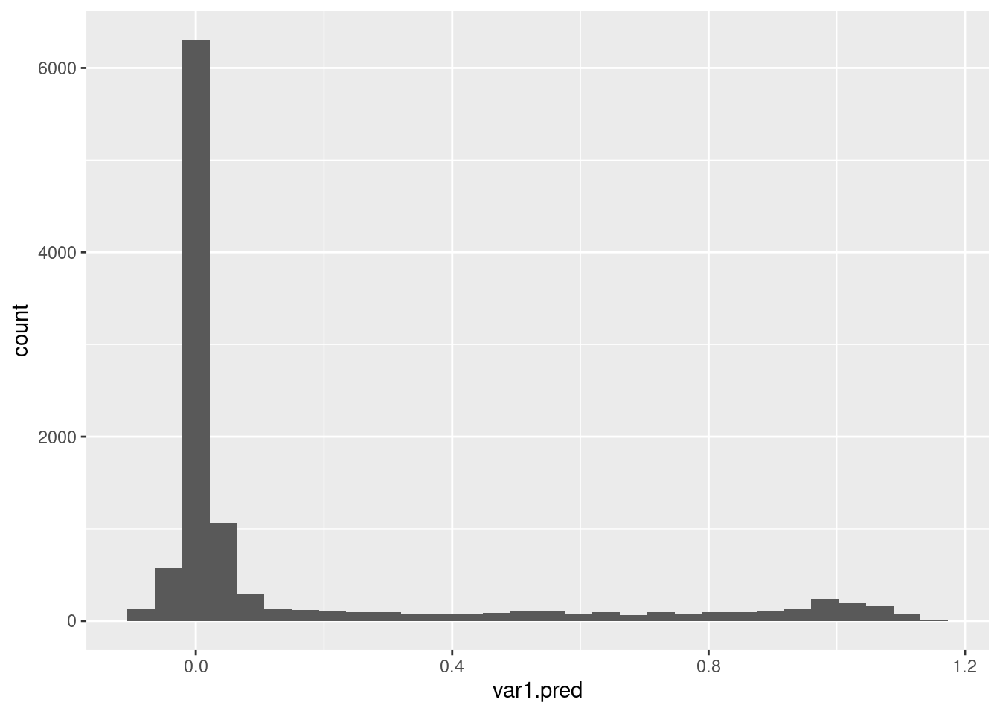
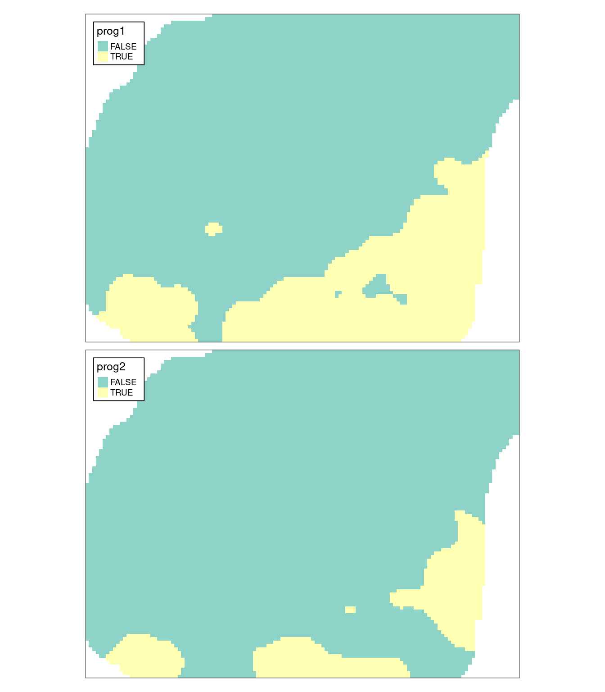
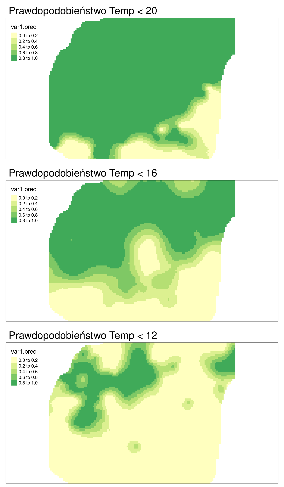

# Estymacja lokalnego rozkładu prawdopodobieństwa {#estymacja-lokalnego-rozkadu-prawdopodobienstwa}

Odtworzenie obliczeń z tego rozdziału wymaga załączenia poniższych pakietów oraz wczytania poniższych danych:


``` r
library(sf)
library(stars)
library(gstat)
library(tmap)
library(ggplot2)
library(geostatbook)
data(punkty)
data(siatka)
```


## Kriging danych kodowanych

### Kriging danych kodowanych (ang. *Indicator kriging*)

Kriging danych kodowanych to metoda krigingu oparta o dane kategoryzowane lub też dane przetworzone z postaci ciągłej do binarnej.
Jest ona zazwyczaj używana jest to oszacowania prawdopodobieństwa przekroczenia zdefiniowanej wartości progowej, może być również używana do szacowania wartości z całego rozkładu.
Wartości danych wykorzystywane do krigingu danych kodowanych są określone jako 0 lub 1, co reprezentuje czy wartość danej zmiennej jest powyżej czy poniżej określonego progu.

<!--http://geostat-course.org/system/files/geostat13_ind.pdf-->

### Wady i zalety krigingu danych kodowanych

Zalety:

- Możliwość zastosowania, gdy nie interesuje nas konkretna wartość, ale znalezienie obszarów o wartości przekraczającej dany poziom.
- Nie jest istotny kształt rozkładu.

Wady:

- Potencjalnie trudne do modelowania semiwariogramy (szczególnie skrajnych przedziałów).
- Czasochłonność/pracochłonność.
    
## Przykłady krigingu danych kodowanych

### Binaryzacja danych

Pierwszym krokiem w krigingu danych kodowanych jest stworzenie zmiennej binarnej. 
Na poniższym przykładzie tworzona jest nowa zmienna `temp_ind`.
Przyjmuje ona wartość `TRUE` (czyli `1`) dla pomiarów temperatury wyższych niż 20 stopni Celsjusza, a dla pomiarów równych i niższych niż 20 stopni Celsjusza jej wartość wynosi `FALSE` (czyli `0`).


``` r
summary(punkty$temp)
```

```
##    Min. 1st Qu.  Median    Mean 3rd Qu.    Max. 
##   7.883  11.953  14.937  15.223  17.584  24.945
```

``` r
punkty$temp_ind = punkty$temp > 20
summary(punkty$temp_ind)
```

```
##    Mode   FALSE    TRUE 
## logical     207      35
```

W przykładzie, próg został wyznaczony arbitralnie. 
Istnieje oczywiście szereg innych możliwości wyznaczania progu. 
Można wykorzystać wiedzę zewnętrzną (np. toksyczne stężenie analizowanej substancji) lub też posłużyć się wykresem dystrybuanty do określenia istotnej zmiany wartości (rycina \@ref(fig:11-dane-kodowane-4)).


``` r
ggplot(punkty, aes(temp)) + stat_ecdf()
```

<div class="figure" style="text-align: center">

<p class="caption">(\#fig:11-dane-kodowane-4)Dystrybuanta zmiennej temp.</p>
</div>

### Modelowanie

Tworzenie i modelowanie semiwariogramu empirycznego w krigingu danych kodowanych wygląda tak samo jak, np. w przypadku krigingu zwykłego (ryciny \@ref(fig:11-dane-kodowane-5) i \@ref(fig:11-dane-kodowane-6)).
Korzystając z funkcji `variogram()` tworzony jest semiwariogram empiryczny, używając `vgm()` tworzony jest model "ręczny", który następnie jest dopasowywany z użyciem funkcji `fit.variogram()`.


``` r
vario_ind = variogram(temp_ind ~ 1, locations = punkty)
plot(vario_ind)
```

<div class="figure" style="text-align: center">

<p class="caption">(\#fig:11-dane-kodowane-5)Semiwariogram empiryczny binarnej zmiennej.</p>
</div>


``` r
model_ind = vgm(model = "Sph", nugget = 0.01)
fitted_ind = fit.variogram(vario_ind, model_ind)
fitted_ind
```

```
##   model      psill    range
## 1   Nug 0.00000000    0.000
## 2   Sph 0.08703823 2342.636
```

``` r
plot(vario_ind, model = fitted_ind)
```

<div class="figure" style="text-align: center">

<p class="caption">(\#fig:11-dane-kodowane-6)Model semiwariogramu empirycznego binarnej zmiennej.</p>
</div>

### Estymacja

Ostatnim etapem jest stworzenie interpolacji geostatystycznej z pomocą funkcji `krige`.
Wymaga ona czterech argumentów - wzoru (`temp_ind ~ 1`), zbioru punktowego (`punkty`), siatki do interpolacji (`siatka`) oraz modelu (`fitted_ind`).


``` r
ik = krige(temp_ind ~ 1, 
           locations = punkty,
           newdata = siatka,
           model = fitted_ind)
```

```
## [using ordinary kriging]
```

W wyniku estymacji otrzymuje się mapę przestawiającą prawdopodobieństwo przekroczenia zadanej wartości (w tym wypadku jest to 20 stopni Celsjusza) oraz uzyskaną wariancję estymacji (rycina \@ref(fig:plotsy2ok)).


``` r
tm_shape(ik) +
        tm_raster(col = c("var1.pred", "var1.var"),
                  style = "cont", 
                  palette = list("-Spectral", "viridis")) +
        tm_layout(legend.frame = TRUE)
```

<div class="figure" style="text-align: center">

<p class="caption">(\#fig:plotsy2ok)Estymacja i wariancja estymacji używając metody krigingu danych kodowanych (IK).</p>
</div>

### Tworzenie mapy binarnej

Mapy przestawiające prawdopodobieństwo można też przetworzyć do postaci map binarnych poprzez użycie wybranej wartości progowej.
Rozkład wartości prawdopodobieństwa jest możliwy do zobaczenia, np. używając histogramu (rycina \@ref(fig:11-dane-kodowane-8)).


``` r
ik_df = as.data.frame(ik)
ggplot(ik_df, aes(var1.pred)) + geom_histogram()
```

<div class="figure" style="text-align: center">

<p class="caption">(\#fig:11-dane-kodowane-8)Rozkład wartości estymacji używając metody krigingu danych kodowanych (IK).</p>
</div>

Następnie można stworzyć nową zmienną binarną w oparciu o wartości estymacji.
Poniższy kod tworzy dwie nowe zmienne - `prog1`, gdzie wartość progowa została arbitralnie ustalona na 0.1 oraz `prog2` z wartością progową 0.75.


``` r
ik$prog1 = ik$var1.pred > 0.1
ik$prog2 = ik$var1.pred > 0.75
```

W wyniku otrzymuje się binarne mapy, dla których stwierdza się obszary powyżej lub poniższej zadanego prawdopodobieństwa (rycina \@ref(fig:plotsy2ik2)).


``` r
tm_shape(ik) +
        tm_raster(col = c("prog1", "prog2")) +
        tm_layout(legend.frame = TRUE)
```

<div class="figure" style="text-align: center">

<p class="caption">(\#fig:plotsy2ik2)Binarne mapy dla progu ustalonego na 0.1 oraz 0.75.</p>
</div>

### Alternatywne użycie funkcji

Alternatywnie, zamiast tworzenia nowej zmiennej (takiej jak `temp_ind`), można wykorzystać funkcję `I`.
Z jej użyciem można definiować przyjęte progi bezpośrednio do funkcji `variogram` i `krige`. 
Na poniższych przykładach w ten sposób ustalono trzy progi - poniżej 20, poniżej 16, oraz poniżej 12 stopni Celsjusza (rycina \@ref(fig:ploty-trzyik)).


``` r
vario_ind20 = variogram(I(temp < 20) ~ 1, locations = punkty)
fitted_ind20 = fit.variogram(vario_ind20, 
                              vgm("Sph", nugget = 0.01))
vario_ind16 = variogram(I(temp < 16) ~ 1, locations = punkty)
fitted_ind16 = fit.variogram(vario_ind16, 
                              vgm("Sph", nugget = 0.03))
vario_ind12 = variogram(I(temp < 12) ~ 1, locations = punkty)
fitted_ind12 = fit.variogram(vario_ind12, 
                              vgm("Sph", nugget = 0.03))
```


``` r
ik20 = krige(I(temp < 20) ~ 1,
              locations = punkty,
              newdata = siatka,
              model = fitted_ind20, 
              nmax = 30)
```

```
## [using ordinary kriging]
```

``` r
ik16 = krige(I(temp < 16) ~ 1,
              locations = punkty,
              newdata = siatka,
              model = fitted_ind16, 
              nmax = 30)
```

```
## [using ordinary kriging]
```

``` r
ik12 = krige(I(temp < 12) ~ 1,
              locations = punkty,
              newdata = siatka,
              model = fitted_ind12, 
              nmax = 30)
```

```
## [using ordinary kriging]
```

<div class="figure" style="text-align: center">

<p class="caption">(\#fig:ploty-trzyik)Estymacje używając metody krigingu danych kodowanych (IK) dla różnych progów prawdopodobieństwa.</p>
</div>

## Zadania {#z9}

Zadania w tym rozdziale są oparte o dane z obiektu `punkty_ndvi`.


``` r
data(punkty_ndvi)
```

1. Używając obiektu `punkty_ndvi` stwórz nowe zmienne określające czy zmienna `ndvi` <!-- barren rock, sand, snow, water --><!-- sparse vegetation such as shrubs and grasslands or senescing crops --><!--  dense vegetation --> ma wartość:
    * poniżej 0.3
    * pomiędzy 0.3 a 0.5
    * powyżej 0.5
2. Poczytaj na temat tego wskaźnika. 
Co mogą oznaczać powyższe przedziały?
3. Korzystając z trzech powyższych przedziałów stwórz mapy prawdopodobieństwa.
W jaki sposób można zinterpretować trzy uzyskane mapy?
4. Używając wybranego progu prawdopodobieństwa, stwórz trzy mapy binarne.
5. (Dodatkowe) połącz trzy mapy binarne w jedną mapę pokazującą uproszczone pokrycie terenu.
