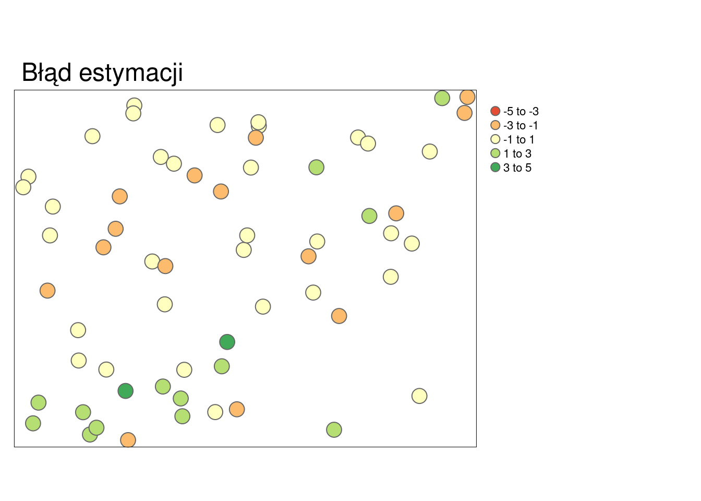
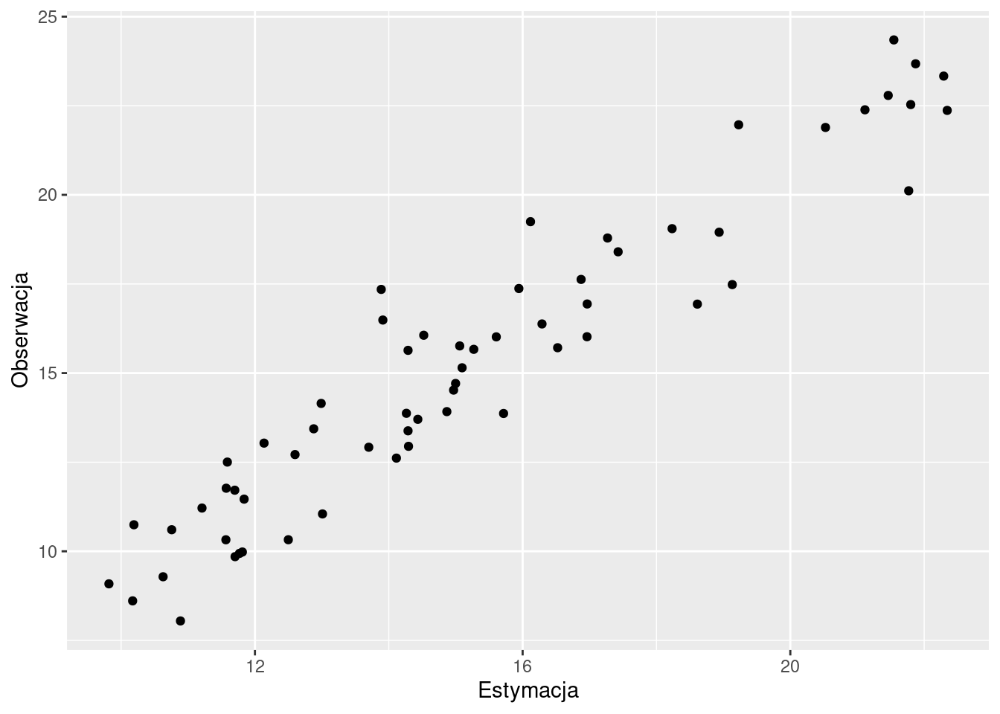
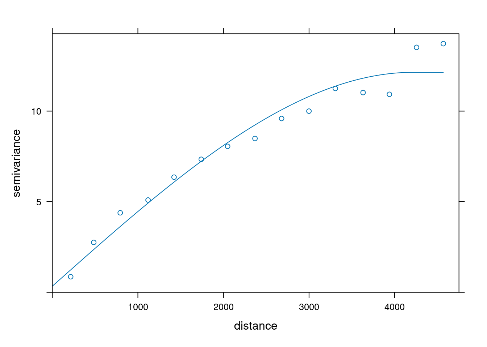
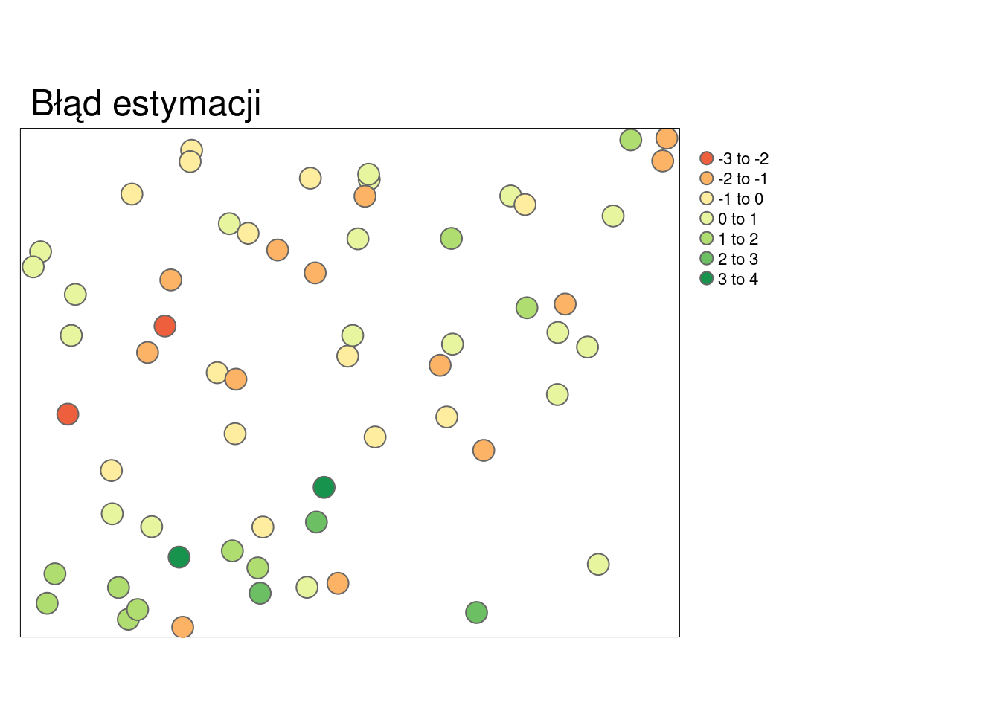
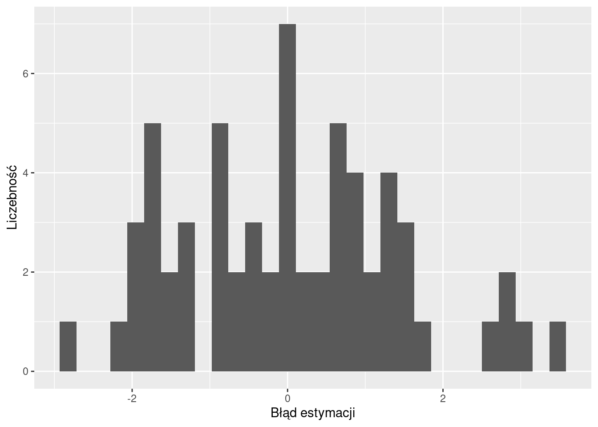
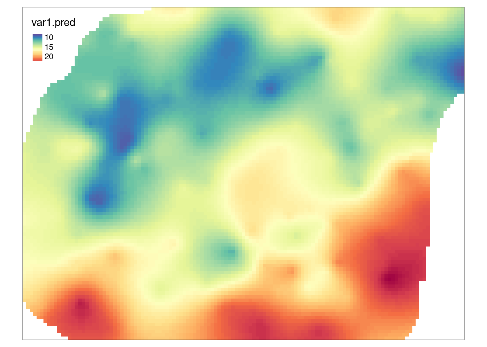
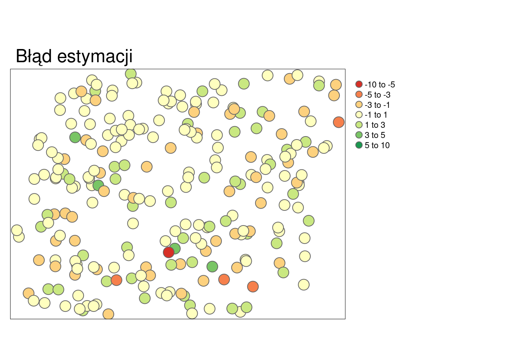
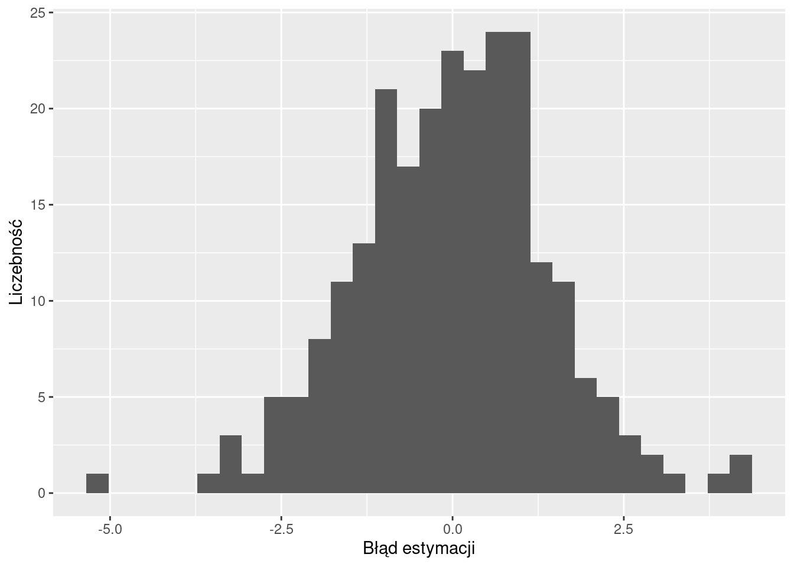
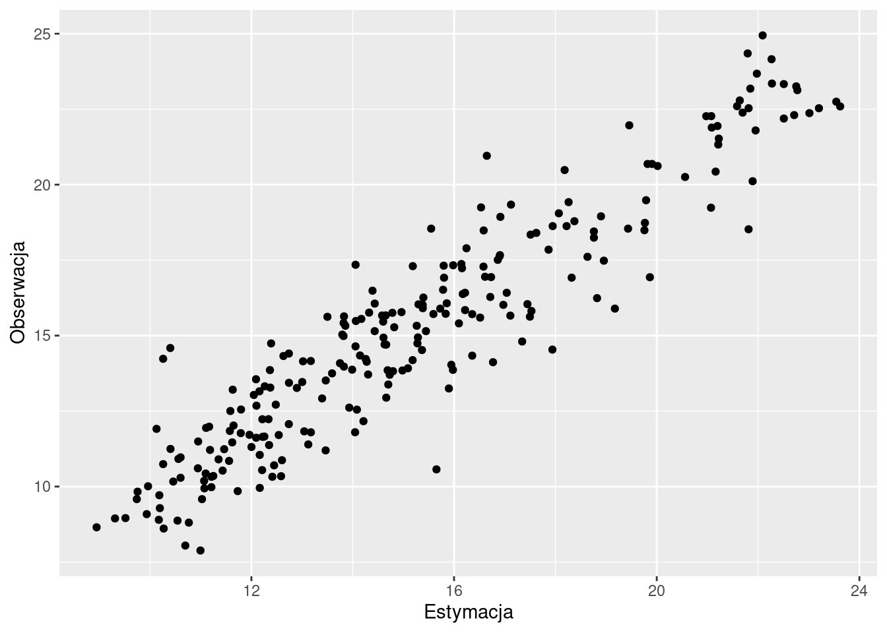
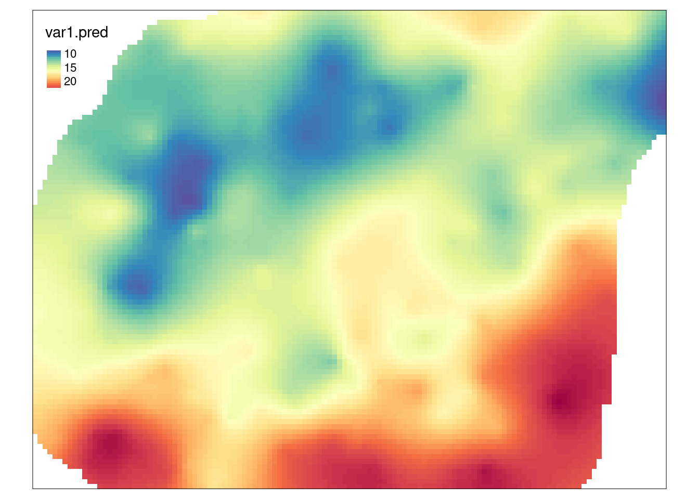

# Ocena jakości estymacji {#ocena-jakosci-estymacji}

Odtworzenie obliczeń z tego rozdziału wymaga załączenia poniższych pakietów oraz wczytania poniższych danych:


``` r
library(sf)
library(stars)
library(gstat)
library(tmap)
library(rsample)
library(ggplot2)
library(geostatbook)
data(punkty)
data(siatka)
```


## Wizualizacja jakości estymacji

### Mapa

Do oceny przestrzennej jakości estymacji można zastosować mapę przestawiającą błędy estymacji (rycina \@ref(fig:mapa)).
Wyliczenie błędów estymacji odbywa się poprzez odjęcie od obserwacji wartości estymowanej.


``` r
blad_estymacji = obserwowane - estymacja
```

<div class="figure" style="text-align: center">

<p class="caption">(\#fig:mapa)Mapa przedstawiająca rozkład przestrzenny błędów estymacji.</p>
</div>

### Histogram

Błąd estymacji można również przedstawić na wykresach, między innymi, na histogramie (rycina \@ref(fig:hist)).

<div class="figure" style="text-align: center">

<p class="caption">(\#fig:hist)Rozkład wartości błędów estymacji.</p>
</div>

### Wykres rozrzutu

Do porównania pomiędzy wartością estymowaną a obserwowaną może również posłużyć wykres rozrzutu (rycina \@ref(fig:point)).

<div class="figure" style="text-align: center">

<p class="caption">(\#fig:point)Wykres rozrzutu porównujący rzeczywiste (obserwowane) wartości i wartości estymowane.</p>
</div>

## Statystyki jakości estymacji

### Podstawowe statystyki

W momencie, gdy trzeba określić jakość estymacji lub porównać wyniki pomiędzy estymacjami należy zastosować tzw. statystyki jakości estymacji. 
Do podstawowych statystyk ocen jakości estymacji należą:

- Średni błąd estymacji (MPE, ang. *mean prediction error*).
- Pierwiastek błędu średniokwadratowego (RMSE, ang. *root mean square error*).
- Współczynnik determinacji (R^2^, ang. *coefficient of determination*).
    
Idealna estymacja dawałaby brak błędu oraz współczynnik determinacji pomiędzy pomiarami (całą populacją) i szacunkiem równy 1. 
Należy jednak zdawać sobie sprawę, że dane wejściowe są obarczone błędem/niepewnością, dlatego też w praktyce idealna estymacja nie jest osiągana.
Wysokie, pojedyncze wartości błędu mogą świadczyć, np. o wystąpieniu wartości odstających.

### Średni błąd estymacji

Średni błąd estymacji (MPE) można wyliczyć korzystając z poniższego wzoru:

$$ MPE=\frac{\sum_{i=1}^{n}(v_i - \hat{v}_i)}{n} $$  
, gdzie $v_i$ to wartość obserwowana a $\hat{v}_i$ to wartość estymowana.

Średni błąd estymacji można też wyliczyć używając funkcji `mean()` w R.


``` r
MPE = mean(obserwowane - estymacja)
```

Optymalnie wartość średniego błędu estymacji powinna być jak najbliżej 0.

### Pierwiastek błędu średniokwadratowego

Pierwiastek błędu średniokwadratowego (RMSE) jest możliwy do wyliczenia poprzez wzór:

$$ RMSE=\sqrt{\frac{\sum_{i=1}^{n}(v_i-\hat{v}_i)^2}{n}} $$     
, gdzie $v_i$ to wartość obserwowana a $\hat{v}_i$ to wartość estymowana.

RMSE można też wyliczyć w R.


``` r
RMSE = sqrt(mean((obserwowane - estymacja) ^ 2))
```

Optymalnie wartość pierwiastka błędu średniokwadratowego powinna być jak najmniejsza.

### Współczynnik determinacji

Współczynnik determinacji (R^2^) jest możliwy do wyliczenia poprzez wzór:

$$ R^2 = 1 - \frac{\sum_{i=1}^{n} (\hat v_i - v_i)^2}{\sum_{i=1}^{n} (v_i - \overline{v_i})^2} $$

, gdzie $v_i$ to wartość obserwowana, $\hat{v}_i$ to wartość estymowana, a $\overline{v}$ średnia arytmetyczna wartości obserwowanych.

R^2^ można też wyliczyć w R.


``` r
R2 = 1 - sum((estymacja - obserwowane) ^ 2) /
    sum((obserwowane - mean(obserwowane)) ^ 2)
```

lub


``` r
R2 = cor(obserwowane, estymacja) ^ 2
```

Współczynnik determinacji przyjmuje wartości od 0 do 1, gdzie model jest lepszy im wartość tego współczynnika jest bliższa jedności.

## Jakość wyników estymacji

### Walidacja wyników estymacji

Dokładne dopasowanie modelu do danych może w efekcie nie dawać najlepszych wyników. 
Szczególnie będzie to widoczne w przypadku modelowania, w którym dane obarczone są znacznym szumem (zawierają wyraźny błąd) lub też posiadają kilka wartości odstających. 
W efekcie ważne jest stosowanie metod pozwalających na wybranie optymalnego modelu. 
Do takich metod należy, między innymi, walidacja podzbiorem (ang. *jackknifing*) oraz kroswalidacja (ang. *crossvalidation*).

### Walidacja podzbiorem 

Walidacja podzbiorem polega na podziale zbioru danych na dwa podzbiory - treningowy i testowy.
Zbiór treningowy służy do stworzenia semiwariogramu empirycznego, zbudowania modelu oraz estymacji wartości.
Następnie wynik estymacji porównywany jest z rzeczywistymi wartościami ze zbioru testowego.
Zaletą tego podejścia jest stosowanie danych niezależnych od estymacji do oceny jakości modelu. 
Wadą natomiast jest konieczność posiadania (relatywnie) dużego zbioru danych.

Na poniższym przykładzie zbiór danych dzielony jest używając funkcji `initial_split()` z pakietu **rsample**.
Użycie tej funkcji powoduje obiektu zawierającego wydzielony podzbiór treningowy i testowy.
Ważną zaletą funkcji `initial_split()` jest to, iż  w zbiorze treningowym i testowym zachowane są podobne rozkłady wartości. 
W przykładzie użyto argumentu `prop = 0.75`, który oznacza, że 75% danych będzie należało do zbioru treningowego, a 25% do zbioru testowego.
Następnie, korzystając ze stworzonego obiektu, budowane są dwa zbiory danych - treningowy (`train`) oraz testowy (`test`).


``` r
set.seed(224)
punkty_podzial = initial_split(punkty, prop = 0.75, strata = temp)
train = training(punkty_podzial)
test = testing(punkty_podzial)
```

Dalszym krokiem jest stworzenie semiwariogramu empirycznego oraz jego modelowanie w oparciu o zbiór treningowy (rycina \@ref(fig:12-ocena-9)).


``` r
vario = variogram(temp ~ 1, locations = train)
model = vgm(model = "Sph", nugget = 0.5)
fitted = fit.variogram(vario, model)
plot(vario, model = fitted)
```

<div class="figure" style="text-align: center">

<p class="caption">(\#fig:12-ocena-9)Model semiwariogramu w oparciu o zbiór testowy.</p>
</div>

Do porównania wyników estymacji w stosunku do zbioru testowego posłuży funkcja `krige()`. 
Wcześniej wymagała ona podania wzoru, zbioru punktowego, siatki oraz modelu.
W tym przypadku jednak chcemy porównać wynik estymacji i testowy zbiór punktowy. 
Dlatego też, zamiast obiektu siatki definiujemy obiekt zawierający zbiór testowy (`test`).


``` r
test_sk = krige(temp ~ 1, 
                 locations = train,
                 newdata = test,
                 model = fitted,
                 beta = 15)
```

```
## [using simple kriging]
```

``` r
summary(test_sk)
```

```
##    var1.pred         var1.var               geometry 
##  Min.   : 9.818   Min.   :0.8199   POINT        :62  
##  1st Qu.:12.226   1st Qu.:1.5630   epsg:2180    : 0  
##  Median :14.695   Median :2.1911   +proj=tmer...: 0  
##  Mean   :15.255   Mean   :2.2243                     
##  3rd Qu.:17.193   3rd Qu.:2.6707                     
##  Max.   :22.345   Max.   :5.3092
```

Uzyskane w ten sposób wyniki możemy określić używając statystyk jakości estymacji lub też wykresów (ryciny \@ref(fig:12-ocena-12), \@ref(fig:12-ocena-13), \@ref(fig:12-ocena-14)).


``` r
blad_estymacji_sk = test$temp - test_sk$var1.pred
summary(blad_estymacji_sk)
```

```
##     Min.  1st Qu.   Median     Mean  3rd Qu.     Max. 
## -2.84080 -0.94748  0.02028  0.04646  0.96024  3.46009
```

``` r
MPE = mean(test$temp - test_sk$var1.pred)
MPE
```

```
## [1] 0.04645957
```

``` r
RMSE = sqrt(mean((test$temp - test_sk$var1.pred) ^ 2))
RMSE
```

```
## [1] 1.408219
```

``` r
R2 = cor(test$temp, test_sk$var1.pred) ^ 2
R2
```

```
## [1] 0.9038962
```


``` r
test_sk$blad_estymacji_sk = blad_estymacji_sk
tm_shape(test_sk) +
        tm_symbols(col = "blad_estymacji_sk", title.col = "") +
        tm_layout(main.title = "Błąd estymacji", legend.outside = TRUE)
```

<div class="figure" style="text-align: center">

<p class="caption">(\#fig:12-ocena-12)Mapa przedstawiająca rozkład przestrzenny błędów estymacji uzyskanych używając krigingu prostego.</p>
</div>


``` r
ggplot(test_sk, aes(blad_estymacji_sk)) +
    geom_histogram() + 
    xlab("Błąd estymacji") + 
    ylab("Liczebność")
```

<div class="figure" style="text-align: center">

<p class="caption">(\#fig:12-ocena-13)Rozkład wartości błędów estymacji uzyskanych używając krigingu prostego.</p>
</div>


``` r
test_sk$true = test$temp
ggplot(test_sk, aes(var1.pred, true)) +
    geom_point() +
    xlab("Estymacja") +
    ylab("Obserwacja")
```

<div class="figure" style="text-align: center">

<p class="caption">(\#fig:12-ocena-14)Wykres rozrzutu porównujący rzeczywiste (obserwowane) wartości i wartości estymowane uzyskane używając krigingu prostego.</p>
</div>

W sytuacji, gdy uzyskany model jest wystarczająco dobry, możemy również uzyskać estymację dla całego obszaru z użyciem funkcji `krige()`, tym razem jednak podając obiekt siatki (rycina \@ref(fig:12-ocena-15)).


``` r
test_sk = krige(temp ~ 1,
                locations = train,
                newdata = siatka,
                model = fitted,
                beta = 15)
```

```
## [using simple kriging]
```

``` r
tm_shape(test_sk) +
        tm_raster("var1.pred", style = "cont", palette = "-Spectral")
```

<div class="figure" style="text-align: center">

<p class="caption">(\#fig:12-ocena-15)Estymacja uzyskana dla całego obszaru.</p>
</div>

### Kroswalidacja

W przypadku kroswalidacji te same dane wykorzystywane są do budowy modelu, estymacji, a następnie do oceny prognozy.
Procedura kroswalidacji LOO (ang. *leave-one-out cross-validation*) składa się z poniższych kroków:

1. Zbudowanie matematycznego modelu z dostępnych obserwacji.
2. Dla każdej znanej obserwacji następuje:
    - Usunięcie jej ze zbioru danych.
    - Użycie modelu do wykonania estymacji w miejscu tej obserwacji.
    - Wyliczenie reszty (ang. *residual*), czyli różnicy pomiędzy znaną wartością a estymacją.
3. Podsumowanie otrzymanych wyników.
    
W pakiecie **gstat**, kroswalidacja LOO jest dostępna w funkcjach `krige.cv()` oraz `gstat.cv()`. 
Działają one bardzo podobnie jak funkcje `krige()` oraz `gstat()`, jednak w przeciwieństwie do nich nie wymagają podania obiektu siatki.


``` r
vario = variogram(temp ~ 1, data = punkty)
model = vgm(model = "Sph", nugget = 0.5)
fitted = fit.variogram(vario, model)
cv_sk = krige.cv(temp ~ 1,
                 locations = punkty,
                 model = fitted,
                 beta = 15)
summary(cv_sk)
```


```
##    var1.pred         var1.var        observed         residual       
##  Min.   : 8.945   Min.   :1.154   Min.   : 7.883   Min.   :-5.08278  
##  1st Qu.:12.258   1st Qu.:1.808   1st Qu.:11.953   1st Qu.:-0.90162  
##  Median :14.695   Median :2.177   Median :14.937   Median : 0.05113  
##  Mean   :15.235   Mean   :2.245   Mean   :15.223   Mean   :-0.01262  
##  3rd Qu.:17.422   3rd Qu.:2.564   3rd Qu.:17.584   3rd Qu.: 0.85763  
##  Max.   :23.620   Max.   :5.319   Max.   :24.945   Max.   : 4.30996  
##      zscore               fold                 geometry  
##  Min.   :-3.555383   Min.   :  1.00   POINT        :242  
##  1st Qu.:-0.627964   1st Qu.: 61.25   epsg:2180    :  0  
##  Median : 0.030835   Median :121.50   +proj=tmer...:  0  
##  Mean   : 0.000425   Mean   :121.50                      
##  3rd Qu.: 0.636819   3rd Qu.:181.75                      
##  Max.   : 3.140278   Max.   :242.00
```

Uzyskane w ten sposób wyniki możemy określić używając statystyk jakości estymacji lub też wykresów (ryciny \@ref(fig:12-ocena-17), \@ref(fig:12-ocena-18), \@ref(fig:12-ocena-19)).


``` r
summary(cv_sk$residual)
```

```
##     Min.  1st Qu.   Median     Mean  3rd Qu.     Max. 
## -5.08278 -0.90162  0.05113 -0.01262  0.85763  4.30996
```

``` r
MPE = mean(cv_sk$residual)
MPE
```

```
## [1] -0.0126244
```

``` r
RMSE = sqrt(mean((cv_sk$residual) ^ 2))
RMSE
```

```
## [1] 1.40683
```

``` r
R2 = cor(cv_sk$observed, cv_sk$var1.pred) ^ 2
R2
```

```
## [1] 0.8732558
```


``` r
tm_shape(cv_sk) +
        tm_symbols(col = "residual", title.col = "",
                   breaks = c(-10, -5, -3, -1, 1, 3, 5, 10)) +
        tm_layout(main.title = "Błąd estymacji", legend.outside = TRUE)
```

<div class="figure" style="text-align: center">

<p class="caption">(\#fig:12-ocena-17)Mapa przedstawiająca rozkład przestrzenny błędów estymacji uzyskanych używając krigingu prostego i kroswalidacji.</p>
</div>


``` r
ggplot(cv_sk, aes(residual)) +
    geom_histogram() +
    xlab("Błąd estymacji") +
    ylab("Liczebność")
```

<div class="figure" style="text-align: center">

<p class="caption">(\#fig:12-ocena-18)Rozkład wartości błędów estymacji uzyskanych używając krigingu prostego i kroswalidacji.</p>
</div>


``` r
ggplot(cv_sk, aes(var1.pred, observed)) +
    geom_point() +
    xlab("Estymacja") +
    ylab("Obserwacja")
```

<div class="figure" style="text-align: center">

<p class="caption">(\#fig:12-ocena-19)Wykres rozrzutu porównujący rzeczywiste (obserwowane) wartości i wartości estymowane uzyskane używając krigingu prostego i kroswalidacji.</p>
</div>

Podobnie jak w walidacji podzbiorem, gdy uzyskany model jest wystarczająco dobry, estymację dla całego obszaru uzyskuje się z użyciem funkcji `krige()` (rycina \@ref(fig:12-ocena-20)).


``` r
cv_skk = krige(temp ~ 1, 
                locations = punkty,
                newdata = siatka, 
                model = fitted, 
                beta = 15)
```

```
## [using simple kriging]
```

``` r
tm_shape(cv_skk) +
        tm_raster("var1.pred", style = "cont", palette = "-Spectral")
```

<div class="figure" style="text-align: center">

<p class="caption">(\#fig:12-ocena-20)Estymacja uzyskana dla całego obszaru po oceneniu modelu używając kroswalidacji.</p>
</div>

<!-- 


``` r
# ok_loocv = krige.cv(temp ~ 1, punkty, model=model_zl2)
# summary(ok_loocv)
```

- Tutaj inne przykłady
- Wykresy z loocv
- wykresy porównujące


``` r
# ok_fit = gstat(formula=temp ~ 1, data=punkty, model=model_zl2)
# ok_loocv = gstat.cv(OK_fit, debug.level=0, random=FALSE)
# spplot(pe[6])
```

## 
- prezentacja 5 Ani
- spatinter folder
- AIC

## Walidacja wyników estymacji

### Walidacja wyników estymacji |  Kriging zwykły - LOO crossvalidation
krige.cv


``` r
# OK_fit = gstat(id="OK_fit", formula=temp ~ 1, data=punkty, model=fitted)
# pe = gstat.cv(OK_fit, debug.level=0, random=FALSE)
# spplot(pe[6])
#
# z = predict(OK_fit, newdata = grid, debug.level = 0)
# grid2 = grid
# grid2$OK_pred = z$OK_fit.pred
# grid2$OK_se = sqrt(z$OK_fit.var)
# library('rasterVis')
# spplot(grid2, 'OK_pred')
# spplot(grid2, 'OK_se')
```

### Walidacja wyników estymacji |  K  Kriging uniwersalny - LOO crossvalidation


``` r
# KU_fit = gstat(id="KU_fit", formula=temp~odl_od_morza, data=punkty, model=fitted_ku)
# pe = gstat.cv(KU_fit, debug.level=0, random=FALSE)
# spplot(pe[6])

# dodanie odległości od morza do siatki !!
# z_KU = predict(KU_fit, newdata = grid, debug.level = 0)
# grid$KU_pred = z$KU_fit.pred
# grid$KU_se = sqrt(z$KU_fit.var)
# library('rasterVis')
# spplot(grid, 'KU_pred')
# spplot(grid, 'KU_se')
```
-->

## Zadania {#z12}

1. Wydziel obiekt `punkty` w taki sposób aby 70% danych należało zbioru treningowego, a 30 % danych do zbioru testowego.
Zwizualizuj oba nowe zbiory danych.
2. Stwórz optymalne modele zmiennej `temp` ze zbioru treningowego używając krigingu zwykłego, kokrigingu oraz krigingu uniwersalnego.
3. Wykonaj estymacje korzystając z powyższych modeli.
Porównaj uzyskane estymacje korzystając ze statystyk jakości estymacji oraz wizualizacji jakości estymacji i używając zbioru testowego. 
Który ze stworzonych modeli można uznać za najlepszy?
Dlaczego?
4. Porównaj uzyskane modele używając kroswalidacji. 
Jak wygląda rozkład reszt z uzyskanych estymacji?
Który model można uznać za najlepszy oglądając rozkłady reszt?
5. Stwórz optymalne modele zmiennej `temp` ze zbioru treningowego używając krigingu zwykłego, kokrigingu oraz krigingu uniwersalnego, ale tym razem wcześniej transformując wartości tej zmiennej używając metod opisanych w sekcji \@ref(trans-danych). 
Wykonaj estymacje korzystając z powyższych modeli.
Porównaj uzyskane estymacje korzystając ze statystyk jakości estymacji oraz wizualizacji jakości estymacji i używając zbioru testowego. 
Który ze stworzonych modeli można uznać za najlepszy?
Dlaczego?
Czy któryś z uzyskanych modeli dla zmiennej po transformacji jest lepszy niż dla zmiennej przed transformacją?

<!-- jedno zadanie używające wcześniej używanych technik estymacji -->

