# Symulacje {#symulacje}

Odtworzenie obliczeń z tego rozdziału wymaga załączenia poniższych pakietów oraz wczytania poniższych danych:


``` r
library(sf)
library(stars)
library(gstat)
library(tmap)
library(ggplot2)
library(geostatbook)
data(punkty)
data(siatka)
```


<!-- demo(cosimulation) -->
<!-- krigeSimCE -->
<!-- krigeSTSimTB -->

<!--
## Symulacje przestrzenne 1:
 sekwencyjna symulacja i ko symulacja gaussowska,
  sekwencyjna symulacja danych kodowanych, 
  przetwarzanie (postprocesing) wyników symulacji
-->  

## Symulacje geostatystyczne

Kriging daje optymalne estymacje, czyli wyznacza najbardziej potencjalnie możliwą wartość dla wybranej lokalizacji. 
Dodatkowo, efektem krigingu jest wygładzony obraz. 
W konsekwencji wyniki estymacji różnią się od danych pomiarowych. 
Uzyskiwana jest tylko (aż?) estymacja, a prawdziwa wartość jest niepewna...
Korzystając z symulacji geostatystycznych nie tworzymy estymacji, ale generujemy równie prawdopodobne możliwości poprzez symulację z rozkładu prawdopodobieństwa (wykorzystując generator liczb losowych).

### Właściwości

Właściwości symulacji geostatystycznych: 

- Efekt symulacji ma bardziej realistyczny przestrzenny wzór (ang. *pattern*) niż kriging, którego efektem jest wygładzona reprezentacja rzeczywistości.
- Każda z symulowanych map jest równie prawdopodobna.
- Symulacje pozwalają na przedstawianie niepewności interpolacji.
- Jednocześnie - kriging jest znacznie lepszy, gdy naszym celem jest jak najdokładniejsza estymacja.

### Typy symulacji

Istnieją dwa podstawowe typy symulacji geostatystycznych:

- Symulacje bezwarunkowe (ang. *Unconditional Simulations*) - wykorzystujące semiwariogram, żeby włączyć informację przestrzenną, ale wartości ze zmierzonych punktów nie są w niej wykorzystywane.
- Symulacje warunkowe (ang. *Conditional Simulations*) - opiera się ona o średnią wartość, strukturę kowariancji oraz obserwowane wartości (w tym sekwencyjna symulacja danych kodowanych (ang. *Sequential indicator simulation*)).

## Symulacje bezwarunkowe

<!--http://santiago.begueria.es/2010/10/generating-spatially-correlated-random-fields-with-r/-->
Symulacje bezwarunkowe w pakiecie **gstat** tworzy się z wykorzystaniem funkcji `krige()`. 
Podobnie jak w przypadku estymacji geostatystycznych, należy tutaj podać wzór, model, siatkę, średnią globalną (`beta`), oraz liczbę sąsiednich punktów używanych do symulacji (w przykładzie poniżej `nmax = 30`). 
Należy wprowadzić również informacje, że nie korzystamy z danych punktowych (`locations = NULL`) oraz że chcemy stworzyć dane sztuczne (`dummy = TRUE`). 
Ostatni argument (`nsim = 4`) informuje o liczbie symulacji do przeprowadzenia (Ryciny \@ref(fig:symbezw1-fig), \@ref(fig:symbezw2-fig)).


``` r
sym_bezw1 = krige(formula = z ~ 1, 
                   model = vgm(psill = 0.025,
                               model = "Exp", 
                               range = 100), 
                   newdata = siatka, 
                   beta = 1,
                   nmax = 30,
                   locations = NULL, 
                   dummy = TRUE, 
                   nsim = 4)
```

```
## [using unconditional Gaussian simulation]
```


``` r
tm_shape(sym_bezw1) +
        tm_raster(title = "", style = "cont")
```

<div class="figure" style="text-align: center">
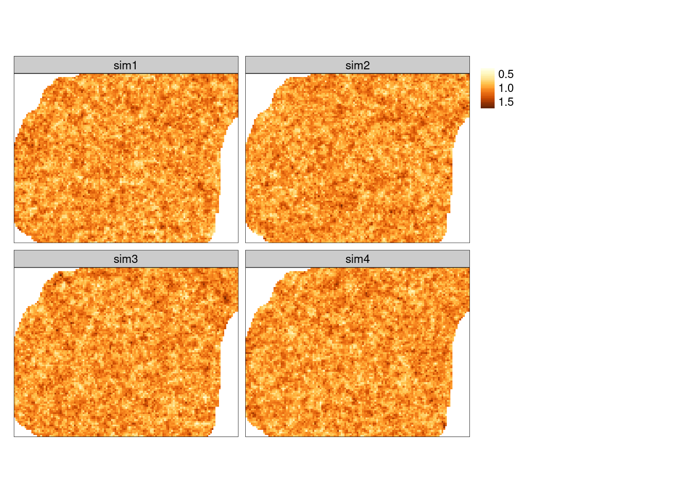
<p class="caption">(\#fig:symbezw1-fig)Przestrzennie skorelowana powierzchnia o średniej równej 1, wartości nsill równej 0.025, zasięgu równym 100, oraz modelu wykładniczego</p>
</div>


``` r
sym_bezw2 = krige(formula = z ~ 1, 
                   model = vgm(psill = 0.025,
                               model = "Exp", 
                               range = 1500), 
                   newdata = siatka, 
                   beta = 1,
                   nmax = 30, 
                   locations = NULL, 
                   dummy = TRUE, 
                   nsim = 4)
```

```
## [using unconditional Gaussian simulation]
```


``` r
tm_shape(sym_bezw2) +
        tm_raster(title = "", style = "cont")
```

<div class="figure" style="text-align: center">
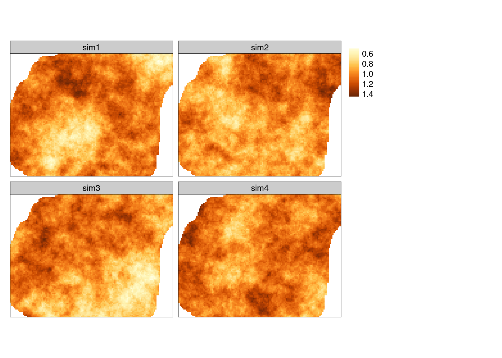
<p class="caption">(\#fig:symbezw2-fig)Przestrzennie skorelowana powierzchnia o średniej równej 1, wartości nsill równej 0.025, zasięgu równym 1500, oraz modelu wykładniczego</p>
</div>

<!--
sym_bezw_model3 = gstat(formula= ~ 1+X+Y, locations=~X+Y, dummy=T, beta=c(1,0,0.005), model=vgm(psill=0.025,model='Exp',range=1500), nmax=20)
sym_bezw3 = predict(sym_bezw_model3, newdata=siatka, nsim=4)
spplot(sym_bezw3, main="Przestrzennie skorelowana powierzchnia \nśrednia=1, sill=0.025, zasięg=1500, model wykładniczy \ntrend na osi y = 0.005")

sym_bezw_model4 = gstat(formula= ~ 1+X+Y, locations=~X+Y, dummy=T, beta=c(1,0.02,0.005), model=vgm(psill=0.025,model='Exp',range=1500), nmax=20)
sym_bezw4 = predict(sym_bezw_model4, newdata=siatka, nsim=4)
spplot(sym_bezw4, main="Przestrzennie skorelowana powierzchnia \nśrednia=1, sill=0.025, zasięg=500, model wykładniczy \ntrend na osi x = 0.02, trend na osi y = 0.005")
-->

## Symulacje warunkowe

### Sekwencyjna symulacja gaussowska

Jednym z podstawowych typów symulacji warunkowych jest sekwencyjna symulacja gaussowska (ang. *Sequential Gaussian simulation*). 
Polega ona na wybieraniu losowo lokalizacji nie posiadającej zmierzonej wartości badanej zmiennej:

1. Krigingu wartości w tej lokalizacji korzystając z dostępnych danych.
2. Wylosowaniu wartości z rozkładu normalnego o średniej i wariancji wynikającej z krigingu.
3. Dodaniu symulowanej wartości do zbioru danych i przejściu do kolejnej lokalizacji.
4. Powtórzeniu poprzednich kroków, aż do momentu gdy nie pozostanie już żadna nieokreślona lokalizacja.

Sekwencyjna symulacja gaussowska wymaga zmiennej posiadającej wartości o rozkładzie zbliżonym do normalnego. 
Można to sprawdzić poprzez wizualizacje danych (histogram, wykres kwantyl-kwantyl) lub też test statystyczny (test Shapiro-Wilka) (ryciny \@ref(fig:13-symulacje-3) i \@ref(fig:13-symulacje-3a)).
Zmienna `temp` nie ma rozkładu zbliżonego do normalnego.


``` r
ggplot(punkty, aes(temp)) + geom_histogram()
```

<div class="figure" style="text-align: center">
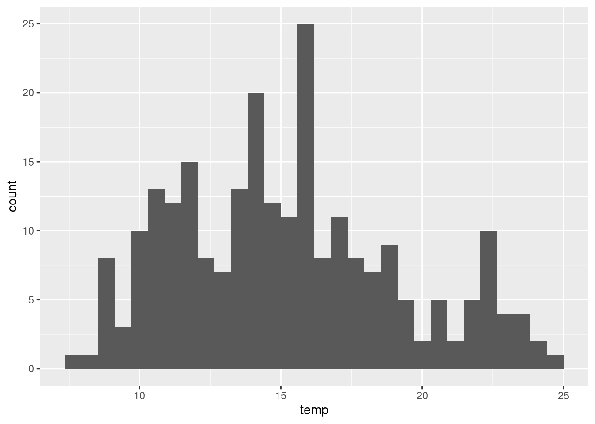
<p class="caption">(\#fig:13-symulacje-3)Rozkład wartości zmiennej temp.</p>
</div>


``` r
ggplot(punkty, aes(sample = temp)) + stat_qq()
shapiro.test(punkty$temp)
```

```
## 
## 	Shapiro-Wilk normality test
## 
## data:  punkty$temp
## W = 0.96904, p-value = 0.00004054
```

<div class="figure" style="text-align: center">
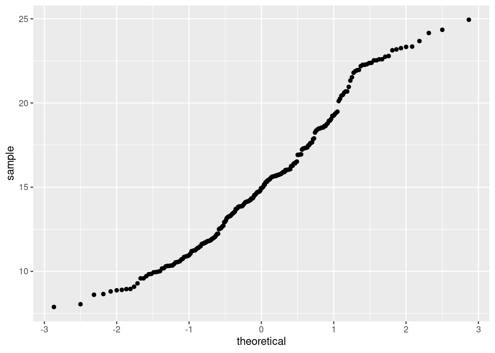
<p class="caption">(\#fig:13-symulacje-3a)Wykres kwantyl-kwantyl wartości zmiennej temp.</p>
</div>

Na potrzeby symulacji zmienna `temp` została zlogarytmizowna (ryciny \@ref(fig:13-symulacje-4) i \@ref(fig:13-symulacje-4a)).


``` r
punkty$temp_log = log(punkty$temp)
ggplot(punkty, aes(temp_log)) + geom_histogram()
```

<div class="figure" style="text-align: center">
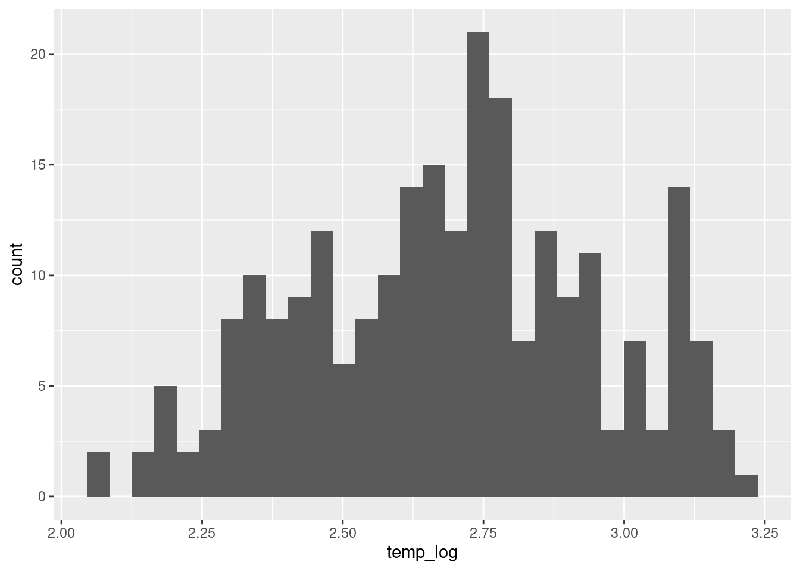
<p class="caption">(\#fig:13-symulacje-4)Rozkład wartości zmiennej temp po logaritmizacji.</p>
</div>


``` r
ggplot(punkty, aes(sample = temp_log)) + stat_qq()
shapiro.test(punkty$temp_log)
```

```
## 
## 	Shapiro-Wilk normality test
## 
## data:  punkty$temp_log
## W = 0.98435, p-value = 0.009226
```

<div class="figure" style="text-align: center">
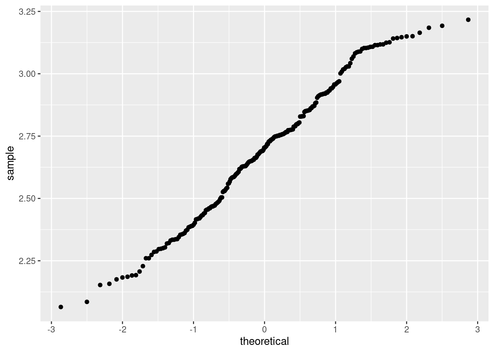
<p class="caption">(\#fig:13-symulacje-4a)Wykres kwantyl-kwantyl wartości zmiennej temp po logaritmizacji.</p>
</div>

Dalsze etapy przypominają przeprowadzenie estymacji statystycznej, jedynym wyjątkiem jest dodanie argumentu mówiącego o liczbie symulacji do przeprowadzenia (`nsim` w funkcji `krige()`) (ryciny \@ref(fig:13-symulacje-5) i \@ref(fig:13-symulacje-6)).


``` r
vario = variogram(temp_log ~ 1, locations = punkty)
model = vgm(model = "Sph", nugget = 0.005)
fitted = fit.variogram(vario, model)
plot(vario, model = fitted)
```

<div class="figure" style="text-align: center">
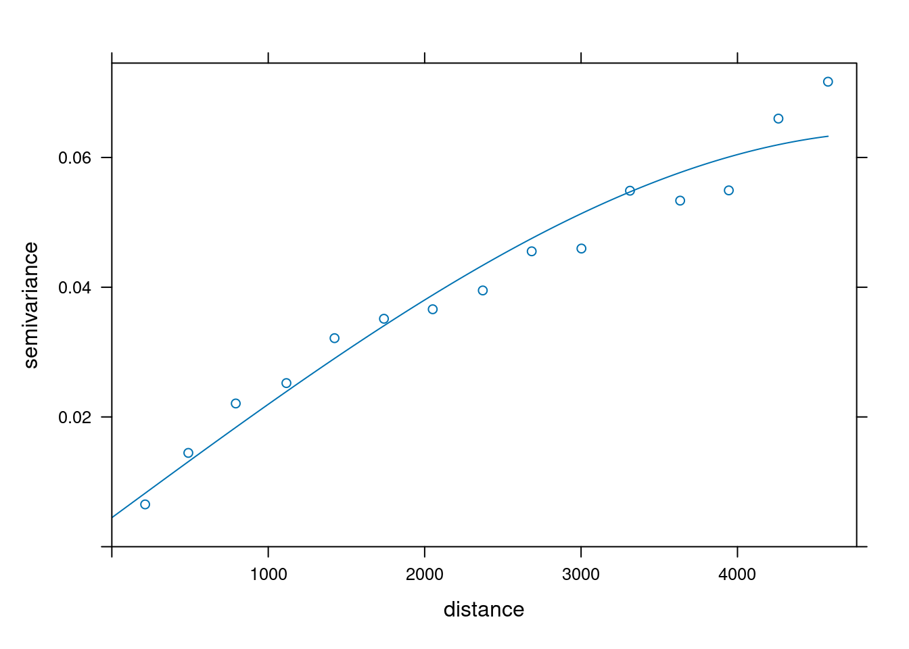
<p class="caption">(\#fig:13-symulacje-5)Model semiwariogramu zmiennej temp po logaritmizacji</p>
</div>


``` r
sym_ok = krige(temp_log ~ 1, 
               locations = punkty,
               newdata = siatka, 
               model = fitted,
               nmax = 30, 
               nsim = 4)
```

```
## drawing 4 GLS realisations of beta...
## [using conditional Gaussian simulation]
```


``` r
tm_shape(sym_ok) +
        tm_raster(title = "", style = "cont")
```

<div class="figure" style="text-align: center">
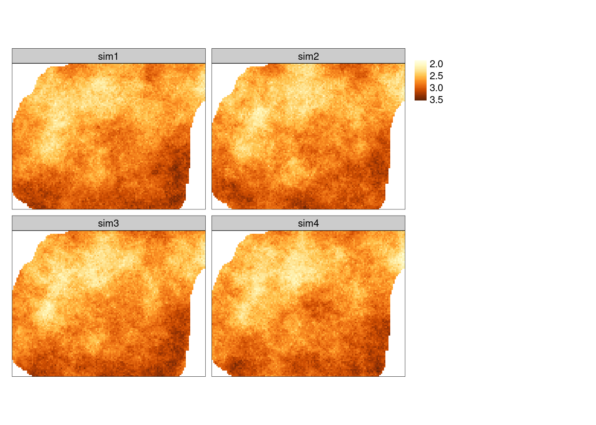
<p class="caption">(\#fig:13-symulacje-6)Symulacja warunkowa zmiennej temp po logaritmizacji.</p>
</div>

Wyniki symulacji można przetworzyć do pierwotnej jednostki z użyciem funkcji `rev_trans()`, którą stworzyliśmy w sekcji \@ref(transformacja-odwrotna).
Potrzebuje ona jednak najpierw określenia wariancji symulacji (rycina \@ref(fig:13-symulacje-7a)).
Do jej wyliczenia używamy kombinacji funkcji `st_apply()` oraz `var()`. 
W funkcji `st_apply()` konieczne tutaj jest określenie argumentu `MARGIN = c("x", "y")`, co oznacza że funkcja `var` będzie wykonana dla każdej komórki niezależnie.
W efekcie tej operacji otrzymujemy tylko jedną warstwę.


``` r
sym_ok_var = st_apply(sym_ok, MARGIN = c("x", "y"), FUN = var)
tm_shape(sym_ok_var) +
        tm_raster(style = "cont", palette = "Purples")
```

<div class="figure" style="text-align: center">
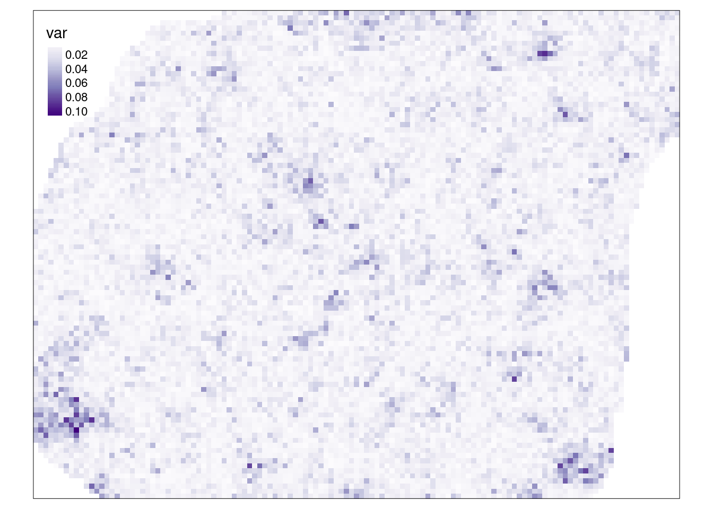
<p class="caption">(\#fig:13-symulacje-7a)Wariancja symulacji warunkowej.</p>
</div>

Teraz możliwe jest przywrócenie oryginalnej jednostki dla wszystkich symulacji z użyciem funkcji `st_apply()` i `rev_trans()`.
(rycina \@ref(fig:13-symulacje-7))


``` r
sym_ok_rescaled = st_apply(sym_ok, 3, rev_trans, 
                           var = sym_ok_var$var, obs = punkty$temp)
tm_shape(sym_ok_rescaled) +
        tm_raster(title = "", style = "cont")
```

<div class="figure" style="text-align: center">
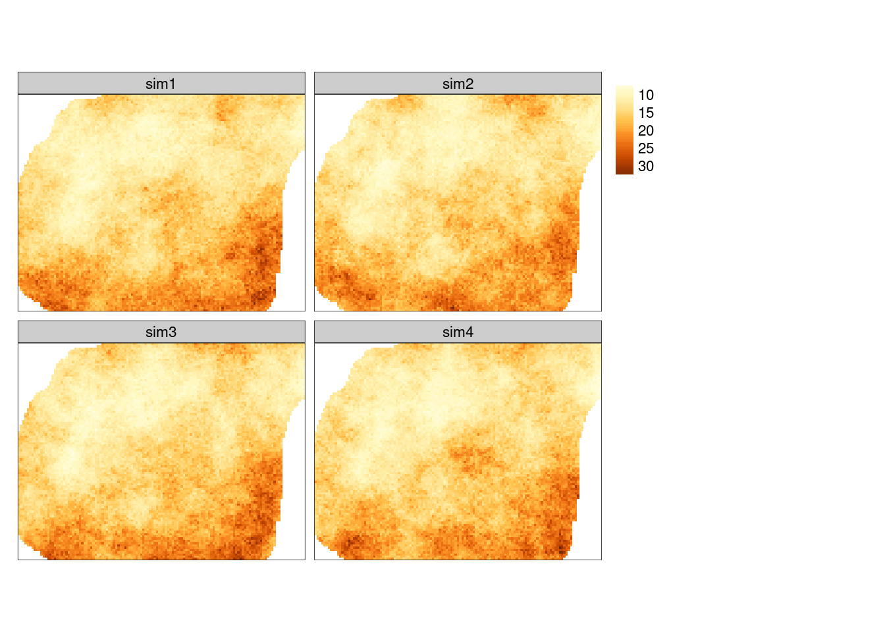
<p class="caption">(\#fig:13-symulacje-7)Symulacja warunkowa po przeskalowaniu do oryginalnych wartości.</p>
</div>

Symulacje geostatystyczne pozwalają również na przedstawianie niepewności interpolacji. 
W tym wypadku należy wykonać znacznie więcej powtórzeń (np. `nsim = 100`).


``` r
sym_sk = krige(temp_log ~ 1, 
               location = punkty, 
               newdata = siatka, 
               model = fitted, 
               nsim = 100, 
               nmax = 30)
```

```
## drawing 100 GLS realisations of beta...
## [using conditional Gaussian simulation]
```

Uzyskane wyniki należy przeliczyć do oryginalnej jednostki, a następnie wyliczyć odchylenie standardowe ich wartości.
Można to zrobić korzystając trzykrotnie z funkcji `st_apply()`.
Przywrócenie oryginalnej jednostki odbywa się poprzez wyliczenie wariancji symulacji, a następnie użycie funkcji `rev_trans()`.


``` r
# wyliczenie wariancji (jedostka log)
sym_sk_var = st_apply(sym_sk, MARGIN = c("x", "y"), FUN = var)
# przywrócenie oryginalnej jednostki
sym_sk_rescaled = st_apply(sym_sk, 3, rev_trans,
                           var = sym_sk_var$var, obs = punkty$temp)
sym_sk_rescaled
```

```
## stars object with 3 dimensions and 1 attribute
## attribute(s), summary of first 100000 cells:
##           Min.  1st Qu.   Median     Mean  3rd Qu.     Max.  NA's
## var1  6.434447 12.14176 14.56187 15.17236 17.65367 33.26342 10550
## dimension(s):
##        from  to offset delta               refsys          values x/y
## x         1 127 745542    90 ETRS89 / Poland CS92            NULL [x]
## y         1  96 721256   -90 ETRS89 / Poland CS92            NULL [y]
## sample    1 100     NA    NA                   NA sim1,...,sim100
```

Wyliczenie odchylenia standardowego odbywa się poprzez argumenty `MARGIN = c("x", "y")` oraz `FUN = sd`.
W ten sposób funkcja `sd()` będzie wykonana niezależnie dla każdej komórki dla wszystkich warstw.
W efekcie tej operacji otrzymuje się tylko jedną warstwę.


``` r
# wyliczenie odchylenia standardowego
sym_sk_sd = st_apply(sym_sk_rescaled, MARGIN = c("x", "y"), FUN = sd)
sym_sk_sd
```

```
## stars object with 2 dimensions and 1 attribute
## attribute(s):
##          Min.  1st Qu.   Median     Mean  3rd Qu.     Max. NA's
## sd  0.6649792 1.300912 1.592292 1.670204 1.945753 4.453824 1270
## dimension(s):
##   from  to offset delta               refsys x/y
## x    1 127 745542    90 ETRS89 / Poland CS92 [x]
## y    1  96 721256   -90 ETRS89 / Poland CS92 [y]
```

Finalnie otrzymujemy mapę odchylenia standardowego symulowanych wartości  (rycina \@ref(fig:13-symulacje-8)).
Można na niej odczytać obszary o najpewniejszych (najmniej zmiennych) wartościach (jasny kolor) oraz obszary o największej zmienności cechy (kolor niebieski).


``` r
tm_shape(sym_sk_sd) +
        tm_raster(title = "", style = "cont", palette = "YlGnBu")
```

<div class="figure" style="text-align: center">
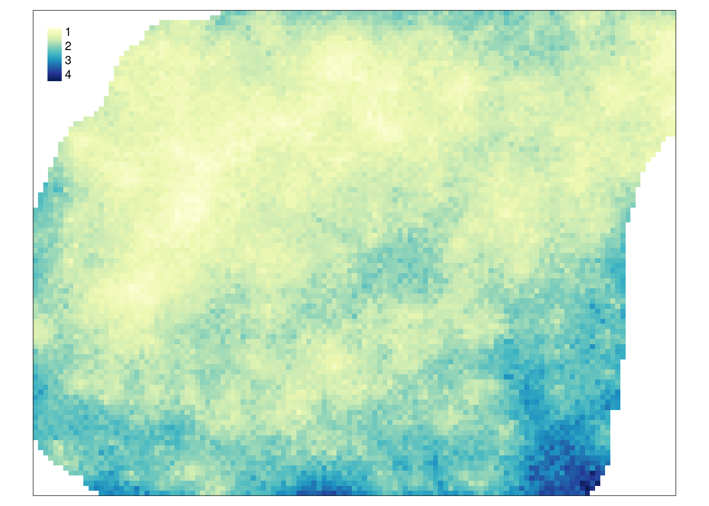
<p class="caption">(\#fig:13-symulacje-8)Mapa odchylenia standardowego symulowanych wartości.</p>
</div>

### Sekwencyjna symulacja danych kodowanych

Symulacje geostatystyczne można również zastosować do danych binarnych.
Dla potrzeb przykładu tworzona jest nowa zmienna `temp_ind` przyjmująca wartość `TRUE` dla pomiarów o wartościach temperatury niższych niż 12 stopni Celsjusza oraz `FALSE` dla pomiarów o wartościach temperatury równych lub wyższych niż 12 stopni Celsjusza.


``` r
summary(punkty$temp)
```

```
##    Min. 1st Qu.  Median    Mean 3rd Qu.    Max. 
##   7.883  11.953  14.937  15.223  17.584  24.945
```

``` r
punkty$temp_ind = punkty$temp < 12
summary(punkty$temp_ind)
```

```
##    Mode   FALSE    TRUE 
## logical     180      62
```

W tej metodzie kolejne etapy przypominają przeprowadzenie krigingu danych kodowanych (rycina \@ref(fig:13-symulacje-10)). 
Jedynie w funkcji `krige()` należy dodać argument mówiący o liczbie symulacji do przeprowadzenia (`nsim`).


``` r
vario_ind = variogram(temp_ind ~ 1, locations = punkty)
# plot(vario_ind)
fitted_ind = fit.variogram(vario_ind,
                            vgm(model = "Sph", nugget = 0.3))
fitted_ind
```

```
##   model      psill    range
## 1   Nug 0.03492253    0.000
## 2   Sph 0.13081796 1733.339
```

``` r
plot(vario_ind, model = fitted_ind)
```

<div class="figure" style="text-align: center">
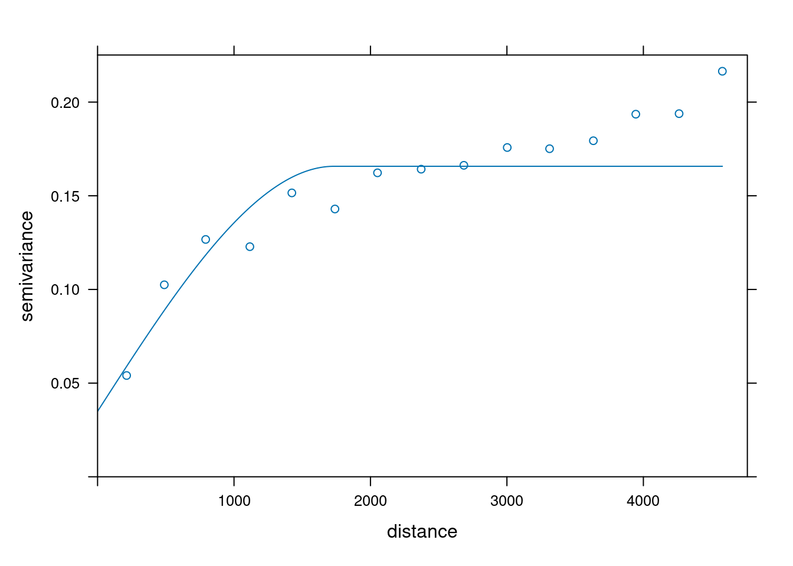
<p class="caption">(\#fig:13-symulacje-10)Model semiwariogramu empirycznego binarnej zmiennej stworzony na potrzeby symulacji.</p>
</div>


``` r
sym_ind = krige(temp_ind ~ 1, 
                locations = punkty, 
                newdata = siatka, 
                model = fitted_ind, 
                indicators = TRUE,
                nsim = 4, 
                nmax = 30)
```

```
## drawing 4 GLS realisations of beta...
## [using conditional indicator simulation]
```

Wynik symulacji danych kodowanych znacząco różni się od wyniku krigingu danych kodowanych.
W przeciwieństwie do tej drugiej metody, w rezultacie symulacji nie otrzymujemy prawdopodobieństwa zajścia danej klasy, ale konkretne wartości `1` lub `0` (rycina \@ref(fig:13-symulacje-11)).


``` r
tm_shape(sym_ind) +
        tm_raster(title = "", style = "cat", palette = c("#88CCEE", "#CC6677")) +
        tm_layout(main.title = "Symulacja warunkowa")
```

<div class="figure" style="text-align: center">
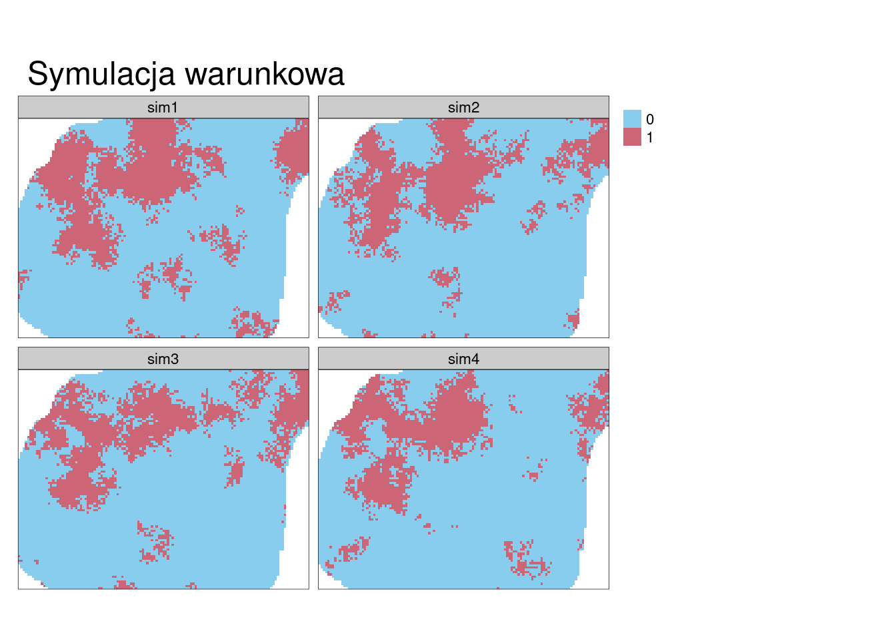
<p class="caption">(\#fig:13-symulacje-11)Przykłady symulacji danych kodowanych.</p>
</div>

<!--
łączenie sis - wiele symulacji
-->

## Zadania {#z13}

1.  Stwórz nową siatkę dla obszaru o zasięgu x od 0 do 40000 i zasięgu y od 0 do 30000 oraz rozdzielczości 250. 
2.  Zbuduj po trzy symulacje bezwarunkowe w tej siatce korzystając z:
    -   modelu sferycznego o semiwariancji cząstkowej 15 i zasięgu 7000
    -   modelu nugetowego o wartości 1 razem z modelem sferycznym o semiwariancji cząstkowej 15 i zasięgu 7000
    -   modelu sferycznego o semiwariancji cząstkowej 5 i zasięgu 7000
    -   modelu sferycznego o semiwariancji cząstkowej 15 i zasięgu 1000
3.  Porównaj graficznie uzyskane powyżej wyniki i opisz je.
4.  Stwórz optymalny model semiwariogramu zmiennej `temp` z obiektu `punkty`.
Następnie korzystając z wybranej metody krigingowej, poznanej w poprzednich rozdziałach, wykonaj estymację zmiennej `temp`.
5.  Wykonaj cztery symulacje warunkowe używając optymalnego modelu semiwariancji stworzonego w poprzednim zadaniu. 
Porównaj uzyskaną estymację geostatystyczną z symulacjami geostatystycznymi. 
Jakie można zaobserwować podobieństwa a jakie różnice?
6.  Zbuduj optymalny model semiwariogramu empirycznego określający prawdopodobieństwo wystąpienia wartości `ndvi`  poniżej 0.4 dla zbioru `punkty`. 
Wykonaj estymację metodą krigingu danych kodowanych. 
Następnie używając tego samego modelu, wykonaj cztery symulacje warunkowe (symulacje danych kodowanych).
Jakie wartości progowe prawdopodobieństwa przypominają uzyskane symulacje?
