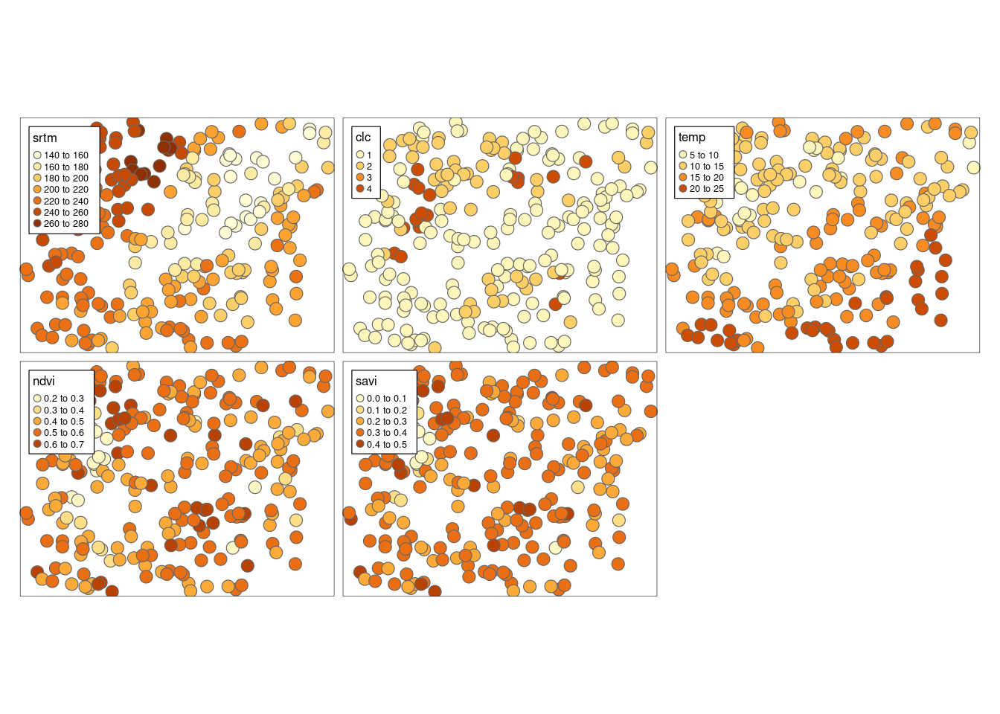
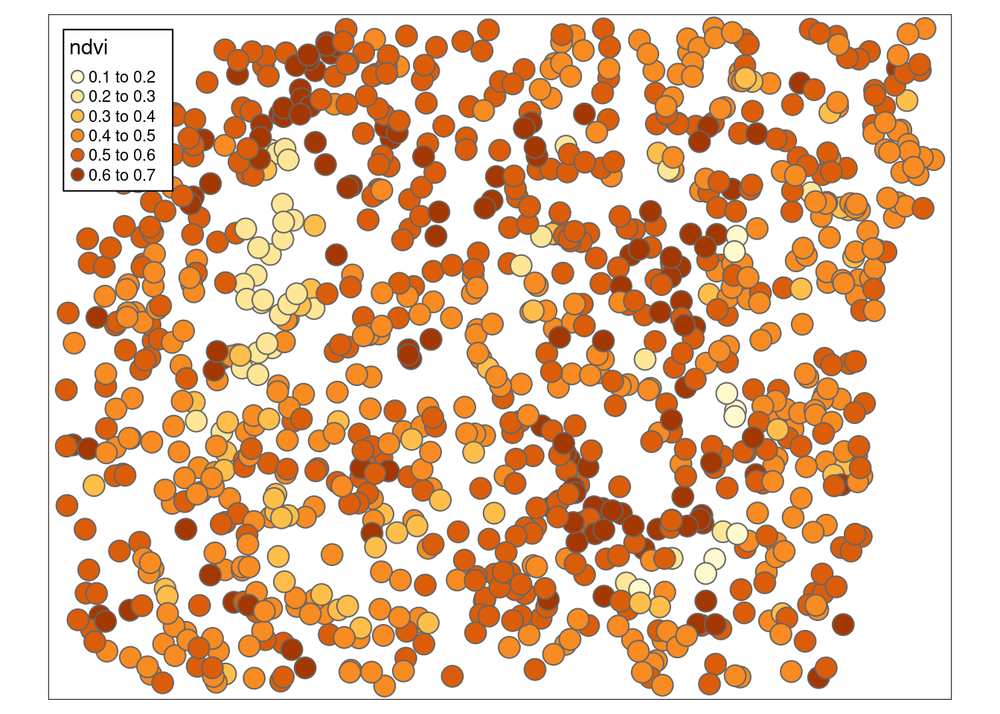
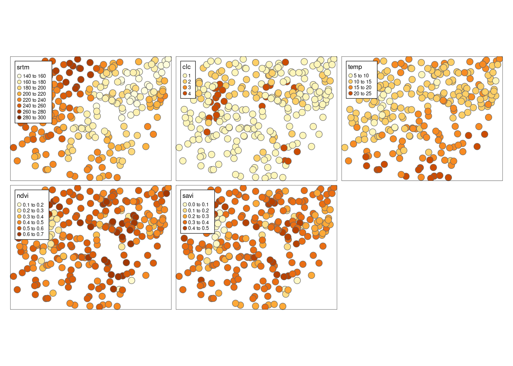
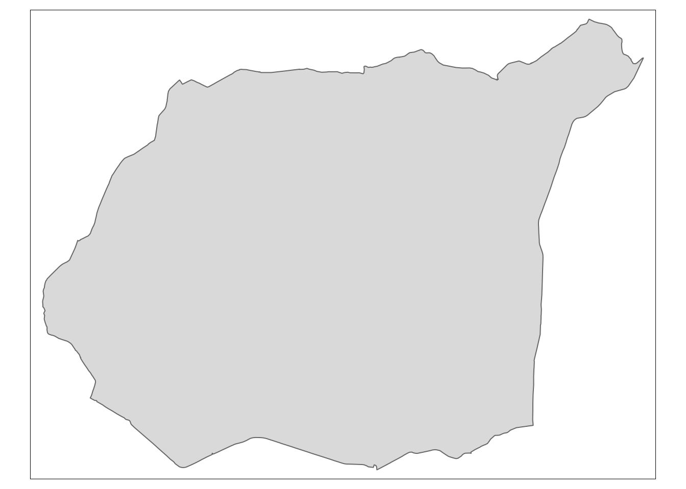
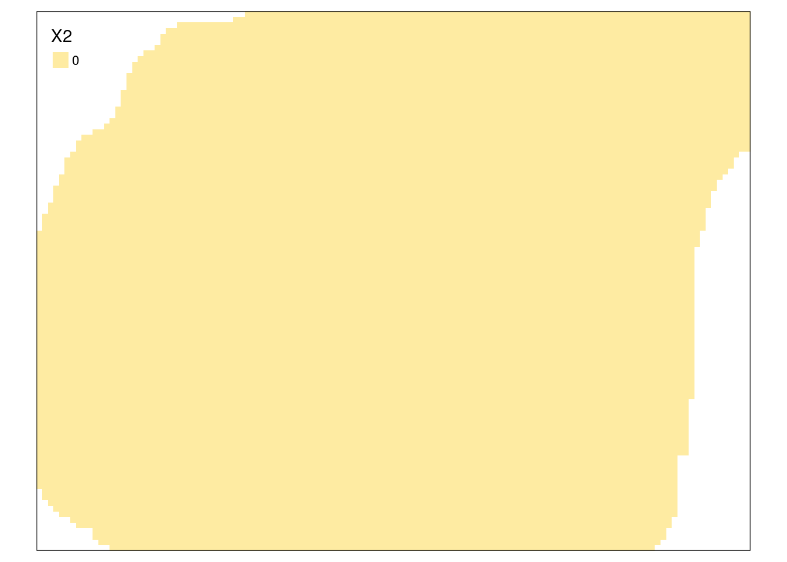
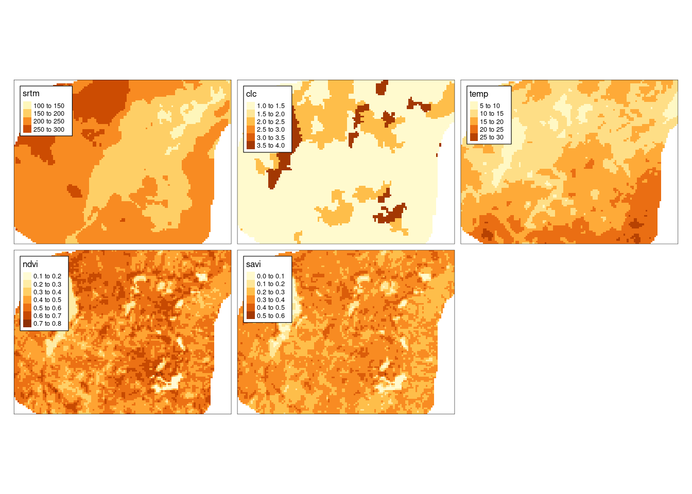

# Dane {#dane-app}


Dane wykorzystywane w tym skrypcie można pobrać w postaci spakowanego archiwum (dla rozdziału \@ref(r-a-dane-przestrzenne)) oraz korzystając z pakietu **geostatbook** (dla kolejnych rozdziałów). 
Dodatkowo, przy instalacji pakietu **geostatbook** pobierane są wszystkie inne pakiety potrzebne do pełnego korzystania z materiałów zawartych w tym skrypcie.

- [Archiwum zawierające dane do rozdziału drugiego](https://github.com/Nowosad/geostat_book/blob/master/dane3.zip?raw=true)
- [Dane do kolejnych rozdziałów są zawarte w pakiecie geostatbook:](https://github.com/Nowosad/geostatbook)


``` r
# install.packages("remotes")
remotes::install_github("nowosad/geostatbook@3")
```


``` r
library(geostatbook)
```

## `punkty`


``` r
data("punkty")
?punkty
```

Zbiór danych `punkty` zawiera 242 obserwacje oraz 5 zmiennych dla obszaru Suwalskiego Parku Krajobrazowego i okolic.
Zmienne:

- `srtm` - wysokość w metrach n.p.m. pozyskana z numerycznego modelu terenu z misji SRTM
- `clc` - uproszczona kategoria pokrycia terenu z bazy Corine Land Cover. 
1 oznacza tereny rolne, 2 oznacza lasy i ekosystemy seminaturalne, 3 to obszary podmokłe, 4 to obszary wodne
- `temp` - temperatura powierzchni ziemi w stopniach Celsjusza 
- `ndvi` - znormalizowany różnicowy wskaźnik wegetacji (ang. *Normalized Difference Vegetation Index*)
- `savi` - wskaźnik wegetacji mniej podatny na wpływ jasności gleby na uzyskane wyniki (ang. *Soil Adjusted Vegetation Index*)


``` r
tm_shape(punkty) +
        tm_symbols(col = c("srtm", "clc", "temp", "ndvi", "savi")) +
        tm_layout(legend.frame = TRUE)
```



## `punkty_ndvi`


``` r
data("punkty_ndvi")
?punkty_ndvi
```

Zbiór danych `punkty_ndvi` zawiera 993 obserwacji oraz 1 zmienną dla obszaru Suwalskiego Parku Krajobrazowego i okolic.
Zmienna:

- `ndvi` - znormalizowany różnicowy wskaźnik wegetacji (ang. *Normalized Difference Vegetation Index*)


``` r
tm_shape(punkty_ndvi) +
        tm_symbols(col = "ndvi") +
        tm_layout(legend.frame = TRUE)
```



## `punkty_pref`


``` r
data("punkty_pref")
?punkty_pref
```

Zbiór danych `punkty_pref` zawiera 264 obserwacji oraz 5 zmiennych dla obszaru Suwalskiego Parku Krajobrazowego i okolic.
Są one rozlokowane w sposób preferencyjny.
Zmienna:

- `srtm` - wysokość w metrach n.p.m. pozyskana z numerycznego modelu terenu z misji SRTM
- `clc` - uproszczona kategoria pokrycia terenu z bazy Corine Land Cover. 
1 oznacza tereny rolne, 2 oznacza lasy i ekosystemy seminaturalne, 3 to obszary podmokłe, 4 to obszary wodne
- `temp` - temperatura powierzchni ziemi w stopniach Celsjusza 
- `ndvi` - znormalizowany różnicowy wskaźnik wegetacji (ang. *Normalized Difference Vegetation Index*)
- `savi` - wskaźnik wegetacji mniej podatny na wpływ jasności gleby na uzyskane wyniki (ang. *Soil Adjusted Vegetation Index*)


``` r
tm_shape(punkty_pref) +
        tm_symbols(col = c("srtm", "clc", "temp", "ndvi", "savi")) +
        tm_layout(legend.frame = TRUE)
```



## `granica`


``` r
data("granica")
?granica
```

Granica Suwalskiego Parku Krajobrazowego.


``` r
tm_shape(granica) + 
        tm_polygons()
```



## `siatka`


``` r
data("siatka")
?siatka
```

Siatka badanego obszaru dla obszaru Suwalskiego Parku Krajobrazowego i okolic.
Zawiera ona 96 wierszy i 127 kolumn.


``` r
tm_shape(siatka) + 
        tm_raster()
```



## `dane_uzup`


``` r
data("dane_uzup")
?dane_uzup
```

Siatka badanego obszaru dla obszaru Suwalskiego Parku Krajobrazowego i okolic zawierająca zmienne dodatkowe.
Zawiera ona 96 wierszy i 127 kolumn oraz 4 zmienne:

- `srtm` - wysokość w metrach n.p.m. pozyskana z numerycznego modelu terenu z misji SRTM
- `clc` - uproszczona kategoria pokrycia terenu z bazy Corine Land Cover. 
1 oznacza tereny rolne, 2 oznacza lasy i ekosystemy seminaturalne, 3 to obszary podmokłe, 4 to obszary wodne
- `ndvi` - znormalizowany różnicowy wskaźnik wegetacji (ang. *Normalized Difference  Vegetation Index*)
- `savi` - wskaźnik wegetacji mniej podatny na wpływ jasności gleby na uzyskane wyniki (ang. *Soil Adjusted Vegetation Index*)


``` r
tm_shape(dane_uzup) + 
        tm_raster() +
        tm_layout(legend.frame = TRUE)
```



