# Przykład analizy geostatystycznej {#przyklad}


## Analiza geostatystyczna

Analiza geostatystyczna jest złożonym procesem, często wymagającym sprawdzenia jakości danych i ich korekcji oraz wypróbowania wielu możliwości modelowania.
Poniższy appendiks skupia się na pokazaniu przykładu uproszczonej analizy geostatystycznej, w której głównym celem jest estymacja średniej wartości temperatury.

## Przygotowanie danych

Pierwszym krokiem analizy geostatystycznej jest załadowanie pakietów, które zostaną użyte.
Brakujące pakiety można także załadować także w trakcie analizy geostatystycznej.


``` r
library(sf)
library(stars)
library(gstat)
library(tmap)
library(ggplot2)
```

Kolejnym krokiem jest wczytanie danych oraz sprawdzenie ich jakości.


``` r
moje_punkty = read_sf("dane/moje_punkty.gpkg")
summary(moje_punkty)
```

```
##       tavg               X                Y                     geom    
##  Min.   :-0.8726   Min.   :345007   Min.   :312609   POINT        :188  
##  1st Qu.: 1.0871   1st Qu.:347681   1st Qu.:314664   epsg:2180    :  0  
##  Median : 1.6470   Median :351093   Median :316628   +proj=tmer...:  0  
##  Mean   : 1.6204   Mean   :350809   Mean   :316827                      
##  3rd Qu.: 2.1644   3rd Qu.:353591   3rd Qu.:319037                      
##  Max.   : 4.0310   Max.   :357010   Max.   :321540
```

Obiekt `moje_punkty` zawiera tylko jedną zmienną `tavg`, która ma być użyta do stworzenia estymacji.
Warto zwizualizować rozkład wartości tej zmiennej w postaci histogramu oraz mapy (rycina \@ref(fig:18-przyklad-4) i \@ref(fig:18-przyklad-4a)).


``` r
ggplot(moje_punkty, aes(tavg)) + geom_histogram()
```

<div class="figure" style="text-align: center">
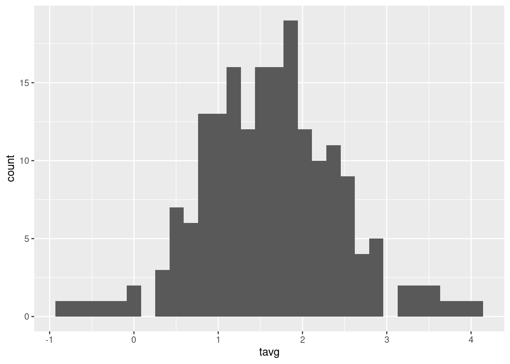
<p class="caption">(\#fig:18-przyklad-4)Rozkład wartości zmiennej tavg.</p>
</div>


``` r
tm_shape(moje_punkty) + 
        tm_symbols(col = "tavg")
```

<div class="figure" style="text-align: center">
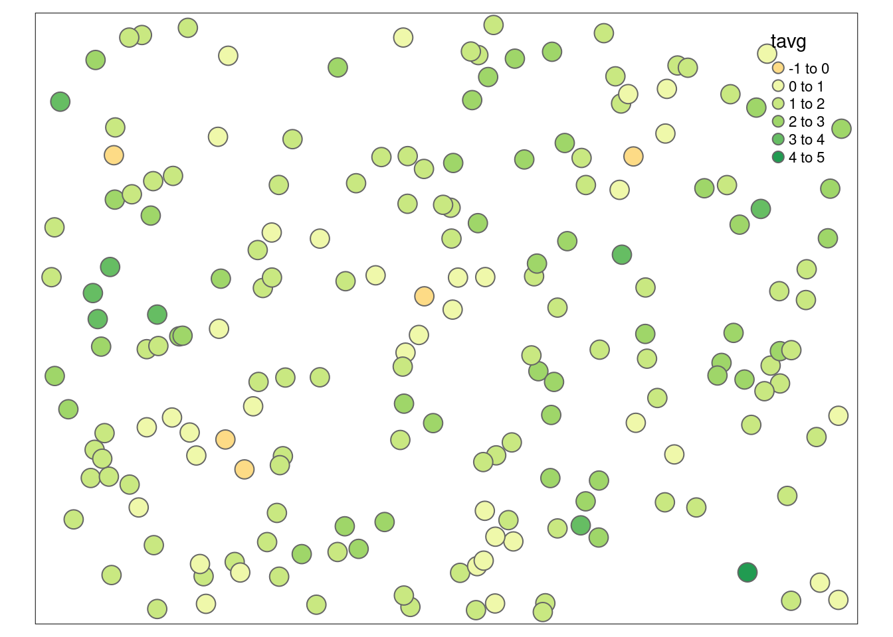
<p class="caption">(\#fig:18-przyklad-4a)Rozkład przestrzenny wartości zmiennej tavg.</p>
</div>

Pozwala to na zauważenie, że w badanej zmiennej występują co najmniej dwie wartości odstające.


``` r
moje_punkty[moje_punkty$tavg == max(moje_punkty$tavg), ]
```

```
## Simple feature collection with 1 feature and 3 fields
## Geometry type: POINT
## Dimension:     XY
## Bounding box:  xmin: 355581.8 ymin: 313212.1 xmax: 355581.8 ymax: 313212.1
## Projected CRS: ETRF2000-PL / CS92
## # A tibble: 1 × 4
##    tavg       X       Y                geom
##   <dbl>   <dbl>   <dbl>         <POINT [m]>
## 1  4.03 355582. 313212. (355581.8 313212.1)
```

``` r
moje_punkty[moje_punkty$tavg == min(moje_punkty$tavg), ]
```

```
## Simple feature collection with 1 feature and 3 fields
## Geometry type: POINT
## Dimension:     XY
## Bounding box:  xmin: 353849 ymin: 319540.7 xmax: 353849 ymax: 319540.7
## Projected CRS: ETRF2000-PL / CS92
## # A tibble: 1 × 4
##     tavg       X       Y              geom
##    <dbl>   <dbl>   <dbl>       <POINT [m]>
## 1 -0.873 353849. 319541. (353849 319540.7)
```

Jedna z nich ma wartość ok. -3,5 °C i jest znacznie niższa od pozostałych, druga natomiast jest znacznie wyższa od pozostałych i ma wartość ok. 9,2 °C.
Należy w tym momencie zastanowić się czy te wartości odstające są prawidłowymi wartościami, czy też są one błędne. 
W tej sytuacji, nie posiadając zewnętrznej informacji, bezpieczniej jest usunąć te dwa pomiary.
Można to zrobić wyszukując id punktów za pomocą pakietu **tmap**.


Teraz id punktów można użyć do ich wybrania i zastąpienia potencjalnie błędnych wartości wartościami `NA`.


``` r
# usunięcie wartości według id
moje_punkty[60, "tavg"] = NA
moje_punkty[72, "tavg"] = NA
```


Te punkty nadal istnieją jednak w obiekcie `moje_punkty`.
Można je usunąć korzystając z funkcji `is.na` oraz indeksowania:


``` r
moje_punkty = moje_punkty[!is.na(moje_punkty$tavg), ]
```

Po tej zmianie powinno się po raz kolejny obejrzeć dokładnie dane w celu stwierdzenia, czy problem został naprawiony i czy nie występują dodatkowe sytuacje problemowe (rycina \@ref(fig:18-przyklad-10) i \@ref(fig:18-przyklad-10a)).


``` r
ggplot(moje_punkty, aes(tavg)) + geom_histogram()
```

<div class="figure" style="text-align: center">
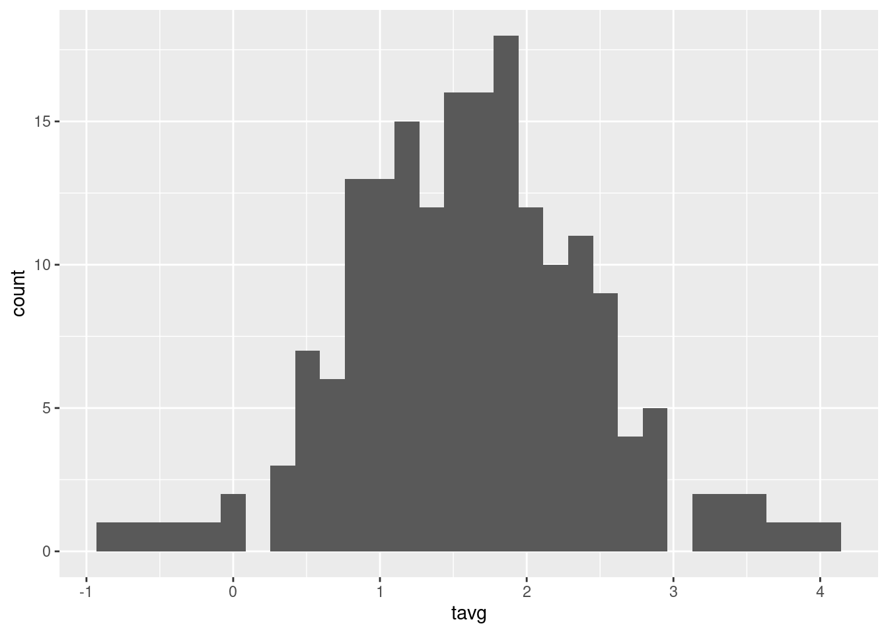
<p class="caption">(\#fig:18-przyklad-10)Rozkład wartości zmiennej tavg po usunięciu wartości odstających.</p>
</div>


``` r
tm_shape(moje_punkty) + 
        tm_symbols(col = "tavg")
```

<div class="figure" style="text-align: center">
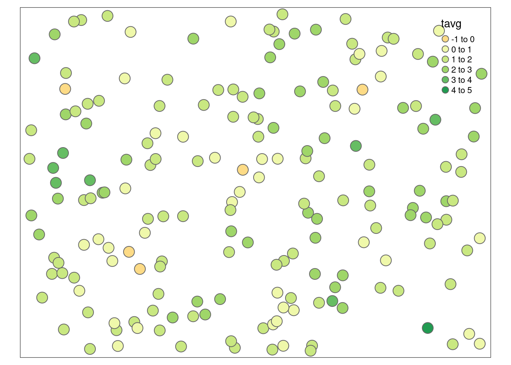
<p class="caption">(\#fig:18-przyklad-10a)Rozkład przestrzenny wartości zmiennej tavg po usunięciu wartości odstających.</p>
</div>

Można dodatkowo stworzyć chmurę semiwariogramu w celu wyszukania potencjalnych wartości lokalnie odstających (rycina \@ref(fig:18-przyklad-11)).


``` r
moja_chmura = variogram(tavg ~ 1, moje_punkty, cloud = TRUE)
plot(moja_chmura)
```

<div class="figure" style="text-align: center">
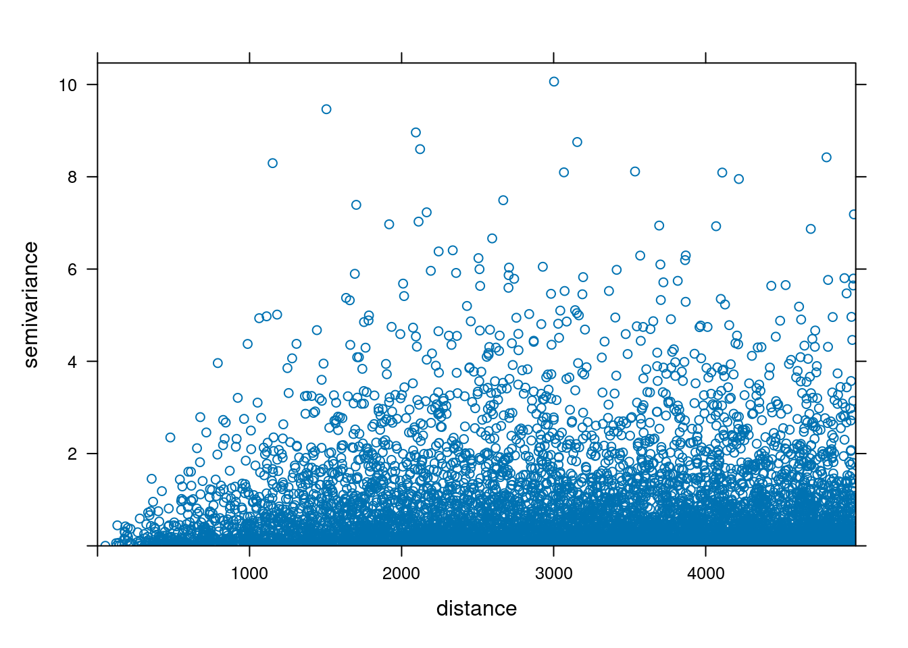
<p class="caption">(\#fig:18-przyklad-11)Chmura semiwariogramu zmiennej tavg.</p>
</div>

## Tworzenie modeli semiwariogramów

Posiadając już poprawne dane można sprawdzić czy badane zjawisko wykazuje anizotropię przestrzenną poprzez stworzenie mapy semiwariogramu (rycina \@ref(fig:18-przyklad-12)).


``` r
moja_mapa = variogram(tavg ~ 1, 
                      locations = moje_punkty,
                      cutoff = 4500,
                      width = 850, 
                      map = TRUE)
plot(moja_mapa, threshold = 30, 
     col.regions = hcl.colors(40, palette = "ag_GrnYl", rev = TRUE))
```

<div class="figure" style="text-align: center">
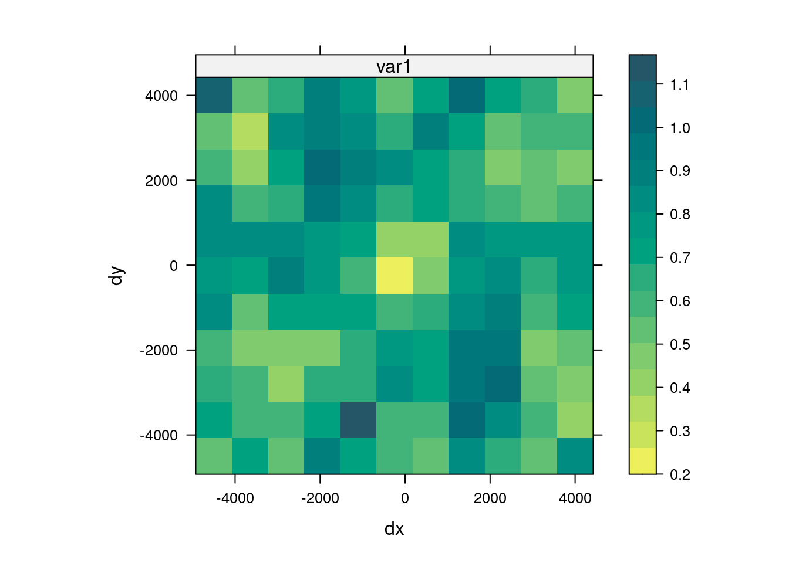
<p class="caption">(\#fig:18-przyklad-12)Mapa semiwariogramu zmiennej tavg.</p>
</div>

Uzyskana mapa nie pozwala na jednoznaczne stwierdzenie kierunkowej zmienności podobieństwa badanej cechy, w związku z tym można skupić się na modelowaniu izotropowym.
Kolejnym etapem jest stworzenie semiwariogramu oraz jego modelowanie.
Optymalnie tworzy się więcej niż jeden model semiwariogramu, co pozwala na porównanie uzyskanych wyników i wybór lepszego modelu.
Do tego przykładu zostały stworzone dwa modele semiwariogramu.
Pierwszy z nich używa tylko zmiennej `tavg` oraz modelu ręcznego o wybranych parametrach (ryciny \@ref(fig:18-przyklad-13), \@ref(fig:18-przyklad-14), \@ref(fig:18-przyklad-15), \@ref(fig:18-przyklad-16)).


``` r
moj_semiwar = variogram(tavg ~ 1, 
                        locations = moje_punkty)
plot(moj_semiwar)
```

<div class="figure" style="text-align: center">

<p class="caption">(\#fig:18-przyklad-13)Semiwariogram zmiennej tavg.</p>
</div>


``` r
moj_model = vgm(psill = 0.65,
        model = "Sph",
        range = 2000,
        nugget = 0.15)
plot(moj_semiwar, moj_model)
```

<div class="figure" style="text-align: center">
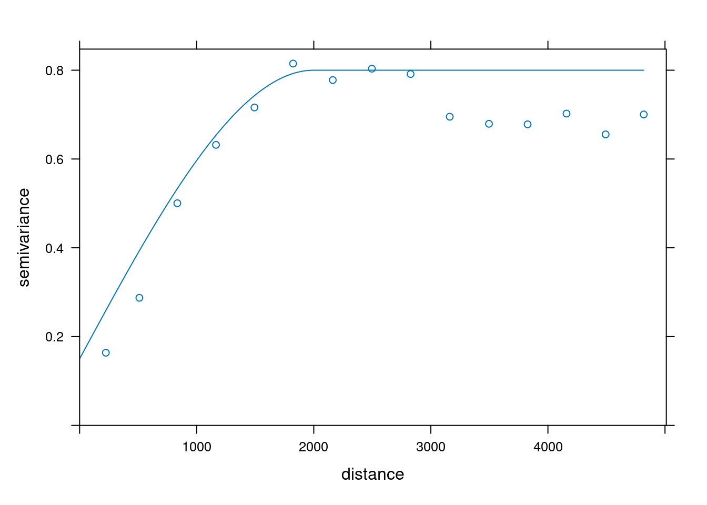
<p class="caption">(\#fig:18-przyklad-14)Model semiwariogramu zmiennej tavg.</p>
</div>

Drugi model, oprócz zmiennej `tavg`, używa też wartości współrzędnych oraz modelu o parametrach zmodyfikowanych przez funkcję `fit.variogram()`.


``` r
moje_punkty$X = st_coordinates(moje_punkty)[, 1]
moje_punkty$Y = st_coordinates(moje_punkty)[, 2]
moj_semiwar2 = variogram(tavg ~ X + Y,
                         locations = moje_punkty)
plot(moj_semiwar2)
```

<div class="figure" style="text-align: center">
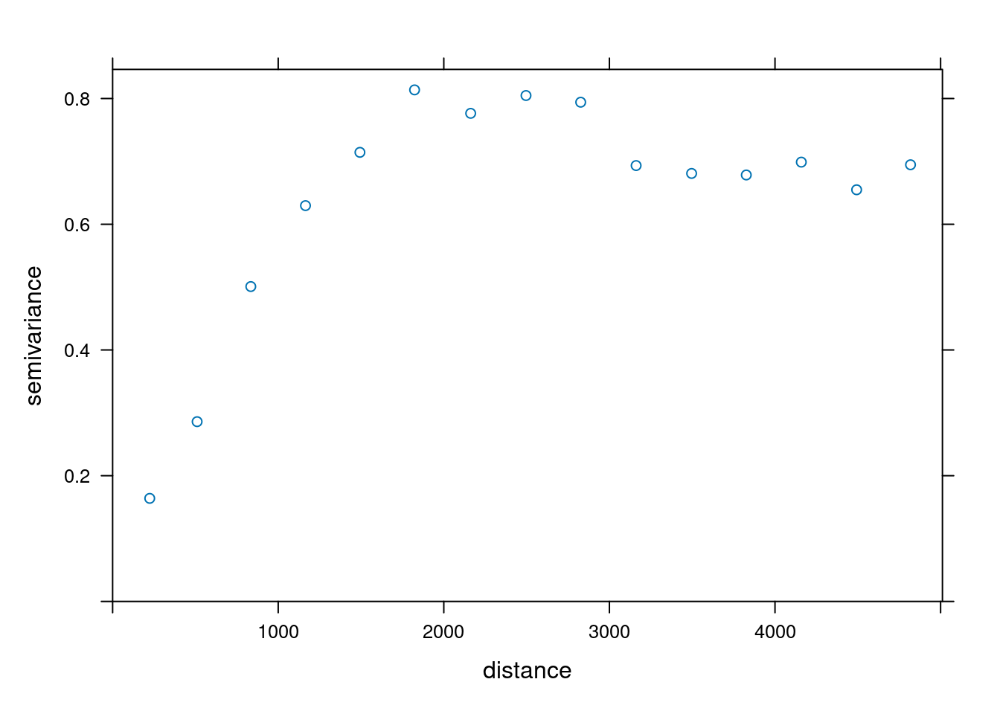
<p class="caption">(\#fig:18-przyklad-15)Semiwariogram zmiennej tavg uwzględniający współrzędne x i y.</p>
</div>


``` r
moj_model2 = vgm(model = "Sph", nugget = 0.1)
moj_model2 = fit.variogram(moj_semiwar2, moj_model2)
moj_model2
```

```
##   model      psill    range
## 1   Nug 0.01750625    0.000
## 2   Sph 0.73618909 1852.585
```

``` r
plot(moj_semiwar2, moj_model2)
```

<div class="figure" style="text-align: center">
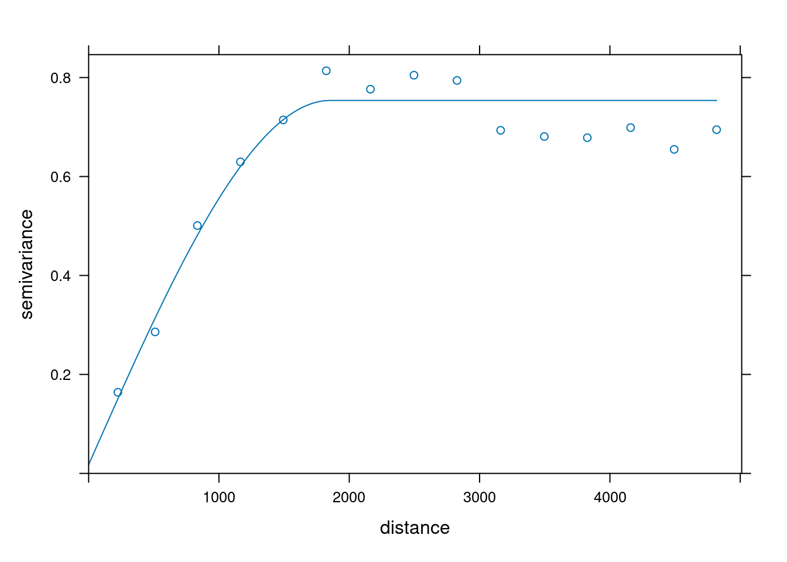
<p class="caption">(\#fig:18-przyklad-16)Model semiwariogramu zmiennej tavg uwzględniający współrzędne x i y.</p>
</div>

## Ocena jakości modeli

Aby porównać oba modele należy przyjąć metodę walidacji oraz współczynnik jakości estymacji.
W tym przykładzie użyto kroswalidacji metodą LOO (funkcja `krige.cv`) oraz pierwiastek błędu średniokwadratowego (RMSE) jako miarę jakości.


``` r
ocena1 = krige.cv(tavg ~ 1,
                  locations = moje_punkty,
                  model = moj_model,
                  beta = 30)
RMSE1 = sqrt(mean((ocena1$residual) ^ 2))
```


``` r
ocena2 = krige.cv(tavg ~ X + Y,
                  locations = moje_punkty,
                  model = moj_model2)
RMSE2 = sqrt(mean((ocena2$residual) ^ 2))
```

Porównanie dwóch wartości RMSE pozwala zdecydowanie stwierdzić, że drugi model charakteryzuje się lepszą jakością estymacji.


``` r
RMSE1
```

```
## [1] 6.233389
```

``` r
RMSE2
```

```
## [1] 0.586952
```

## Stworzenie siatki

Przedostatnim krokiem jest utworzenie siatki do estymacji.
Do niej zostaną wpisane wartości uzyskane z modelu semiwariogramu.


``` r
punkty_bbox = st_bbox(moje_punkty)
moja_siatka = st_as_stars(punkty_bbox, 
                          dx = 100,
                          dy = 100)
moja_siatka$X = st_coordinates(moja_siatka)[, 1]
moja_siatka$Y = st_coordinates(moja_siatka)[, 2]
```

## Stworzenie estymacji

Następnie nowo utworzona siatka może posłużyć do stworzenia estymacji (rycina \@ref(fig:18-przyklad-21)).


``` r
moja_estymacja = krige(tavg ~ X + Y,
                       locations = moje_punkty,
                       newdata = moja_siatka,
                       model = moj_model2)
```

```
## [using universal kriging]
```

``` r
tm_shape(moja_estymacja) +
        tm_raster(col = "var1.pred", style = "cont", palette = "-Spectral")
tm_shape(moja_estymacja) +
        tm_raster(col = "var1.var", style = "cont", palette = "viridis")
```

<div class="figure" style="text-align: center">
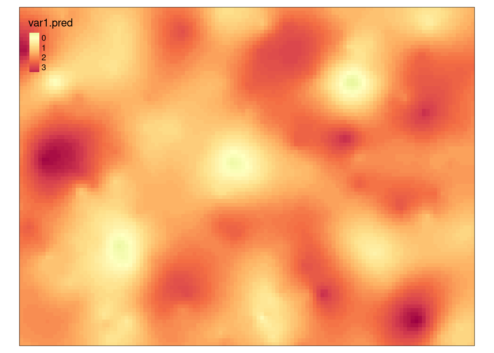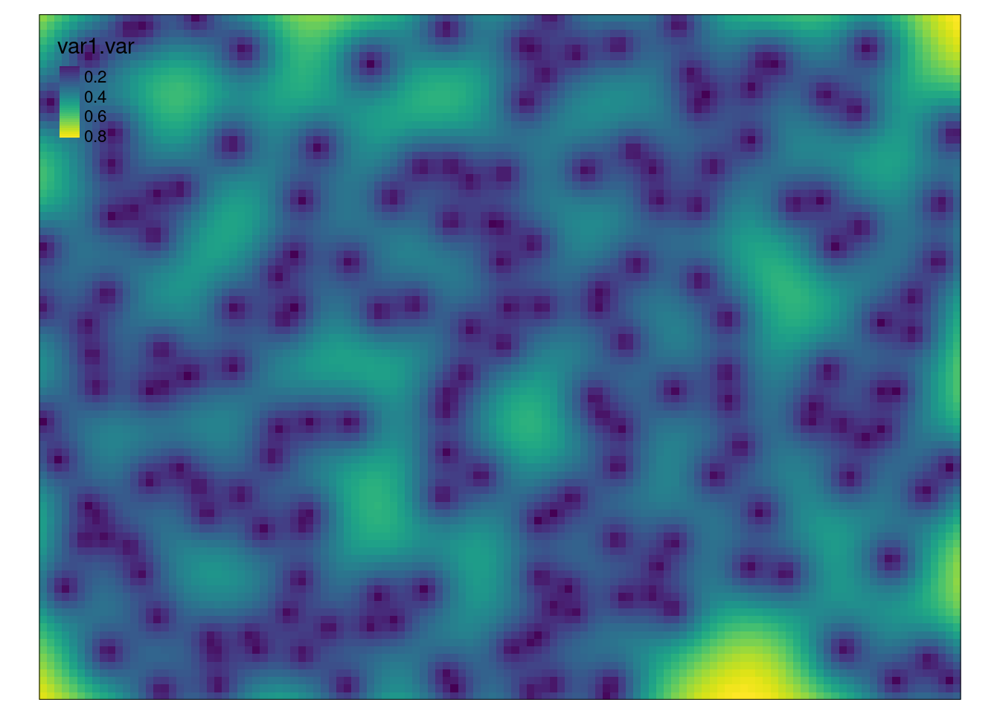
<p class="caption">(\#fig:18-przyklad-21)Estymacja i wariancja estymacji drugiego modelu zmiennej tavg.</p>
</div>

Wynikiem uproszczonej analizy geostatystycznej jest mapa estymowanych wartości temperatury dla całego badanego obszaru oraz mapa przedstawiająca wariancję estymacji temperatury.
