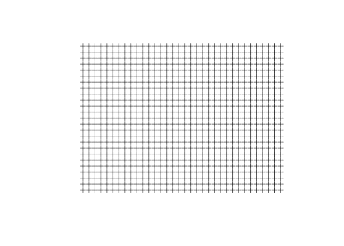
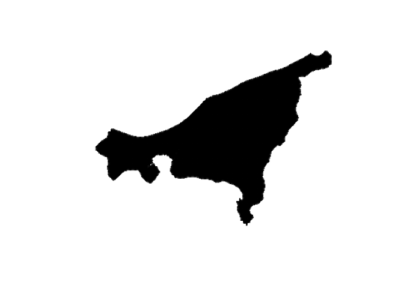
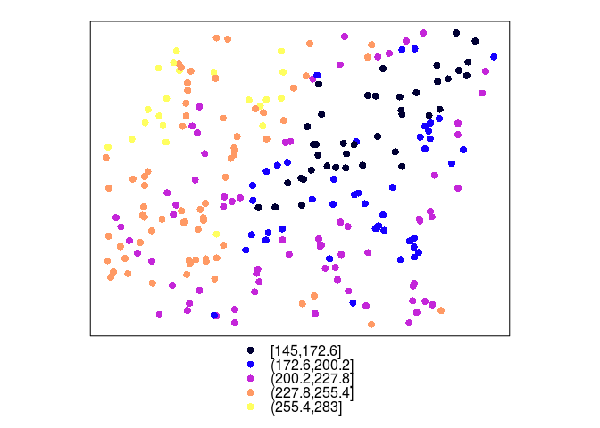
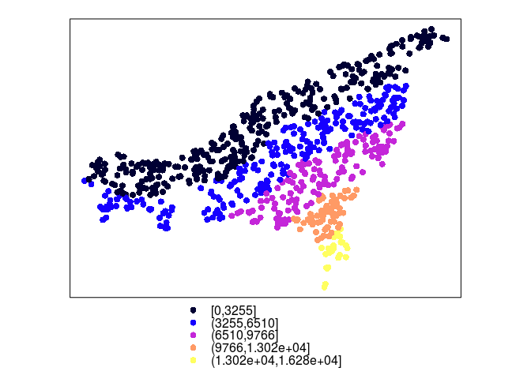
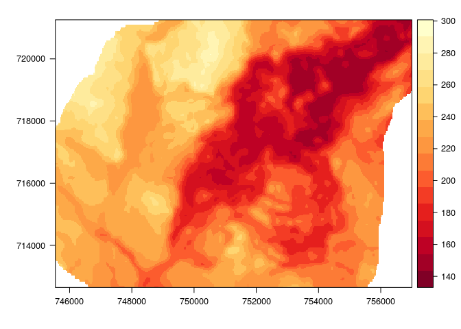
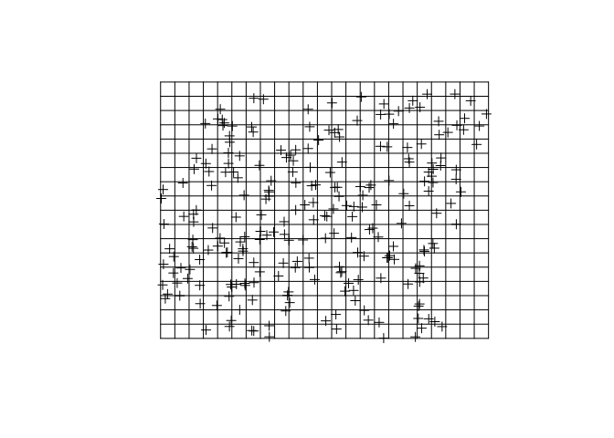

# Wprowadzenie {#intro}

## Suwalski Park Krajobrazowy
    
## R a dane przestrzenne
    
### Pakiety
    
- GIS - **sp, rgdal, raster, rasterVis, rgeos, maptools, GeoXp, deldir, pgirmess**
- Geostatystyka - **gstat, geoR, geoRglm, fields, spBayes, RandomFields, vardiag**
- Inne - **ggplot2, corrplot, caret**


```r
install.packages(c('sp', 'rgdal', 'raster', 'rasterVis', 'gstat', 'ggplot2', 'corrplot', 'deldir', 'fields', 'geoR', 'pgirmess', 'caret'))
```

### Reprezentacja danych nieprzestrzennych
    
- Wektory (ang. *vector*):
    - liczbowe (ang. *integer*, *numeric*) - c(1, 2, 3) i c(1.21, 3.32, 4.43)
    - znakowe (ang. *character*) - c('jeden', 'dwa', 'trzy')
    - logiczne (ang. *logical*) - c(TRUE, FALSE)
    - czynnikowe (ang. *factor*) - c('jeden', 'dwa', 'trzy', 'jeden')
- Ramki danych (ang. *data.frame*) - to zbiór zmiennych (kolumn) oraz obserwacji (wierszy) zawierających różne typy danych
- Macierze (ang. *matrix*)
- Listy (ang. *list*)

### Reprezentacja danych przestrzennych

- Obiekty klasy Spatial* - wszystkie z nich zawierają dwie dodatkowe informacje:
    - bounding box (bbox) - obwiednia - określa zasięg danych
    - CRS (proj4string) - układ współrzędnych
- Najczęściej stosowane obiekty klasy Spatial* to SpatialPointsDataFrame, SpatialPolygonsDataFrame oraz SpatialGridDataFrame
- Obiekty klasy Raster, tj. RasterLayer, RasterStack, RasterBrick
- Inne

### GDAL/OGR
- http://www.gdal.org/
- GDAL to biblioteka zawierająca funkcje służące do odczytywania i zapiswania danych w formatach rastrowych
- OGR to bibioteka służąca to odczytywania i zapiswania danych w formatach wektorowych
- Pakiet **rgdal** pozwala na wykorzystanie bibliotek GDAL/OGR w R

### PROJ.4
- Dane przestrzenne powinny być zawsze powiązane z układem współrzednych
- PROJ.4 - to biblioteka pozwalająca na identyfiację oraz konwersję pomiędzy różnymi układami współrzędnych
http://www.spatialreference.org/

### EPSG
- Kod EPSG (ang. *European Petroleum Survey Group*) pozwala na łatwe identyfikowanie układów współrzędnych
- Przykładowo, układ PL 1992 może być określony jako:

"+proj=tmerc +lat_0=0 +lon_0=19 +k=0.9993 +x_0=500000 +y_0=-5300000 +ellps=GRS80 +towgs84=0,0,0,0,0,0,0 +units=m +no_defs"

lub

"+init=epsg:2180"

### Układ geograficzny
- Proporcje pomiędzy współrzedną X (długość) a Y (szerokość) nie są 1:1
- Wielkość oczka siatki jest zmienna 
- Nie pozwala na proste określanie odległości czy powierzchni
- Jednostka mapy jest abstrakcyjna

- Do większości algorytmów w geostatystyce wykorzystywane są układy prostokątne płaskie

## Import danych

### Dane punktowe (format csv)


```r
library('sp')
dane_punktowe <- read.csv('dane/punkty.csv')
```


```r
head(dane_punktowe)
```

```
##       srtm clc     temp      ndvi      savi        x        y
## 1 184.4150   1 17.82931 0.5490699 0.3642284 752244.9 716188.1
## 2 220.3998   2 16.76045 0.6070772 0.3425520 751900.9 714991.4
## 3 242.2178   2 10.08023 0.5999830 0.3975228 750204.8 718884.6
## 4 204.4045   1 18.60791 0.7228759 0.4889487 753276.1 714766.4
## 5 202.6243   1 17.85643 0.4998576 0.3347926 753895.0 720630.3
## 6 196.3847   1 20.45337 0.5463166 0.3275971 754495.3 715109.0
```


```r
coordinates(dane_punktowe) <- ~x+y
summary(dane_punktowe)
```

```
## Object of class SpatialPointsDataFrame
## Coordinates:
##        min      max
## x 745573.7 756977.8
## y 712659.1 721228.1
## Is projected: NA 
## proj4string : [NA]
## Number of points: 244
## Data attributes:
##       srtm            clc             temp             ndvi       
##  Min.   :145.0   Min.   :1.000   Min.   : 7.805   Min.   :0.1465  
##  1st Qu.:188.5   1st Qu.:1.000   1st Qu.:12.192   1st Qu.:0.4590  
##  Median :213.2   Median :1.000   Median :15.134   Median :0.5163  
##  Mean   :211.6   Mean   :1.418   Mean   :15.324   Mean   :0.5033  
##  3rd Qu.:236.7   3rd Qu.:2.000   3rd Qu.:17.343   3rd Qu.:0.5660  
##  Max.   :283.0   Max.   :4.000   Max.   :26.072   Max.   :0.7229  
##       savi        
##  Min.   :0.04552  
##  1st Qu.:0.29080  
##  Median :0.32742  
##  Mean   :0.32071  
##  3rd Qu.:0.36468  
##  Max.   :0.48895
```


```r
proj4string(dane_punktowe) <- '+init=epsg:2180'
summary(dane_punktowe)
```

```
## Object of class SpatialPointsDataFrame
## Coordinates:
##        min      max
## x 745573.7 756977.8
## y 712659.1 721228.1
## Is projected: TRUE 
## proj4string :
## [+init=epsg:2180 +proj=tmerc +lat_0=0 +lon_0=19 +k=0.9993
## +x_0=500000 +y_0=-5300000 +ellps=GRS80 +towgs84=0,0,0,0,0,0,0
## +units=m +no_defs]
## Number of points: 244
## Data attributes:
##       srtm            clc             temp             ndvi       
##  Min.   :145.0   Min.   :1.000   Min.   : 7.805   Min.   :0.1465  
##  1st Qu.:188.5   1st Qu.:1.000   1st Qu.:12.192   1st Qu.:0.4590  
##  Median :213.2   Median :1.000   Median :15.134   Median :0.5163  
##  Mean   :211.6   Mean   :1.418   Mean   :15.324   Mean   :0.5033  
##  3rd Qu.:236.7   3rd Qu.:2.000   3rd Qu.:17.343   3rd Qu.:0.5660  
##  Max.   :283.0   Max.   :4.000   Max.   :26.072   Max.   :0.7229  
##       savi        
##  Min.   :0.04552  
##  1st Qu.:0.29080  
##  Median :0.32742  
##  Mean   :0.32071  
##  3rd Qu.:0.36468  
##  Max.   :0.48895
```

<!--
### Usuwanie punktów zawierających braki wartości


```r
sp_na_omit <- function(x, margin=1) {
    if (!inherits(x, "SpatialPointsDataFrame") & !inherits(x, "SpatialPolygonsDataFrame")) 
        stop("MUST BE sp SpatialPointsDataFrame OR SpatialPolygonsDataFrame CLASS OBJECT") 
    na.index <- unique(as.data.frame(which(is.na(x@data),arr.ind=TRUE))[,margin])
    if(margin == 1) {  
        cat("DELETING ROWS: ", na.index, "\n") 
        return( x[-na.index,]  ) 
    }
    if(margin == 2) {  
        cat("DELETING COLUMNS: ", na.index, "\n") 
        return( x[,-na.index]  ) 
    }
}
# wolin_lato_los2 <- sp_na_omit(wolin_lato_los) 
# summary(wolin_lato_los2)
```
-->

### Dane poligonowe (formaty gisowe)


```r
library('rgdal')
```

```
## Loading required package: methods
```

```
## rgdal: version: 1.1-3, (SVN revision 594)
##  Geospatial Data Abstraction Library extensions to R successfully loaded
##  Loaded GDAL runtime: GDAL 1.11.2, released 2015/02/10
##  Path to GDAL shared files: /usr/share/gdal/1.11
##  Loaded PROJ.4 runtime: Rel. 4.8.0, 6 March 2012, [PJ_VERSION: 480]
##  Path to PROJ.4 shared files: (autodetected)
##  Linking to sp version: 1.2-1
```

```r
granica <- readOGR(dsn='dane', layer='granica', verbose=FALSE)
plot(granica)
```

<!-- -->

### Rastry


```r
library('raster')
siatka_raster <- raster("dane/siatka.tif")
plot(siatka_raster)
```

<!-- -->

## Eksport danych

### Zapisywanie danych wektorowych


```r
library('rgdal')
writeOGR(poligon, dsn="nazwa_folderu", layer="nowy_poligon", driver="ESRI Shapefile")
```

### Zapisywanie danych rastrowych


```r
library('raster')
writeRaster(siatka_raster, filename="nazwa_folderu/nowy_raster.tif")
```

## Wizualizacja danych 2D
### Dane punktowe


```r
spplot(dane_punktowe, "temp")
```

<!-- -->

### Dane punktowe


```r
spplot(dane_punktowe, "srtm")
```

<!-- -->

### Dane punktowe - kategorie


```r
dane_punktowe@data$clc <- as.factor(dane_punktowe@data$clc)
spplot(dane_punktowe, "clc")
```

<!-- -->

### Rastry


```r
library('raster')
library('rasterVis')
levelplot(siatka_raster, margin=FALSE)
```

<!-- -->

## Tworzenie siatek
### Siatki regularne


```r
bbox(dane_punktowe)
```

```
##        min      max
## x 745573.7 756977.8
## y 712659.1 721228.1
```

```r
extent(dane_punktowe)
```

```
## class       : Extent 
## xmin        : 745573.7 
## xmax        : 756977.8 
## ymin        : 712659.1 
## ymax        : 721228.1
```


```r
siatka <- expand.grid(x = seq(from = 745050, to = 757050, by = 500),
                      y = seq(from = 712650, to = 721650, by = 500))
coordinates(siatka) <- ~x + y
gridded(siatka) <- TRUE
proj4string(siatka) <- proj4string(dane_punktowe)
```


```r
siatka <- makegrid(dane_punktowe, cellsize=500)
names(siatka) <- c('x', 'y')
coordinates(siatka) <- ~x + y
gridded(siatka) <- TRUE
proj4string(siatka) <- proj4string(dane_punktowe)
```

### Siatki regularne


```r
plot(siatka)
plot(dane_punktowe, add=TRUE)
```

<!-- -->

### Siatki nieregularne


```r
library('raster')
granica <- readOGR(dsn='dane', layer='granica')
```

```
## OGR data source with driver: ESRI Shapefile 
## Source: "dane", layer: "granica"
## with 1 features
## It has 3 fields
```

```r
siatka_n <- raster(extent(granica))
res(siatka_n) <- c(500, 500)
siatka_n[] <- 0
proj4string(siatka_n) <- proj4string(granica)
siatka_n <- mask(siatka_n, granica)
```


```r
levelplot(siatka_n, margin=FALSE)
```

<!-- -->

### Siatki nieregularne


```r
siatka_n <- as(siatka_n, 'SpatialPointsDataFrame')
siatka_n <- siatka_n[!is.na(siatka_n@data$layer), ]
gridded(siatka_n) <- TRUE
plot(siatka_n)
```

<!-- -->
