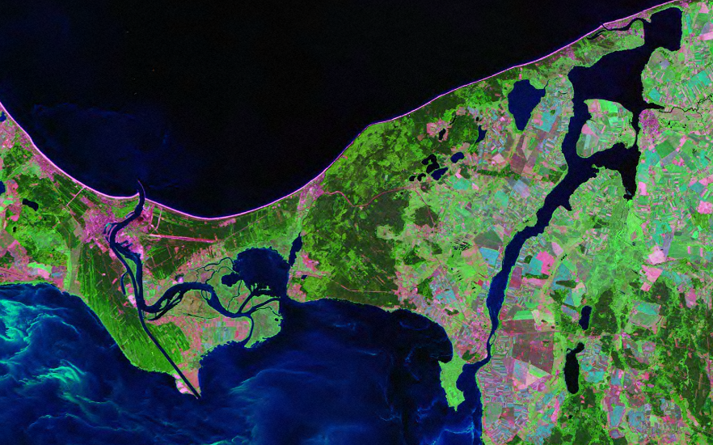
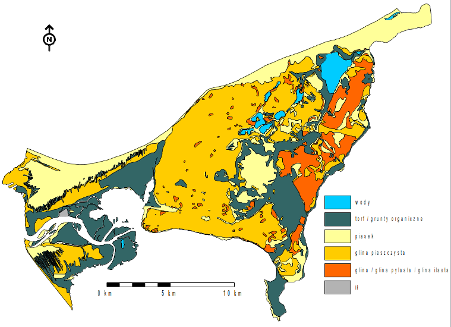
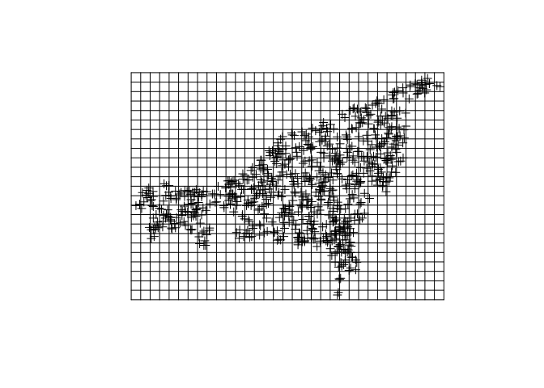
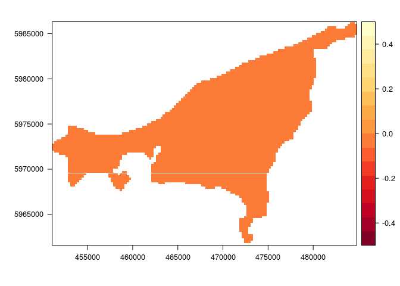

# Wprowadzenie {#intro}

## Wprowadzenie

### Program zajęć
1. Wstęp do R
2. Nieprzestrzenna i przestrzenna eksploracyjna analiza danych
3. Przestrzenna eksploracyjna analiza danych
4. Matematyczne modelowanie autokorelacji przestrzennej
5. Estymacje jednozmienne
6. Ocena jakości estymacji
7. Wykorzystanie do estymacji danych uzupełniających 8. Estymacja lokalnego rozkładu prawdopodobieństwa
9. Estymacje wielozmienne
10. Symulacje przestrzenne

### Formy oceny
- Dwa krótkie (0,5 godziny) kolokwia okresowe – na zajęciach, przy komputerach – po 15% wagi przy końcowej ocenie
- Projekt do wykonania w domu – końcowe 2 tygodnie semestru – 20% wagi przy końcowej ocenie
- Kolokwium końcowe – 1,5 godziny przy komputerach na ostatnich zajęciach w semestrze  - 50% wagi przy końcowej ocenie
- Zaliczenie zajęć (ocena dostateczna) – co najmniej 55% maksymalnej punktacji

### Kodeks honorowy
- Wszelkie prace domowe czy zaliczeniowe muszą być samodzielne oraz odzwierciedlać sposób myślenia i pracy ich twórcy

### Źródła wiedzy
- [An Introduction to R](http://cran.r-project.org/doc/manuals/R-intro.pdf) - oficjalne wprowadzenie do R
- [Przewodnik po pakiecie R](http://www.biecek.pl/R/), [Programowanie w języku R](http://rksiazka.rexamine.com/),  [Statystyczna analiza danych z wykorzystaniem programu R](http://ksiegarnia.pwn.pl/7371_pozycja.html?npt=233) - polskie wydawnictwa
- [Applied Spatial Dala Analysis with R](http://www.asdar-book.org/)
- [A Practical Guide to Geostatistical Mapping](http://spatial-analyst.net/book/system/files/Hengl_2009_GEOSTATe2c1w.pdf)
- [gstat user's manual](http://www.gstat.org/gstat.pdf)
- [CRAN Task View: Analysis of Spatial Data](https://cran.r-project.org/web/views/Spatial.html)
- [Applied Geostatistics](https://books.google.pl/books?id=vC2dcXFLI3YC), [Statistics for spatial data](https://books.google.pl/books?id=4SdRAAAAMAAJ)
- [Praktyczny poradnik - jak szybko zrozumieć i wykorzystać geostatystykę w pracy badawczej](http://www.geoinfo.amu.edu.pl/staff/astach/www_geostat/programy/A_Stach_%20poradnik_geostatystyki.pdf)
- Wyszukiwarki internetowe [Rseek](http://www.rseek.org/), [Duckduckgo](http://duckduckgo.com/), [Google](http://google.com/), [Bing](http://bing.com/), itd.

## Wolin

### Mapa topograficzna


    
### Obraz satelitarny
   

    
### Rzeźba terenu
    


Uproszczona mapa geomorfologiczna wyspy Wolin (Karczewski 1968, zmienione). 

Objaśnienia:
1 – plaża
2 – wydmy i powierzchnie piasków eolicznych
3 – fluwioglacjalne poziomy terasowe
4 – dna rynien glacjalnych
5 – wysoczyzna morenowa
6 – wzgórza moreny czołowej
7 – sandry
8 – jeziora
        
### Pokrycie/użytkowanie terenu
    

    
### Litologia
    

    
### Wilgotność gruntu
    

    
## R a dane przestrzenne
    
### Pakiety
    
- GIS - **sp, rgdal, raster, rasterVis, rgeos, maptools, GeoXp, deldir, pgirmess**
- Geostatystyka - **gstat, geoR, geoRglm, fields, spBayes, RandomFields, vardiag**
- Inne - **ggplot2, corrplot, caret**


```r
install.packages(c('sp', 'rgdal', 'raster', 'rasterVis', 'gstat', 'ggplot2', 'corrplot', 'deldir', 'fields', 'geoR', 'pgirmess', 'caret'))
```

### Reprezentacja danych nieprzestrzennych
    
- Wektory (ang. *vector*):
    - liczbowe (ang. *integer*, *numeric*) - c(1, 2, 3) i c(1.21, 3.32, 4.43)
    - znakowe (ang. *character*) - c('jeden', 'dwa', 'trzy')
    - logiczne (ang. *logical*) - c(TRUE, FALSE)
    - czynnikowe (ang. *factor*) - c('jeden', 'dwa', 'trzy', 'jeden')
- Ramki danych (ang. *data.frame*) - to zbiór zmiennych (kolumn) oraz obserwacji (wierszy) zawierających różne typt danych
- Macierze (ang. *matrix*)
- Listy (ang. *list*)

### Reprezentacja danych przestrzennych

- Obiekty klasy Spatial* - wszystkie z nich zawierają dwie dodatkowe informacje:
    - bounding box (bbox) - obwiednia - określa zasięg danych
    - CRS (proj4string) - układ współrzędnych
- Najczęściej stosowane obiekty klasy Spatial* to SpatialPointsDataFrame, SpatialPolygonsDataFrame oraz SpatialGridDataFrame
- Obiekty klasy Raster, tj. RasterLayer, RasterStack, RasterBrick
- Inne

### GDAL/OGR
- http://www.gdal.org/
- GDAL to biblioteka zawierająca funkcje służące do odczytywania i zapiswania danych w formatach rastrowych
- OGR to bibioteka służąca to odczytywania i zapiswania danych w formatach wektorowych
- Pakiet **rgdal** pozwala na wykorzystanie bibliotek GDAL/OGR w R

### PROJ.4
- Dane przestrzenne powinny być zawsze powiązane z układem współrzednych
- PROJ.4 - to biblioteka pozwalająca na identyfiację oraz konwersję pomiędzy różnymi układami współrzędnych
http://www.spatialreference.org/

### EPSG
- Kod EPSG (ang. *European Petroleum Survey Group*) pozwala na łatwe identyfikowanie układów współrzędnych
- Przykładowo, układ PL 1992 może być określony jako:

"+proj=tmerc +lat_0=0 +lon_0=19 +k=0.9993 +x_0=500000 +y_0=-5300000 +ellps=GRS80 +towgs84=0,0,0,0,0,0,0 +units=m +no_defs"

lub

"+init=epsg:2180"

### Układ geograficzny
- Proporcje pomiędzy współrzedną X (długość) a Y (szerokość) nie są 1:1
- Wielkość oczka siatki jest zmienna 
- Nie pozwala na proste określanie odległości czy powierzchni
- Jednostka mapy jest abstrakcyjna

- Do większości algorytmów w geostatystyce wykorzystywane są układy prostokątne płaskie

## Import danych

### Dane punktowe (format csv)


```r
library('sp')
wolin_lato_los <- read.csv('data/Wolin_TPZ_p_lato_750losN.csv', na.strings=-999.00)
```

### Dane punktowe (format csv)


```r
coordinates(wolin_lato_los) <- ~X+Y
summary(wolin_lato_los)
```

```
## Object of class SpatialPointsDataFrame
## Coordinates:
##       min     max
## X  451470  483570
## Y 5962620 5985510
## Is projected: NA 
## proj4string : [NA]
## Number of points: 750
## Data attributes:
##  X1999.09.13_TPZ X1999.09.13_NDVI  X2002.08.20_TPZ X2002.08.20_NDVI 
##  Min.   :16.01   Min.   :-0.2273   Min.   :17.11   Min.   :-0.2500  
##  1st Qu.:20.24   1st Qu.: 0.3207   1st Qu.:20.48   1st Qu.: 0.2673  
##  Median :21.46   Median : 0.4101   Median :21.89   Median : 0.3766  
##  Mean   :22.86   Mean   : 0.3627   Mean   :23.56   Mean   : 0.3295  
##  3rd Qu.:24.92   3rd Qu.: 0.4752   3rd Qu.:25.81   3rd Qu.: 0.4483  
##  Max.   :33.19   Max.   : 0.5912   Max.   :41.79   Max.   : 0.5724  
##  NA's   :495     NA's   :495                                        
##      CLC06      CLC06_p_lato    odl_od_morza   InsCalk_1999.09
##  Min.   :112   Min.   :1.000   Min.   :    0   Min.   :31.89  
##  1st Qu.:231   1st Qu.:3.000   1st Qu.: 1928   1st Qu.:47.89  
##  Median :311   Median :4.000   Median : 4259   Median :48.25  
##  Mean   :282   Mean   :3.603   Mean   : 4940   Mean   :48.03  
##  3rd Qu.:312   3rd Qu.:4.000   3rd Qu.: 7127   3rd Qu.:48.45  
##  Max.   :512   Max.   :6.000   Max.   :16276   Max.   :54.55  
##                                                               
##  InsCalk_2002.08
##  Min.   :47.02  
##  1st Qu.:63.78  
##  Median :64.09  
##  Mean   :63.87  
##  3rd Qu.:64.26  
##  Max.   :69.44  
## 
```

### Dane punktowe (format csv)


```r
proj4string(wolin_lato_los) <- '+init=epsg:32633'
summary(wolin_lato_los)
```

```
## Object of class SpatialPointsDataFrame
## Coordinates:
##       min     max
## X  451470  483570
## Y 5962620 5985510
## Is projected: TRUE 
## proj4string :
## [+init=epsg:32633 +proj=utm +zone=33 +datum=WGS84 +units=m +no_defs
## +ellps=WGS84 +towgs84=0,0,0]
## Number of points: 750
## Data attributes:
##  X1999.09.13_TPZ X1999.09.13_NDVI  X2002.08.20_TPZ X2002.08.20_NDVI 
##  Min.   :16.01   Min.   :-0.2273   Min.   :17.11   Min.   :-0.2500  
##  1st Qu.:20.24   1st Qu.: 0.3207   1st Qu.:20.48   1st Qu.: 0.2673  
##  Median :21.46   Median : 0.4101   Median :21.89   Median : 0.3766  
##  Mean   :22.86   Mean   : 0.3627   Mean   :23.56   Mean   : 0.3295  
##  3rd Qu.:24.92   3rd Qu.: 0.4752   3rd Qu.:25.81   3rd Qu.: 0.4483  
##  Max.   :33.19   Max.   : 0.5912   Max.   :41.79   Max.   : 0.5724  
##  NA's   :495     NA's   :495                                        
##      CLC06      CLC06_p_lato    odl_od_morza   InsCalk_1999.09
##  Min.   :112   Min.   :1.000   Min.   :    0   Min.   :31.89  
##  1st Qu.:231   1st Qu.:3.000   1st Qu.: 1928   1st Qu.:47.89  
##  Median :311   Median :4.000   Median : 4259   Median :48.25  
##  Mean   :282   Mean   :3.603   Mean   : 4940   Mean   :48.03  
##  3rd Qu.:312   3rd Qu.:4.000   3rd Qu.: 7127   3rd Qu.:48.45  
##  Max.   :512   Max.   :6.000   Max.   :16276   Max.   :54.55  
##                                                               
##  InsCalk_2002.08
##  Min.   :47.02  
##  1st Qu.:63.78  
##  Median :64.09  
##  Mean   :63.87  
##  3rd Qu.:64.26  
##  Max.   :69.44  
## 
```

### Usuwanie punktów zawierających braki wartości


```r
sp_na_omit <- function(x, margin=1) {
    if (!inherits(x, "SpatialPointsDataFrame") & !inherits(x, "SpatialPolygonsDataFrame")) 
        stop("MUST BE sp SpatialPointsDataFrame OR SpatialPolygonsDataFrame CLASS OBJECT") 
    na.index <- unique(as.data.frame(which(is.na(x@data),arr.ind=TRUE))[,margin])
    if(margin == 1) {  
        cat("DELETING ROWS: ", na.index, "\n") 
        return( x[-na.index,]  ) 
    }
    if(margin == 2) {  
        cat("DELETING COLUMNS: ", na.index, "\n") 
        return( x[,-na.index]  ) 
    }
}
wolin_lato_los2 <- sp_na_omit(wolin_lato_los) 
```

```
## DELETING ROWS:  256 257 258 259 260 261 262 263 264 265 266 267 268 269 270 271 272 273 274 275 276 277 278 279 280 281 282 283 284 285 286 287 288 289 290 291 292 293 294 295 296 297 298 299 300 301 302 303 304 305 306 307 308 309 310 311 312 313 314 315 316 317 318 319 320 321 322 323 324 325 326 327 328 329 330 331 332 333 334 335 336 337 338 339 340 341 342 343 344 345 346 347 348 349 350 351 352 353 354 355 356 357 358 359 360 361 362 363 364 365 366 367 368 369 370 371 372 373 374 375 376 377 378 379 380 381 382 383 384 385 386 387 388 389 390 391 392 393 394 395 396 397 398 399 400 401 402 403 404 405 406 407 408 409 410 411 412 413 414 415 416 417 418 419 420 421 422 423 424 425 426 427 428 429 430 431 432 433 434 435 436 437 438 439 440 441 442 443 444 445 446 447 448 449 450 451 452 453 454 455 456 457 458 459 460 461 462 463 464 465 466 467 468 469 470 471 472 473 474 475 476 477 478 479 480 481 482 483 484 485 486 487 488 489 490 491 492 493 494 495 496 497 498 499 500 501 502 503 504 505 506 507 508 509 510 511 512 513 514 515 516 517 518 519 520 521 522 523 524 525 526 527 528 529 530 531 532 533 534 535 536 537 538 539 540 541 542 543 544 545 546 547 548 549 550 551 552 553 554 555 556 557 558 559 560 561 562 563 564 565 566 567 568 569 570 571 572 573 574 575 576 577 578 579 580 581 582 583 584 585 586 587 588 589 590 591 592 593 594 595 596 597 598 599 600 601 602 603 604 605 606 607 608 609 610 611 612 613 614 615 616 617 618 619 620 621 622 623 624 625 626 627 628 629 630 631 632 633 634 635 636 637 638 639 640 641 642 643 644 645 646 647 648 649 650 651 652 653 654 655 656 657 658 659 660 661 662 663 664 665 666 667 668 669 670 671 672 673 674 675 676 677 678 679 680 681 682 683 684 685 686 687 688 689 690 691 692 693 694 695 696 697 698 699 700 701 702 703 704 705 706 707 708 709 710 711 712 713 714 715 716 717 718 719 720 721 722 723 724 725 726 727 728 729 730 731 732 733 734 735 736 737 738 739 740 741 742 743 744 745 746 747 748 749 750
```

```r
summary(wolin_lato_los2)
```

```
## Object of class SpatialPointsDataFrame
## Coordinates:
##       min     max
## X  452070  483570
## Y 5964330 5985330
## Is projected: TRUE 
## proj4string :
## [+init=epsg:32633 +proj=utm +zone=33 +datum=WGS84 +units=m +no_defs
## +ellps=WGS84 +towgs84=0,0,0]
## Number of points: 255
## Data attributes:
##  X1999.09.13_TPZ X1999.09.13_NDVI  X2002.08.20_TPZ X2002.08.20_NDVI 
##  Min.   :16.01   Min.   :-0.2273   Min.   :17.16   Min.   :-0.1905  
##  1st Qu.:20.24   1st Qu.: 0.3207   1st Qu.:20.44   1st Qu.: 0.2626  
##  Median :21.46   Median : 0.4101   Median :21.84   Median : 0.3827  
##  Mean   :22.86   Mean   : 0.3627   Mean   :23.37   Mean   : 0.3394  
##  3rd Qu.:24.92   3rd Qu.: 0.4752   3rd Qu.:25.70   3rd Qu.: 0.4417  
##  Max.   :33.19   Max.   : 0.5912   Max.   :37.36   Max.   : 0.5534  
##      CLC06      CLC06_p_lato    odl_od_morza   InsCalk_1999.09
##  Min.   :112   Min.   :1.000   Min.   :    0   Min.   :39.48  
##  1st Qu.:231   1st Qu.:3.000   1st Qu.: 1656   1st Qu.:47.90  
##  Median :312   Median :4.000   Median : 3817   Median :48.24  
##  Mean   :286   Mean   :3.663   Mean   : 4477   Mean   :48.01  
##  3rd Qu.:312   3rd Qu.:4.000   3rd Qu.: 6719   3rd Qu.:48.43  
##  Max.   :512   Max.   :6.000   Max.   :14982   Max.   :53.59  
##  InsCalk_2002.08
##  Min.   :56.15  
##  1st Qu.:63.79  
##  Median :64.09  
##  Mean   :63.85  
##  3rd Qu.:64.24  
##  Max.   :68.47
```

### Dane poligonowe (formaty gisowe)


```r
library('rgdal')
```

```
## Loading required package: methods
```

```
## rgdal: version: 1.1-3, (SVN revision 594)
##  Geospatial Data Abstraction Library extensions to R successfully loaded
##  Loaded GDAL runtime: GDAL 1.11.2, released 2015/02/10
##  Path to GDAL shared files: /usr/share/gdal/1.11
##  Loaded PROJ.4 runtime: Rel. 4.8.0, 6 March 2012, [PJ_VERSION: 480]
##  Path to PROJ.4 shared files: (autodetected)
##  Linking to sp version: 1.2-1
```

```r
poligon <- readOGR(dsn='data', layer='wolin_polygon', verbose=FALSE)
plot(poligon)
```

<!-- -->

### Rastry


```r
library('raster')
siatka_raster <- raster("data/siatka_raster.tif")
plot(siatka_raster)
```

<!-- -->

### Siatki regularne


```r
siatka_shp <- readOGR(dsn='data', layer='siatka', verbose=FALSE)
plot(siatka_shp)
```

<!-- -->

### Siatki nieregularne


```r
siatka_n_shp <- readOGR(dsn='data', layer='siatka_n', verbose=FALSE)
plot(siatka_n_shp)
```

<!-- -->

## Eksport danych

### Zapisywanie danych wektorowych


```r
library('rgdal')
writeOGR(poligon, dsn="nazwa_folderu", layer="nowy_poligon", driver="ESRI Shapefile")
```

### Zapisywanie danych rastrowych


```r
library('raster')
writeRaster(siatka_raster, filename="nazwa_folderu/nowy_raster.tif")
```

## Wizualizacja danych 2D
### Dane punktowe


```r
spplot(wolin_lato_los, "X1999.09.13_TPZ")
```

<!-- -->

### Dane punktowe


```r
spplot(wolin_lato_los, "odl_od_morza")
```

<!-- -->

### Dane punktowe - kategorie


```r
wolin_lato_los@data$CLC06_p_lato <- as.factor(wolin_lato_los@data$CLC06_p_lato)
spplot(wolin_lato_los, "CLC06_p_lato")
```

<!-- -->

### Rastry


```r
library('raster')
library('rasterVis')
levelplot(siatka_raster, margin=FALSE)
```

<!-- -->

## Tworzenie siatek
### Siatki regularne


```r
siatka <- expand.grid(X = seq(from = 451470, to = 483570, by = 1000),
                      Y = seq(from = 5962620, to = 5986000, by = 1000))
coordinates(siatka) <- ~X + Y
gridded(siatka) <- TRUE
```

### Siatki regularne


```r
plot(siatka)
plot(wolin_lato_los, add=TRUE)
```

<!-- -->

### Siatki nieregularne


```r
library('raster')
poligon_shp <- readOGR(dsn='data', layer='wolin_polygon', verbose=FALSE)
siatka_n <- raster(extent(poligon_shp))
res(siatka_n) <- c(250, 250)
siatka_n[] <- 0
proj4string(siatka_n) <- CRS(proj4string(poligon_shp))
siatka_n <- mask(siatka_n, poligon_shp)
```

### Siatki nieregularne


```r
levelplot(siatka_n, margin=FALSE)
```

<!-- -->

### Siatki nieregularne


```r
siatka_n <- as(siatka_n, 'SpatialPointsDataFrame')
siatka_n <- siatka_n[!is.na(siatka_n@data$layer), ]
gridded(siatka_n) <- TRUE
plot(siatka_n)
```

<!-- -->
