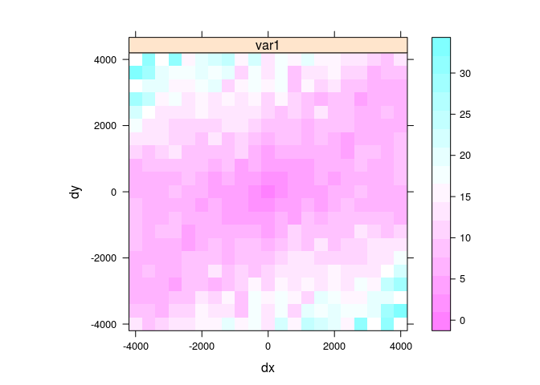

# Eksploracyjna analiza danych - geostatystyka

## Interpolacja 

### Modele deterministyczne
- Parametry tych modeli są zazwyczaj ustalane w oparciu o funkcję odległości lub powierzchni. Brakuje również szacunków na temat oceny błędu modelu. Np:
    - Funkcje wielomianowe
    - Funkcje sklejane (ang. *splines*)
    - Triangulacje 
    - IDW (ang. *Inverse Distance Weighted*)

http://neondataskills.org/Data-Workshops/ESA15-Going-On-The-Grid-Spatial-Interpolation-Basics/

### Modele deterministyczne 


```r
library('fields')
```

```
## Loading required package: methods
```

```
## Loading required package: spam
```

```
## Loading required package: grid
```

```
## Spam version 1.3-0 (2015-10-24) is loaded.
## Type 'help( Spam)' or 'demo( spam)' for a short introduction 
## and overview of this package.
## Help for individual functions is also obtained by adding the
## suffix '.spam' to the function name, e.g. 'help( chol.spam)'.
```

```
## 
## Attaching package: 'spam'
```

```
## The following objects are masked from 'package:base':
## 
##     backsolve, forwardsolve
```

```
## Loading required package: maps
```

```
## 
##  # maps v3.1: updated 'world': all lakes moved to separate new #
##  # 'lakes' database. Type '?world' or 'news(package="maps")'.  #
```

```r
library('sp')
library('raster')
library('gstat')
library('rgdal')
```

```
## rgdal: version: 1.1-3, (SVN revision 594)
##  Geospatial Data Abstraction Library extensions to R successfully loaded
##  Loaded GDAL runtime: GDAL 1.11.2, released 2015/02/10
##  Path to GDAL shared files: /usr/share/gdal/1.11
##  Loaded PROJ.4 runtime: Rel. 4.8.0, 6 March 2012, [PJ_VERSION: 480]
##  Path to PROJ.4 shared files: (autodetected)
##  Linking to sp version: 1.2-1
```

```r
punkty <- read.csv('dane/punkty.csv')
coordinates(punkty) <- ~x+y
proj4string(punkty) <- '+init=epsg:2180'
ras <- raster('dane/siatka.tif')
crs(ras) <- proj4string(punkty)
grid <- as(ras, "SpatialGridDataFrame")
granica <- readOGR("dane", "granica")
```

```
## OGR data source with driver: ESRI Shapefile 
## Source: "dane", layer: "granica"
## with 1 features
## It has 3 fields
```

### Modele deterministyczne | Funkcje wielomianowe


```r
wielomian_1 <- gstat(formula=temp~1, data=punkty, degree=1)
wielomian_1_pred <- predict(wielomian_1, newdata=grid)
```

```
## [ordinary or weighted least squares prediction]
```

```r
spplot(wielomian_1_pred[1], contour=TRUE,main="Powierzchnia trendu - wielomian pierwszego stopnia")
```

<!-- -->

```r
wielomian_2 <- gstat(formula=temp~1, data=punkty, degree=2)
wielomian_2_pred <- predict(wielomian_2, newdata=grid)
```

```
## [ordinary or weighted least squares prediction]
```

```r
spplot(wielomian_2_pred[1], contour=TRUE,main="Powierzchnia trendu - wielomian drugiego stopnia")
```

<!-- -->

```r
wielomian_3 <- gstat(formula=temp~1, data=punkty, degree=3)
wielomian_3_pred <- predict(wielomian_3, newdata=grid)
```

```
## [ordinary or weighted least squares prediction]
```

```r
spplot(wielomian_3_pred[1], contour=TRUE,main="Powierzchnia trendu - wielomian trzeciego stopnia")
```

<!-- -->

<!--
library('rasterVis')
xx <- as(wielomian_1_pred[1], "SpatialPointsDataFrame")
raster <- raster(extent(wielomian_1_pred))
res(raster) <- c(100, 100)
raster <- rasterize(x=xx, y=raster)
plot3D(raster[[1]])
-->

### Modele deterministyczne | Funkcje sklejane


```r
tps <- Tps(coordinates(punkty), punkty@data$temp)
spline <- interpolate(ras, tps)
spline <- mask(spline, ras)
spplot(spline, contour=TRUE , main="Funkcje sklejane")
```

<!-- -->


### Modele deterministyczne | Triangulacje (Thiessen)


```r
library('dismo')
voronoi_interp <- voronoi(punkty)
```

```
## Loading required namespace: deldir
```

```
## 
##      PLEASE NOTE:  The components "delsgs" and "summary" of the
##  object returned by deldir() are now DATA FRAMES rather than
##  matrices (as they were prior to release 0.0-18).
##  See help("deldir").
##  
##      PLEASE NOTE: The process that deldir() uses for determining
##  duplicated points has changed from that used in version
##  0.0-9 of this package (and previously). See help("deldir").
```

```r
voronoi_interp <- intersect(granica, voronoi_interp)
```

```
## Loading required namespace: rgeos
```

```
## Warning in intersect(granica, voronoi_interp): non identical CRS
```

```r
spplot(voronoi_interp, "temp", contour=TRUE, main="Poligony Voronoi'a")
```

<!-- -->

### Modele deterministyczne | IDW


```r
idw_wolin <- idw(temp~1, punkty, grid, idp=2)
```

```
## [inverse distance weighted interpolation]
```

```r
spplot(idw_wolin, 'var1.pred', contour=TRUE, main="IDW")
```

<!-- -->

<!--
dodaj wykresy idw
https://rpubs.com/DonalOLeary/80504
-->

### Modele deterministyczne | Porównanie

<!-- -->

### Modele statystyczne
- Parametry modeli są określane w oparciu o teorię prawdopodobieństwa. Dodatkowo wynik estymacji zawiera oszacowanie błędu. Np.:
    - Kriging
    - Modele regresyjne
    - Modele bayesowe
    - Modele hybrydowe

<!--
http://www.inside-r.org/packages/cran/raster/docs/interpolate

-->

## Geostatystyka - prolog

### Geostatystyka
- Zbiór narzędzi statystycznych uwzględniających w analizie danych ich przestrzenną i czasową lokalizację, a opartych o teorię funkcji losowych.

<!--
### Geostatystyka a klasyczna statystyka
- Isnieje informacja o lokalizacji obserwacji
-->

### Geostatystyka | Funkcje
- Identyfikacja i modelowanie struktury przestrzennej/czasowej zjawiska
- Estymacja - szacowanie wartości badanej zmiennej w nieopróbowanym miejscu i/lub momencie czasu
- Symulacja - generowanie alternatywnych obrazów, które honorują wyniki pomiarów i strukturę przestrzenną/czasową zjawiska
- Optymalizacja próbkowania/sieci pomiarowej 

### Geostatystyczna analiza danych


### Geostatystyka | Dane wejściowe
1. Wystarczająca duża liczba punktów (minimalnie >30, ale zazwyczaj więcej niż 100/150)
2. Są reprezentatywne
3. Są niezależne
4. Były stworzone używając stałej metodyki
5. Są wystarczająco dokładne

<!--
### Geostatystyka | Cele
- Charakterystyka struktury przestrzennej badanego zjawiska
- Uwzględnienie przestrzennych relacji między zmiennymi
- Interpolacja wartości
- Wizualizacja
- Określenie niepewności danych
- Stwierdzenie niepewności estymacji
-->

### Geostatystyka | Podstawowe etapy

1. Zaprojektowanie sposobu (typu) próbkowania oraz organizacji zadań
2. Zebranie danych, analiza labolatoryjna
3. Wstepna eksploracja danych, ocena ich jakości
4. Modelowanie semiwariogramów na podstawie dostępnych danych
5. Estymacja badanej cechy
6. Porównanie i ocena modeli
7. Stworzenie wynikowego produktu i jego dystrybucja

## Przestrzenna kowariancja, korelacja i semiwariancja

### Przestrzenna kowariancja, korelacja i semiwariancja | Założenia
1. Przestrzennej ciągłości - przestrzenna korelacja między zmienny w dwóch lokalizacjach zależy tylko od ich odległości (oraz czasem kierunku), lecz nie od tego gdzie są one położone
2. Stacjonarności - średnia i wariancja są stałe na całym badanym obszarze

### Przestrzenna kowariancja, korelacja i semiwariancja
- $u$ - wektor współrzędnych
- $z(u)$ - badana zmienna jako funkcja położenia - inaczej określany jako ogon (ang. *tail*)
- $h$ - lag - odstęp pomiędzy dwoma lokalizacjami
- $z(u+h)$ - wartość badanej zmiennej odległej o odstęp $h$ - inaczej określany jako głowa (ang. *head*)

### Przestrzenna kowariancja, korelacja i semiwariancja
- Kowariancja i korelacja to miary podobieństwa pomiędzy dwoma zmiennymi
- Przenosząc to na aspekt przestrzenny, badamy jedną zmienną ale pomiędzy dwoma punktami odległymi od siebie o pewien dystans (okreslany jako lag)
- W efekcie otrzymujemy miarę podobieństwa pomiędzy wartością głowy i ogona
- Trzecią miarę charakteryzującą relację między obserwacjami odległymi o kolejne odstępy jest semiwariancja
- Z praktycznego punktu widzenia, semiwariogram jest preferowaną miarą relacji przestrzennej, ponieważ wykazuje tendencję do lepszego wygładzania danych niż funkcja kowariancji
- Dodatkowo, semiwariogram jest mniej wymagający obliczeniowo
- Jednocześnie, dla potrzeb interpretacji relacji kowarancja i korelacja przestrzenna nadaje się nie gorzej niż semiwariancja

<!-- -->


### Wykres rozrzutu z przesunięciem


```r
hscat(temp~1, punkty, breaks=seq(0, 4000, by=500))
```

<!-- -->

### Autokowariancja
- Autokowariancja pokazuje jak mocno są ze sobą powiązane przestrzennie wartości pary obserwacji odległych od siebie o kolejne przedziały 


```r
kowario <- variogram(temp~1, punkty, covariogram = TRUE)
plot(kowario)
```

<!-- -->

### Autokorelacja
- Autokorelogram jest wykresem pokazującym jedną z miar autokorelacji (np. I Morana lub C Geary'ego) w stosunku do odległości
 

```r
library('pgirmess')
library('ggplot2')
wsp <- coordinates(punkty)
kor <- correlog(wsp, punkty$temp)
kor <- as.data.frame(kor)
ggplot(kor, aes(dist.class, coef)) + geom_smooth(linetype=0) + geom_line() + geom_point(size=5)
```

<!-- -->

### Semiwariancja
- Zmienność przestrzenna może być określona za pomocą semiwariancji. Jest to połowa średniej kwadratu różnicy pomiędzy wartościami badanej zmiennej w dwóch lokalizacjach odległych o wektor $h$
$$ \gamma(h) = \frac{1}{2}E[(z(s) - z(s+h))^2] $$

### Określenie występowania autokorelacji przestrzennej | Chmura semiwariogramu
- Jeżeli w badanej próbie mamy $n$ obserwacji oznacza to, że możemy zaobserwować $\frac{1}{2}n(n-1)$ par obserwacji
- Każda para obserwacji daje nam informacje o semiwariancji występującej wraz z odległością
- Semiwariancję można zaprezentować na wykresie zwanym chumrą semiwariogramu

### Semiwariancja | Przykładowe obliczenia


```r
odl <- dist(coordinates(punkty)[c(1, 2), ])
gamma <- 0.5 * (punkty$temp[1] - punkty$temp[2])^2
gamma
```

```
## [1] 0.5712228
```

### Określenie występowania autokorelacji przestrzennej | Chmura semiwariogramu


```r
library('gstat')
vario_cloud <- variogram(temp~1, punkty, cloud=TRUE)
plot(vario_cloud) 
```

<!-- -->

### Określenie występowania autokorelacji przestrzennej | Chmura semiwariogramu


```r
vario_cloud_sel <- plot(variogram(temp~1, punkty, cloud=TRUE), digitize=TRUE)
plot(vario_cloud_sel, punkty) 
```

### Semiwariogram | Charakterystyka struktury przestrzennej
- Semiwariogram to wykres pokazujący relację pomiędzy odległością a semiwariancją
- Jest to uśrednieniem semiwariancji dla kolejnych odstępów (lagów)
- W oparciu o semiwariogram empiryczny możemy następnie dopasować do niego model/e

$$ \hat{\gamma}(h) = \frac{1}{2N(h)}\sum_{i=1}^{N(h)}(z(s_i) - z(s_i+h))^2 $$

gdzie $N(h)$ oznacza liczbę par punktów w odstępie $h$

### Semiwariogram
- Nugget - efekt nuggetowy - pozwala na określenie błędu w danych wejściowych oraz zmienności na dystansie krótszym niż pierwszy odstęp
- Sill - semiwariancja progowa - oznacza wariancję badanej zmiennej
- Range - zasięg - to odległość do której istnieje przestrzenna korelacja

### Semiwariogram | Rules of thumb
- W każdym odstępie powinno się znaleźć co najmniej 30 par punktów
- Maksymalny zasięg semiwariogramu (ang. *cutoff distance*) to 1/2 pierwiastka z badanej powierzchni (inne źródła mówią o połowie z przekątnej badanego obszaru/jednej trzeciej)
- Liczba odstępów powinna nie być mniejsza niż 10
- Optymalnie maksymalny zasięg semiwariogramu powinien być dłuższy o 10-15% od zasięgu zjawiska
- Optymalnie odstępy powinny być jak najbliżej siebie i jednocześnie nie być chaotyczne
- Warto metodą prób i błędów określić optymalne parametry semiwariogramu
- Należy określić czy zjawisko wykazuje anizotropię przestrzenną

### Semiwariogram | Obliczenia pomocnicze
- Liczba par obserwacji


```r
0.5*length(punkty)*(length(punkty)-1)
```

```
## [1] 29646
```

- Połowa pierwiastka powierzchni


```r
pow <- area(granica)
as.vector(0.5*sqrt(pow))
```

```
## [1] 3980.472
```

 <!--
- Połowa przekątnej obszaru
Twierdzenie Pitagorasa

$$x^2 + y^2 = z^2$$


```r
wierz <- as.vector(extent(poligon))
kraw_x <- wierz[2] - wierz[1]
kraw_y <- wierz[4] - wierz[3]
z_kwadrat <- kraw_x^2 + kraw_y^2
0.5*sqrt(z_kwadrat)
```

-->
- Powierzchnia zajmowana przez jedną próbkę


```r
pow_pr <- area(granica)/length(punkty)
pow_pr
```

```
##        0 
## 259740.3
```

- Średnia odległość między punktami 


```r
sqrt(pow_pr)
```

```
##        0 
## 509.6473
```

### Semiwariogram | Maksymalny zasięg semiwariogramu (ang. *Cutoff distance*)
- Maksymalny zasięg semiwariogramu (ang. *Cutoff distance*) jest domyślnie wyliczany w pakiecie **gstat** jako 1/3 z najdłuższej przekątnej badanego obszaru


```r
vario_par <- variogram(temp~1, punkty)
vario_par
```

```
##      np      dist     gamma dir.hor dir.ver   id
## 1   106  216.1844  1.430239       0       0 var1
## 2   297  480.4988  2.917001       0       0 var1
## 3   483  809.9846  3.928418       0       0 var1
## 4   675 1120.7278  5.042605       0       0 var1
## 5   763 1435.6421  6.476427       0       0 var1
## 6   939 1751.4373  7.497110       0       0 var1
## 7  1038 2060.9052  8.419728       0       0 var1
## 8  1173 2375.2790  9.523110       0       0 var1
## 9  1284 2698.7080  9.853235       0       0 var1
## 10 1336 3010.7474 10.612134       0       0 var1
## 11 1346 3328.7317 10.364951       0       0 var1
## 12 1380 3647.2702 10.789531       0       0 var1
## 13 1426 3963.2623 12.021108       0       0 var1
## 14 1299 4280.0420 12.515079       0       0 var1
## 15 1431 4599.6926 14.808762       0       0 var1
```

```r
plot(vario_par, plot.numbers=TRUE)
```

<!-- -->

```r
vario_par <- variogram(temp~1, punkty, cutoff = 4000)
plot(vario_par)
```

<!-- -->

### Semiwariogram | Odległość między przedziałami (ang, *Interval width *)
- Domyślnie to maksymalny zasięg semiwariogramu podzielony przez 15 dahe odległość między przedziałami  (ang, *Interval width *)


```r
vario_par <- variogram(temp~1, punkty, cutoff = 1000, width = 250)
plot(vario_par)
```

<!-- -->

<!--
## Wpływa danych odstających

Tak jak inne statystyki typu wariancji, wartości kowariancji i semiwariogramu są bardzo czułe na występowanie danych ekstremalnych – potencjalnie błędnych. Stosuje się trzy sposoby aby ten problem rozwiązać:
Transformację matematyczną danych (logarytmowanie, pierwiastkowanie itp.) , aby zredukować skośność ich histogramu,
Usuwanie par danych, które zaburzają wartość semiwariancji dla określonych odstępów h. Procedura ta zwana jest czyszczeniem wykresu rozrzutu z przesunięciem („h-scattergram cleansing”).
Używanie innych statystyk h-scattergramu, które są mniej czułe na występowanie danych ekstremalnych.
### Rodogram/madogram


```r
# library('SpatialExtremes')
# n.site <- 15
# locations <- matrix(runif(2*n.site, 0, 10), ncol = 2)
# colnames(locations) <- c("lon", "lat")
# 
# ##Simulate a max-stable process - with unit Frechet margins
# data <- rmaxstab(40, locations, cov.mod = "whitmat", nugget = 0, range = 1,
#                  smooth = 2)
# 
# ##Compute the madogram
# madogram(data, locations)
# data2 <- matrix(c(punkty$temp, punkty$X2002.08.20_NDVI), nrow=2)
# locations2 <- coordinates(punkty)
# colnames(locations2) <- c("lon", "lat")
# madogram(data2, locations2)
```

-->

## Anizotropia

### Anizotropia struktury przestrzennej
- W wielu rzeczywistych sytuacjach, wartość cechy zależy nie tylko od odległości, ale także od kierunku

### Mapa semiwariogramu
- Mapa semiwariogramu (powierzchnia semiwariogramu) służy do określenia czy struktura przestrzenna zjawiska posiada anizotropię, a jeżeli tak to w jakim kierunku
- Na podstawie mapy semiwariogramu identyfikuje się parametry potrzebne do zbudowania semiwariogramów kierunkowych


```r
vario_map <- variogram(temp~1, punkty, cutoff=4000, width=400, map=TRUE)
plot(vario_map, threshold=30) # co najmniej 30 par punktów
```

<!-- -->

### Mapa semiwariogramu | 3D


```r
library('rasterVis')
plot3D(raster(vario_map$map), col=rainbow)
```

### Semiwariogramy kierunkowe | Kierunki
- W przypadku, gdy zjawisko wykazuje anizotropię przestrzenną, możliwe jest stworzenie semiwariogramów dla różnych wybranych kierunków
- Przykładowo, dla argumentu *alpha = c(0, 45, 90, 135)* cztery główne kierunki to 0, 45, 90 i 135 stopni. Oznacza to, że dla kierunku 45 stopni brane pod uwagę będą wszystkie pary punktów pomiędzy 22,5 a 67,5 stopnia.


```r
vario_kier <- variogram(temp~1, punkty, alpha = c(0, 45, 90, 135))
plot(vario_kier)
```

<!-- -->

### Semiwariogramy kierunkowe | Kierunki
 

```r
vario_kier <- variogram(temp~1, punkty, alpha = c(60, 105, 150, 195))
plot(vario_kier)
```

<!-- -->


<!--
Kroskowariogramy
Kroskorelogramy
-->

## Krossemiwariogramy
### Krossemiwariogramy
- Krossemiwariogram jest to wariancja różnicy pomiędzy dwiema zmiennymi w dwóch lokalizacjach
- Wyliczając Krossemiwariogram otrzymujemy empiryczne semiwatiogramy dla dwóch badanych zmiennych oraz kroswariogram dla kombinacji dwóch zmiennych
- Krossemiwariogram znajduje swoje zastosowanie w technice zwanej kokrigingiem

### Krossemiwariogramy

toDo
<!--


```r
library('sp')
punkty <- read.csv('dane/punkty.csv')
coordinates(punkty) <- ~x+y
proj4string(punkty) <- '+init=epsg:2180'

punkty_255 <- punkty[!is.na(punkty$X1999.09.13_TPZ), ]
punkty_750 <- punkty

library('gstat')
g <- gstat(NULL, id="TPZ1999", form = X1999.09.13_TPZ~1, data = punkty_255)
g <- gstat(g, id="TPZ2000", form = temp~1, data = punkty_750)
g
plot(variogram(g))
```

### Krossemiwariogramy


```r
# plot(variogram(g, map=TRUE, cutoff=12000, width=800))
plot(variogram(g, alpha = c(60, 105, 150, 195)))
```

-->
