# Modelowanie matematycznie autokorelacji przestrzennej


### Modelowanie matematycznie autokorelacji przestrzennej
- Semiwariogram empiryczny jest:
    - Nieciągły - wartości semiwariancji są średnimi przedziałowymi
    - Chaotyczny - badana próba jest jedynie przybliżeniem rzeczywistości, dodatkowo obciążonym błędami
- Estymacje i symulacje przestrzenne wymagają modelu struktury przestrzennej analizowanej cechy, a nie tylko wartości empirycznych (wyliczonych z danych)
- Dodatkowo, matematycznie modelowanie wygładza chaotyczne fluktuacje danych empirycznych

## Modele podstawowe 

### Modele podstawowe 
- Nuggetowy (ang. *Nugget effect model*)
- Sferyczny (ang. *Spherical model*)
- Gaussowski (ang. *Gaussian model*)
- Potęgowy (ang. *Power model*)
- Wykładniczy (ang. *Exponential model*)
- Inne


```r
library('gstat')
vgm()
```

```
##    short                                      long
## 1    Nug                              Nug (nugget)
## 2    Exp                         Exp (exponential)
## 3    Sph                           Sph (spherical)
## 4    Gau                            Gau (gaussian)
## 5    Exc               Exclass (Exponential class)
## 6    Mat                              Mat (Matern)
## 7    Ste Mat (Matern, M. Stein's parameterization)
## 8    Cir                            Cir (circular)
## 9    Lin                              Lin (linear)
## 10   Bes                              Bes (bessel)
## 11   Pen                      Pen (pentaspherical)
## 12   Per                            Per (periodic)
## 13   Wav                                Wav (wave)
## 14   Hol                                Hol (hole)
## 15   Log                         Log (logarithmic)
## 16   Pow                               Pow (power)
## 17   Spl                              Spl (spline)
## 18   Leg                            Leg (Legendre)
## 19   Err                   Err (Measurement error)
## 20   Int                           Int (Intercept)
```


```r
show.vgms()
```

<!-- -->


```r
show.vgms(models=c("Nug", "Sph", "Gau", "Pow", "Exp"), range=1.4, max=2.5)
```

<!-- -->


```r
show.vgms(models=c("Nug", "Sph", "Gau", "Pow", "Exp"), range=1.4, max=2.5, as.groups = TRUE)
```

<!-- -->

## Metody modelowania

### Metody modelowania
- Ustawianie "ręczne" parametrów modelu, np. funkcja *vgm* z pakietu **gstat**
- Ustawianie "wizualne" parametrów modelu, np. funkcja *eyefit* z pakietu **geoR**
- Automatyczny wybór parametrów na podstawie różnych kryterów statystycznych, np. funkcja *fit.variogram* z pakietu **gstat**, *variofit* z pakietu **geoR**, *autofitVariogram* z pakietu **automap**

### Metody modelowania
- Odpowiednie określenie modelu matematycznego często nie jest proste
- Automatyczne metody nie zawsze są w stanie dać lepszy wynik od modelowania "ręcznego"
- Najlepiej, gdy wybór modelu oparty jest o wiedzę na temat zakładanego procesu przestrzennego

### Metody modelowania | Liniowy model regionalizacji
- W przypadku, gdy analizowane zjawisko jest złożone, odwzorowanie kształtu semiwariogramu empirycznego wymaga połączenia dwóch lub większej liczby modeli podstawowych
- W takiej sytuacji konieczne jest spełnienie dwóch warunków:
    - Wszystkie zastosowane modele muszą być dopuszczalne (*vgm()*)
    - Wariancja progowa każdego podstawowego modelu musi być dodatnia

## Modelowanie semiwariogramu
### Modelowanie semiwariogramu | funkcja *fit.variogram*
- Funkcja *fit.variogram* dopasowuje zasięg oraz semiwariancję progową w oparciu o ustalone "ręcznie" parametry modelu

<!--
 Modelowanie semiwariogramu


-->

## Modelowanie izotropowe

### Modelowanie izotropowe | Modelowanie "wizualne"


```r
library('geoR')
v_eye <- eyefit(variog(as.geodata(punkty, "temp")))
ve_fit <- as.vgm.variomodel(v_eye[[1]])
```

### Modelowanie izotropowe | Model nuggetowy


```r
library('raster')
library('gstat')
vario <- variogram(temp~1, punkty)
plot(vario)
```

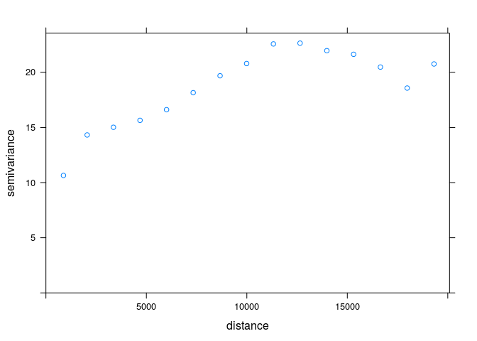<!-- -->

```r
model_nug <- vgm(10, model = 'Nug')
model_nug
```

```
##   model psill range
## 1   Nug    10     0
```

```r
plot(vario, model=model_nug)
```

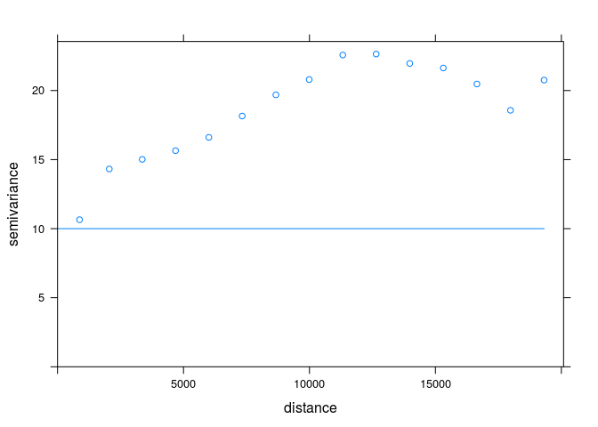<!-- -->

```r
fitted_nug <- fit.variogram(vario, model_nug)
fitted_nug
```

```
##   model    psill range
## 1   Nug 4.356675     0
```

```r
plot(vario, model=fitted_nug)
```

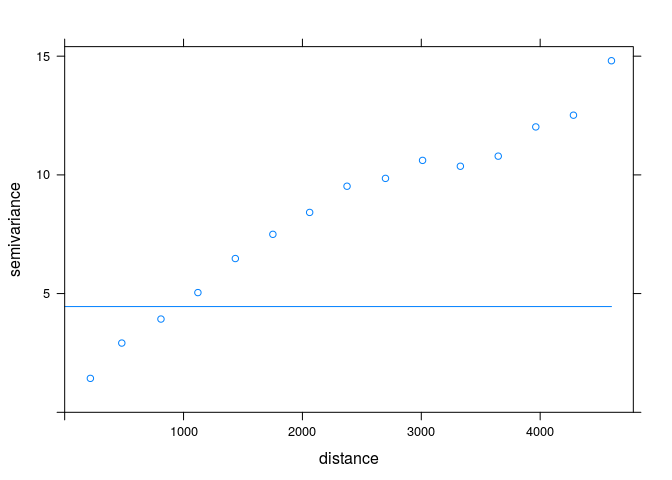<!-- -->

### Modelowanie izotropowe | Model sferyczny


```r
vario <- variogram(temp~1, punkty)
plot(vario)
```

<!-- -->

```r
model_sph <- vgm(psill=10, model = 'Sph', range=3000)
model_sph
```

```
##   model psill range
## 1   Sph    10  3000
```

```r
plot(vario, model=model_sph)
```

<!-- -->

```r
fitted_sph <- fit.variogram(vario, model_sph)
fitted_sph
```

```
##   model   psill    range
## 1   Sph 13.5325 4570.822
```

```r
plot(vario, model=fitted_sph)
```

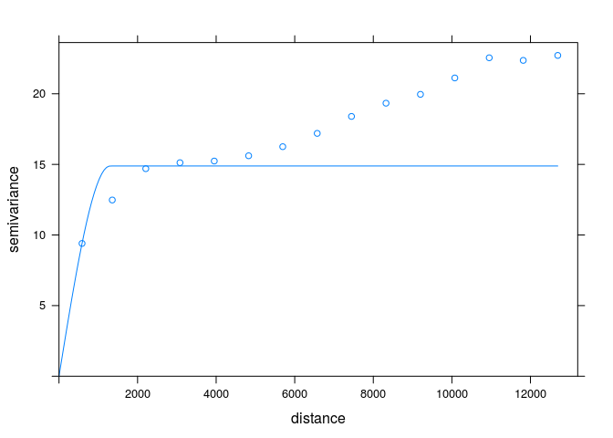<!-- -->

### Modelowanie izotropowe | Model Gaussowski


```r
vario <- variogram(temp~1, punkty)
plot(vario)
```

<!-- -->

```r
model_gau <- vgm(psill=15, model = 'Gau', range=3000)
model_gau
```

```
##   model psill range
## 1   Gau    15  3000
```

```r
plot(vario, model=model_gau)
```

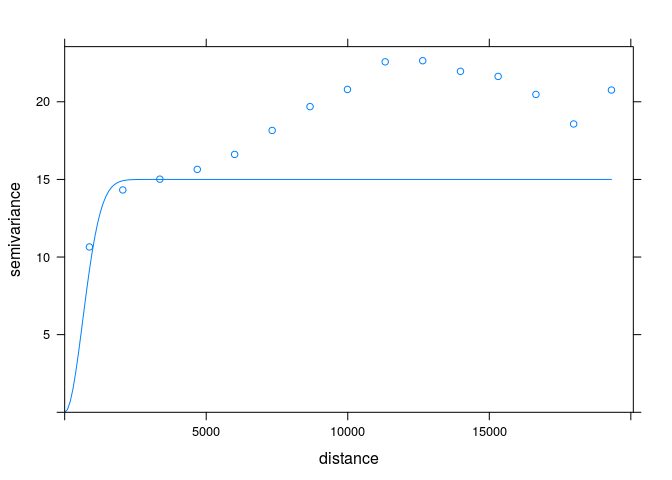<!-- -->

```r
fitted_gau <- fit.variogram(vario, model_gau)
fitted_gau
```

```
##   model    psill    range
## 1   Gau 8.361489 761.2621
```

```r
plot(vario, model=fitted_gau)
```

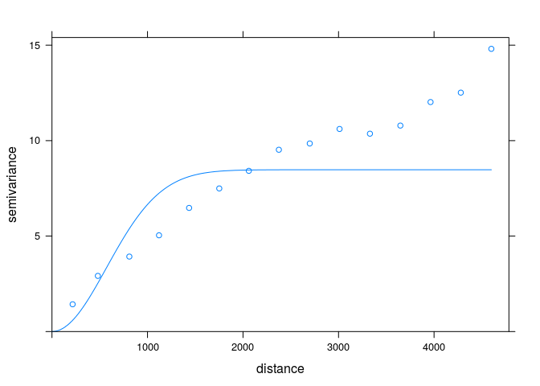<!-- -->

### Modelowanie izotropowe | Model potęgowy


```r
vario <- variogram(temp~1, punkty)
plot(vario)
```

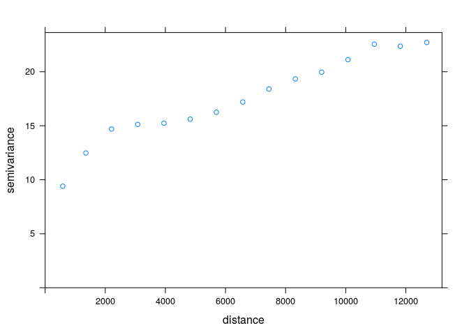<!-- -->

```r
model_pow <- vgm(psill=1, model = 'Pow', range=0.30)
model_pow
```

```
##   model psill range
## 1   Pow     1   0.3
```

```r
plot(vario, model=model_pow)
```

<!-- -->

```r
fitted_pow <- fit.variogram(vario, model_pow)
fitted_pow
```

```
##   model      psill     range
## 1   Pow 0.02920527 0.7371518
```

```r
plot(vario, model=fitted_pow)
```

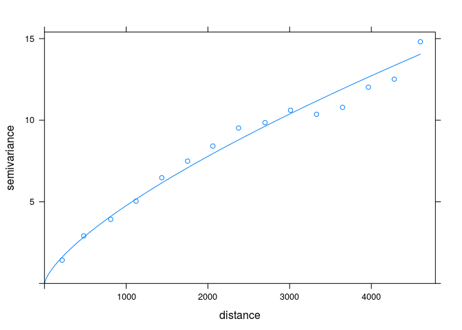<!-- -->

### Modelowanie izotropowe | Model wykładniczy


```r
vario <- variogram(temp~1, punkty)
plot(vario)
```

<!-- -->

```r
model_exp <- vgm(psill=10, model = 'Exp', range=900)
model_exp
```

```
##   model psill range
## 1   Exp    10   900
```

```r
plot(vario, model=model_exp)
```

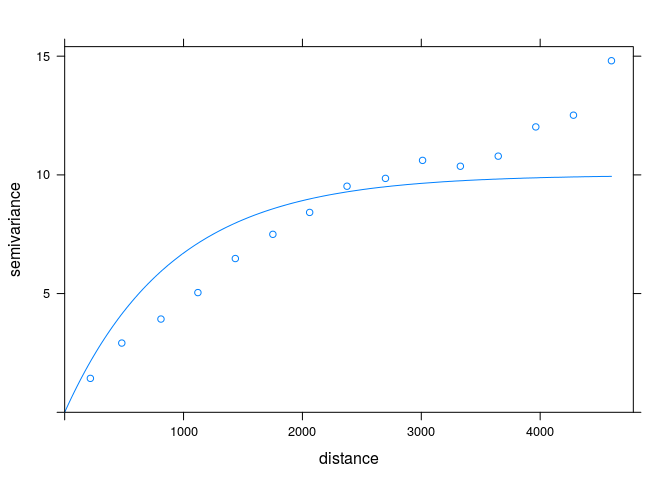<!-- -->

```r
fitted_exp <- fit.variogram(vario, model_exp)
fitted_exp
```

```
##   model   psill    range
## 1   Exp 17.9672 3217.767
```

```r
plot(vario, model=fitted_exp)
```

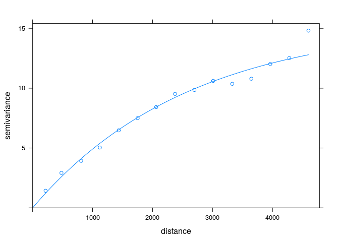<!-- -->

### Modelowanie izotropowe | Modele złożone I


```r
vario <- variogram(temp~1, punkty)
model_zl1 <- vgm(psill=10, model = 'Sph', range = 3000, add.to = vgm(0.5, "Nug"))
model_zl1
```

```
##   model psill range
## 1   Nug   0.5     0
## 2   Sph  10.0  3000
```

```r
plot(vario, model=model_zl1)
```

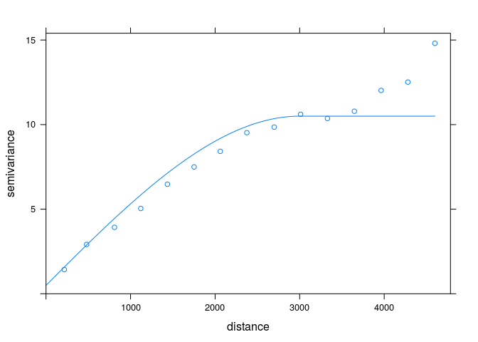<!-- -->

```r
fitted_zl1 <- fit.variogram(vario, model_zl1)
fitted_zl1
```

```
##   model      psill    range
## 1   Nug  0.8981984    0.000
## 2   Sph 14.8165152 6117.773
```

```r
plot(vario, model=fitted_zl1)
```

<!-- -->

### Modelowanie izotropowe | Modele złożone II


```r
vario <- variogram(temp~1, punkty)
model_zl2 <- vgm(2, "Gau", 3000, add.to = vgm(8, model = 'Sph', range = 2000, nugget = 0.5))
model_zl2
```

```
##   model psill range
## 1   Nug   0.5     0
## 2   Sph   8.0  2000
## 3   Gau   2.0  3000
```

```r
plot(vario, model=model_zl2)
```

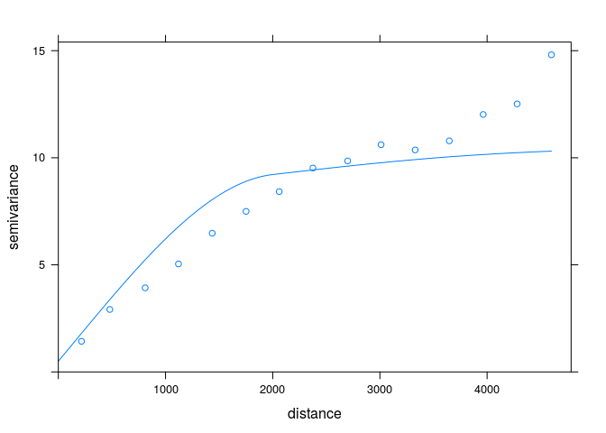<!-- -->

```r
fitted_zl2 <- fit.variogram(vario, model_zl2)
plot(vario, model=fitted_zl2)
```

<!-- -->

## Modelowanie anizotropowe

### Anizotropia
- Uwzględnienie anizotropii wymaga zamiany parametru zasięgu na trzy inne parametry:
- Zasięg w dominującym kierunku
- Kąt określający dominujący kierunek
- Proporcję anizotropii, czyli relację pomiędzy zasięgiem w dominującym kierunku a zasięgiem w przeciwległym kierunku


```r
vario_map <- variogram(temp~1, punkty, cutoff=4000, width=400, map=TRUE)
plot(vario_map)
```

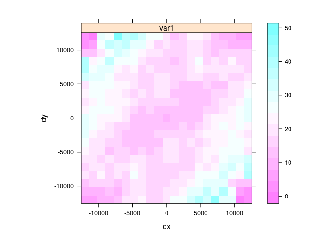<!-- -->

```r
vario_kier <- variogram(temp~1, punkty, alpha = c(60, 105, 150, 195), cutoff=20000)
plot(vario_kier, plot.numbers=TRUE)
```

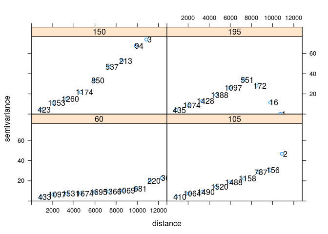<!-- -->

```r
vario_kier_fit <- vgm(psill=8, model="Sph", range=4000, nugget=0.5, anis = c(60, .4))
plot(vario_kier, vario_kier_fit, as.table=TRUE)
```

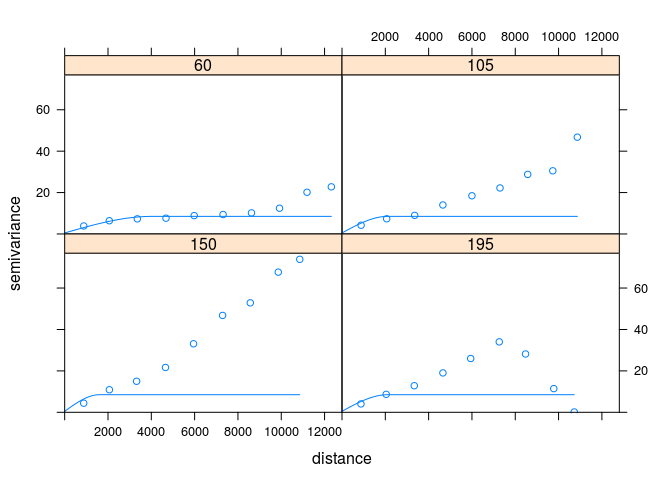<!-- -->

## Modelowanie krossemiwariogramów
### Modelowanie krossemiwariogramów | *fit.lmc*
- Funkcja *fit.lmc* dopasowuje liniowy model koregionalizacji do semiwariogramów wielozmienych 

### Modelowanie krossemiwariogramów


```r
punkty_ndvi <- read.csv('dane/punkty_ndvi.csv')
coordinates(punkty_ndvi) <- ~x+y
proj4string(punkty_ndvi) <- '+init=epsg:2180'

library('gstat')
g <- gstat(NULL, id="SAVI", form = savi~1, data = punkty)
g <- gstat(g, id="NDVI", form = ndvi~1, data = punkty_ndvi)
g
v <- variogram(g)
plot(v)
g <- gstat(g, model=vgm(0.006, "Sph", 2000, 0.001), fill.all=TRUE)
g_fit <- fit.lmc(v, g, fit.method=1)
g_fit
plot(v, g_fit)
```
