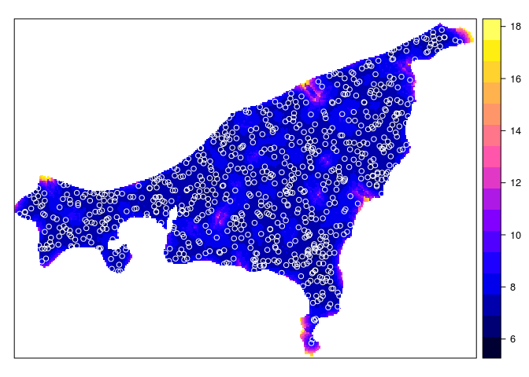
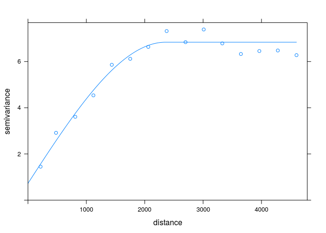
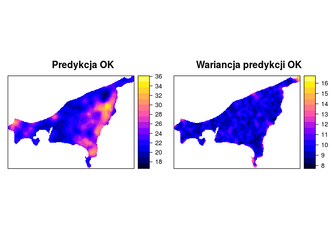

# Estymacje jednozmienne


## Kriging

### Kriging | Interpolacja geostatystyczna
- Zaproponowana w latach 50. przez Daniela Krige
- Istnieje wiele rodzajów krigingu
- Główna zasada mówi, że prognoza w danej lokalizacji jest kombinacją obokległych obserwacji
- Waga nadawana każdej z obserwacji jest zależna od stopnia (przestrzennej) korelacji - stąd też bierze się istotna rola semiwariogramów

## Rodzaje krigingu
### Rodzaje krigingu
- Kriging prosty (ang. *Simple kriging*)
- Kriging zwykły (ang. *Ordinary kriging*)
- Kriging z trendem (ang. *Kriging with a trend*)
- Kriging stratyfikowany (ang. *Kriging within strata* – KWS)
- Kriging prosty ze zmiennymi średnimi lokalnymi (ang. *Simple kriging with varying local means* - SKlm)
- Kriging z zewnętrznym trendem/Uniwersalny kriging (ang.*Kriging with an external trend/Universal kriging*)
- Kriging danych kodowanych (ang. *Indicator kriging*)
- Kokriging (ang. *Co-kriging*)
- Inne


## Kriging prosty (ang. *Simple kriging*)
### Kriging prosty (ang. *Simple kriging*)
- Zakłada, że średnia jest znana i stała na całym obszarze

### Kriging prosty (ang. *Simple kriging*)


```r
library('raster')
ras <- raster('data/siatka_raster.tif')
grid <- as(ras, "SpatialGridDataFrame")
proj4string(grid) <- proj4string(wolin_lato_los)

library('gstat')
vario <- variogram(X2002.08.20_TPZ~1, wolin_lato_los)
model_zl2 <- vgm(10, model = 'Sph', range = 4000, add.to = vgm(5, "Gau", 8000, nugget = 5))
model_zl2
```

```
##   model psill range
## 1   Nug     5     0
## 2   Gau     5  8000
## 3   Sph    10  4000
```

```r
fitted_zl2 <- fit.variogram(vario, model_zl2)
plot(vario, model=fitted_zl2)
```

<!-- -->

```r
sk <- krige(X2002.08.20_TPZ~1, wolin_lato_los, grid, model=model_zl2, beta=23.6)
```

```
## [using simple kriging]
```

```r
summary(sk)
```

```
## Object of class SpatialGridDataFrame
## Coordinates:
##          min       max
## s1  451080.5  484780.5
## s2 5961519.5 5986319.5
## Is projected: TRUE 
## proj4string :
## [+init=epsg:32633 +proj=utm +zone=33 +datum=WGS84 +units=m +no_defs
## +ellps=WGS84 +towgs84=0,0,0]
## Grid attributes:
##    cellcentre.offset cellsize cells.dim
## s1          451130.5      100       337
## s2         5961569.5      100       248
## Data attributes:
##    var1.pred        var1.var    
##  Min.   :18.14   Min.   : 6.05  
##  1st Qu.:21.01   1st Qu.: 6.91  
##  Median :22.40   Median : 7.20  
##  Mean   :23.41   Mean   : 7.34  
##  3rd Qu.:25.41   3rd Qu.: 7.57  
##  Max.   :35.49   Max.   :15.74  
##  NA's   :57412   NA's   :57412
```

```r
spplot(sk, "var1.pred")
spplot(sk, "var1.var")
```
<!-- -->


## Kriging zwykły (ang. *Ordinary kriging*)
### Kriging zwykły (ang. *Ordinary kriging*)
- Średnia traktowana jest jako nieznana
- Uwzględnia lokalne fluktuacje średniej poprzez stosowanie ruchomego okna

### Kriging zwykły  (ang. *Ordinary kriging*)


```r
ok <- krige(X2002.08.20_TPZ~1, wolin_lato_los, grid, model=model_zl2, maxdist=1000)
```

```
## [using ordinary kriging]
```

```r
spplot(ok, "var1.pred")
spplot(ok, "var1.var")
```
<!-- -->


<!--


```r
spplot(ok, "var1.pred", sp.layout=list(wolin_lato_los, pch=21, col="white"))
```

<!-- -->

```r
spplot(ok, "var1.var", sp.layout=list(wolin_lato_los, pch=21, col="white"))
```

<!-- -->


-->
## Kriging z trendem (ang. *Kriging with a trend*)
### Kriging z trendem (ang. *Kriging with a trend*)


```r
vario_kzt <- variogram(X2002.08.20_TPZ~X+Y, data=wolin_lato_los)
plot(vario_kzt)
```

<!-- -->

```r
model_kzt <- vgm(psill = 17, model = 'Sph', range = 12000, nugget = 5)
fitted_kzt <- fit.variogram(vario_kzt, model_kzt)
fitted_kzt
```

```
##   model    psill    range
## 1   Nug 6.931465    0.000
## 2   Sph 8.460149 2930.277
```

```r
plot(vario_kzt, fitted_kzt)
```

<!-- -->

```r
grid_sp <- as(ras, "SpatialPixelsDataFrame")
proj4string(grid_sp) <- proj4string(wolin_lato_los)
grid_sp@data <- as.data.frame(coordinates(grid_sp))
names(grid_sp) <- c("X", "Y")

wolin_lato_los@data <- cbind(wolin_lato_los@data, as.data.frame(coordinates(wolin_lato_los)))
kzt <- krige(X2002.08.20_TPZ~X+Y, wolin_lato_los, grid_sp, model=fitted_kzt)
```

```
## [using universal kriging]
```

```r
spplot(kzt, "var1.pred")
spplot(kzt, "var1.var")
```
<!-- -->


## Porównanie wyników SK, OK i KZT


<!-- -->


