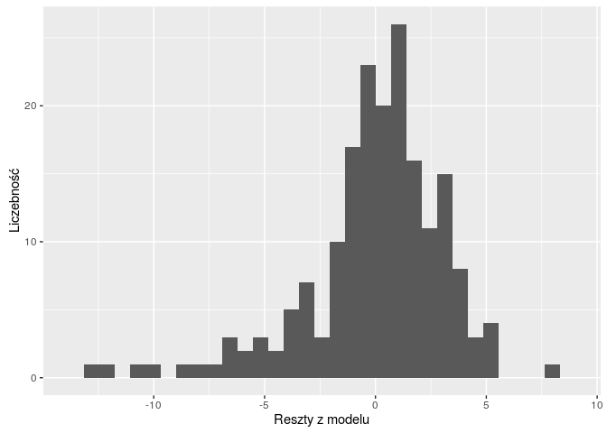
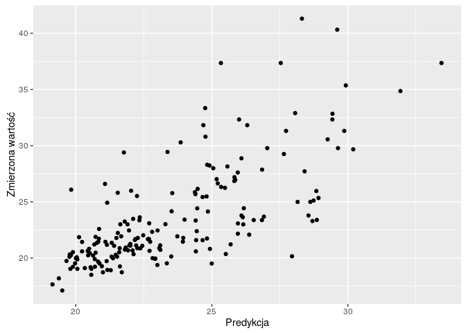
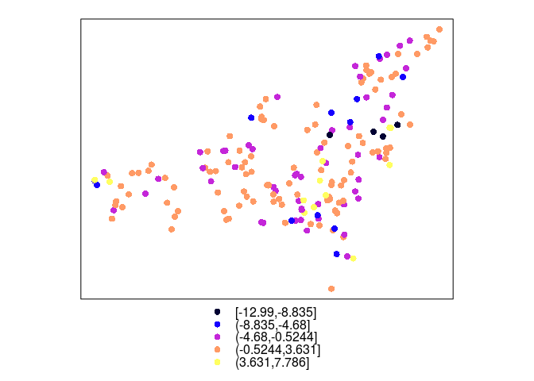
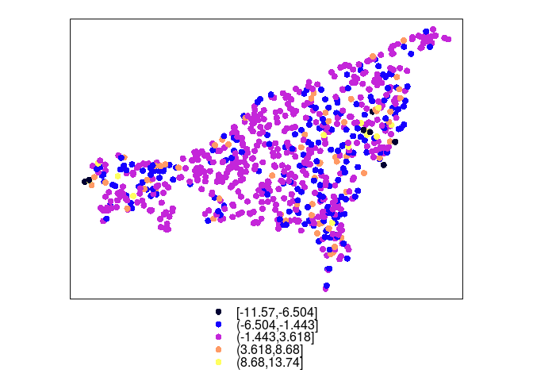

# Ocena jakości estymacji [UWAGA POMIESZANY ME Z RESZTĄ!!]


## Statystyki jakości estymacji
### Statystyki jakości estymacji
- Służą do oceny i porównania jakości estymacji
- Do podstawowych statystyk ocen jakości estymacji należą:
    - Średni błąd estymacji (ME, ang. *mean error*)
    - Pierwiastek średniego błędu kwadratowego (RMSE, ang. *root square prediction error*)
    - Współczynnik korelacji
    - Rozkład błędu (np. 5. percentyl, mediana, 95. percentyl)
    
### Statystyki jakości estymacji
- Idealna estymacja dawałaby brak błędu oraz wspołczynnik korelacji pomiędzy pomiarami (całą populacją) i szacunkiem równy 1
- Wysokie, pojedyncze wartości błędu mogą świadczyć, np. o wystapieniu wartości odstających

### Średni błąd estymacji
- Optymalnie wartość średniego błędu estymacji powinna być jak najbliżej 0

$$ ME=\frac{\sum_{i=1}^{n}(\hat{v}_i-v_i)}{n} $$     

### Pierwiastek średniego błędu kwadratowego
- Optymalnie wartość pierwiastka średniego błędu kwadratowego powinna być jak najmniejsza

$$ RMSE=\sqrt{\frac{\sum_{i=1}^{n}(\hat{v}_i-v_i)^2}{n}} $$     

### Współczynnik korelacji
- Optymalnie wartość współczynnika korelacji powinna być jak najwyższa

### Statystyki jakości estymacji | Mapa


```
## [using simple kriging]
```

<!-- -->

### Statystyki jakości estymacji | Histogram

<!-- -->

### Statystyki jakości estymacji | Wykres rozrzutu

<!-- -->

## Walidacja wyników estymacji

### Walidacja wyników estymacji
- Dokładne dopasowanie modelu do danych może w efekcie nie dawać najlepszych wyników
- W efekcie ważne jest stosowanie metod pozwalających na wybranie optymalnego modelu
- Do takich metod należy, między innymi, walidacja podzbiorem (ang. *jackknifing*) oraz kroswalidacja (ang. *crossvalidation*)

### Walidacja podzbiorem 
- Polega na podziale zbioru danych na dwa podzbiory - treningowy i testowy
- Zbiór treningowy służy do estymacji wartości
- Wynik estymacji porównywany jest z rzeczywistymi wartościami ze zbioru testowego
- Zaletą tego podejścia jest stosowanie danych niezależnych od estymacji
- Wadą jest konieczność posiadania dużego zbioru danych

### Walidacja podzbiorem 


```r
library('caret')
set.seed(124)
indeks <- as.vector(createDataPartition(punkty$temp, p=0.75, list=FALSE))
indeks
```

```
##   [1]   1   2   5   6   7   8   9  10  11  12  15  16  17  18  20  21  23
##  [18]  24  25  26  28  30  31  32  33  34  35  36  38  39  41  42  44  45
##  [35]  46  47  48  51  53  54  59  60  63  65  66  67  71  72  73  74  75
##  [52]  77  78  81  82  83  84  85  86  87  88  89  90  91  92  93  94  95
##  [69]  96  98  99 100 101 102 103 105 106 107 108 109 110 111 112 116 117
##  [86] 118 119 120 121 122 123 126 128 129 130 132 134 135 136 138 139 140
## [103] 141 142 144 145 146 147 148 149 150 151 153 154 155 156 158 159 161
## [120] 162 163 164 166 167 169 171 172 174 175 176 177 178 179 180 181 183
## [137] 184 185 186 187 188 189 190 191 193 194 195 196 197 198 199 200 201
## [154] 203 204 206 207 210 211 212 213 214 215 216 217 218 219 220 221 223
## [171] 224 226 227 228 229 231 232 234 235 236 237 238 242 244
```

```r
train <- punkty[indeks, ]
test <- punkty[-indeks, ]
vario <- variogram(temp~1, data=train)
model <- vgm(10, model = 'Sph', range = 4000, nugget = 0.5)
fitted <- fit.variogram(vario, model)
plot(vario, model=fitted)
```

<!-- -->

```r
test_sk <- krige(temp~1, train, test, model=fitted, beta=15.324)
```

```
## [using simple kriging]
```

```r
summary(test_sk)
```

```
## Object of class SpatialPointsDataFrame
## Coordinates:
##        min      max
## x 745638.8 756082.1
## y 712705.0 721228.1
## Is projected: TRUE 
## proj4string :
## [+init=epsg:2180 +proj=tmerc +lat_0=0 +lon_0=19 +k=0.9993
## +x_0=500000 +y_0=-5300000 +ellps=GRS80 +towgs84=0,0,0,0,0,0,0
## +units=m +no_defs]
## Number of points: 60
## Data attributes:
##    var1.pred         var1.var    
##  Min.   : 9.394   Min.   :1.258  
##  1st Qu.:12.344   1st Qu.:2.085  
##  Median :14.218   Median :2.480  
##  Mean   :15.017   Mean   :2.544  
##  3rd Qu.:17.529   3rd Qu.:3.001  
##  Max.   :22.963   Max.   :4.021
```

```r
reszta_sk <-  test_sk$var1.pred - test$temp
summary(reszta_sk)
```

```
##    Min. 1st Qu.  Median    Mean 3rd Qu.    Max. 
## -4.1530 -1.1090 -0.2059 -0.1075  0.6296  6.6670
```

```r
ME <- sum(reszta_sk)/length(reszta_sk)
ME
```

```
## [1] -0.1075438
```

```r
RMSE <- sqrt(sum(reszta_sk^2)/length(reszta_sk))
RMSE
```

```
## [1] 2.008649
```

```r
srednia_reszta <- test$temp - mean(test$temp)
R2 <- 1 - sum(reszta_sk^2)/sum(srednia_reszta^2)
R2
```

```
## [1] 0.68205
```

```r
test_sk$reszty <- reszta_sk
spplot(test_sk, "reszty")
```

<!-- -->


### Kroswalidacja
- W przypadku kroswalidacji te same dane wykorzystywane są do budowy modelu, estymacji, a następnie do oceny prognozy
- Procedura kroswalidacji LOO (ang. *leave-one-out cross-validation*)

1. Zbudowanie matematycznego modelu z dostępnych obserwacji
2. Dla każdej znanej obserwacji następuje:
    - Usunięcie jej ze zbioru danych
    - Użycie modelu do wykonania predykcji w miejscu tej obserwacji
    - Wyliczenie reszty (ang. *residual*), czyli różnicy pomiędzy znaną wartością a obserwacją
3. Podsumowanie otrzymanych wyników
    
- W pakiecie **gstat**, kroswalidacja LOO jest dostępna w funkcjach *krige.cv* oraz *gstat.cv*

### Kroswalidacja 


```r
vario <- variogram(temp~1, data=punkty)
model <- vgm(10, model = 'Sph', range = 4000, nugget = 0.5)
fitted <- fit.variogram(vario, model)

cv_sk <- krige.cv(temp~1, punkty, model=fitted, beta=15.324)
summary(cv_sk)
```

```
## Object of class SpatialPointsDataFrame
## Coordinates:
##        min      max
## x 745573.7 756977.8
## y 712659.1 721228.1
## Is projected: NA 
## proj4string : [NA]
## Number of points: 244
## Data attributes:
##    var1.pred        var1.var        observed         residual        
##  Min.   : 9.49   Min.   :1.321   Min.   : 7.805   Min.   :-6.425156  
##  1st Qu.:12.65   1st Qu.:1.992   1st Qu.:12.192   1st Qu.:-0.852296  
##  Median :14.88   Median :2.345   Median :15.134   Median :-0.042211  
##  Mean   :15.32   Mean   :2.453   Mean   :15.324   Mean   : 0.003435  
##  3rd Qu.:17.26   3rd Qu.:2.818   3rd Qu.:17.343   3rd Qu.: 0.926687  
##  Max.   :24.99   Max.   :4.859   Max.   :26.072   Max.   : 6.825684  
##      zscore               fold       
##  Min.   :-3.636753   Min.   :  1.00  
##  1st Qu.:-0.532630   1st Qu.: 61.75  
##  Median :-0.027623   Median :122.50  
##  Mean   : 0.003269   Mean   :122.50  
##  3rd Qu.: 0.635316   3rd Qu.:183.25  
##  Max.   : 4.064887   Max.   :244.00
```

```r
spplot(cv_sk, "residual")
```

<!-- -->

<!-- 


```r
# ok_loocv <- krige.cv(temp~1, punkty, model=model_zl2)
# summary(ok_loocv)
```


- Tutaj inne przykłady
- Wykresy z loocv
- wykresy porównujące


```r
# ok_fit <- gstat(formula=temp~1, data=punkty, model=model_zl2)
# ok_loocv <- gstat.cv(OK_fit, debug.level=0, random=FALSE)
# spplot(pe[6])
```


## 
- prezentacja 5 Ani
- spatinter folder
- AIC

## Walidacja wyników estymacji

### Walidacja wyników estymacji |  Kriging zwykły - LOO crossvalidation
krige.cv


```r
# OK_fit <- gstat(id="OK_fit", formula=temp~1, data=punkty, model=fitted)
# pe <- gstat.cv(OK_fit, debug.level=0, random=FALSE)
# spplot(pe[6])
# 
# z <- predict(OK_fit, newdata = grid, debug.level = 0)
# grid2 <- grid
# grid2$OK_pred <- z$OK_fit.pred
# grid2$OK_se <- sqrt(z$OK_fit.var)
# library('rasterVis')
# spplot(grid2, 'OK_pred')
# spplot(grid2, 'OK_se')
```

### Walidacja wyników estymacji |  K  Kriging uniwersalny - LOO crossvalidation


```r
# KU_fit <- gstat(id="KU_fit", formula=temp~odl_od_morza, data=punkty, model=fitted_ku)
# pe <- gstat.cv(KU_fit, debug.level=0, random=FALSE)
# spplot(pe[6])

# dodanie odległości od morza do siatki !!
# z_KU <- predict(KU_fit, newdata = grid, debug.level = 0)
# grid$KU_pred <- z$KU_fit.pred
# grid$KU_se <- sqrt(z$KU_fit.var)
# library('rasterVis')
# spplot(grid, 'KU_pred')
# spplot(grid, 'KU_se')
```

-->
