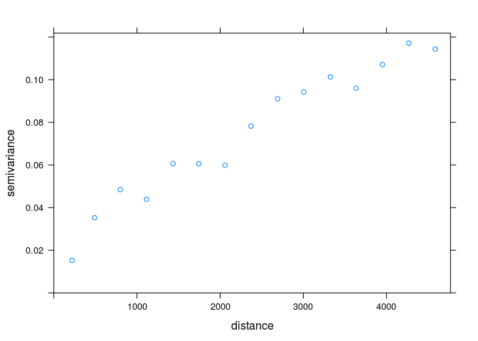
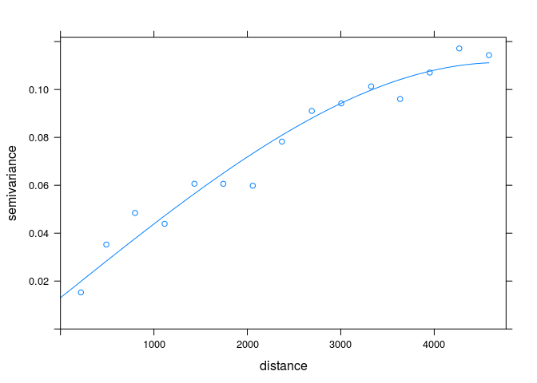
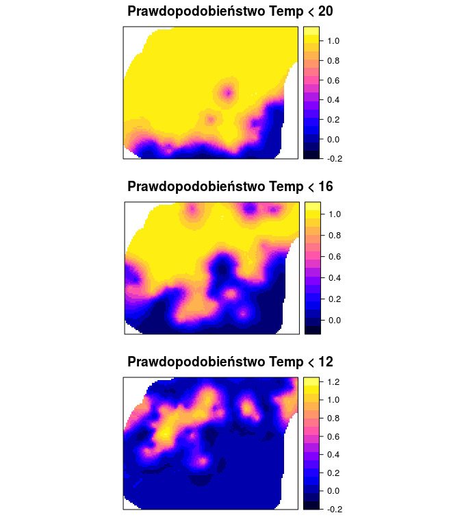

# Estymacja lokalnego rozkładu prawdopodobieństwa


## Kriging danych kodowanych (ang. *Indicator kriging*) | Wprowadzenie

### Kriging danych kodowanych (ang. *Indicator kriging*)
- Jest to metoda krigingu oparta o dane kategoryzowane lub też dane przetworzone z postaci ciągłej do binarnej
- Zazwyczaj używana jest to oszacowania prawdopodobieństwa przekroczenia zdefiniowanej wartości progowej
- Może być też używana do szacowania wartości z całego rozkładu

<!--
http://geostat-course.org/system/files/geostat13_ind.pdf
-->

### Kriging danych kodowanych (ang. *Indicator kriging*)
- Wartości danych wykorzystywane do krigingu danych kodowanych są określone jako 0 lub 1
- Powyzsze kategorie reprezentują czy wartość danej zmiennej jest powyżej czy poniżej określonego progu

### Kriging danych kodowanych (ang. *Indicator kriging*)| Wady i zalety
- Zalety:
    - Możliwość zastosowania, gdy nie interesuje nas konkretna wartość, ale znalezienie obszarów o wartości przekraczającej dany poziom
    - Nie jest istotny kszałt rozkładu
- Wady:
    - Potencjalnie trudne do modelowania semiwariogramy (szczególnie skrajnych przedziałów)
    - Czasochłonność/pracochłonność
    
## Kriging danych kodowanych (ang. *Indicator kriging*) | Przykłady

### Binaryzacja danych


```r
summary(punkty$temp) 
```

```
##    Min. 1st Qu.  Median    Mean 3rd Qu.    Max. 
##   8.153  12.460  15.210  15.520  18.260  26.700
```

```r
punkty$temp_ind <- punkty$temp > 20
summary(punkty$temp_ind) 
```

```
##    Mode   FALSE    TRUE    NA's 
## logical     212      40       0
```

### Eksploracja danych


```r
library('ggplot2')
ggplot(punkty@data, aes(temp)) + stat_ecdf()
```

<!-- -->

    
### Kriging danych kodowanych (ang. *Indicator kriging*) | Semiwariogram


```r
library('gstat')
vario_ind <- variogram(temp_ind~1, punkty)         
plot(vario_ind)
```

<!-- -->

### Kriging danych kodowanych (ang. *Indicator kriging*) | Modelowanie


```r
model_ind <- vgm(0.07, model = 'Sph', range = 3000,  nugget = 0.01)  
plot(vario_ind, model=model_ind)
```

<!-- -->

```r
fitted_ind <- fit.variogram(vario_ind, model_ind)
fitted_ind
```

```
##   model      psill    range
## 1   Nug 0.01303201    0.000
## 2   Sph 0.09822073 4710.163
```

```r
plot(vario_ind, model=fitted_ind)
```

<!-- -->

### Kriging danych kodowanych (ang. *Indicator kriging*) | Interpolacja


```r
ik <- krige(temp_ind~1, punkty, grid, model=fitted_ind)
```

```
## [using ordinary kriging]
```


```r
spplot(ik, "var1.pred")
spplot(ik, "var1.var")
```

<!-- -->

### Kriging danych kodowanych (ang. *Indicator kriging*)


```r
vario_ind20 <- variogram(I(temp<20)~1, punkty)  
fitted_ind20 <- fit.variogram(vario_ind20, vgm(0.08, "Sph", 3500, nugget=0.01))
vario_ind16 <- variogram(I(temp<16)~1, punkty)  
fitted_ind16 <- fit.variogram(vario_ind16, vgm(0.18, "Sph", 3500, nugget=0.03))
vario_ind12 <- variogram(I(temp<12)~1, punkty)  
fitted_ind12 <- fit.variogram(vario_ind12, vgm(0.13, "Sph", 2000, nugget=0.03))

ik20 <- krige(I(temp<20)~1, punkty, grid, model=fitted_ind20, nmax=30)
```

```
## [using ordinary kriging]
```

```r
ik16 <- krige(I(temp<16)~1, punkty, grid, model=fitted_ind16, nmax=30)
```

```
## [using ordinary kriging]
```

```r
ik12 <- krige(I(temp<12)~1, punkty, grid, model=fitted_ind12, nmax=30)
```

```
## [using ordinary kriging]
```

<!-- -->
