# Wykorzystanie do estymacji danych uzupełniających 


## Kriging stratyfikowany (ang. *Kriging within strata*)
### Kriging stratyfikowany (ang. *Kriging within strata*)
- Zakłada on, że zmienność badanego zjawiska zależy od zmiennej jakościowej (kategoryzowanej)
- Przykładowo, zróżnicowanie badanej zmiennej jest różne w zależności od pokrycia terenu
- Kriging stratyfikowany wymaga posiadania danych zmiennej jakościowej (kategoryzowanej) na całym badanym obszarze

### Kriging stratyfikowany (ang. *Kriging within strata*)


```r
library('gstat')
grid <- read.csv("data/siatka_wolin_lato.csv")
head(grid)
```

```
##   X1999.09.13_NDVI X2002.08.20_NDVI CLC06 CLC06_p_lato odl_od_morza
## 1         0.170732         0.090909   411            5     17190.21
## 2         0.473684         0.428571   411            5     17206.85
## 3        -0.133333        -0.153846   411            5     17148.59
## 4         0.298969         0.230769   411            5     17165.27
## 5         0.500000         0.487603   411            5     17181.86
## 6         0.513889         0.532258   411            5     17198.48
##   InsCalk_1999.09 InsCalk_2002.08      X       Y
## 1        48.35811        64.16846 472740 5961510
## 2        48.45755        64.25623 472770 5961510
## 3        48.35780        64.16824 472710 5961540
## 4        48.35745        64.16785 472740 5961540
## 5        48.92398        64.66546 472770 5961540
## 6        48.98947        64.72395 472800 5961540
```

```r
coordinates(grid) <- ~X+Y
proj4string(grid) <- proj4string(wolin_lato_los)
gridded(grid) <- TRUE

spplot(grid, "CLC06_p_lato")
```

<!-- -->

```r
vario_kws1 <- variogram(X2002.08.20_TPZ~1, wolin_lato_los[wolin_lato_los$CLC06_p_lato==1, ])
plot(vario_kws1)
```

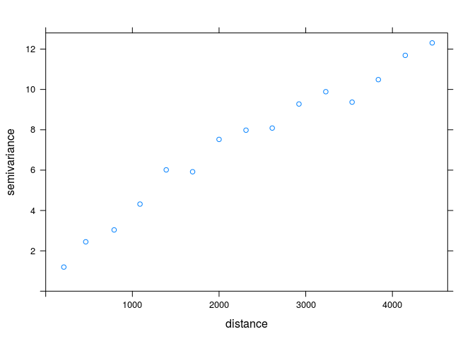<!-- -->

```r
fitted_kws1 <- fit.variogram(vario_kws1, vgm(8, model = 'Sph', range = 1500, nugget = 1))
plot(vario_kws1, fitted_kws1)
```

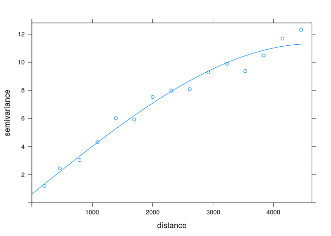<!-- -->

```r
vario_kws2 <- variogram(X2002.08.20_TPZ~1, wolin_lato_los[wolin_lato_los$CLC06_p_lato==2, ])
plot(vario_kws2)
```

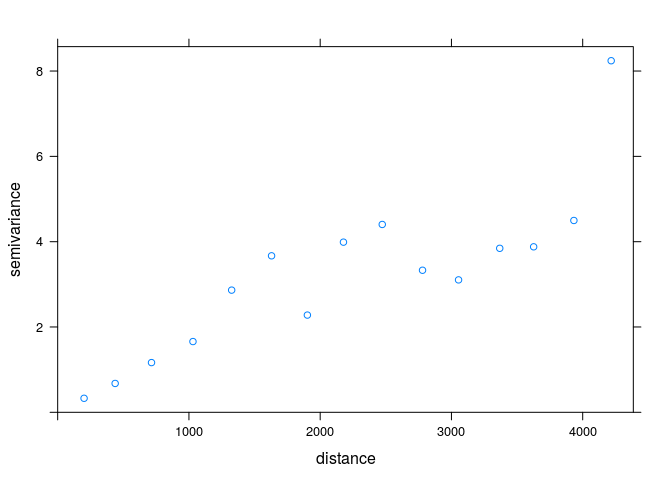<!-- -->

```r
fitted_kws2 <- fit.variogram(vario_kws2, vgm(8, model = 'Sph', range = 2000, nugget = 4))
plot(vario_kws2, fitted_kws2)
```

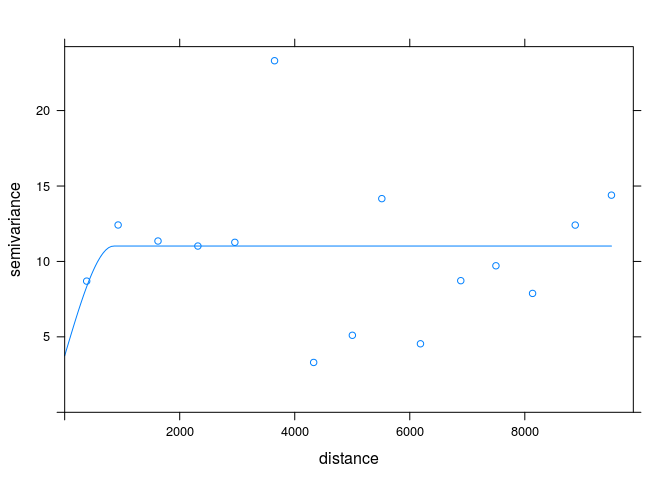<!-- -->

```r
vario_kws3 <- variogram(X2002.08.20_TPZ~1, wolin_lato_los[wolin_lato_los$CLC06_p_lato==3, ])
plot(vario_kws3)
```

<!-- -->

```r
fitted_kws3 <- fit.variogram(vario_kws3, vgm(15, model = 'Sph', range = 2000, nugget = 5))
plot(vario_kws3, fitted_kws3)
```

<!-- -->

```r
vario_kws4 <- variogram(X2002.08.20_TPZ~1, wolin_lato_los[wolin_lato_los$CLC06_p_lato==4, ])
plot(vario_kws4)
```

<!-- -->

```r
fitted_kws4 <- fit.variogram(vario_kws4, vgm(4, model = 'Gau', range = 10000, nugget = 2))
plot(vario_kws4, fitted_kws4)
```

<!-- -->

```r
vario_kws5 <- variogram(X2002.08.20_TPZ~1, wolin_lato_los[wolin_lato_los$CLC06_p_lato==5, ])
plot(vario_kws5)
```

<!-- -->

```r
fitted_kws5 <- fit.variogram(vario_kws5, vgm(2, model = 'Sph', range = 2000, nugget = 1))
plot(vario_kws5, fitted_kws5)
```

<!-- -->

```r
vario_kws6 <- variogram(X2002.08.20_TPZ~1, wolin_lato_los[wolin_lato_los$CLC06_p_lato==6, ])
plot(vario_kws6)
```

<!-- -->

```r
fitted_kws6 <- fit.variogram(vario_kws6, vgm(1, model = 'Gau', range = 2500, nugget = 0.4))
plot(vario_kws6, fitted_kws6)
```

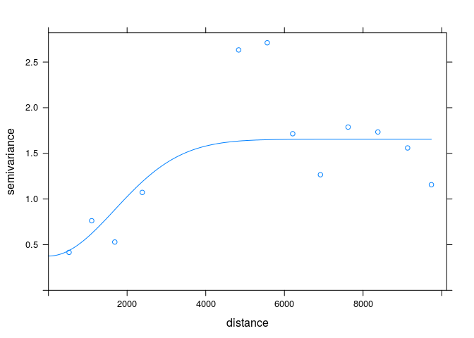<!-- -->

```r
kws1 <- krige(X2002.08.20_TPZ~1, wolin_lato_los[wolin_lato_los$CLC06_p_lato==1, ], grid[grid$CLC06_p_lato==1, ], model = fitted_kws1, maxdist = 500)
```

```
## [using ordinary kriging]
```

```r
kws2 <- krige(X2002.08.20_TPZ~1, wolin_lato_los[wolin_lato_los$CLC06_p_lato==2, ], grid[grid$CLC06_p_lato==2, ], model = fitted_kws2, maxdist = 200)
```

```
## [using ordinary kriging]
```

```r
kws3 <- krige(X2002.08.20_TPZ~1, wolin_lato_los[wolin_lato_los$CLC06_p_lato==3, ], grid[grid$CLC06_p_lato==3, ], model = fitted_kws3, maxdist = 1000)
```

```
## [using ordinary kriging]
```

```r
kws4 <- krige(X2002.08.20_TPZ~1, wolin_lato_los[wolin_lato_los$CLC06_p_lato==4, ], grid[grid$CLC06_p_lato==4, ], model = fitted_kws4, maxdist = 1000)
```

```
## [using ordinary kriging]
```

```r
kws5 <- krige(X2002.08.20_TPZ~1, wolin_lato_los[wolin_lato_los$CLC06_p_lato==5, ], grid[grid$CLC06_p_lato==5, ], model = fitted_kws5, maxdist = 500)
```

```
## [using ordinary kriging]
```

```r
kws6 <- krige(X2002.08.20_TPZ~1, wolin_lato_los[wolin_lato_los$CLC06_p_lato==6, ], grid[grid$CLC06_p_lato==6, ], model = fitted_kws6, maxdist = 500)
```

```
## [using ordinary kriging]
```

```r
kws <- rbind(as.data.frame(kws1), as.data.frame(kws2), as.data.frame(kws3), as.data.frame(kws4), as.data.frame(kws5), as.data.frame(kws6))
coordinates(kws) <- ~X+Y
kws <- as(kws, "SpatialPixelsDataFrame")
spplot(kws, "var1.pred", sp.layout=(list=SpatialPoints(wolin_lato_los)))
```

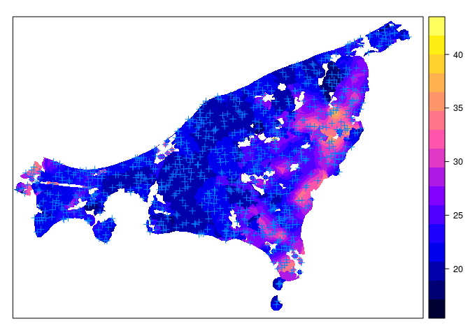<!-- -->


## Prosty kriging ze zmiennymi średnimi lokalnymi (LVM)
### Prosty kriging ze zmiennymi średnimi lokalnymi (LVM)
- Prosty kriging ze zmiennymi średnimi lokalnymi zamiast znanej (stałej) stacjonarnej średniej wykorzystuje zmienne średnie lokalne uzyskane na podstawie innej informacji
- Lokalna średnia może być uzyskana za pomocą wyliczenia regresji liniowej pomiędzy zmienną badaną a zmienną dodatkową


### Prosty kriging ze zmiennymi średnimi lokalnymi (LVM)


```r
coef <- lm(X2002.08.20_TPZ~sqrt(odl_od_morza), wolin_lato_los)$coef
coef
```

```
##        (Intercept) sqrt(odl_od_morza) 
##        20.54376534         0.04678513
```

```r
vario <- variogram(X2002.08.20_TPZ~sqrt(odl_od_morza), wolin_lato_los)
model_sim <- vgm(9, model = 'Sph', range = 4000, nugget = 7)
model_sim
```

```
##   model psill range
## 1   Nug     7     0
## 2   Sph     9  4000
```

```r
fitted_sim <- fit.variogram(vario, model_sim)
fitted_sim
```

```
##   model    psill    range
## 1   Nug 6.919352    0.000
## 2   Sph 8.695489 2911.116
```

```r
plot(vario, model=fitted_sim)
```

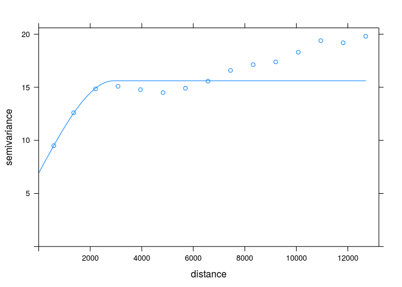<!-- -->

```r
sk_lvm <- krige(X2002.08.20_TPZ~sqrt(odl_od_morza), wolin_lato_los, grid, model=fitted_sim, beta = coef)
```

```
## [using simple kriging]
```

```r
summary(sk_lvm)
```

```
## Object of class SpatialPixelsDataFrame
## Coordinates:
##       min     max
## X  451110  484770
## Y 5961510 5986290
## Is projected: TRUE 
## proj4string :
## [+init=epsg:32633 +proj=utm +zone=33 +datum=WGS84 +units=m +no_defs
## +ellps=WGS84 +towgs84=0,0,0]
## Number of points: 288649
## Grid attributes:
##   cellcentre.offset cellsize cells.dim
## X            451110       30      1123
## Y           5961510       30       827
## Data attributes:
##    var1.pred        var1.var     
##  Min.   :17.11   Min.   : 0.000  
##  1st Qu.:21.05   1st Qu.: 9.330  
##  Median :22.51   Median : 9.687  
##  Mean   :23.43   Mean   : 9.795  
##  3rd Qu.:25.37   3rd Qu.:10.147  
##  Max.   :41.79   Max.   :15.468
```

```r
spplot(sk_lvm, "var1.pred")
spplot(sk_lvm, "var1.var")
```
<!-- -->


## Kriging uniwersalny (ang. *Universal kriging*)
### Kriging uniwersalny (ang. *Universal kriging*)
- Określany również jako kriging z trendem (ang. *Kriging with a trend model*)
- Zakłada on, że nieznana średnia lokalna zmiania się stopniowo na badanym obszarze

### Kriging uniwersalny (ang. *Universal kriging*)

<!--


```r
# vario_ku <- variogram(X2002.08.20_TPZ~odl_od_morza, data=wolin_lato_los)
# plot(vario_ku)
# model_ku <- vgm(psill = 17, model = 'Sph', range = 12000, nugget = 5)
# fitted_ku <- fit.variogram(vario_ku, model_ku)
# fitted_ku
# plot(vario_ku, fitted_ku)
```


-->


```r
wolin_lato_los$CLC06_p_lato <- as.factor(wolin_lato_los$CLC06_p_lato)
vario_uk1 <- variogram(X2002.08.20_TPZ~CLC06_p_lato, wolin_lato_los)
vario_uk1
```

```
##       np       dist     gamma dir.hor dir.ver   id
## 1   2489   586.6262  8.178226       0       0 var1
## 2   6419  1356.0526  9.706976       0       0 var1
## 3   9455  2209.0161 10.309445       0       0 var1
## 4  11765  3079.7299 10.147147       0       0 var1
## 5  13604  3951.9182 10.206803       0       0 var1
## 6  14898  4827.0845 10.013613       0       0 var1
## 7  15759  5695.0007  9.472628       0       0 var1
## 8  16230  6572.6776  9.532064       0       0 var1
## 9  15903  7444.9323  9.849153       0       0 var1
## 10 15958  8323.4239  9.743650       0       0 var1
## 11 15848  9199.8893 10.238576       0       0 var1
## 12 15388 10074.5949 10.608090       0       0 var1
## 13 14428 10950.7884 10.654297       0       0 var1
## 14 13438 11816.4479 10.493071       0       0 var1
## 15 12138 12695.1130 10.654643       0       0 var1
```

```r
plot(vario_uk1)
```

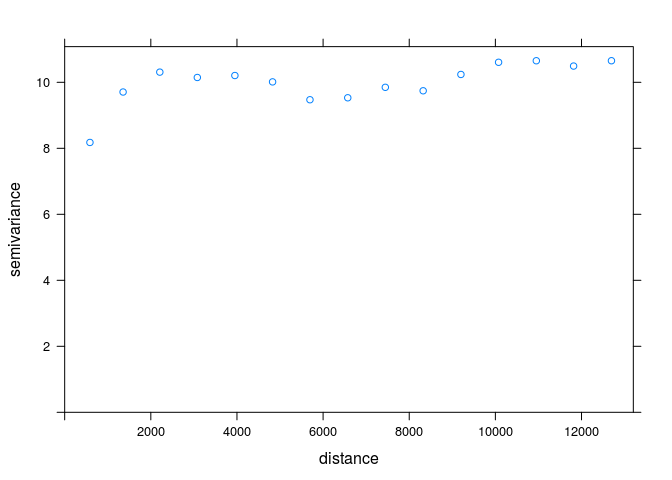<!-- -->

```r
model_uk1 <- vgm(3, model = 'Sph', range = 2300, nugget = 7)
vario_fit_uk1 <- fit.variogram(vario_uk1, model=model_uk1)
vario_fit_uk1
```

```
##   model    psill    range
## 1   Nug 6.631904    0.000
## 2   Sph 3.479906 1918.538
```

```r
plot(vario_uk1, vario_fit_uk1)
```

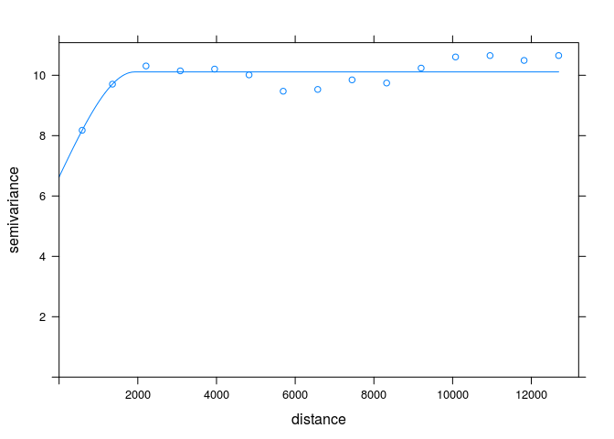<!-- -->


<!--


```r
# przygotowanie siatki
# grid <- read.csv("data/Wolin_TPZ_p_lato_popN.csv")
# head(grid)
# coordinates(grid) <- ~X+Y
# proj4string(grid) <- proj4string(wolin_lato_los)
# gridded(grid) <- TRUE
# plot(grid)
# names(grid)[6] <- c("CLC06_p_lato")
# names(grid)[7] <- c("odl_od_morza")
# grid@data <- grid@data[c(2, 4:9)]
# # grid@data <- cbind(grid@data, as.data.frame(coordinates(grid)))
# write.csv(grid, 'data/siatka_wolin_lato.csv', row.names=FALSE)
# spplot(grid)
```


-->


```r
grid$CLC06_p_lato <- as.factor(grid$CLC06_p_lato)
spplot(grid, "CLC06_p_lato")
```

<!-- -->

```r
uk1 <- krige(X2002.08.20_TPZ~CLC06_p_lato, locations = wolin_lato_los, newdata=grid, model=vario_fit_uk1)
```

```
## [using universal kriging]
```

```r
spplot(uk1, "var1.pred")
spplot(uk1, "var1.var")
```
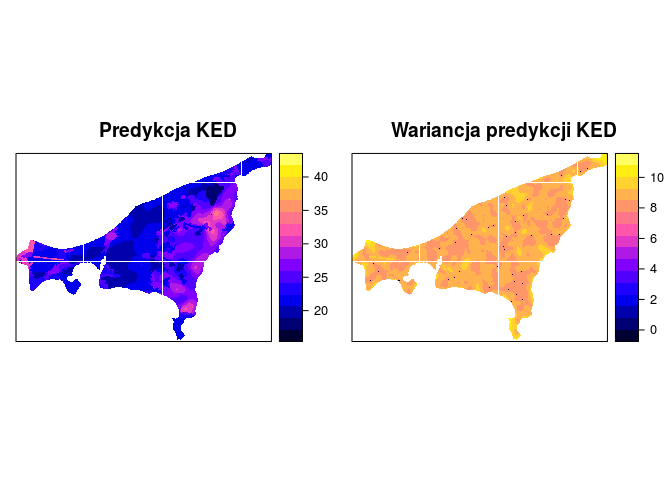<!-- -->


```r
vario_uk2 <- variogram(X2002.08.20_TPZ~X2002.08.20_NDVI+odl_od_morza, wolin_lato_los)
vario_uk2
```

```
##       np       dist     gamma dir.hor dir.ver   id
## 1   2489   586.6262  6.129399       0       0 var1
## 2   6419  1356.0526  9.090591       0       0 var1
## 3   9455  2209.0161 10.841663       0       0 var1
## 4  11765  3079.7299 10.233852       0       0 var1
## 5  13604  3951.9182  9.618208       0       0 var1
## 6  14898  4827.0845  9.492690       0       0 var1
## 7  15759  5695.0007  9.761382       0       0 var1
## 8  16230  6572.6776  9.852395       0       0 var1
## 9  15903  7444.9323  9.943900       0       0 var1
## 10 15958  8323.4239  9.750130       0       0 var1
## 11 15848  9199.8893  9.670453       0       0 var1
## 12 15388 10074.5949 10.228914       0       0 var1
## 13 14428 10950.7884 11.131210       0       0 var1
## 14 13438 11816.4479 11.578387       0       0 var1
## 15 12138 12695.1130 11.753851       0       0 var1
```

```r
plot(vario_uk2)
```

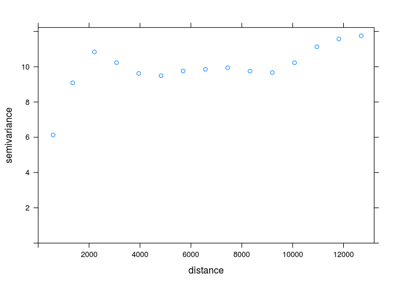<!-- -->

```r
model <- vgm(5, model = 'Sph', range = 2300, nugget = 5)
vario_fit_uk2 <- fit.variogram(vario_uk2, model=model)
vario_fit_uk2
```

```
##   model    psill    range
## 1   Nug 3.279731    0.000
## 2   Sph 6.931077 2083.678
```

```r
plot(vario_uk2, vario_fit_uk2)
```

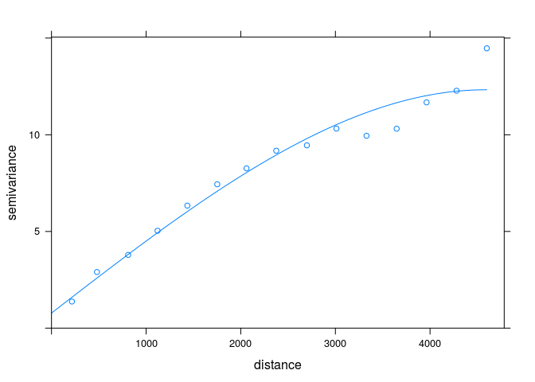<!-- -->

```r
uk2 <- krige(X2002.08.20_TPZ~X2002.08.20_NDVI+odl_od_morza, locations = wolin_lato_los, newdata=grid, model=vario_fit_uk2)
```

```
## [using universal kriging]
```

```r
spplot(uk2, "var1.pred")
spplot(uk2, "var1.var")
```
<!-- -->


