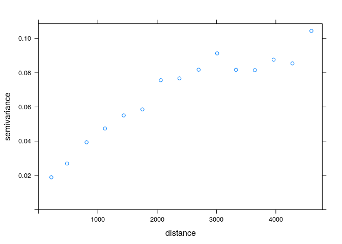
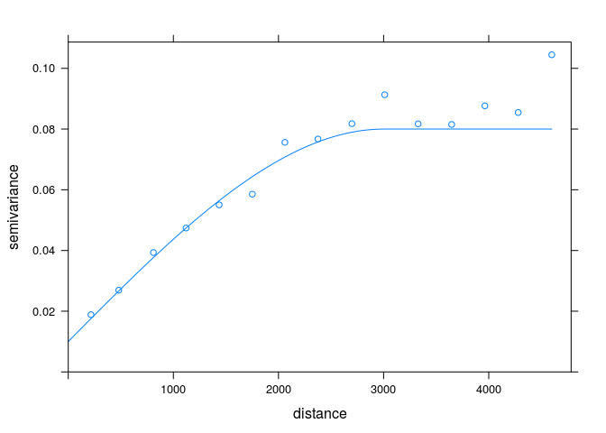
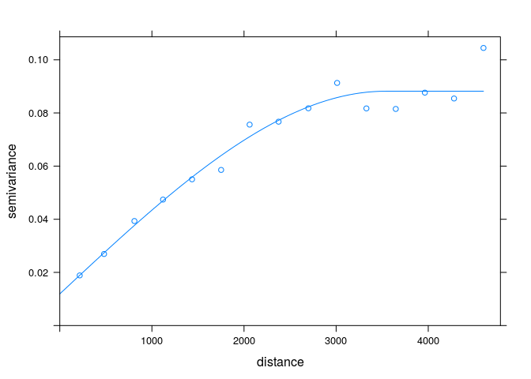
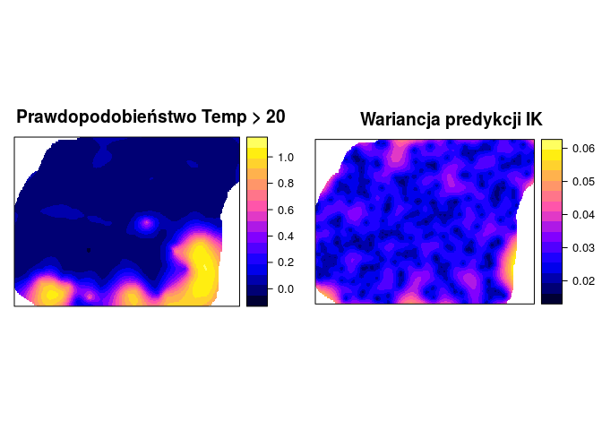

# Estymacja lokalnego rozkładu prawdopodobieństwa


## Kriging danych kodowanych (ang. *Indicator kriging*) | Wprowadzenie

### Kriging danych kodowanych (ang. *Indicator kriging*)
- Jest to metoda krigingu oparta o dane kategoryzowane lub też dane przetworzone z postaci ciągłej do binarnej
- Zazwyczaj używana jest to oszacowania prawdopodobieństwa przekroczenia zdefiniowanej wartości progowej
- Może być też używana do szacowania wartości z całego rozkładu

<!--
http://geostat-course.org/system/files/geostat13_ind.pdf
-->

### Kriging danych kodowanych (ang. *Indicator kriging*)
- Wartości danych wykorzystywane do krigingu danych kodowanych są określone jako 0 lub 1
- Powyzsze kategorie reprezentują czy wartość danej zmiennej jest powyżej czy poniżej określonego progu

### Kriging danych kodowanych (ang. *Indicator kriging*)| Wady i zalety
- Zalety:
    - Możliwość zastosowania, gdy nie interesuje nas konkretna wartość, ale znalezienie obszarów o wartości przekraczającej dany poziom
    - Nie jest istotny kszałt rozkładu
- Wady:
    - Potencjalnie trudne do modelowania semiwariogramy (szczególnie skrajnych przedziałów)
    - Czasochłonność/pracochłonność
    
## Kriging danych kodowanych (ang. *Indicator kriging*) | Przykłady

### Binaryzacja danych


```r
summary(wolin_lato_los$X2002.08.20_TPZ) 
```

```
##    Min. 1st Qu.  Median    Mean 3rd Qu.    Max. 
##   17.11   20.48   21.89   23.56   25.81   41.79
```

```r
wolin_lato_los$temp_ind <- wolin_lato_los$X2002.08.20_TPZ < 20
summary(wolin_lato_los$temp_ind) 
```

```
##    Mode   FALSE    TRUE    NA's 
## logical     630     120       0
```


### Eksploracja danych


```r
library('ggplot2')
ggplot(wolin_lato_los@data, aes(X2002.08.20_TPZ)) + stat_ecdf()
```

<!-- -->

    
### Kriging danych kodowanych (ang. *Indicator kriging*) | Semiwariogram


```r
library('gstat')
vario_ind <- variogram(temp_ind~1, wolin_lato_los)         
plot(vario_ind)
```

<!-- -->


### Kriging danych kodowanych (ang. *Indicator kriging*) | Modelowanie


```r
model_ind <- vgm(0.05, model = 'Sph', range = 2000, add.to = vgm(0.05, "Exp", 6000, nugget = 0.05))   
plot(vario_ind, model=model_ind)
```

<!-- -->

```r
fitted_ind <- fit.variogram(vario_ind, model_ind)
fitted_ind
```

```
##   model      psill     range
## 1   Nug 0.05007591     0.000
## 2   Exp 0.07173086 12927.822
## 3   Sph 0.05970977  1790.056
```

```r
plot(vario_ind, model=fitted_ind)
```

<!-- -->


### Kriging danych kodowanych (ang. *Indicator kriging*) | Interpolacja


```r
ik <- krige(temp_ind~1, wolin_lato_los, grid, model=fitted_ind)
```

```
## [using ordinary kriging]
```

```r
spplot(ik, "var1.pred")
spplot(ik, "var1.var")
```
<!-- -->


### Kriging danych kodowanych (ang. *Indicator kriging*)


```r
vario_ind20 <- variogram(I(X2002.08.20_TPZ>20)~1, wolin_lato_los)  
fitted_ind20 <- fit.variogram(vario_ind20, vgm(0.1, "Exp", 9000, nugget=0.05))
vario_ind22 <- variogram(I(X2002.08.20_TPZ>22)~1, wolin_lato_los)  
fitted_ind22 <- fit.variogram(vario_ind22, vgm(0.15, "Exp", 9000, nugget=0.1))
vario_ind25 <- variogram(I(X2002.08.20_TPZ>25)~1, wolin_lato_los)  
fitted_ind25 <- fit.variogram(vario_ind25, vgm(0.1, "Exp", 9000, nugget=0.1))

ik20 <- krige(I(X2002.08.20_TPZ>20)~1, wolin_lato_los, grid, model=fitted_ind20, nmax=10)
```

```
## [using ordinary kriging]
```

```r
ik22 <- krige(I(X2002.08.20_TPZ>22)~1, wolin_lato_los, grid, model=fitted_ind22, nmax=10)
```

```
## [using ordinary kriging]
```

```r
ik25 <- krige(I(X2002.08.20_TPZ>25)~1, wolin_lato_los, grid, model=fitted_ind25, nmax=10)
```

```
## [using ordinary kriging]
```
<!-- -->

    
