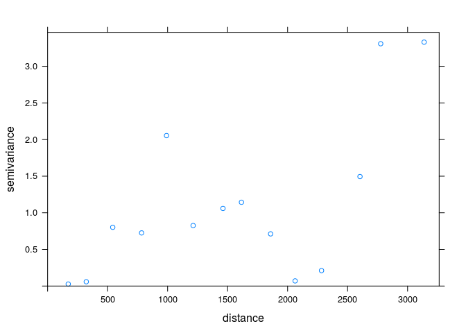
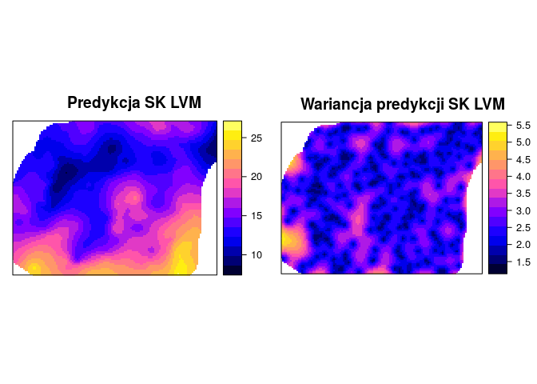
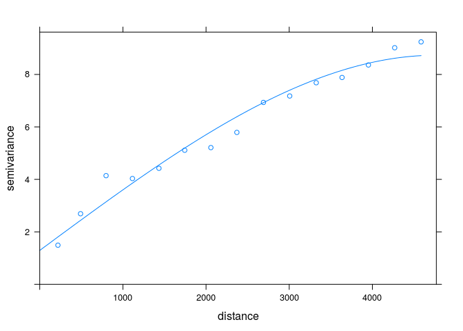
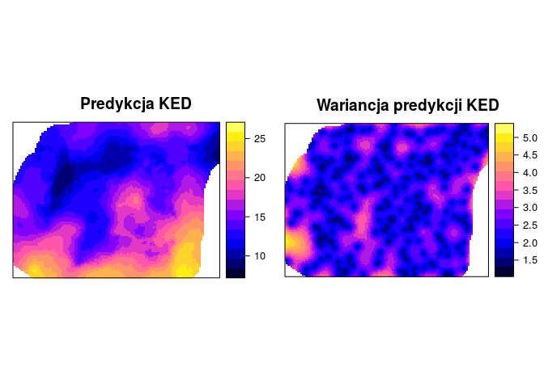

# Wykorzystanie do estymacji danych uzupełniających 


## Kriging stratyfikowany (ang. *Kriging within strata*)
### Kriging stratyfikowany (ang. *Kriging within strata*)
- Zakłada on, że zmienność badanego zjawiska zależy od zmiennej jakościowej (kategoryzowanej)
- Przykładowo, zróżnicowanie badanej zmiennej jest różne w zależności od pokrycia terenu
- Kriging stratyfikowany wymaga posiadania danych zmiennej jakościowej (kategoryzowanej) na całym badanym obszarze

### Kriging stratyfikowany (ang. *Kriging within strata*)


```r
library('gstat')
grid <- read.csv("dane/siatka.csv")
head(grid)
```

```
##       srtm clc      ndvi      savi        x        y
## 1       NA  NA 0.5179814 0.3308685 748826.7 721211.2
## 2 240.9517   1 0.5275287 0.3408735 748916.7 721211.2
## 3 238.6385   1 0.5066541 0.3252446 749006.7 721211.2
## 4 237.6719   1 0.5220953 0.3370855 749096.7 721211.2
## 5 235.7462   1 0.5240265 0.3384357 749186.7 721211.2
## 6 230.6863   1 0.6171365 0.4051174 749276.7 721211.2
```

```r
coordinates(grid) <- ~x+y
proj4string(grid) <- proj4string(punkty)
gridded(grid) <- TRUE

grid$clc <- as.factor(grid$clc)
spplot(grid, "clc")
```

<!-- -->

```r
vario_kws1 <- variogram(temp~1, punkty[punkty$clc==1, ])
plot(vario_kws1)
```

<!-- -->

```r
fitted_kws1 <- fit.variogram(vario_kws1, vgm(10, model = 'Sph', range = 4500, nugget = 0.5))
plot(vario_kws1, fitted_kws1)
```

<!-- -->

```r
vario_kws2 <- variogram(temp~1, punkty[punkty$clc==2, ])
plot(vario_kws2)
```

<!-- -->

```r
fitted_kws2 <- fit.variogram(vario_kws2, vgm(5, model = 'Sph', range = 4500, nugget = 0.1))
plot(vario_kws2, fitted_kws2)
```

<!-- -->

```r
vario_kws4 <- variogram(temp~1, punkty[punkty$clc==4, ])
plot(vario_kws4)
```

<!-- -->

```r
fitted_kws4 <- fit.variogram(vario_kws4, vgm(0.5, model = 'Nug'))
plot(vario_kws4, fitted_kws4)
```

<!-- -->

```r
kws1 <- krige(temp~1, punkty[punkty$clc==1, ], grid[na.omit(grid$clc==1), ], model = fitted_kws1, nmax = 50)
```

```
## [using ordinary kriging]
```

```r
kws2 <- krige(temp~1, punkty[punkty$clc==2, ], grid[na.omit(grid$clc==2), ], model = fitted_kws2, nmax = 50)
```

```
## [using ordinary kriging]
```

```r
kws4 <- krige(temp~1, punkty[punkty$clc==4, ], grid[na.omit(grid$clc==4), ], model = fitted_kws4, nmax = 50)
```

```
## [using ordinary kriging]
```

```r
kws <- rbind(as.data.frame(kws1), as.data.frame(kws2), as.data.frame(kws4))
coordinates(kws) <- ~x+y
kws <- as(kws, "SpatialPixelsDataFrame")
spplot(kws, "var1.pred", sp.layout=(list=SpatialPoints(punkty)))
```

<!-- -->

## Prosty kriging ze zmiennymi średnimi lokalnymi (LVM)
### Prosty kriging ze zmiennymi średnimi lokalnymi (LVM)
- Prosty kriging ze zmiennymi średnimi lokalnymi zamiast znanej (stałej) stacjonarnej średniej wykorzystuje zmienne średnie lokalne uzyskane na podstawie innej informacji
- Lokalna średnia może być uzyskana za pomocą wyliczenia regresji liniowej pomiędzy zmienną badaną a zmienną dodatkową

### Prosty kriging ze zmiennymi średnimi lokalnymi (LVM)


```r
coef <- lm(temp~srtm, punkty)$coef
coef
```

```
##  (Intercept)         srtm 
## 16.480355788 -0.004535255
```

```r
vario <- variogram(temp~srtm, punkty)
model_sim <- vgm(10, model = 'Sph', range = 4000, nugget = 1)
model_sim
```

```
##   model psill range
## 1   Nug     1     0
## 2   Sph    10  4000
```

```r
fitted_sim <- fit.variogram(vario, model_sim)
fitted_sim
```

```
##   model      psill    range
## 1   Nug  0.9382992    0.000
## 2   Sph 14.5761601 6027.977
```

```r
plot(vario, model=fitted_sim)
```

<!-- -->

```r
sk_lvm <- krige(temp~srtm, punkty, grid, model=fitted_sim, beta = coef)
```

```
## [using simple kriging]
```

```r
summary(sk_lvm)
```

```
## Object of class SpatialPixelsDataFrame
## Coordinates:
##        min      max
## x 745586.7 756926.7
## y 712661.2 721211.2
## Is projected: TRUE 
## proj4string :
## [+init=epsg:2180 +proj=tmerc +lat_0=0 +lon_0=19 +k=0.9993
## +x_0=500000 +y_0=-5300000 +ellps=GRS80 +towgs84=0,0,0,0,0,0,0
## +units=m +no_defs]
## Number of points: 10993
## Grid attributes:
##   cellcentre.offset cellsize cells.dim
## x          745586.7       90       127
## y          712661.2       90        96
## Data attributes:
##    var1.pred         var1.var    
##  Min.   : 8.624   Min.   :1.415  
##  1st Qu.:12.942   1st Qu.:2.148  
##  Median :15.037   Median :2.458  
##  Mean   :15.666   Mean   :2.543  
##  3rd Qu.:17.875   3rd Qu.:2.853  
##  Max.   :25.922   Max.   :5.313  
##  NA's   :43       NA's   :43
```


```r
spplot(sk_lvm, "var1.pred")
spplot(sk_lvm, "var1.var")
```

<!-- -->

## Kriging uniwersalny (ang. *Universal kriging*)
### Kriging uniwersalny (ang. *Universal kriging*)
- Określany również jako kriging z trendem (ang. *Kriging with a trend model*)
- Zakłada on, że nieznana średnia lokalna zmiania się stopniowo na badanym obszarze

### Kriging uniwersalny (ang. *Universal kriging*)

<!--

```r
# vario_ku <- variogram(temp~odl_od_morza, data=punkty)
# plot(vario_ku)
# model_ku <- vgm(psill = 17, model = 'Sph', range = 12000, nugget = 5)
# fitted_ku <- fit.variogram(vario_ku, model_ku)
# fitted_ku
# plot(vario_ku, fitted_ku)
```

-->


```r
punkty$clc <- as.factor(punkty$clc)
vario_uk1 <- variogram(temp~clc, punkty)
vario_uk1
```

```
##      np      dist    gamma dir.hor dir.ver   id
## 1   131  218.6119 1.492195       0       0 var1
## 2   312  490.7338 2.692324       0       0 var1
## 3   516  797.7160 4.143141       0       0 var1
## 4   683 1114.7117 4.032339       0       0 var1
## 5   849 1433.5720 4.422906       0       0 var1
## 6   965 1743.1558 5.112034       0       0 var1
## 7  1103 2057.9031 5.212272       0       0 var1
## 8  1246 2370.6101 5.790961       0       0 var1
## 9  1219 2690.1356 6.934307       0       0 var1
## 10 1343 3005.8324 7.179945       0       0 var1
## 11 1377 3324.7716 7.685214       0       0 var1
## 12 1432 3635.2805 7.885347       0       0 var1
## 13 1485 3952.0183 8.361701       0       0 var1
## 14 1494 4268.2314 9.018930       0       0 var1
## 15 1478 4585.7878 9.241991       0       0 var1
```

```r
plot(vario_uk1)
```

<!-- -->

```r
model_uk1 <- vgm(8, model = 'Sph', range = 3000, nugget = 1)
vario_fit_uk1 <- fit.variogram(vario_uk1, model=model_uk1)
vario_fit_uk1
```

```
##   model    psill    range
## 1   Nug 1.292171    0.000
## 2   Sph 7.441007 4763.345
```

```r
plot(vario_uk1, vario_fit_uk1)
```

<!-- -->

<!--


```r
# przygotowanie siatki
# grid <- read.csv("data/Wolin_TPZ_p_lato_popN.csv")
# head(grid)
# coordinates(grid) <- ~X+Y
# proj4string(grid) <- proj4string(punkty)
# gridded(grid) <- TRUE
# plot(grid)
# names(grid)[6] <- c("clc")
# names(grid)[7] <- c("odl_od_morza")
# grid@data <- grid@data[c(2, 4:9)]
# # grid@data <- cbind(grid@data, as.data.frame(coordinates(grid)))
# write.csv(grid, 'data/siatka_wolin_lato.csv', row.names=FALSE)
# spplot(grid)
```

-->


```r
grid$clc <- as.factor(grid$clc)
spplot(grid, "clc")
```

<!-- -->

```r
uk1 <- krige(temp~clc, locations = punkty, newdata=grid, model=vario_fit_uk1)
```

```
## [using universal kriging]
```


```r
spplot(uk1, "var1.pred")
spplot(uk1, "var1.var")
```

<!-- -->


```r
vario_uk2 <- variogram(temp~ndvi+srtm, punkty)
vario_uk2
```

```
##      np      dist     gamma dir.hor dir.ver   id
## 1   131  218.6119  1.386828       0       0 var1
## 2   312  490.7338  2.822672       0       0 var1
## 3   516  797.7160  4.294554       0       0 var1
## 4   683 1114.7117  4.501500       0       0 var1
## 5   849 1433.5720  6.310286       0       0 var1
## 6   965 1743.1558  7.395085       0       0 var1
## 7  1103 2057.9031  7.375078       0       0 var1
## 8  1246 2370.6101  8.529375       0       0 var1
## 9  1219 2690.1356  9.517366       0       0 var1
## 10 1343 3005.8324 10.213423       0       0 var1
## 11 1377 3324.7716 11.100148       0       0 var1
## 12 1432 3635.2805 11.730141       0       0 var1
## 13 1485 3952.0183 13.053957       0       0 var1
## 14 1494 4268.2314 14.252817       0       0 var1
## 15 1478 4585.7878 14.968739       0       0 var1
```

```r
plot(vario_uk2)
```

<!-- -->

```r
model <- vgm(8, model = 'Sph', range = 3000, nugget = 1)
vario_fit_uk2 <- fit.variogram(vario_uk2, model=model)
vario_fit_uk2
```

```
##   model      psill    range
## 1   Nug  0.8470453    0.000
## 2   Sph 14.8073531 6243.382
```

```r
plot(vario_uk2, vario_fit_uk2)
```

<!-- -->

```r
uk2 <- krige(temp~ndvi+srtm, locations = punkty, newdata=grid, model=vario_fit_uk2)
```

```
## [using universal kriging]
```


```r
spplot(uk2, "var1.pred")
spplot(uk2, "var1.var")
```

<!-- -->
