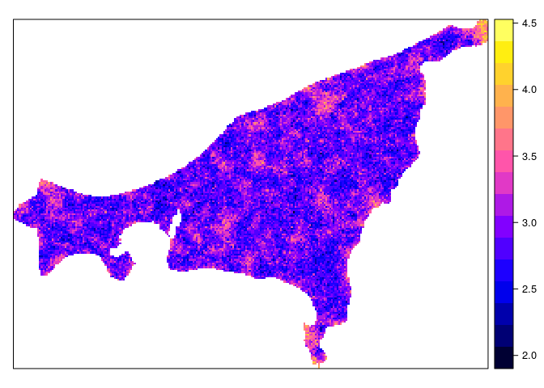
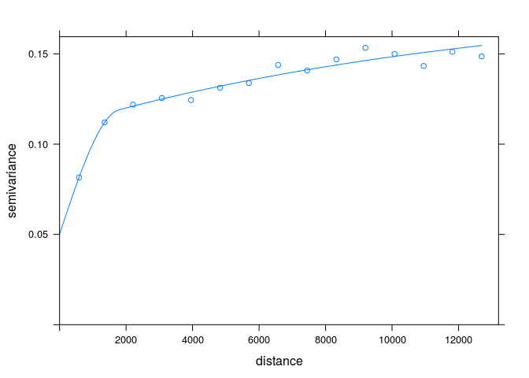

# Symulacje


<!--

## Symulacje przestrzenne 1:
 sekwencyjna symulacja i ko symulacja gaussowska,
  sekwencyjna symulacja danych kodowanych, 
  przetwarzanie (postprocesing) wyników symulacji
  
-->  

## Symulacje geostatystyczne
### Symulacje geostatystyczne
- Kriging daje optymalne predykcje, czyli wyznacza najbardziej potencjalnie możliwą wartość dla wybranej lokalizacji
- Dodatkowo, efektem krigingu jest wygładzony obraz. W konsekwencji wyniki estymacji różnią się od danych pomiarowych
- Jest to tylko (aż?) predykcja. Prawdziwa wartość jest niepewna ...
- Korzystając z symulacji geostatystycznych nie tworzymy predykcji, ale generujemy równie prawdopodobne możliwości poprzez symulację z rozkładu prawdopodobieństwa (wykorzystując genereator liczb losowych)

### Symulacje geostatystyczne | Cel

- Efekt symulacji ma bardziej realistyczny przestrzenny wzór (ang. *pattern*) niż kriging, którego efektem jest wygładzona reprezentacja rzeczywistości
- Każda z symulowanych map jest równie prawdopodobna
- Symulacje pozwalają na przedstawianie niepewności interpolacji
- Jednocześnie - kriging jest znacznie lepszy, gdy naszym celem jest jak najdokładniejsza predykcja

## Typy symulacji
### Typy symulacji
- Symulacje bezwarunkowe (ang. Unconditional Simulations) - wykorzystuje semiwariogram, żeby włączyć informację przestrzenną, ale wartości ze zmierzonych punktów nie są wykorzystywane. 
- Symulacje warunkowe (ang. Conditional Simulations) - opiera się ona o średnią wartość, strukturę kowariancji oraz obserwowane wartości


## Symulacje bezwarunkowe

<!--
http://santiago.begueria.es/2010/10/generating-spatially-correlated-random-fields-with-r/
-->


```r
grid <- read.csv("data/siatka_wolin_lato60.csv")
head(grid)
```

```
##        X       Y X1999.09.13_NDVI X2002.08.20_NDVI CLC06 CLC06_p_lato
## 1 484185 5986275        0.3777780        0.3333330   311            4
## 2 484245 5986275        0.3591857        0.3516057   311            4
## 3 484305 5986275        0.4804645        0.4181650   311            4
## 4 484365 5986275        0.4475050        0.4057467   311            4
## 5 484425 5986275        0.4379390        0.4029118   311            4
## 6 484485 5986275        0.4628957        0.4251747   311            4
##   odl_od_morza InsCalk_1999.09 InsCalk_2002.08
## 1     2077.811        48.10563        63.98322
## 2     2128.540        48.10553        63.98314
## 3     2183.775        48.10548        63.98310
## 4     2243.541        48.10548        63.98311
## 5     2303.318        48.10548        63.98311
## 6     2363.107        48.10548        63.98310
```

```r
coordinates(grid) <- ~X+Y
proj4string(grid) <- proj4string(wolin_lato_los)
gridded(grid) <- TRUE
```


```r
library('gstat')
sym_bezw1 <- krige(formula=z~1, locations=NULL, newdata=grid, dummy=TRUE,
                         beta=1, model=vgm(psill=0.025,model='Exp',range=100), nsim=4, nmax=30)
```

```
## [using unconditional Gaussian simulation]
```

```r
spplot(sym_bezw1, main="Przestrzennie skorelowana powierzchnia \nśrednia=1, sill=0.025, zasięg=100, model wykładniczy")
```

<!-- -->


```r
sym_bezw2 <- krige(formula=z~1, locations=NULL, newdata=grid, dummy=TRUE, 
                   beta=1, model=vgm(psill=0.025,model='Exp',range=1500), nsim=4, nmax=30)
```

```
## [using unconditional Gaussian simulation]
```

```r
spplot(sym_bezw2, main="Przestrzennie skorelowana powierzchnia \nśrednia=1, sill=0.025, zasięg=1500, model wykładniczy")
```

<!-- -->


<!--
sym_bezw_model3 <- gstat(formula=~1+X+Y, locations=~X+Y, dummy=T, beta=c(1,0,0.005), model=vgm(psill=0.025,model='Exp',range=1500), nmax=20)
sym_bezw3 <- predict(sym_bezw_model3, newdata=grid, nsim=4)
spplot(sym_bezw3, main="Przestrzennie skorelowana powierzchnia \nśrednia=1, sill=0.025, zasięg=1500, model wykładniczy \ntrend na osi y = 0.005")


sym_bezw_model4 <- gstat(formula=~1+X+Y, locations=~X+Y, dummy=T, beta=c(1,0.02,0.005), model=vgm(psill=0.025,model='Exp',range=1500), nmax=20)
sym_bezw4 <- predict(sym_bezw_model4, newdata=grid, nsim=4)
spplot(sym_bezw4, main="Przestrzennie skorelowana powierzchnia \nśrednia=1, sill=0.025, zasięg=500, model wykładniczy \ntrend na osi x = 0.02, trend na osi y = 0.005")
-->

## Symulacje warunkowe

### Sekwencyjna symulacja gaussowska (ang. *Sequential Gaussian simulation*)
1. Wybranie lokalizacji nie posiadającej zmierzonej wartości badanej zmiennej
2. Kriging wartości tej lokalizacji korzystając z dostepnych danych, co pozwala na uzyskanie rozkładu prawdopodobieństwa badanej zmiennej
3. Wylosowanie wartości z rozkładu prawdopodobieństwa za pomocą generatora liczba losowych i przypisanie tej wartości do lokalizacji
4. Dodanie symulowaniej wartości do zbioru danych i przejście do kolejnej lokalizacji
5. Powtórzenie poprzednich kroków, aż do momentu gdy nie pozostanie już żadna nieokreślona lokalizacja

### Sekwencyjna symulacja gaussowska (ang. *Sequential Gaussian simulation*)


```r
vario <- variogram(X2002.08.20_TPZ~1, wolin_lato_los, cutoff=8000)
model <- vgm(10, model = 'Sph', range = 4000, nugget=4)
fitted <- fit.variogram(vario, model)
plot(vario, model=fitted)
```

<!-- -->

```r
sym_ok <- krige(X2002.08.20_TPZ~1, wolin_lato_los, grid, model=fitted, nsim=4, nmax=30)
```

```
## drawing 4 GLS realisations of beta...
## [using conditional Gaussian simulation]
```

```r
spplot(sym_ok)
```

<!-- -->

### Sekwencyjna symulacja gaussowska (ang. *Sequential Gaussian simulation*)


```r
sym_sk <- krige(X2002.08.20_TPZ~1, wolin_lato_los, grid, model=fitted, beta=23.6, nsim=100, nmax=30)
```

```
## [using conditional Gaussian simulation]
```

```r
library('raster')
sym_sk <- stack(sym_sk)
sym_sk_sd <- calc(sym_sk, fun = sd)
spplot(sym_sk_sd)
```

<!-- -->


## Sekwencyjna symulacja danych kodowanych (ang. *Sequential indicator simulation*)
### Sekwencyjna symulacja danych kodowanych (ang. *Sequential indicator simulation*)


```r
summary(wolin_lato_los$X2002.08.20_TPZ) 
```

```
##    Min. 1st Qu.  Median    Mean 3rd Qu.    Max. 
##   17.11   20.48   21.89   23.56   25.81   41.79
```

```r
wolin_lato_los$temp_ind <- wolin_lato_los$X2002.08.20_TPZ < 20
summary(wolin_lato_los$temp_ind) 
```

```
##    Mode   FALSE    TRUE    NA's 
## logical     630     120       0
```


```r
vario_ind <- variogram(temp_ind~1, wolin_lato_los)         
plot(vario_ind)
```

<!-- -->

```r
model_ind <- vgm(0.05, model = 'Sph', range = 2000, add.to = vgm(0.05, "Exp", 6000, nugget = 0.05))   
plot(vario_ind, model=model_ind)
```

<!-- -->

```r
fitted_ind <- fit.variogram(vario_ind, model_ind)
fitted_ind
```

```
##   model      psill     range
## 1   Nug 0.05007591     0.000
## 2   Exp 0.07173086 12927.822
## 3   Sph 0.05970977  1790.056
```

```r
plot(vario_ind, model=fitted_ind)
```

<!-- -->

```r
sym_ind <- krige(temp_ind~1, wolin_lato_los, grid, model=fitted_ind, indicators=TRUE, nsim=4, nmax=30)
```

```
## drawing 4 GLS realisations of beta...
## [using conditional indicator simulation]
```

```r
spplot(sym_ind, main='Symulacje warunkowe')
```

<!-- -->


<!--
łączenie sis - wiele symulacji
-->


