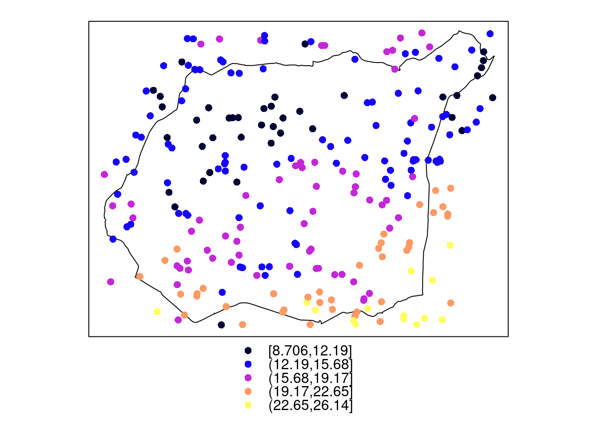
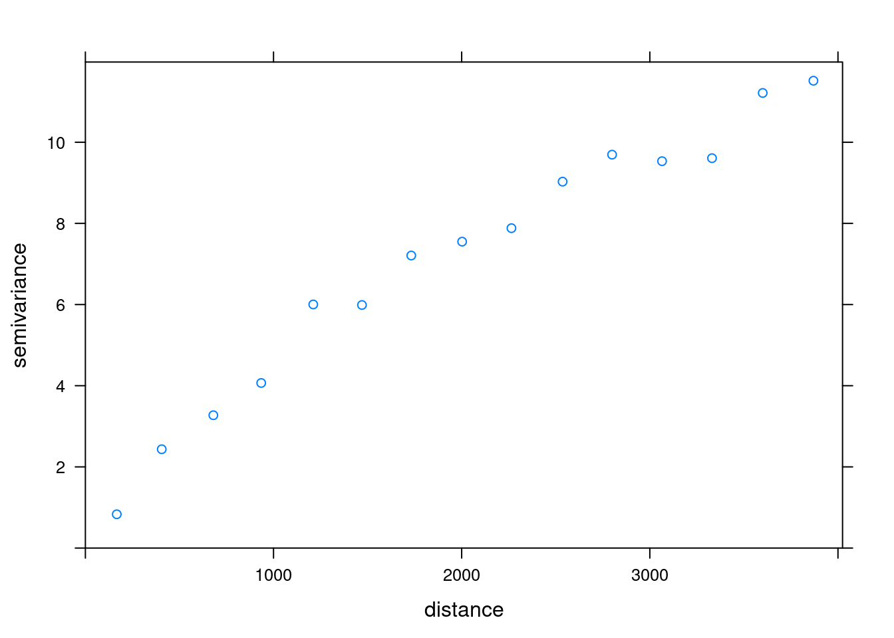
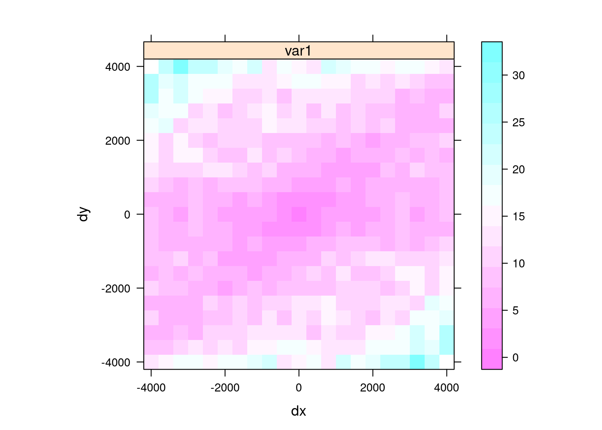
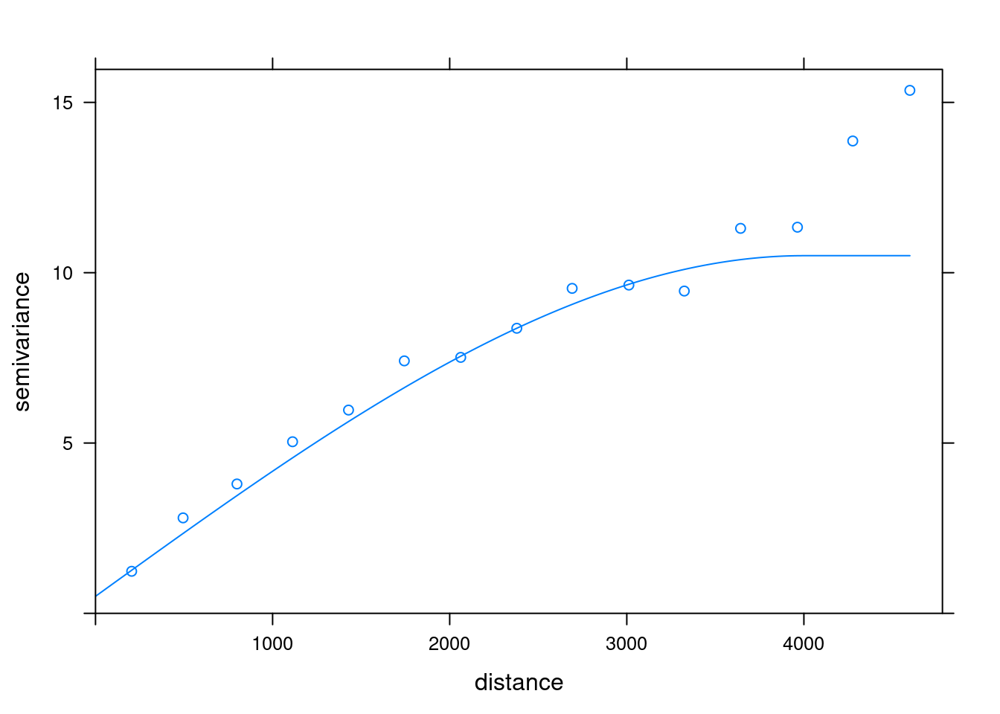
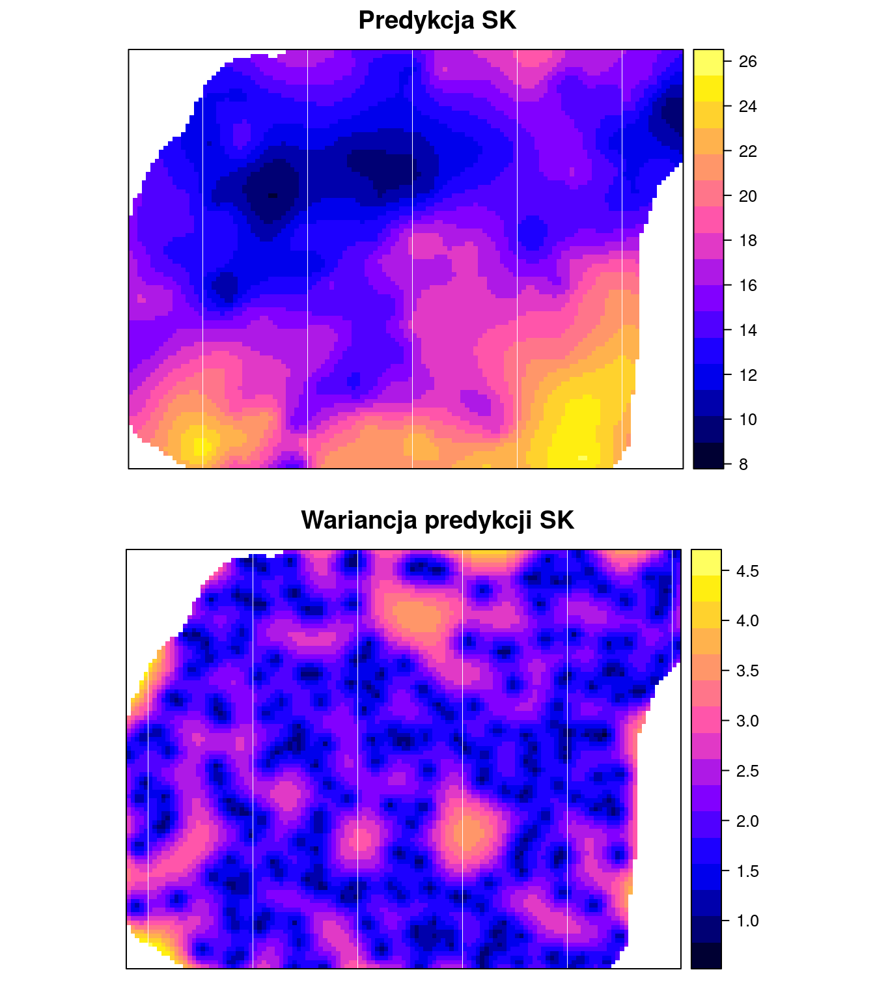
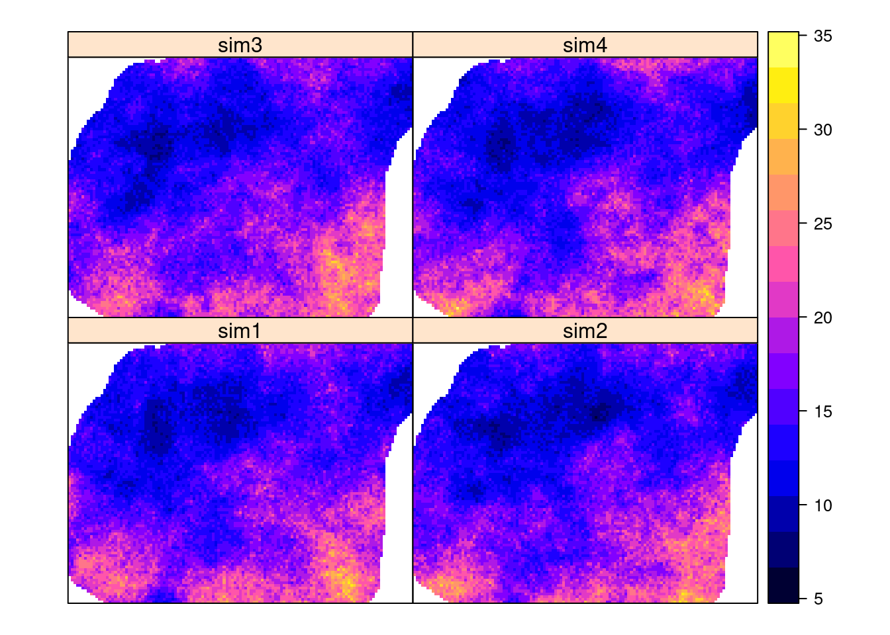

--- 
title: "Geostatystyka w R"
author: "Jakub Nowosad"
date: "`r Sys.Date()`"
documentclass: book
site: bookdown::bookdown_site
bibliography: [book.bib, packages.bib]
biblio-style: apalike
link-citations: yes
classoption: a4paper
fontsize: 12pt
monofont: "Source Code Pro"
monofontoptions: "Scale=0.7"
description: "Introduction to geostatistics with R (in Polish)."
url: 'https\://bookdown.org/nowosad/Geostatystyka/'
github-repo: "nowosad/geostat_book"
cover-image: "Rfigs/book_cover2.png"
---

# Wprowadzenie

```{r fig.align='center', echo=FALSE, include=identical(knitr:::pandoc_to(), 'html')}
knitr::include_graphics("Rfigs/book_cover.png")
```

Masz przed sobą skrypt zawierający materiały do ćwiczeń z geostatystyki.
Składa się ona z kilkunastu rozdziałów pokazujących jak: dodawać i wizualizować dane przestrzenne w R (rozdział \@ref(r-a-dane-przestrzenne)), wykonywać wstępną eksplorację danych nieprzestrzennych (rozdział \@ref(eksploracja-analiza-danych-nieprzestrzennych)), wstępnie analizować dane przestrzenne (rozdział \@ref(eksploracyjna-analiza-danych-przestrzennych)), wykorzystywać deterministyczne metody interpolacji (rozdział \@ref(metody-interpolacji)), rozumieć i tworzyć przestrzenne miary podobieństwa i niepodobieństwa (rozdział \@ref(geostatystyka-prolog)), modelować semiwariogramy bezkierunkowe i kierunkowe (rozdział \@ref(modelowanie-matematycznie-autokorelacji-przestrzennej)), tworzyć estymacje jednozmienne (rozdział \@ref(estymacje-jednozmienne)), estymacje danych kodowanych (rozdział \@ref(estymacja-lokalnego-rozkadu-prawdopodobienstwa)), estymacje wielozmienne (rozdział \@ref(estymacje-wielozmienne)), estymacje wykorzystujące dane uzupełniające (rozdział \@ref(wykorzystanie-do-estymacji-danych-uzupeniajacych)), oceniać jakość wykonanych estymacji (rozdział \@ref(ocena-jakosci-estymacji)) oraz budować symulacje przestrzenne (rozdział \@ref(symulacje)).

Dodatkowo załączone są trzy appendiksy. 
W appendiksie \@ref(zrodla-wiedzy) można znaleźć odnośniki do innych materiałów związanych z geostatystyką i R, appendiks \@ref(dane-app) opisuje dane użyte w tym skrypcie, a appendiks \@ref(reprex) wprowadza pojęcie powtarzalnego przykładu i tłumaczy jak taki przykład stworzyć.

Wszystkie zaprezentowane meotdy i analizy zawierają również kod w języku R.
Skrypt został stworzony w R [@R-base] z wykorzystaniem pakietów `bookdown` [@R-bookdown], `rmarkdown` [@R-rmarkdown], `knitr` [@R-knitr] oraz programu [Pandoc](http://pandoc.org/). 
Aktualna wersja skryptu znajduje się pod adresem https://bookdown.org/nowosad/Geostatystyka/. 

Zachęcam do zgłaszania wszelkich uwag, błędów, pomysłów oraz komentarzy na adres mailowy nowosad.jakub@gmail.com.

## Geostatystyczna analiza danych

> Geostatystyka to gałąź statystyki skupiająca się na przestrzennych lub czasoprzestrzennych zbiorach danych

Geostatystyka jest stosowana obecnie w wielu dyscyplinach, jakich jak geologia naftowa, oceanografia, geochemia, logistyka, leśnictwo, gleboznawstwo, hydrologia, meteorologia, czy epidemiologia.

Geostatystyczna analiza danych może przyjmować różną postać w zależności od postawionego celu analizy.
Poniższa rycina przestawia uproszczoną ścieżkę postępowania geostatystycznego.

```{r, echo=FALSE, fig.width=8}
knitr::include_graphics("figs/diag.png")
```

Punktem wyjścia analizy geostatystycznej jest posiadanie danych przestrzennych opisujących badane zjawisko, np. w **postaci punktowej**:

```{r, echo=FALSE}

```

Na ich podstawie chcemy zrozumieć zmienność przestrzenną analizowanej cechy.
Do tego może nam posłużyć wykres nazywany **semiwariogramem**:

```{r, echo=FALSE}

```

Opisuje on przestrzenną zmienność badanej cechy i za jego pomocą możemy stwierdzić jak szybko to zjawisko zmienia się w przestrzeni.
Dodatkowo za pomocą **mapy semiwariogramu** możliwe jest stwierdzenie czy istnieją jakieś kierunki w których ta cecha zmienia się zmienia bardziej dynamicznie, a w których ta zmiana jest wolniejsza:

```{r, echo=FALSE}

```

Następnie korzystając z wiedzy uzyskanej z semiwariogramu i mapy semiwariogramu, jesteśmy w stanie stworzyć **model semiwariogramu**:

```{r, echo=FALSE}

```

Pozwala on zarówno na lepszy opis zmienności zjawiska, jak również służy do tworzenia **predykcji** czy też **symulacji**.
Predykcja tworzy najbardziej potencjalnie możliwą wartość dla wybranej lokalizacji:

```{r, echo=FALSE}

```

Rolą symulacji jest natomiast generowanie równie prawdopodobne możliwości rozkładu badanej cechy:

```{r, echo=FALSE}

```

Każdy z powyższych elementów geostatystycznej analizy danych zostanie rozwinięty w dalszych rozdziałach tego skryptu.

<!-- po co to - prosta analiza bez kodu -->
<!-- http://dmowska-zajecia.home.amu.edu.pl/data/uploads/geostatystyka/materialy/1_wprowadzenie.html -->

## Wymagania wstępne

### Oprogramowanie

Do odtworzenia przykładów użytych w poniższym skrypcie wystarczy podstawowa znajomość R. 
Aby zainstalować R oraz RStudio można skorzystać z poniższych odnośników:

- [R](https://www.r-project.org/) - https://cloud.r-project.org/
- [RStudio](https://www.rstudio.com/) - https://www.rstudio.com/products/rstudio/download/

Dodatkowo, użyte zostały poniższe pakiety R [@R-caret;@R-corrplot;@R-dismo;@R-fields;@R-ggplot2;@R-gridExtra;@R-gstat;@R-mapview;@R-pgirmess;@R-rgdal;@R-rgeos;@R-sp].

```{r pakietsy}
pakiety <- c(
  "caret", "corrplot", "dismo", "fields", "ggplot2", "gridExtra",
  "gstat", "mapview", "pgirmess", "rgdal", "rgeos", "sp"
)
```

```{r pakiertbib, echo=FALSE}
knitr::write_bib(c(pakiety, "bookdown", "knitr", "rmarkdown", "geostatbook", "base"), "packages.bib", width = 60)
```

Pakiety R używane w tym skrypcie można zainstalować poprzez funkcję `install.packages()`:

```{r pakiety_inst, eval=FALSE}
install.packages(pakiety)
```

Lub też za pomocą pakietu `geostatbook` [@R-geostatbook], który automatycznie zainstaluje wszystkie wymagane pakiety:

```{r instgeobook, eval=FALSE}
install.packages("devtools")
devtools::install_github("nowosad/geostatbook")
```

```{r sessoninfo, echo=FALSE, eval=FALSE}
devtools::session_info(pakiety)
```

### Dane

Dane wykorzystywane w tym skrypcie można pobrać w postaci spakowanego archiwum (dla rozdziału \@ref(r-a-dane-przestrzenne)) oraz korzystając z pakietu `geostatbook` (dla kolejnych rozdziałów). 
Dodatkowo, przy instalacji pakietu `geostatbook` pobierane są wszystkie inne pakiety potrzebne do pełnego korzystania z materiałów zawartych w skrypcie.

- [Archiwum zawierające dane do rozdziału drugiego](https://github.com/Nowosad/geostat_book/blob/master/dane.zip?raw=true)
- [Dane do kolejnych rozdziałów są zawarte w pakiecie geostatbook:](https://github.com/Nowosad/geostatbook)

```{r instgeobook2, eval=FALSE}
# install.packages("devtools")
devtools::install_github("nowosad/geostatbook")
```

Aby ułatwić korzystanie ze skryptu, rozdziały od \@ref(eksploracja-analiza-danych-nieprzestrzennych) do \@ref(symulacje) rozpoczynają się od wczytania wymaganych pakietów oraz zbiorów danych.

<script>
  (function(i,s,o,g,r,a,m){i['GoogleAnalyticsObject']=r;i[r]=i[r]||function(){
  (i[r].q=i[r].q||[]).push(arguments)},i[r].l=1*new Date();a=s.createElement(o),
  m=s.getElementsByTagName(o)[0];a.async=1;a.src=g;m.parentNode.insertBefore(a,m)
  })(window,document,'script','//www.google-analytics.com/analytics.js','ga');

  ga('create', 'UA-75924107-1', 'auto');
  ga('send', 'pageview');

</script>
